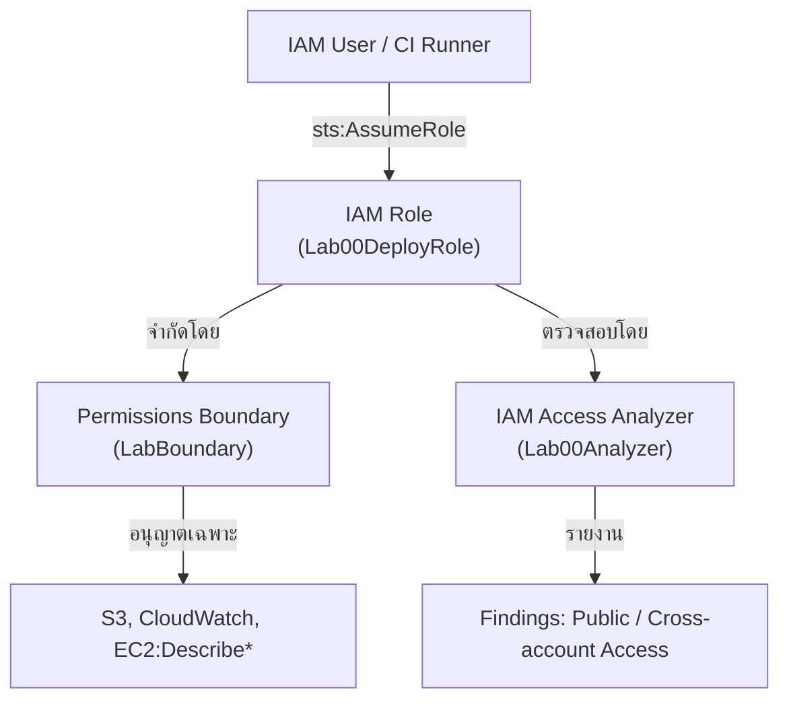

# Lab 00: IAM Foundations, Least Privilege, and Cross-Account Access

## Metadata
- Difficulty: Intermediate
- Time estimate: 20–30 minutes
- Estimated cost: Free Tier eligible
- Prerequisites: None
- Depends on: None

## Learning Objectives
หลังจากทำ Lab นี้เสร็จ ผู้เรียนจะสามารถ:
- สร้าง IAM Role พร้อม Permissions Boundary เพื่อจำกัดเพดานสิทธิ์สูงสุด
- จำลองการ Assume Role ด้วย AWS STS และตรวจสอบผลลัพธ์ด้วย Simulate Policy
- ใช้ IAM Access Analyzer ตรวจจับการเปิดสิทธิ์ข้าม Account ที่ไม่ตั้งใจ
- อธิบายความแตกต่างระหว่าง Identity Policy, Permissions Boundary และ Trust Policy ได้

## Business Scenario
ทีมแพลตฟอร์มต้องการให้วิศวกรแอปพลิเคชัน (App Engineers) มีสิทธิ์จัดการทรัพยากรเฉพาะส่วนงานของตนเท่านั้น ในขณะเดียวกันต้องการให้ผู้ตรวจสอบ (Auditors) สามารถเข้าถึงเพื่อตรวจสอบได้ โดยไม่ต้องแชร์ข้อมูลประจำตัวระดับ Admin

การใช้ Policy ที่กว้างเกินไป เช่น `AdministratorAccess` ทำให้เกิดช่องโหว่แบบ Permission Creep หากข้อมูลประจำตัว (Credentials) รั่วไหล ความเสียหายจะกระจายวงกว้าง (Blast Radius) อย่างรวดเร็ว

## Core Services
IAM, STS, Organizations, Access Analyzer

## Target Architecture


## Environment Setup
```bash
# กำหนดค่าเหล่านี้ก่อนรันคำสั่งใดๆ ใน Lab นี้
export AWS_REGION=ap-southeast-1
export ACCOUNT_ID=$(aws sts get-caller-identity --query Account --output text)
export PROJECT_TAG=SAA-Lab-00
export ROLE_NAME=Lab00DeployRole
```

---

## Step-by-Step

### Phase 1 — สร้าง Role และกำหนด Permissions Boundary

สร้าง IAM Role พร้อม Permissions Boundary เพื่อจำกัดเพดานสิทธิ์สูงสุดที่ Role นี้จะมีได้ แม้ว่าภายหลังจะผูก Policy ที่มีสิทธิ์สูงกว่าเข้าไปก็ตาม

#### 🖥️ วิธีทำผ่าน AWS Console (GUI)

1. เข้า **IAM → Policies** → คลิก **Create policy**
2. เลือกแท็บ **JSON** แล้ววาง policy ด้านล่าง:
   ```json
   {
     "Version": "2012-10-17",
     "Statement": [
       {
         "Effect": "Allow",
         "Action": ["s3:*", "cloudwatch:*", "ec2:Describe*"],
         "Resource": "*"
       }
     ]
   }
   ```
3. คลิก **Next** → ตั้งชื่อ **`LabBoundary`** → คลิก **Create policy**
4. ไปที่ **IAM → Roles** → คลิก **Create role**
5. เลือก **AWS account** → ใส่ Account ID ของตัวเอง → คลิก **Next**
6. ข้ามหน้า Add permissions → คลิก **Next**
7. ตั้งชื่อ Role ว่า **`Lab00DeployRole`** → เพิ่ม Tag `Project = SAA-Lab-00`
8. คลิก **Create role**
9. เปิด Role ที่สร้าง → แท็บ **Permissions** → คลิก **Set permissions boundary** → เลือก `LabBoundary` → **Save**

#### ⌨️ วิธีทำผ่าน CLI

```bash
cat <<EOF > trust.json
{
  "Version": "2012-10-17",
  "Statement": [
    {
      "Effect": "Allow",
      "Principal": { "AWS": "arn:aws:iam::$ACCOUNT_ID:root" },
      "Action": "sts:AssumeRole"
    }
  ]
}
EOF

cat <<EOF > boundary.json
{
    "Version": "2012-10-17",
    "Statement": [
        {
            "Effect": "Allow",
            "Action": [
                "s3:*",
                "cloudwatch:*",
                "ec2:Describe*"
            ],
            "Resource": "*"
        }
    ]
}
EOF

aws iam create-policy --policy-name LabBoundary --policy-document file://boundary.json
aws iam create-role --role-name $ROLE_NAME --assume-role-policy-document file://trust.json --tags "Key=Project,Value=$PROJECT_TAG"
aws iam put-role-permissions-boundary --role-name $ROLE_NAME --permissions-boundary arn:aws:iam::$ACCOUNT_ID:policy/LabBoundary
```

**Expected output:** Role และ Permissions Boundary ถูกสร้างขึ้นเรียบร้อย โดย `LabBoundary` ปรากฏในช่อง `PermissionsBoundary` ของ Role

---

### Phase 2 — ทดสอบการ Assume Role และการจำลองสิทธิ์

จำลองการ Assume Role จากนั้นใช้ Simulate Policy ตรวจสอบว่า Action ที่ไม่อยู่ใน Boundary ถูกปฏิเสธ (Denied) จริง

> **หมายเหตุ:** Simulate Policy ใช้เพื่อ **ตรวจสอบว่า Policy ทำงานถูกต้อง** ไม่ใช่การอนุญาตให้ดำเนินการจริง

#### 🖥️ วิธีทำผ่าน AWS Console (GUI)

1. ไปที่ **IAM → Roles** → เปิด Role **`Lab00DeployRole`**
2. คลิกแท็บ **Permissions** → คลิก **Simulate**
3. ในหน้า Policy Simulator → ที่ช่อง **Action Settings** พิมพ์ `iam:CreateUser`
4. คลิก **Run Simulation**
5. สังเกตผลลัพธ์ในคอลัมน์ **Permission** — ควรแสดงเป็น **`implicitDeny`**

#### ⌨️ วิธีทำผ่าน CLI

```bash
# Assume role เพื่อรับ credentials ชั่วคราว
aws sts assume-role --role-arn arn:aws:iam::$ACCOUNT_ID:role/$ROLE_NAME --role-session-name lab00

# จำลองว่า Role นี้มีสิทธิ์ทำ iam:CreateUser หรือไม่
aws iam simulate-principal-policy \
  --policy-source-arn arn:aws:iam::$ACCOUNT_ID:role/$ROLE_NAME \
  --action-names iam:CreateUser
```

**Expected output:** ค่า `EvalDecision` จะแสดงเป็น `explicitDeny` หรือ `implicitDeny` เนื่องจาก `iam:CreateUser` ไม่อยู่ใน Permissions Boundary

---

### Phase 3 — ตรวจสอบด้วย IAM Access Analyzer

ใช้ Access Analyzer ตรวจสอบว่ามีทรัพยากรใดใน Account ที่เปิดสิทธิ์ให้บุคคลภายนอก (Cross-account หรือ Public access) โดยที่ไม่ตั้งใจ

> **หมายเหตุ:** Access Analyzer ใช้เวลาประมาณ **3–5 นาที** ในการสแกนครั้งแรกหลังสร้าง ผลลัพธ์ที่ได้เป็น list ว่าง (`[]`) ถือว่า Clean ไม่มีช่องโหว่

#### 🖥️ วิธีทำผ่าน AWS Console (GUI)

1. ไปที่ **IAM → Access Analyzer** (แผงด้านซ้าย)
2. คลิก **Create analyzer**
3. ตั้งชื่อ **`Lab00Analyzer`** → Type เลือก **Account** → เพิ่ม Tag `Project = SAA-Lab-00`
4. คลิก **Create analyzer**
5. รอประมาณ 3–5 นาที แล้ว Refresh หน้า
6. ตรวจสอบแท็บ **Findings** — หากไม่มีรายการ แสดงว่าไม่พบช่องโหว่

#### ⌨️ วิธีทำผ่าน CLI

```bash
# สร้าง Analyzer
aws accessanalyzer create-analyzer \
  --analyzer-name Lab00Analyzer \
  --type ACCOUNT \
  --tags Key=Project,Value=$PROJECT_TAG

# รอ 3–5 นาที แล้วดึง Findings
ANALYZER_ARN=$(aws accessanalyzer list-analyzers \
  --query "analyzers[?name=='Lab00Analyzer'].arn" \
  --output text)

aws accessanalyzer list-findings --analyzer-arn $ANALYZER_ARN
```

**Expected output:** ผลลัพธ์เป็น list ของ Findings ที่ระบุ Resource และ Condition ของการเข้าถึง หรือ `[]` หากไม่พบช่องโหว่

---

## Failure Injection

ผูก `AdministratorAccess` เข้ากับ Role ที่มี Permissions Boundary อยู่แล้ว เพื่อพิสูจน์ว่า Boundary ยังคงจำกัดสิทธิ์ได้

```bash
aws iam attach-role-policy --role-name $ROLE_NAME --policy-arn arn:aws:iam::aws:policy/AdministratorAccess

# ทดสอบซ้ำ: ยังทำ iam:CreateUser ได้หรือไม่?
aws iam simulate-principal-policy \
  --policy-source-arn arn:aws:iam::$ACCOUNT_ID:role/$ROLE_NAME \
  --action-names iam:CreateUser
```

**What to observe:** แม้จะผูก `AdministratorAccess` เข้าไปแล้ว แต่ `iam:CreateUser` ยังคงถูกปฏิเสธ เพราะ Effective Permissions คือสิ่งที่ **ทั้ง Identity Policy และ Boundary อนุญาตร่วมกัน** เท่านั้น

**How to recover:** ไม่จำเป็นต้อง recover — ระบบทำงานป้องกันได้ตามที่ออกแบบไว้

---

## Decision Trade-offs

| ตัวเลือก | เหมาะกับ | ความเร็ว | ค่าใช้จ่าย | ภาระงาน (Ops) |
|---|---|---|---|---|
| IAM User (ถาวร) | ระบบอัตโนมัติรุ่นเก่า (Legacy) | ทันที | ฟรี | สูง — ต้องหมุนเวียน Access Key เอง มีความเสี่ยงหลุดรั่ว |
| IAM Role (ชั่วคราว) | ลดความเสี่ยง / ยืนยันตัวตนข้าม Account | ทันที | ฟรี | ต่ำ — Credentials หมดอายุอัตโนมัติ |
| Permissions Boundary | จำกัดเพดานสิทธิ์ของ Delegated Admin | ทันที | ฟรี | ปานกลาง — ต้องเขียน JSON Policy ซ้อนกันหลายชั้น |

---

## Common Mistakes

- **Mistake:** แจก Long-lived Access Keys ของ IAM User ให้สมาชิกในทีมโดยตรง
  **Why it fails:** หาก Key รั่วไหลลง Source Control ผู้ไม่ประสงค์ดีสามารถนำไปใช้สร้างทรัพยากรและก่อให้เกิดความเสียหายทางการเงินได้ภายในเวลาไม่กี่นาที ควรใช้ IAM Identity Center (SSO) แทน

- **Mistake:** เขียน Trust Policy ที่หละหลวม เช่น `"Principal": "*"`
  **Why it fails:** เท่ากับอนุญาตให้ทุก Account ใน AWS สามารถ Assume Role นี้ได้ ซึ่งเปิดช่องให้เกิด Privilege Escalation จากภายนอก

- **Mistake:** เข้าใจผิดว่า Permissions Boundary คือ "การอนุญาต" แทน "การกำหนดเพดานสูงสุด"
  **Why it fails:** Boundary กำหนดเพดานสูงสุดเท่านั้น ไม่ได้แปลว่าอนุญาตโดยตรง หาก Boundary อนุญาต S3 แต่ Identity Policy ไม่ได้ผูก Action ใดๆ ไว้ Role นั้นก็ยังใช้ S3 ไม่ได้

- **Mistake:** สับสนระหว่าง `iam:PassRole` และ `sts:AssumeRole`
  **Why it fails:** `PassRole` คือสิทธิ์ที่อนุญาตให้ AWS Service (เช่น EC2, Lambda) นำ Role ไปใช้รันงาน ส่วน `AssumeRole` คือการที่ผู้ใช้หรือ Service เปลี่ยนตัวตนชั่วคราวโดยตรงผ่าน STS

---

## Exam Questions

**Q1:** กลไกใดที่สามารถป้องกันไม่ให้ Delegated Admin สร้าง Role หรือ User ที่มีสิทธิ์สูงกว่าตนเองได้อย่างเหมาะสมที่สุด?
**A:** Permissions Boundary
**Rationale:** Boundary กำหนดเพดานสูงสุดของสิทธิ์ที่ Role หรือ User จะมีได้เสมอ แม้ Delegated Admin จะพยายามผูก `AdministratorAccess` เข้าไป Effective Permissions ก็จะไม่เกินขอบเขตที่ Boundary กำหนด

**Q2:** นักพัฒนาต้องการทดสอบสิทธิ์ของ Role ที่ทำงานข้าม Account โดยไม่ต้องล็อกอินเข้า AWS Console คำสั่ง CLI ใดที่เหมาะสม?
**A:** `aws sts assume-role`
**Rationale:** AWS STS (Security Token Service) ออก Temporary Credentials ให้ผู้เรียกสามารถสวมสิทธิ์ของ Role ที่กำหนดได้ชั่วคราว ตาม Trust Policy ที่กำหนดไว้

---

## Cleanup (เรียงลำดับตามนี้เท่านั้น — ห้ามข้ามขั้นตอน)

```bash
# Step 1 — ลบ Access Analyzer
aws accessanalyzer delete-analyzer --analyzer-name Lab00Analyzer || true

# Step 2 — ถอด Policy ที่ผูกไว้ (รวม AdministratorAccess จาก Failure Injection)
aws iam detach-role-policy --role-name $ROLE_NAME --policy-arn arn:aws:iam::aws:policy/AdministratorAccess || true

# Step 3 — ลบ Permissions Boundary ออกจาก Role
aws iam delete-role-permissions-boundary --role-name $ROLE_NAME

# Step 4 — ลบ Role และ Custom Policy
aws iam delete-role --role-name $ROLE_NAME
aws iam delete-policy --policy-arn arn:aws:iam::$ACCOUNT_ID:policy/LabBoundary

# Step 5 — ตรวจสอบว่าลบเรียบร้อยแล้ว
aws iam get-role --role-name $ROLE_NAME 2>&1 || echo "✅ Role ถูกลบเรียบร้อย"
```

**Cost check:** รันคำสั่งนี้เพื่อยืนยันว่าไม่มีค่าใช้จ่ายคงค้าง (IAM ไม่มีค่าใช้จ่าย — คำสั่งนี้ใช้สำหรับตรวจสอบ Resource อื่นใน Account ที่อาจเกี่ยวข้อง):
```bash
aws iam list-roles --query "Roles[?contains(RoleName,'Lab00')]" --output table
aws iam list-policies --scope Local --query "Policies[?contains(PolicyName,'Lab')]" --output table
```
