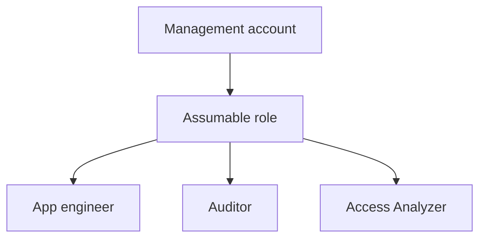

# Lab 00: IAM Foundations, Least Privilege, and Cross-Account Access

## Business Scenario
A platform team wants app engineers to deploy only their stack while auditors can review permissions without sharing admin credentials.

## Core Services
IAM, STS, Organizations, Access Analyzer

## Target Architecture


## Step-by-Step
1. Create a role that app engineers can assume.
2. Attach a permission boundary and simulate allowed and denied actions.
3. Validate that cross-account access is limited to read-only review.

## CLI Commands
```bash
aws iam create-role --role-name Lab00DeployRole --assume-role-policy-document file://trust.json
aws iam put-role-permissions-boundary --role-name Lab00DeployRole --permissions-boundary arn:aws:iam::123456789012:policy/LabBoundary
aws sts assume-role --role-arn arn:aws:iam::123456789012:role/Lab00DeployRole --role-session-name lab00
aws iam simulate-principal-policy --policy-source-arn arn:aws:iam::123456789012:role/Lab00DeployRole --action-names iam:CreateUser
```

## Expected Output
- `AssumedRoleUser` appears in the STS response.
- Policy simulation returns an explicit deny for `iam:CreateUser`.
- Access Analyzer reports only intended external access.

## Failure Injection
Try to create an IAM user or attach an admin policy with the assumed role, then confirm `AccessDenied` and boundary enforcement.

## Decision Trade-offs
| Option | Best for | Risk | Notes |
| --- | --- | --- | --- |
| IAM user | Legacy automation | High | Long-lived credentials increase blast radius. |
| IAM role | Temporary access | Low | Best default for humans and services. |
| Permission boundary | Guardrails | Low | Caps what delegated admins can grant. |

## Common Mistakes
- Using long-lived access keys for humans.
- Leaving the trust policy too broad.
- Confusing identity policy permissions with permission boundaries.

## Exam Question
**Q:** Which control best prevents a delegated admin from creating a more powerful role than intended?

**A:** A permission boundary. It caps the maximum permissions even if the identity policy is broader.

## Cleanup
- Delete the temporary role and boundary policy.
- Remove any test users or access keys created for the lab.
- Verify no unintended cross-account access remains in Access Analyzer.

