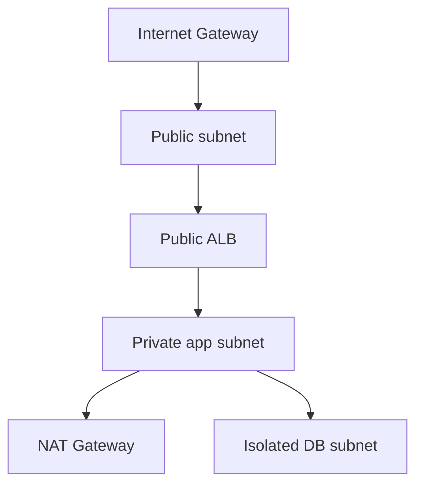

# Lab 01: Production-Ready VPC from Scratch

## Business Scenario
A new web app needs public ingress, private app subnets, and isolated database subnets with clean routing from day one.

## Core Services
VPC, Subnets, Route Tables, IGW, NAT Gateway

## Target Architecture


## Step-by-Step
1. Create a VPC and carve public, private, and isolated subnets across two AZs.
2. Attach an internet gateway and build route tables for public and private traffic.
3. Validate that only the intended subnets can reach the internet.

## CLI Commands
```bash
aws ec2 create-vpc --cidr-block 10.10.0.0/16
aws ec2 create-subnet --vpc-id vpc-12345678 --cidr-block 10.10.1.0/24 --availability-zone ap-southeast-1a
aws ec2 create-internet-gateway
aws ec2 create-route --route-table-id rtb-12345678 --destination-cidr-block 0.0.0.0/0 --gateway-id igw-12345678
```

## Expected Output
- The VPC is created with the requested CIDR block.
- The public subnet has a route to the IGW.
- The private subnet depends on NAT while the isolated subnet has no internet route.

## Failure Injection
Associate the private subnet with the public route table and confirm the exposure is immediately visible.

## Decision Trade-offs
| Option | Use case | Pros | Cons |
| --- | --- | --- | --- |
| Public subnet | Internet-facing tiers | Simple ingress | Not safe for databases or secrets. |
| Private subnet | App servers | Safer default | Needs NAT or endpoints for egress. |
| Isolated subnet | Databases | Strongest isolation | No internet access at all. |

## Common Mistakes
- Creating only one AZ and calling it highly available.
- Forgetting to attach the IGW.
- Putting the database in a public subnet.

## Exam Question
**Q:** Which subnet type is the right place for an RDS database that should never be reached from the internet?

**A:** An isolated subnet, because it has no route to the internet gateway.

## Cleanup
- Delete route table associations and subnets.
- Delete the VPC and its gateways.
- Confirm no stray elastic IPs or NAT gateways remain.

