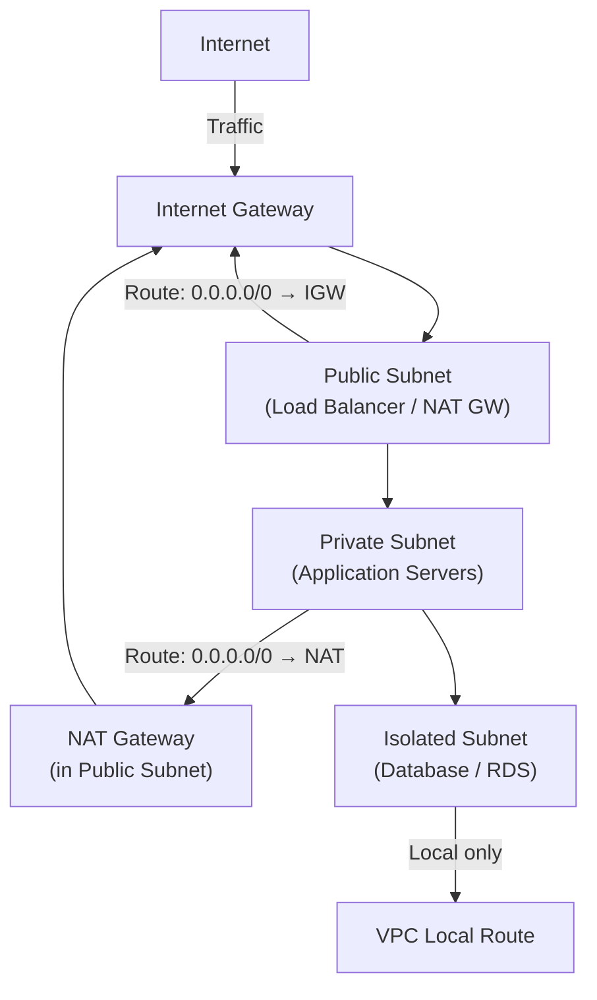

# Lab 01: Production-Ready VPC from Scratch

## Metadata
- Difficulty: Intermediate
- Time estimate: 25–30 minutes
- Estimated cost: Free Tier eligible (NAT Gateway ~$0.045/hr หากสร้างไว้)
- Prerequisites: Lab 00 (IAM Setup, optional)
- Depends on: None

> **📌 หมายเหตุสำคัญสำหรับ Lab ถัดไป:** Lab นี้จะสร้าง Subnet ครบ **6 ตัวข้าม 2 AZ** ซึ่งเป็น Foundation ที่ Lab 02, 05, 06, 08, 09 ต้องการ — ทำ Lab นี้ให้เสร็จก่อนเริ่ม Lab เหล่านั้น

## Learning Objectives
หลังจากทำ Lab นี้เสร็จ ผู้เรียนจะสามารถ:
- ออกแบบและสร้าง VPC พร้อม Subnet 3 ระดับ (Public, Private, Isolated) **ครอบคลุม 2 AZ** สำหรับ HA
- กำหนด Route Table และผูก Internet Gateway ให้ถูกต้องตามแต่ละ Tier
- อธิบายความแตกต่างระหว่าง Public, Private และ Isolated Subnet ได้
- ระบุความเสี่ยงที่เกิดขึ้นเมื่อกำหนด Route Table ผิดประเภท
- เตรียม VPC Foundation ที่รองรับ Lab 02, 05, 06, 08, 09 โดยไม่ต้องสร้าง VPC ซ้ำ

## Business Scenario
แอปพลิเคชันใหม่จำเป็นต้องมีสถาปัตยกรรมเครือข่ายที่พร้อมสำหรับ Production การออกแบบโครงสร้างเครือข่ายตั้งแต่ต้น โดยแบ่งแยก Public Subnet (สำหรับ Load Balancer), Private Subnet (สำหรับ Application) และ Isolated Subnet (สำหรับฐานข้อมูล) อย่างชัดเจนตั้งแต่เริ่มต้น เป็นสิ่งสำคัญอย่างยิ่ง

หากไม่มีการแบ่ง Subnet อย่างถูกต้อง ฐานข้อมูลอาจถูกเปิดเผยต่ออินเทอร์เน็ตโดยตรง ซึ่งเพิ่มความเสี่ยงในการถูกโจมตีอย่างมีนัยสำคัญ

## Core Services
VPC, Subnets, Route Tables, IGW, NAT Gateway

## Target Architecture


## Environment Setup
```bash
# กำหนดค่าเหล่านี้ก่อนรันคำสั่งใดๆ ใน Lab นี้
export AWS_REGION=ap-southeast-1
export ACCOUNT_ID=$(aws sts get-caller-identity --query Account --output text)
export PROJECT_TAG=SAA-Lab-01
export VPC_CIDR="10.10.0.0/16"
```

---

## Step-by-Step

### Phase 1 — สร้าง VPC และ Subnets

สร้าง VPC และแบ่ง Subnet 3 ระดับ กระจายข้าม 2 Availability Zone เพื่อรองรับ High Availability

#### 🖥️ วิธีทำผ่าน AWS Console (GUI)

1. ไปที่ **VPC → Your VPCs** → คลิก **Create VPC**
2. เลือก **VPC only** → ตั้งค่า:
   - Name tag: `Lab01-VPC`
   - IPv4 CIDR: `10.10.0.0/16`
3. คลิก **Create VPC**
4. เลือก VPC ที่สร้าง → **Actions → Edit VPC settings** → เปิด **Enable DNS hostnames** → Save
5. ไปที่ **VPC → Subnets** → คลิก **Create subnet** แล้วสร้างครบ **6 Subnets ข้าม 2 AZ**:

   | Name | CIDR | AZ |
   |---|---|---|
   | `Public-Subnet` | `10.10.1.0/24` | ap-southeast-1**a** |
   | `Public-Subnet-2` | `10.10.2.0/24` | ap-southeast-1**b** |
   | `Private-Subnet` | `10.10.11.0/24` | ap-southeast-1**a** |
   | `Private-Subnet-2` | `10.10.12.0/24` | ap-southeast-1**b** |
   | `Isolated-Subnet` | `10.10.21.0/24` | ap-southeast-1**a** |
   | `Isolated-Subnet-2` | `10.10.22.0/24` | ap-southeast-1**b** |

6. เลือก `Public-Subnet` และ `Public-Subnet-2` → **Actions → Edit subnet settings** → เปิด **Enable auto-assign public IPv4 address** → Save

#### ⌨️ วิธีทำผ่าน CLI

```bash
VPC_ID=$(aws ec2 create-vpc --cidr-block $VPC_CIDR \
  --tag-specifications "ResourceType=vpc,Tags=[{Key=Project,Value=$PROJECT_TAG},{Key=Name,Value=Lab01-VPC}]" \
  --query 'Vpc.VpcId' --output text)
aws ec2 modify-vpc-attribute --vpc-id $VPC_ID --enable-dns-hostnames

# Public Subnets × 2 (ข้าม 2 AZ — จำเป็นสำหรับ ALB ใน Lab 06)
PUB_SUBNET_ID=$(aws ec2 create-subnet --vpc-id $VPC_ID --cidr-block 10.10.1.0/24 \
  --availability-zone ${AWS_REGION}a \
  --tag-specifications "ResourceType=subnet,Tags=[{Key=Project,Value=$PROJECT_TAG},{Key=Name,Value=Public-Subnet}]" \
  --query 'Subnet.SubnetId' --output text)
PUB_SUBNET_2_ID=$(aws ec2 create-subnet --vpc-id $VPC_ID --cidr-block 10.10.2.0/24 \
  --availability-zone ${AWS_REGION}b \
  --tag-specifications "ResourceType=subnet,Tags=[{Key=Project,Value=$PROJECT_TAG},{Key=Name,Value=Public-Subnet-2}]" \
  --query 'Subnet.SubnetId' --output text)

# Private Subnets × 2 (ข้าม 2 AZ — จำเป็นสำหรับ ASG ใน Lab 06, NAT ใน Lab 08)
PRIV_SUBNET_ID=$(aws ec2 create-subnet --vpc-id $VPC_ID --cidr-block 10.10.11.0/24 \
  --availability-zone ${AWS_REGION}a \
  --tag-specifications "ResourceType=subnet,Tags=[{Key=Project,Value=$PROJECT_TAG},{Key=Name,Value=Private-Subnet}]" \
  --query 'Subnet.SubnetId' --output text)
PRIV_SUBNET_2_ID=$(aws ec2 create-subnet --vpc-id $VPC_ID --cidr-block 10.10.12.0/24 \
  --availability-zone ${AWS_REGION}b \
  --tag-specifications "ResourceType=subnet,Tags=[{Key=Project,Value=$PROJECT_TAG},{Key=Name,Value=Private-Subnet-2}]" \
  --query 'Subnet.SubnetId' --output text)

# Isolated Subnets × 2 (ข้าม 2 AZ — จำเป็นสำหรับ RDS Multi-AZ ใน Lab 05)
ISOLATED_SUBNET_ID=$(aws ec2 create-subnet --vpc-id $VPC_ID --cidr-block 10.10.21.0/24 \
  --availability-zone ${AWS_REGION}a \
  --tag-specifications "ResourceType=subnet,Tags=[{Key=Project,Value=$PROJECT_TAG},{Key=Name,Value=Isolated-Subnet}]" \
  --query 'Subnet.SubnetId' --output text)
ISOLATED_SUBNET_2_ID=$(aws ec2 create-subnet --vpc-id $VPC_ID --cidr-block 10.10.22.0/24 \
  --availability-zone ${AWS_REGION}b \
  --tag-specifications "ResourceType=subnet,Tags=[{Key=Project,Value=$PROJECT_TAG},{Key=Name,Value=Isolated-Subnet-2}]" \
  --query 'Subnet.SubnetId' --output text)

# เปิดให้ Public Subnets ทั้งสองตัวจ่าย Public IP โดยอัตโนมัติ
aws ec2 modify-subnet-attribute --subnet-id $PUB_SUBNET_ID --map-public-ip-on-launch
aws ec2 modify-subnet-attribute --subnet-id $PUB_SUBNET_2_ID --map-public-ip-on-launch
```

**Expected output:** VPC ID และ Subnet IDs ถูกบันทึกลงใน Shell variables เรียบร้อย

---

### Phase 2 — Internet Gateway และ Route Tables

สร้าง Internet Gateway แล้วกำหนด Route Table ให้ Public Subnet สามารถสื่อสารกับอินเทอร์เน็ตได้ ส่วน Private และ Isolated Subnet ไม่มี Route ออกโดยตรง

#### 🖥️ วิธีทำผ่าน AWS Console (GUI)

1. ไปที่ **VPC → Internet Gateways** → คลิก **Create internet gateway**
2. ตั้งชื่อ `Lab01-IGW` → คลิก **Create internet gateway**
3. เลือก IGW ที่สร้าง → **Actions → Attach to VPC** → เลือก `Lab01-VPC` → **Attach**
4. ไปที่ **VPC → Route Tables** → คลิก **Create route table**
   - Name: `Public-RT` → VPC: `Lab01-VPC` → **Create**
5. เลือก `Public-RT` → แท็บ **Routes** → **Edit routes** → **Add route**
   - Destination: `0.0.0.0/0` → Target: เลือก IGW ที่สร้าง → **Save changes**
6. แท็บ **Subnet associations** → **Edit subnet associations** → เลือก `Public-Subnet` → **Save**

#### ⌨️ วิธีทำผ่าน CLI

```bash
IGW_ID=$(aws ec2 create-internet-gateway \
  --tag-specifications "ResourceType=internet-gateway,Tags=[{Key=Project,Value=$PROJECT_TAG}]" \
  --query 'InternetGateway.InternetGatewayId' --output text)
aws ec2 attach-internet-gateway --vpc-id $VPC_ID --internet-gateway-id $IGW_ID

# สร้าง Route Table สำหรับ Public Subnets
RTB_PUB_ID=$(aws ec2 create-route-table --vpc-id $VPC_ID \
  --tag-specifications "ResourceType=route-table,Tags=[{Key=Project,Value=$PROJECT_TAG},{Key=Name,Value=Public-RT}]" \
  --query 'RouteTable.RouteTableId' --output text)
aws ec2 create-route --route-table-id $RTB_PUB_ID --destination-cidr-block 0.0.0.0/0 --gateway-id $IGW_ID

# ผูก Route Table กับ Public Subnets ทั้ง 2 ตัว
aws ec2 associate-route-table --subnet-id $PUB_SUBNET_ID --route-table-id $RTB_PUB_ID
aws ec2 associate-route-table --subnet-id $PUB_SUBNET_2_ID --route-table-id $RTB_PUB_ID
# Private และ Isolated Subnets ใช้ Default Route Table (Local only) — ไม่ต้อง Associate
```

**Expected output:** คำสั่ง `associate-route-table` คืนค่า `"AssociationState": {"State": "associated"}` แสดงว่าผูกสำเร็จ

---

### Phase 3 — ตรวจสอบ Route Tables

ตรวจสอบว่ามีเพียง `Public-RT` เท่านั้นที่มี Route ไปยัง IGW ส่วน Private และ Isolated Subnet ใช้เฉพาะ Local Route

#### 🖥️ วิธีทำผ่าน AWS Console (GUI)

1. ไปที่ **VPC → Route Tables**
2. กรองด้วย VPC ที่สร้าง
3. ตรวจสอบ Route Tables แต่ละตัว:
   - `Public-RT` ต้องมี Route `0.0.0.0/0 → igw-xxx`
   - Route Table ของ Private และ Isolated ต้องมีเฉพาะ `local` เท่านั้น

#### ⌨️ วิธีทำผ่าน CLI

```bash
aws ec2 describe-route-tables \
  --filters "Name=vpc-id,Values=$VPC_ID" \
  --query 'RouteTables[*].{Name:Tags[?Key==`Name`].Value|[0], Routes:Routes}'
```

**Expected output:** มีเพียง `Public-RT` เท่านั้นที่มี Route `0.0.0.0/0 → IGW` Route Table อื่นมีเฉพาะ `local` route

---

## Failure Injection

ผูก Private Subnet เข้ากับ Public Route Table โดยตั้งใจ เพื่อสังเกตผลกระทบด้านความปลอดภัย

```bash
# จำลองการกำหนดค่าผิดพลาด: ให้ Private Subnet ใช้ Route Table เดียวกับ Public
ASSOC_ID=$(aws ec2 associate-route-table \
  --subnet-id $PRIV_SUBNET_ID \
  --route-table-id $RTB_PUB_ID \
  --query 'AssociationId' --output text)
```

**What to observe:** ทรัพยากรใดก็ตามที่อยู่ใน Private Subnet จะมี Route ออกอินเทอร์เน็ตโดยตรงผ่าน IGW ทำให้ Application Server ถูกเปิดเผยสู่สาธารณะโดยไม่ตั้งใจ (Unintended Internet Exposure)

**How to recover:**
```bash
# ยกเลิกการผูกที่ผิดพลาด เพื่อให้ Private Subnet กลับไปใช้ Default Route Table
aws ec2 disassociate-route-table --association-id $ASSOC_ID
```

---

## Decision Trade-offs

| ประเภท Subnet | เหมาะกับ | ประสิทธิภาพ | ค่าใช้จ่าย | ภาระงาน (Ops) |
|---|---|---|---|---|
| Public Subnet | Load Balancer, NAT Gateway, Bastion Host | สูง (เชื่อมต่ออินเทอร์เน็ตโดยตรง) | ฟรี (เก็บตาม Data Transfer) | ต่ำ |
| Private Subnet | Application Servers, Worker Nodes | สูง (ต้องพึ่ง NAT GW สำหรับ Outbound) | ปานกลาง (ค่า NAT GW) | ปานกลาง |
| Isolated Subnet | ฐานข้อมูล RDS, ElastiCache | สูง (ภายใน VPC เท่านั้น) | ฟรี | ต่ำ |

---

## Common Mistakes

- **Mistake:** วางทรัพยากรทั้งหมดใน Availability Zone เดียว โดยเข้าใจว่าเป็น High Availability
  **Why it fails:** หากเกิดเหตุขัดข้องใน AZ นั้น ระบบทั้งหมดจะหยุดทำงานพร้อมกัน ควรกระจายอย่างน้อย 2 AZ เสมอ

- **Mistake:** ลืม Attach Internet Gateway เข้ากับ VPC ก่อนสร้าง Route
  **Why it fails:** แม้จะสร้าง Route `0.0.0.0/0 → igw-xxx` ไว้แล้ว หาก IGW ยังไม่ถูก Attach เข้า VPC Traffic จะไม่สามารถออกได้

- **Mistake:** วางฐานข้อมูลบน Public Subnet เพื่อให้เชื่อมต่อจากภายนอกได้ง่าย
  **Why it fails:** ฐานข้อมูลจะถูกเปิดเผยต่ออินเทอร์เน็ตโดยตรง เพิ่มความเสี่ยงในการถูก Brute Force หรือโจมตีได้

- **Mistake:** ใช้ NAT Instance (EC2) แทน NAT Gateway
  **Why it fails:** NAT Instance ต้องบริหารจัดการเอง และมีข้อจำกัดด้าน Throughput รวมถึงเป็น Single Point of Failure

- **Mistake:** เพิ่ม Route `0.0.0.0/0 → IGW` ใน Private Subnet Route Table โดยไม่ตั้งใจ
  **Why it fails:** Private Subnet จะกลายเป็น Public Subnet ทันที ทำลายหลักการ Layered Security

---

## Exam Questions

**Q1:** Subnet ประเภทใดเหมาะสมที่สุดสำหรับวางฐานข้อมูล RDS ที่ไม่ควรเข้าถึงได้จากอินเทอร์เน็ตโดยตรง?
**A:** Isolated Subnet (Private Subnet ที่ไม่มี Route ไปยัง NAT Gateway หรือ IGW)
**Rationale:** Isolated Subnet ไม่มี Route ออกนอก VPC ทั้งสิ้น ทำให้ฐานข้อมูลไม่สามารถเริ่มต้นการเชื่อมต่อออกนอก และไม่สามารถถูกเข้าถึงจากอินเทอร์เน็ตโดยตรง

**Q2:** เหตุใด NAT Gateway จึงต้องตั้งอยู่ใน Public Subnet เสมอ?
**A:** เพราะ NAT Gateway ต้องการ Route ไปยัง Internet Gateway เพื่อทำหน้าที่แปล Private IP เป็น Public IP สำหรับ Outbound Traffic
**Rationale:** NAT Gateway ทำหน้าที่เป็นตัวกลางรับ Traffic จาก Private Subnet ส่งออกอินเทอร์เน็ต จึงต้องอยู่ใน Subnet ที่มี Route ถึง IGW และมี Elastic IP Address

---

## Cleanup (เรียงลำดับตามนี้เท่านั้น — ห้ามข้ามขั้นตอน)

```bash
# ⚠️ ลบ VPC จาก Lab 01 ก็ต่อเมื่อทำ Labs ทั้งหมดที่ใช้ VPC นี้เสร็จแล้ว
# (Lab 02, 05, 06, 08, 09 ต่างใช้ VPC และ Subnets จาก Lab 01)

# Step 1 — ถอด Internet Gateway และลบ Route Table
aws ec2 detach-internet-gateway --internet-gateway-id $IGW_ID --vpc-id $VPC_ID
aws ec2 delete-internet-gateway --internet-gateway-id $IGW_ID
aws ec2 delete-route-table --route-table-id $RTB_PUB_ID

# Step 2 — ลบ Subnets ทั้ง 6 ตัว
aws ec2 delete-subnet --subnet-id $PUB_SUBNET_ID
aws ec2 delete-subnet --subnet-id $PUB_SUBNET_2_ID
aws ec2 delete-subnet --subnet-id $PRIV_SUBNET_ID
aws ec2 delete-subnet --subnet-id $PRIV_SUBNET_2_ID
aws ec2 delete-subnet --subnet-id $ISOLATED_SUBNET_ID
aws ec2 delete-subnet --subnet-id $ISOLATED_SUBNET_2_ID

# Step 3 — ลบ VPC
aws ec2 delete-vpc --vpc-id $VPC_ID

# Step 4 — ตรวจสอบว่าลบเรียบร้อยแล้ว
aws ec2 describe-vpcs --vpc-ids $VPC_ID 2>&1 || echo "✅ VPC ถูกลบเรียบร้อย"
```

**Cost check:** ตรวจสอบว่าไม่มี NAT Gateway ที่ยังค้างอยู่ (เพราะมีค่าใช้จ่าย $0.045/hr):
```bash
aws ec2 describe-nat-gateways \
  --filter "Name=tag:Project,Values=$PROJECT_TAG" \
  --query 'NatGateways[?State!=`deleted`]' --output table
```
