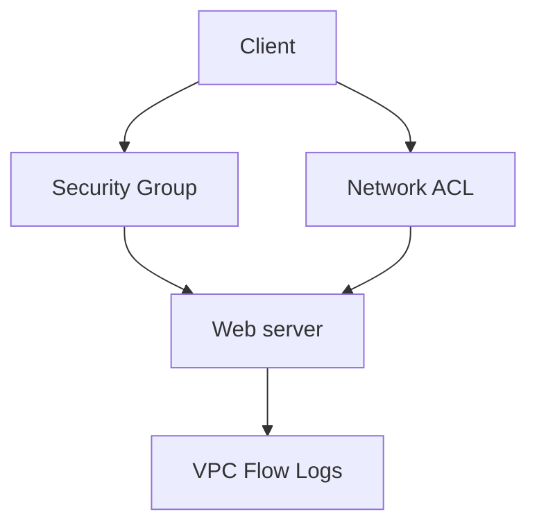

# Lab 02: Security Groups vs NACLs

## Business Scenario
A team needs to prove the difference between stateful security groups and stateless network ACLs using real traffic flow.

## Core Services
EC2, Security Groups, NACLs, VPC Flow Logs

## Target Architecture


## Step-by-Step
1. Launch two test instances and give one a tight security group.
2. Add a NACL rule set that intentionally blocks return traffic.
3. Run a connection test and compare the logs and packet flow.

## CLI Commands
```bash
aws ec2 authorize-security-group-ingress --group-id sg-12345678 --protocol tcp --port 443 --cidr 0.0.0.0/0
aws ec2 create-network-acl-entry --network-acl-id acl-12345678 --ingress --rule-number 100 --protocol tcp --port-range From=443,To=443 --cidr-block 0.0.0.0/0 --rule-action allow
aws ec2 create-network-acl-entry --network-acl-id acl-12345678 --egress --rule-number 110 --protocol tcp --port-range From=1024,To=65535 --cidr-block 0.0.0.0/0 --rule-action allow
curl -vk https://<instance-public-dns>
```

## Expected Output
- Security group allows stateful return traffic automatically.
- NACL needs explicit return-port rules or the connection fails.
- VPC Flow Logs show `ACCEPT` for SG behavior but `REJECT` when the NACL is too narrow.

## Failure Injection
Remove the ephemeral port range from the NACL and observe that the TLS handshake starts but the return traffic is dropped.

## Decision Trade-offs
| Option | Strength | Weakness | Typical use |
| --- | --- | --- | --- |
| Security Group | Stateful and simple | No explicit deny | Instance-level allow lists. |
| NACL | Subnet-level deny rules | More error-prone | Broad subnet guardrails. |
| Network Firewall | Deep inspection | More cost and ops | Centralized inspection. |

## Common Mistakes
- Forgetting ephemeral ports in the NACL.
- Assuming the NACL is stateful like a security group.
- Using a NACL as the only control for instance-specific rules.

## Exam Question
**Q:** Why does HTTPS fail after the SYN packet when a NACL is too restrictive?

**A:** Because NACLs are stateless and must explicitly allow the return ephemeral ports.

## Cleanup
- Delete the test NACL rules.
- Terminate the instances used for traffic tests.
- Disable Flow Logs if they were created only for the lab.

