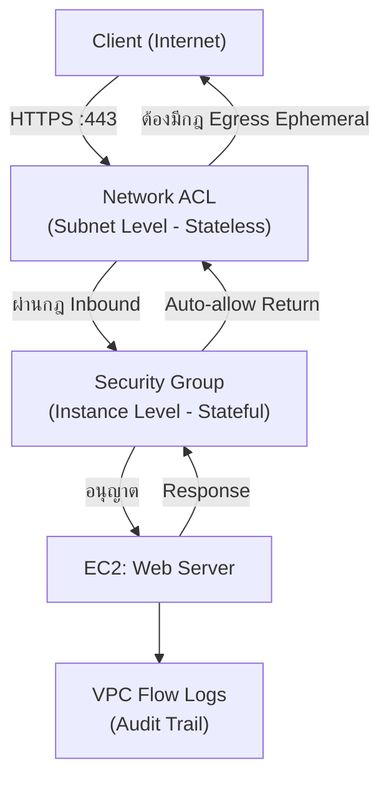

# Lab 02: Security Groups vs NACLs

## Metadata
- Difficulty: Intermediate
- Time estimate: 20–25 minutes
- Estimated cost: Free Tier eligible
- Prerequisites: Lab 01 (VPC with public subnets)
- Depends on: Lab 01

## Learning Objectives
หลังจากทำ Lab นี้เสร็จ ผู้เรียนจะสามารถ:
- อธิบายความแตกต่างระหว่าง Security Group (Stateful) และ NACL (Stateless) ได้
- กำหนด Inbound และ Outbound rules ของ NACL ได้อย่างถูกต้อง รวมถึง Ephemeral Ports
- ระบุสาเหตุที่ Application ค้างหรือ Timeout เมื่อ NACL กำหนดไม่ครบ
- เลือกใช้ Security Group หรือ NACL ได้อย่างเหมาะสมตามสถานการณ์

## Business Scenario
ทีมวิศวกรมีความเห็นไม่ตรงกันในการกำหนดค่า Firewall บางส่วนต้องการใช้ Network ACL เพื่อควบคุมที่ระดับ Subnet ในขณะที่ทีมแอปพลิเคชันต้องการใช้เพียง Security Group เท่านั้น

หากไม่เข้าใจความแตกต่างระหว่าง Stateful และ Stateless จะนำไปสู่การบล็อก Ephemeral Ports (ขากลับ) โดยไม่ตั้งใจ ทำให้แอปพลิเคชันค้างหรือหยุดทำงาน หรืออาจเปิดสิทธิ์กว้างเกินไปจนเกิดช่องโหว่ด้านความปลอดภัย

## Core Services
EC2, Security Groups, NACLs, VPC Flow Logs

## Target Architecture


## Environment Setup
```bash
# กำหนดค่าเหล่านี้ก่อนรันคำสั่งใดๆ ใน Lab นี้
export AWS_REGION=ap-southeast-1
export ACCOUNT_ID=$(aws sts get-caller-identity --query Account --output text)
export PROJECT_TAG=SAA-Lab-02
# เชื่อมต่อกับ VPC ที่ได้จาก Lab 01
export VPC_ID=$(aws ec2 describe-vpcs \
  --filters "Name=tag:Project,Values=SAA-Lab-01" \
  --query 'Vpcs[0].VpcId' --output text)
```

---

## Step-by-Step

### Phase 1 — สร้าง Security Group

สร้าง Security Group ที่อนุญาตเฉพาะ HTTPS (Port 443) Inbound เท่านั้น Security Group เป็น Stateful จึงอนุญาต Return traffic โดยอัตโนมัติ

#### 🖥️ วิธีทำผ่าน AWS Console (GUI)

1. ไปที่ **VPC → Security Groups** → คลิก **Create security group**
2. กำหนดค่า:
   - Name: `Lab02-Web-SG`
   - Description: `Web SG`
   - VPC: เลือก VPC จาก Lab 01
3. เพิ่ม **Inbound rule**:
   - Type: `HTTPS` → Port: `443` → Source: `0.0.0.0/0`
4. คลิก **Create security group**

#### ⌨️ วิธีทำผ่าน CLI

```bash
SG_ID=$(aws ec2 create-security-group \
  --group-name Lab02-Web-SG \
  --description "Web SG" \
  --vpc-id $VPC_ID \
  --query 'GroupId' --output text)
aws ec2 authorize-security-group-ingress \
  --group-id $SG_ID --protocol tcp --port 443 --cidr 0.0.0.0/0
aws ec2 create-tags --resources $SG_ID --tags Key=Project,Value=$PROJECT_TAG
```

**Expected output:** Security Group ID ถูกบันทึกลงในตัวแปร `$SG_ID` และมี Inbound rule สำหรับ Port 443

---

### Phase 2 — กำหนด NACL (จำลองการกำหนดค่าผิดพลาด)

สร้าง NACL ที่มีเฉพาะ Inbound rule แต่ยังขาด Egress rule สำหรับ Ephemeral Ports เพื่อสังเกตผลกระทบ

> **หมายเหตุ:** NACL เป็น Stateless หมายความว่าต้องกำหนด Inbound และ Outbound rules แยกกันอย่างชัดเจน

#### 🖥️ วิธีทำผ่าน AWS Console (GUI)

1. ไปที่ **VPC → Network ACLs** → คลิก **Create network ACL**
2. ตั้งชื่อ `Lab02-NACL` → เลือก VPC จาก Lab 01 → **Create**
3. เลือก NACL ที่สร้าง → แท็บ **Inbound rules** → **Edit inbound rules** → **Add new rule**:
   - Rule number: `100` → Type: `HTTPS (443)` → Source: `0.0.0.0/0` → Allow → **Save**
4. สังเกตว่า **Outbound rules** ยังไม่มีกฎสำหรับ Ephemeral Ports (จุดบกพร่อง)

#### ⌨️ วิธีทำผ่าน CLI

```bash
NACL_ID=$(aws ec2 create-network-acl \
  --vpc-id $VPC_ID \
  --query 'NetworkAcl.NetworkAclId' --output text)

# กำหนด Inbound rule: อนุญาต HTTPS Port 443
aws ec2 create-network-acl-entry \
  --network-acl-id $NACL_ID \
  --ingress \
  --rule-number 100 \
  --protocol tcp \
  --port-range From=443,To=443 \
  --cidr-block 0.0.0.0/0 \
  --rule-action allow

# หมายเหตุ: ยังไม่มี Egress rule สำหรับ Ephemeral Ports → จะทำให้ Response ถูกบล็อก
```

**Expected output:** NACL ถูกสร้างและมี Inbound rule สำหรับ Port 443 แต่ยังขาด Outbound rule

---

### Phase 3 — แก้ไข NACL ให้สมบูรณ์

เพิ่ม Egress rule สำหรับ Ephemeral Ports (1024–65535) เพื่ออนุญาต Return Traffic จาก Server ไปยัง Client

#### 🖥️ วิธีทำผ่าน AWS Console (GUI)

1. เลือก NACL `Lab02-NACL` → แท็บ **Outbound rules** → **Edit outbound rules** → **Add new rule**:
   - Rule number: `110` → Type: `Custom TCP` → Port range: `1024 - 65535`
   - Destination: `0.0.0.0/0` → Allow → **Save**
2. ตรวจสอบว่า Web Server สามารถตอบกลับ Client ได้แล้ว

#### ⌨️ วิธีทำผ่าน CLI

```bash
# แก้ไข: เพิ่ม Egress rule สำหรับ Ephemeral Ports
aws ec2 create-network-acl-entry \
  --network-acl-id $NACL_ID \
  --egress \
  --rule-number 110 \
  --protocol tcp \
  --port-range From=1024,To=65535 \
  --cidr-block 0.0.0.0/0 \
  --rule-action allow
```

**Expected output:** NACL มีทั้ง Inbound (Port 443) และ Outbound (Ports 1024–65535) ทำให้ HTTPS Request สมบูรณ์ตั้งแต่ต้นจนปลาย

---

## Failure Injection

ลบ Egress rule ออกเพื่อจำลองความผิดพลาดที่เกิดขึ้นบ่อยใน Production

```bash
aws ec2 delete-network-acl-entry \
  --network-acl-id $NACL_ID \
  --egress \
  --rule-number 110
```

**What to observe:** การเชื่อมต่อ HTTPS จะสำเร็จในขั้น TLS Handshake แต่ Response จาก Server จะถูกบล็อกที่ NACL ชั้น Subnet ผู้ใช้จะพบ Connection Timeout โดยไม่มีข้อความ Error ที่ชัดเจน

**How to recover:**
```bash
aws ec2 create-network-acl-entry \
  --network-acl-id $NACL_ID \
  --egress \
  --rule-number 110 \
  --protocol tcp \
  --port-range From=1024,To=65535 \
  --cidr-block 0.0.0.0/0 \
  --rule-action allow
```

---

## Decision Trade-offs

| ตัวเลือก | เหมาะกับ | ประสิทธิภาพ | ค่าใช้จ่าย | ภาระงาน (Ops) |
|---|---|---|---|---|
| Security Group | ควบคุมระดับ Instance | เร็ว | ฟรี | ต่ำ (Stateful, ไม่ต้องกำหนด Return traffic) |
| NACL | Block IP เฉพาะ / ควบคุมระดับ Subnet | เร็ว | ฟรี | สูง (Stateless, ต้องกำหนดทั้ง Inbound และ Outbound) |
| AWS Network Firewall | Deep Packet Inspection / Layer 7 | ปานกลาง | แพง | สูงปานกลาง |

---

## Common Mistakes

- **Mistake:** ลืมกำหนด Outbound Ephemeral Ports ใน NACL
  **Why it fails:** NACL เป็น Stateless — ไม่จดจำ State ของ Connection จึงต้องกำหนด Inbound และ Outbound rules แยกกันอย่างชัดเจน หาก Outbound ขาด Ephemeral Ports (1024–65535) Response จาก Server จะถูกบล็อก

- **Mistake:** เข้าใจว่า NACL ทำงานแบบ Stateful เหมือน Security Group
  **Why it fails:** ความเข้าใจผิดนี้ทำให้เกิด Asymmetric Routing — Traffic เข้าได้แต่ออกไม่ได้ หรือในทางกลับกัน

- **Mistake:** ใช้ NACL เป็นกลไกป้องกันหลักเพียงชั้นเดียว
  **Why it fails:** NACL ป้องกันที่ระดับ Subnet หาก Instance ใดในกลุ่ม Subnet เดียวกันถูก Compromise สามารถโจมตี Instance อื่นๆ ในกลุ่มเดียวกันได้ เนื่องจาก NACL ไม่ควบคุม Traffic ภายใน Subnet

- **Mistake:** กำหนด Outbound rules ของ Security Group สำหรับ Return Traffic
  **Why it fails:** Security Group เป็น Stateful — Outbound rules ใช้ควบคุมเฉพาะ Traffic ที่ Instance **เริ่มต้นส่งออกเอง** ไม่เกี่ยวกับ Return Traffic จาก Inbound Connections ที่ได้รับ

- **Mistake:** พึ่ง NACL เป็นหลักสำหรับ Application Firewall ทั่วไป
  **Why it fails:** Security Group เพียงอย่างเดียวครอบคลุม Use Case ทั่วไปได้ถึง 95% NACL ควรใช้เฉพาะกรณีที่ต้องการ Explicit Deny หรือ Block IP ที่ระดับ Subnet

---

## Exam Questions

**Q1:** เหตุใด HTTPS Connection จึงค้างและ Timeout หลังจากที่ SYN Packet ผ่าน NACL มาได้แล้ว?
**A:** NACL เป็น Stateless จึงต้องกำหนด Egress rule สำหรับ Ephemeral Ports (1024–65535) อย่างชัดเจน เพื่ออนุญาต Return Traffic จาก Server
**Rationale:** Inbound request บน Port 443 ผ่านได้ แต่เมื่อ Server พยายาม Response ผ่าน Ephemeral Port (1024–65535) จะถูกบล็อกโดย NACL ที่ไม่มี Outbound rule รองรับ

**Q2:** กลไกใดบน AWS ที่รองรับการ Deny เฉพาะ IP Address ที่ระดับ Subnet?
**A:** Network ACLs (NACL)
**Rationale:** Security Group รองรับเฉพาะ Allow rules เท่านั้น NACL รองรับทั้ง Allow และ Deny rules ที่ระดับ Subnet ทำให้สามารถ Block IP เฉพาะได้อย่างชัดเจน

---

## Cleanup (เรียงลำดับตามนี้เท่านั้น — ห้ามข้ามขั้นตอน)

```bash
# Step 1 — ลบ NACL (ต้องไม่มี Subnet Association ก่อนลบ)
aws ec2 delete-network-acl --network-acl-id $NACL_ID

# Step 2 — ลบ Security Group
aws ec2 delete-security-group --group-id $SG_ID

# Step 3 — ตรวจสอบว่าลบเรียบร้อยแล้ว
aws ec2 describe-security-groups \
  --filters "Name=tag:Project,Values=$PROJECT_TAG" 2>&1 || echo "✅ ทรัพยากรถูกลบเรียบร้อย"
```

**Cost check:** NACL และ Security Group ไม่มีค่าใช้จ่าย ตรวจสอบว่าไม่มี EC2 ที่รันอยู่:
```bash
aws ec2 describe-instances \
  --filters "Name=tag:Project,Values=$PROJECT_TAG" "Name=instance-state-name,Values=running" \
  --query 'Reservations[].Instances[].InstanceId' --output table
```
