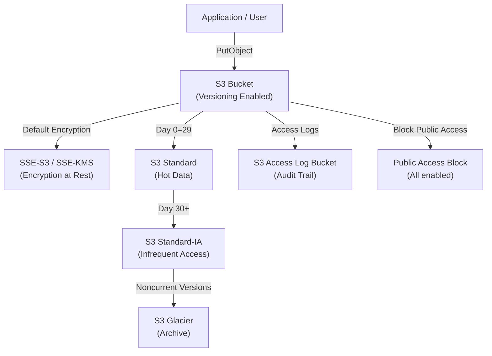

# Lab 03: S3 Security, Encryption, and Lifecycle

## Metadata
- Difficulty: Intermediate
- Time estimate: 15–20 minutes
- Estimated cost: Free Tier eligible
- Prerequisites: None
- Depends on: None

## Learning Objectives
หลังจากทำ Lab นี้เสร็จ ผู้เรียนจะสามารถ:
- สร้าง S3 Bucket พร้อม Versioning และ Default Encryption อย่างถูกต้อง
- กำหนด Lifecycle Policy เพื่อย้าย Object ไปยัง Storage Class ที่ประหยัดกว่าตามอายุการใช้งาน
- อธิบายความแตกต่างระหว่าง SSE-S3, SSE-KMS และ Client-Side Encryption ได้
- ป้องกัน Public Access โดยใช้ Block Public Access และตรวจสอบสถานะได้

## Business Scenario
ทีมตัดต่อวิดีโออัปโหลดไฟล์ขนาดใหญ่เก็บไว้ใน S3 เป็นจำนวนมาก แต่เมื่อเวลาผ่านไป ค่า Storage เพิ่มขึ้นอย่างต่อเนื่องจนน่าเป็นห่วง นอกจากนี้ทีม Audit ยังกำหนดว่าไฟล์ทุกชิ้นต้องถูกเข้ารหัส และห้ามเปิดเป็น Public โดยเด็ดขาด

การไม่กำหนด Lifecycle Policy ทำให้ไฟล์เก่าคงอยู่ใน Storage Class ราคาสูงโดยไม่จำเป็น และหากเกิดการกำหนดค่า Bucket ผิดพลาดทำให้เป็น Public จะทำให้ข้อมูลลับรั่วไหลได้ทันที

## Core Services
S3, KMS, Lifecycle Policies, Bucket Policy

## Target Architecture


## Environment Setup
```bash
# กำหนดค่าเหล่านี้ก่อนรันคำสั่งใดๆ ใน Lab นี้
export AWS_REGION=ap-southeast-1
export ACCOUNT_ID=$(aws sts get-caller-identity --query Account --output text)
export PROJECT_TAG=SAA-Lab-03
export BUCKET_NAME="lab03-assets-${ACCOUNT_ID}-${RANDOM}"
```

---

## Step-by-Step

### Phase 1 — สร้าง Bucket และเปิด Versioning

สร้าง S3 Bucket แบบ Private พร้อมเปิด Versioning เพื่อป้องกันการลบหรืออัปโหลดทับไฟล์โดยไม่ตั้งใจ

#### 🖥️ วิธีทำผ่าน AWS Console (GUI)

1. ไปที่ **S3 → Buckets** → คลิก **Create bucket**
2. ตั้งชื่อ Bucket (ต้อง Unique ทั่ว AWS) → เลือก Region: `ap-southeast-1`
3. ส่วน **Object Ownership**: เลือก **ACLs disabled**
4. ส่วน **Block Public Access**: ตรวจสอบว่าเปิดทุก Option (เปิดเป็น Default)
5. ส่วน **Bucket Versioning**: เลือก **Enable**
6. คลิก **Create bucket**
7. เข้า Bucket ที่สร้าง → แท็บ **Properties** → **Default encryption** → ตรวจสอบว่าเป็น **SSE-S3 (AES-256)**

#### ⌨️ วิธีทำผ่าน CLI

```bash
aws s3api create-bucket \
  --bucket $BUCKET_NAME \
  --region $AWS_REGION \
  --create-bucket-configuration LocationConstraint=$AWS_REGION

aws s3api put-bucket-versioning \
  --bucket $BUCKET_NAME \
  --versioning-configuration Status=Enabled

# ตรวจสอบ Default Encryption
aws s3api get-bucket-encryption --bucket $BUCKET_NAME
```

**Expected output:** คำสั่ง `get-bucket-encryption` แสดง `SSEAlgorithm: AES256` ยืนยันว่ามีการเข้ารหัสพื้นฐานอยู่แล้วโดยอัตโนมัติ

---

### Phase 2 — กำหนด Lifecycle Policy

กำหนดกฎ Lifecycle เพื่อย้าย Object ใน Prefix `assets/` ไปยัง Storage Class ที่ถูกกว่า ตามอายุการใช้งาน

#### 🖥️ วิธีทำผ่าน AWS Console (GUI)

1. เข้า Bucket → แท็บ **Management** → **Lifecycle rules** → **Create lifecycle rule**
2. กำหนดค่า:
   - Rule name: `MoveToInfrequentAccess`
   - Prefix: `assets/`
3. ส่วน **Lifecycle rule actions** เลือก:
   - **Transition current versions of objects between storage classes**
   - **Transition noncurrent versions of objects between storage classes**
4. กำหนด Transitions:
   - Current versions: หลัง **30 วัน** → `S3 Standard-IA`
   - Noncurrent versions: หลัง **30 วัน** → `S3 Glacier`
5. คลิก **Create rule**

#### ⌨️ วิธีทำผ่าน CLI

```bash
cat <<EOF > lifecycle.json
{
  "Rules": [
    {
      "ID": "MoveToInfrequentAccess",
      "Filter": { "Prefix": "assets/" },
      "Status": "Enabled",
      "Transitions": [
        { "Days": 30, "StorageClass": "STANDARD_IA" }
      ],
      "NoncurrentVersionTransitions": [
        { "NoncurrentDays": 30, "StorageClass": "GLACIER" }
      ]
    }
  ]
}
EOF

aws s3api put-bucket-lifecycle-configuration \
  --bucket $BUCKET_NAME \
  --lifecycle-configuration file://lifecycle.json
```

**Expected output:** คำสั่งสำเร็จโดยไม่มี Error Lifecycle Policy จะเริ่มประเมิน Object ตาม Rule ทุกคืนเที่ยงคืน UTC

---

### Phase 3 — ตรวจสอบ Public Access Block

ตรวจสอบว่า Bucket ถูกป้องกันจากการเปิดเป็น Public ทุกช่องทาง

#### 🖥️ วิธีทำผ่าน AWS Console (GUI)

1. เข้า Bucket → แท็บ **Permissions**
2. ดูส่วน **Block public access (bucket settings)**
3. ตรวจสอบว่าทุก Option แสดงสถานะ **On** ทั้ง 4 รายการ:
   - Block public access to buckets and objects granted through new ACLs
   - Block public access to buckets and objects granted through any ACLs
   - Block public access to buckets and objects granted through new public bucket policies
   - Block public and cross-account access to buckets and objects

#### ⌨️ วิธีทำผ่าน CLI

```bash
aws s3api get-public-access-block --bucket $BUCKET_NAME
```

**Expected output:** ทุก field (`BlockPublicAcls`, `IgnorePublicAcls`, `BlockPublicPolicy`, `RestrictPublicBuckets`) แสดงเป็น `true` ทั้งหมด

---

## Failure Injection

ปลดล็อค Block Public Access แล้วพยายามตั้งค่า Object เป็น Public-Read เพื่อสังเกตผลกระทบ

```bash
# ปิด Block Public Access ทั้งหมด
aws s3api delete-public-access-block --bucket $BUCKET_NAME

# อัปโหลดไฟล์ทดสอบและตั้งค่าเป็น Public
aws s3 put-object --bucket $BUCKET_NAME --key test.txt --body /dev/null
aws s3api put-object-acl --bucket $BUCKET_NAME --key test.txt --acl public-read
```

**What to observe:** เมื่อปิด Block Public Access แล้ว Object สามารถถูกตั้งเป็น Public-Read ได้ ทำให้ URL ของไฟล์สามารถเข้าถึงได้จากอินเทอร์เน็ตโดยไม่ต้องมีการยืนยันตัวตน

**How to recover:**
```bash
# เปิด Block Public Access กลับทันที
aws s3api put-public-access-block \
  --bucket $BUCKET_NAME \
  --public-access-block-configuration \
  "BlockPublicAcls=true,IgnorePublicAcls=true,BlockPublicPolicy=true,RestrictPublicBuckets=true"
```

---

## Decision Trade-offs

| ตัวเลือก Encryption | เหมาะกับ | ประสิทธิภาพ | ค่าใช้จ่าย | ภาระงาน (Ops) |
|---|---|---|---|---|
| SSE-S3 (AES-256) | ข้อมูลทั่วไปที่ต้องการเข้ารหัส | สมบูรณ์ | ฟรี | ต่ำมาก (S3 จัดการ Key เอง) |
| SSE-KMS | ข้อมูลการเงิน / ข้อมูลลูกค้า ที่ต้องมี Audit trail | สมบูรณ์ | มีค่าใช้จ่ายต่อการเรียกใช้ KMS | ปานกลาง (ต้องกำหนด Key Policy) |
| Client-Side Encryption | ข้อมูลที่ต้องการ Zero-Knowledge ฝั่ง AWS | ขึ้นอยู่กับ Client | ขึ้นอยู่กับระบบ | สูงมาก (Application ต้องจัดการเอง) |

---

## Common Mistakes

- **Mistake:** ไม่เปิด Block Public Access ทำให้ Bucket ถูกเปิดเผยโดยบังเอิญ
  **Why it fails:** S3 Public Buckets เป็นสาเหตุอันดับต้นๆ ของ Data Breach บน AWS ควรเปิด Block Public Access ทันทีเมื่อสร้าง Bucket

- **Mistake:** ใช้ SSE-KMS แต่ไม่ได้ Grant สิทธิ์ `kms:Decrypt` ให้ Service ที่ต้องอ่านไฟล์
  **Why it fails:** Lambda, CloudFront หรือ Service อื่นๆ จะได้รับ Error `AccessDenied` เมื่อพยายามอ่านไฟล์ แม้จะมีสิทธิ์ S3 ครบถ้วนก็ตาม

- **Mistake:** กำหนด Lifecycle Policy สำหรับ Current Versions แต่ไม่ได้กำหนดสำหรับ Noncurrent Versions
  **Why it fails:** Noncurrent Versions (เวอร์ชันเก่า) จะยังคงอยู่ใน Storage Class ราคาสูง ทำให้ค่าใช้จ่าย Storage ลดลงไม่มากอย่างที่คาดไว้

- **Mistake:** ย้ายไฟล์ขนาดเล็ก (น้อยกว่า 128 KB) ไปยัง Standard-IA
  **Why it fails:** S3 Standard-IA คิดค่าบริการขั้นต่ำ 128 KB ต่อ Object ไฟล์ขนาดเล็กจะเสียค่าใช้จ่ายมากกว่าการเก็บไว้ใน Standard

- **Mistake:** ไม่กำหนด Lifecycle rule สำหรับ Incomplete Multipart Uploads
  **Why it fails:** Parts ที่อัปโหลดไม่สำเร็จจะยังคงถูกเก็บค่าใช้จ่าย แต่ไม่แสดงใน Object list — ควรเพิ่ม Rule `AbortIncompleteMultipartUpload` ด้วย

---

## Exam Questions

**Q1:** Encryption แบบใดที่ให้ทั้ง Encryption at Rest และ Key-level Audit Trail ผ่าน CloudTrail รวมถึงป้องกันไม่ให้ S3 Admin อ่านข้อมูลได้โดยตรง?
**A:** SSE-KMS
**Rationale:** SSE-KMS แยก Key Management ออกจาก S3 Permission ผู้ดูแล S3 ที่มีสิทธิ์อ่าน Object แต่ไม่มีสิทธิ์ `kms:Decrypt` จะยังไม่สามารถอ่านเนื้อหาได้ นอกจากนี้ทุก Decrypt API call ถูกบันทึกใน CloudTrail

**Q2:** ต้องการเก็บประวัติ Object ทุกเวอร์ชันเพื่อป้องกันการลบโดยไม่ตั้งใจ แต่ยังต้องการประหยัดค่า Storage ด้วย ควรใช้วิธีใด?
**A:** เปิด S3 Versioning และกำหนด Lifecycle Policy ให้ย้าย Noncurrent Versions ไปยัง S3 Glacier Deep Archive
**Rationale:** Versioning ป้องกันการสูญหายของข้อมูล ส่วน Lifecycle Policy ช่วยลดค่าใช้จ่ายโดยย้ายเวอร์ชันเก่าไปยัง Storage Class ที่ถูกกว่าโดยอัตโนมัติ

---

## Cleanup (เรียงลำดับตามนี้เท่านั้น — ห้ามข้ามขั้นตอน)

```bash
# Step 1 — ลบ Objects ทั้งหมด รวมทุก Version
aws s3 rm s3://$BUCKET_NAME --recursive

aws s3api list-object-versions \
  --bucket $BUCKET_NAME \
  --query '{Objects: Versions[].{Key:Key,VersionId:VersionId}}' \
  --max-items 1000 | \
  aws s3api delete-objects --bucket $BUCKET_NAME --delete file:///dev/stdin || true

aws s3api list-object-versions \
  --bucket $BUCKET_NAME \
  --query '{Objects: DeleteMarkers[].{Key:Key,VersionId:VersionId}}' \
  --max-items 1000 | \
  aws s3api delete-objects --bucket $BUCKET_NAME --delete file:///dev/stdin || true

# Step 2 — ลบ Bucket
aws s3api delete-bucket --bucket $BUCKET_NAME

# Step 3 — ตรวจสอบว่าลบเรียบร้อยแล้ว
aws s3 ls | grep $BUCKET_NAME || echo "✅ Bucket ถูกลบเรียบร้อย"
```

**Cost check:** S3 ไม่มีค่าบริการขั้นต่ำ — หลัง Cleanup ค่าใช้จ่ายจะเป็นศูนย์ทันที ตรวจสอบ Buckets ที่เหลืออยู่:
```bash
aws s3 ls | grep lab03
```
