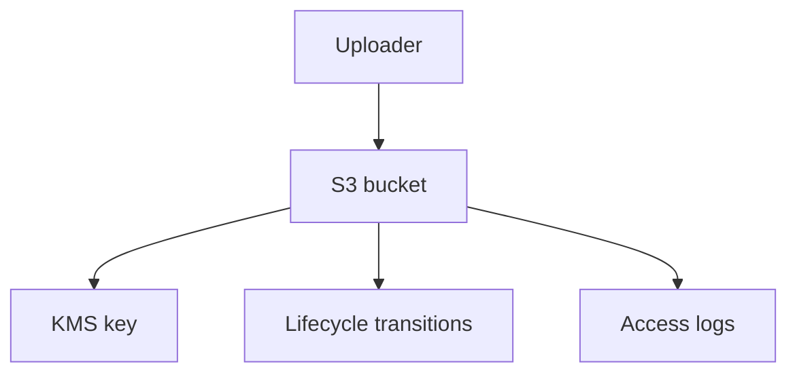

# Lab 03: S3 Security, Encryption, and Lifecycle

## Business Scenario
A media team stores uploaded assets in S3 and needs encryption, versioning, and lifecycle controls to keep costs in check.

## Core Services
S3, KMS, Lifecycle Policies, Bucket Policy

## Target Architecture


## Step-by-Step
1. Create a private bucket with versioning and default encryption.
2. Add a lifecycle policy to transition old objects to cheaper storage.
3. Verify that public access is blocked and the bucket remains private.

## CLI Commands
```bash
aws s3api create-bucket --bucket lab03-assets --region ap-southeast-1
aws s3api put-bucket-versioning --bucket lab03-assets --versioning-configuration Status=Enabled
aws s3api put-bucket-encryption --bucket lab03-assets --server-side-encryption-configuration file://encryption.json
aws s3api put-bucket-lifecycle-configuration --bucket lab03-assets --lifecycle-configuration file://lifecycle.json
```

## Expected Output
- The bucket reports encryption as enabled by default.
- Versioning is enabled.
- Lifecycle rules transition older objects on schedule.

## Failure Injection
Attempt a public object read or upload a non-encrypted object and confirm the bucket policy blocks it.

## Decision Trade-offs
| Option | Strength | Weakness | Typical fit |
| --- | --- | --- | --- |
| SSE-S3 | Lowest ops | Less control | Default bucket encryption. |
| SSE-KMS | Key control and audit | More cost | Regulated data or audit needs. |
| Client-side encryption | Full client control | More complexity | Special compliance cases. |

## Common Mistakes
- Leaving the bucket public.
- Turning on KMS encryption but forgetting the key policy.
- Using lifecycle rules without versioning where needed.

## Exam Question
**Q:** Which encryption option usually gives the simplest secure default for general S3 storage?

**A:** SSE-S3, because it is managed by S3 with minimal operational overhead.

## Cleanup
- Delete lifecycle rules and encryption test artifacts.
- Remove the bucket after emptying all versions.
- Confirm no replication or logging buckets were left behind.

