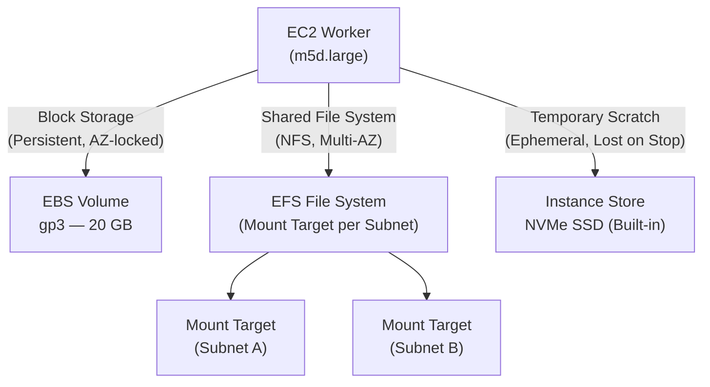

# Lab 04: EBS, EFS, and Instance Store

## Metadata
- Difficulty: Intermediate
- Time estimate: 20–30 minutes
- Estimated cost: Free Tier eligible (แนะนำใช้ Instance ขนาดเล็ก)
- Prerequisites: Lab 01 (VPC + Public Subnet สำหรับสร้าง EC2)
- Depends on: Lab 01 — ใช้ `Public-Subnet` จาก Lab 01 สำหรับ Launch EC2 Instance

## Learning Objectives
หลังจากทำ Lab นี้เสร็จ ผู้เรียนจะสามารถ:
- อธิบายความแตกต่างระหว่าง EBS, EFS และ Instance Store ในแง่ของ Persistence, Performance และ Sharing ได้
- สร้างและ Attach EBS Volume เข้ากับ EC2 Instance ได้
- สร้าง EFS File System และกำหนด Mount Target ในแต่ละ Subnet ได้
- เลือก Storage Type ที่เหมาะสมตาม Use Case ของแต่ละ Workload

## Business Scenario
ทีมตัดต่อและประมวลผลกราฟิกต้องการใช้งาน EC2 หลายเครื่องพร้อมกัน แต่ละงานต้องการ Storage ในรูปแบบที่แตกต่างกัน:
- **EBS** สำหรับ OS Disk และข้อมูลถาวรต่อเครื่อง
- **EFS** สำหรับโฟลเดอร์แชร์ระหว่างเครื่อง (Shared File System)
- **Instance Store** สำหรับ Temporary Cache ที่ต้องการความเร็วสูงสุด

การเลือก Storage ผิดประเภทจะทำให้ระบบช้า เกิด Throughput คอขวด หรือข้อมูลสูญหายเมื่อ Instance หยุดทำงาน

## Core Services
EBS, EFS, EC2 Instance Store

## Target Architecture


## Environment Setup
```bash
# กำหนดค่าเหล่านี้ก่อนรันคำสั่งใดๆ ใน Lab นี้
export AWS_REGION=ap-southeast-1
export ACCOUNT_ID=$(aws sts get-caller-identity --query Account --output text)
export PROJECT_TAG=SAA-Lab-04
export VPC_ID=$(aws ec2 describe-vpcs \
  --filters "Name=tag:Project,Values=SAA-Lab-01" \
  --query 'Vpcs[0].VpcId' --output text)
export SUBNET_ID=$(aws ec2 describe-subnets \
  --filters "Name=tag:Project,Values=SAA-Lab-01" "Name=tag:Name,Values=Private-Subnet" \
  --query 'Subnets[0].SubnetId' --output text)

# สร้าง Security Group และ EC2 Instance สำหรับ Lab นี้
SECURITY_GROUP_ID=$(aws ec2 create-security-group \
  --group-name lab04-sg --description "Lab04" \
  --vpc-id $VPC_ID --query 'GroupId' --output text)

# หมายเหตุ: m5d.large มี NVMe Instance Store ติดมาด้วย
INSTANCE_ID=$(aws ec2 run-instances \
  --image-id resolve:ssm:/aws/service/ami-amazon-linux-latest/amzn2-ami-hvm-x86_64-gp2 \
  --instance-type m5d.large \
  --subnet-id $SUBNET_ID \
  --security-group-ids $SECURITY_GROUP_ID \
  --tag-specifications "ResourceType=instance,Tags=[{Key=Project,Value=$PROJECT_TAG}]" \
  --query 'Instances[0].InstanceId' --output text)
echo "Instance ID: $INSTANCE_ID"
```

---

## Step-by-Step

### Phase 1 — สร้างและ Attach EBS Volume

สร้าง EBS Volume แบบ gp3 และ Attach เข้ากับ Instance (EBS ต้องอยู่ใน Availability Zone เดียวกับ Instance)

#### 🖥️ วิธีทำผ่าน AWS Console (GUI)

1. ไปที่ **EC2 → Volumes** → คลิก **Create volume**
2. กำหนดค่า:
   - Volume type: `gp3`
   - Size: `20 GiB`
   - Availability Zone: เลือก AZ เดียวกับ Instance
   - Tag: `Project = SAA-Lab-04`
3. คลิก **Create volume**
4. เลือก Volume ที่สร้าง → **Actions → Attach volume**
5. เลือก Instance → Device name: `/dev/sdf` → **Attach**

#### ⌨️ วิธีทำผ่าน CLI

```bash
# รับ AZ ของ Instance ที่สร้างไว้
AZ=$(aws ec2 describe-instances \
  --instance-ids $INSTANCE_ID \
  --query 'Reservations[0].Instances[0].Placement.AvailabilityZone' \
  --output text)

VOLUME_ID=$(aws ec2 create-volume \
  --availability-zone $AZ \
  --size 20 \
  --volume-type gp3 \
  --tag-specifications "ResourceType=volume,Tags=[{Key=Project,Value=$PROJECT_TAG}]" \
  --query 'VolumeId' --output text)

# รอให้ Volume พร้อมก่อน Attach
aws ec2 wait volume-available --volume-ids $VOLUME_ID
aws ec2 attach-volume --volume-id $VOLUME_ID --instance-id $INSTANCE_ID --device /dev/sdf
```

**Expected output:** คำสั่ง `attach-volume` คืนค่า `"State": "attaching"` จากนั้นเปลี่ยนเป็น `"State": "attached"` เมื่อสำเร็จ

---

### Phase 2 — สร้าง EFS Shared File System

สร้าง EFS File System และ Mount Target เพื่อให้ Instance หลายเครื่องใน Subnet สามารถเขียน/อ่านไฟล์ร่วมกันได้

#### 🖥️ วิธีทำผ่าน AWS Console (GUI)

1. ไปที่ **EFS → File systems** → คลิก **Create file system**
2. เลือก **Customize** → กำหนดค่า:
   - Name: `lab04-efs`
   - Tag: `Project = SAA-Lab-04`
3. ส่วน **Network**: เลือก VPC จาก Lab 01 → เพิ่ม Mount Target ใน Subnet
4. ตรวจสอบ Security Group ให้เปิด Port `2049` (NFS) สำหรับ Instance
5. คลิก **Create**

#### ⌨️ วิธีทำผ่าน CLI

```bash
EFS_ID=$(aws efs create-file-system \
  --creation-token lab04-efs \
  --tags Key=Project,Value=$PROJECT_TAG \
  --query 'FileSystemId' --output text)

# รอให้ EFS พร้อมก่อนสร้าง Mount Target
aws efs wait file-system-available --file-system-id $EFS_ID

# สร้าง Mount Target ใน Subnet
MOUNT_TARGET_ID=$(aws efs create-mount-target \
  --file-system-id $EFS_ID \
  --subnet-id $SUBNET_ID \
  --security-groups $SECURITY_GROUP_ID \
  --query 'MountTargetId' --output text)
echo "Mount Target ID: $MOUNT_TARGET_ID"
```

**Expected output:** Mount Target ID ถูกบันทึกในตัวแปร `$MOUNT_TARGET_ID` สถานะเริ่มต้นจะเป็น `creating` และเปลี่ยนเป็น `available` ภายใน 1–2 นาที

---

### Phase 3 — ทดสอบพฤติกรรม Instance Store

สาธิตให้เห็นว่าข้อมูลใน Instance Store หายไปเมื่อ Instance ถูก Stop แล้ว Start ใหม่

#### 🖥️ วิธีทำผ่าน AWS Console (GUI)

1. ใช้ **EC2 Instance Connect** หรือ **SSM Session Manager** เพื่อเข้าถึง Instance
2. เขียนไฟล์ทดสอบใน Instance Store (NVMe):
   ```bash
   echo "test data" > /dev/nvme1n1
   ```
3. กลับไปที่ Console → เลือก Instance → **Instance state → Stop**
4. รอจนสถานะเป็น **Stopped** → คลิก **Start instance**
5. เชื่อมต่อกลับเข้า Instance และตรวจสอบว่าข้อมูลหายไปแล้ว

#### ⌨️ วิธีทำผ่าน CLI

```bash
# จำลองการ Stop และ Start Instance (ข้อมูลใน Instance Store จะหายไป)
aws ec2 stop-instances --instance-ids $INSTANCE_ID
aws ec2 wait instance-stopped --instance-ids $INSTANCE_ID
aws ec2 start-instances --instance-ids $INSTANCE_ID
aws ec2 wait instance-running --instance-ids $INSTANCE_ID
```

**Expected output:** Instance กลับมาทำงานได้ปกติ แต่ข้อมูลทั้งหมดที่เขียนไว้ใน NVMe Instance Store (`/dev/nvme1n1`) จะหายไปทั้งหมด — นี่คือพฤติกรรมที่ออกแบบไว้

---

## Failure Injection

ลบ EFS Mount Target ออกขณะที่ Instance ยังคง Mount อยู่

```bash
aws efs delete-mount-target --mount-target-id $MOUNT_TARGET_ID
```

**What to observe:** Process ใดก็ตามภายใน Instance ที่กำลังใช้งาน EFS Mount Point จะค้าง (Hang) โดยไม่มี Error message ชัดเจน เนื่องจาก NFS Client รอ Response จาก Mount Target ที่ไม่มีอยู่แล้ว

**How to recover:**
```bash
# สร้าง Mount Target ใหม่
aws efs create-mount-target \
  --file-system-id $EFS_ID \
  --subnet-id $SUBNET_ID \
  --security-groups $SECURITY_GROUP_ID
```

---

## Decision Trade-offs

| ประเภท Storage | เหมาะกับ | ประสิทธิภาพ | ค่าใช้จ่าย | ภาระงาน (Ops) |
|---|---|---|---|---|
| EBS | OS Disk, Database, ข้อมูลถาวรต่อ Instance | สูง (จำกัดใน AZ เดียว) | ปานกลาง | ต่ำ (Snapshot ได้ง่าย) |
| EFS | Shared File System, Data Science, CMS | ปานกลาง (Latency ข้าม AZ เพิ่มขึ้นเล็กน้อย) | สูงกว่า EBS | ต่ำ (Scale อัตโนมัติ) |
| Instance Store | Temporary Cache, Buffer, HPC Scratch | สูงที่สุด (NVMe ติด Host โดยตรง) | ฟรี (รวมกับค่า Instance) | สูง (ข้อมูลหายเมื่อ Stop) |

---

## Common Mistakes

- **Mistake:** ใช้ Instance Store เก็บข้อมูลสำคัญที่ต้องการ Persistence
  **Why it fails:** ข้อมูลใน Instance Store หายทั้งหมดทันทีที่ Instance ถูก Stop, Terminated หรือเกิด Hardware Failure บน Host

- **Mistake:** ไม่เปิด Port NFS (2049) ใน Security Group เมื่อ Mount EFS
  **Why it fails:** การ Mount จะค้าง (Hang) โดยไม่มี Error message ที่ชัดเจน ทำให้ Debug ยาก

- **Mistake:** คาดหวังว่า EBS Volume 1 ชิ้น จะแชร์ระหว่าง EC2 หลายเครื่องได้
  **Why it fails:** Standard EBS Volume ผูกกับ Instance เดียวในหนึ่ง AZ เท่านั้น หากต้องการแชร์ข้ามหลาย Instance ควรใช้ EFS หรือ EBS Multi-Attach (เฉพาะ io1/io2)

- **Mistake:** ใช้ gp2/gp3 สำหรับ Workload ที่ต้องการ IOPS สูงมากอย่างต่อเนื่อง
  **Why it fails:** gp2/gp3 มี Baseline IOPS ที่จำกัด หาก Workload ต้องการ Sustained High IOPS ควรใช้ `io2 Block Express` แทน

---

## Exam Questions

**Q1:** Storage Type ใดเหมาะสมที่สุดสำหรับการแชร์ไฟล์ (POSIX) ระหว่าง EC2 หลายเครื่องในหลาย Availability Zone พร้อมกัน?
**A:** Amazon EFS
**Rationale:** EBS จำกัดอยู่ใน AZ เดียว EFS รองรับการ Mount จากหลาย Instance ในหลาย AZ พร้อมกัน รองรับ POSIX File System และ Scale ได้โดยอัตโนมัติ

**Q2:** ทีม HPC ต้องการ Storage สำหรับผลลัพธ์การคำนวณชั่วคราวที่สร้างได้ใหม่ และต้องการ IOPS และ Latency ที่ดีที่สุดบน AWS ควรเลือก Storage ใด?
**A:** EC2 Instance Store
**Rationale:** Instance Store คือ NVMe SSD ที่ติดอยู่กับ Host โดยตรง มี Latency ต่ำที่สุดและ IOPS สูงที่สุด เหมาะกับ Temporary Scratch อย่างยิ่ง เนื่องจากข้อมูลสามารถสร้างใหม่ได้จึงไม่มีปัญหาด้าน Persistence

---

## Cleanup (เรียงลำดับตามนี้เท่านั้น — ห้ามข้ามขั้นตอน)

```bash
# Step 1 — Terminate EC2 Instance ก่อน (Instance Store จะถูกลบพร้อมกัน)
aws ec2 terminate-instances --instance-ids $INSTANCE_ID
aws ec2 wait instance-terminated --instance-ids $INSTANCE_ID

# Step 2 — ลบ EFS Mount Target และรอให้เสร็จก่อนลบ File System
aws efs delete-mount-target --mount-target-id $MOUNT_TARGET_ID || true
sleep 30  # รอให้ Mount Target ถูกลบ
aws efs delete-file-system --file-system-id $EFS_ID

# Step 3 — ลบ EBS Volume และ Security Group
aws ec2 delete-volume --volume-id $VOLUME_ID || true
aws ec2 delete-security-group --group-id $SECURITY_GROUP_ID

# Step 4 — ตรวจสอบว่าลบเรียบร้อยแล้ว
aws ec2 describe-volumes --volume-ids $VOLUME_ID 2>&1 || echo "✅ EBS Volume ถูกลบเรียบร้อย"
```

**Cost check:** ตรวจสอบว่าไม่มี EFS หรือ EBS Volume ที่ยังค้างอยู่:
```bash
aws efs describe-file-systems \
  --query "FileSystems[?contains(Tags[?Key=='Project'].Value,'SAA-Lab-04')]" --output table
aws ec2 describe-volumes \
  --filters "Name=tag:Project,Values=$PROJECT_TAG" "Name=status,Values=available" --output table
```
