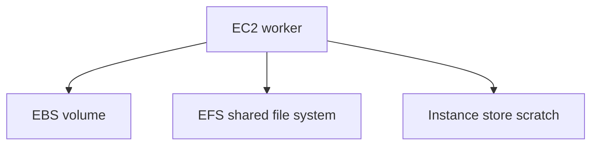

# Lab 04: EBS, EFS, and Instance Store

## Business Scenario
A content-processing workload needs durable block storage, shared file storage, and fast scratch space for temporary jobs.

## Core Services
EBS, EFS, EC2 Instance Store

## Target Architecture


## Step-by-Step
1. Provision an EBS volume for persistent block data.
2. Create an EFS file system and mount target for shared files.
3. Use instance store only for temporary scratch and verify what survives a stop/start.

## CLI Commands
```bash
aws ec2 create-volume --availability-zone ap-southeast-1a --size 20 --volume-type gp3
aws efs create-file-system --creation-token lab04-efs
aws efs create-mount-target --file-system-id fs-12345678 --subnet-id subnet-12345678 --security-groups sg-12345678
aws ec2 attach-volume --volume-id vol-12345678 --instance-id i-12345678 --device /dev/sdf
```

## Expected Output
- EBS is available before attach and in-use after attach.
- EFS mount targets are available in each AZ used.
- Instance store data disappears after stop/start or termination.

## Failure Injection
Put a file on instance store, stop the instance, and confirm the data does not survive.

## Decision Trade-offs
| Option | Best for | Pros | Cons |
| --- | --- | --- | --- |
| EBS | Persistent block storage | Durable and easy to snapshot | One instance attachment pattern. |
| EFS | Shared POSIX files | Multi-AZ and shared access | Higher latency and cost. |
| Instance store | Scratch space | Very fast | Not durable. |

## Common Mistakes
- Using instance store for durable data.
- Mounting EFS without security group rules.
- Choosing EBS when the workload needs shared multi-instance access.

## Exam Question
**Q:** Which storage option should be used for shared POSIX files across multiple EC2 instances?

**A:** EFS, because it is a managed shared file system that multiple instances can mount concurrently.

## Cleanup
- Detach and delete the EBS volume.
- Delete the EFS file system and mount targets.
- Terminate any test instances used for the mount validation.

