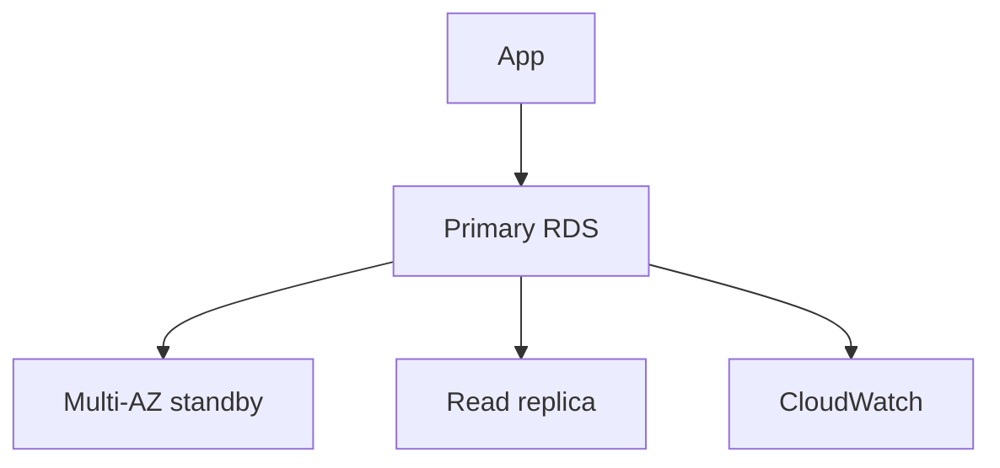

# Lab 05: RDS Multi-AZ vs Read Replica under Failure

## Business Scenario
An ecommerce team needs the database to survive maintenance windows and occasional AZ failures without changing the application endpoint.

## Core Services
RDS, Multi-AZ, Read Replica, CloudWatch

## Target Architecture


## Step-by-Step
1. Create an RDS instance with Multi-AZ enabled.
2. Add a read replica for read-heavy reporting or analytics.
3. Force a failover and observe how the endpoint behaves.

## CLI Commands
```bash
aws rds create-db-subnet-group --db-subnet-group-name lab05-subnets --db-subnet-group-description "Lab 05 subnet group" --subnet-ids subnet-123 subnet-456
aws rds create-db-instance --db-instance-identifier lab05-db --db-instance-class db.t3.micro --engine postgres --allocated-storage 20 --multi-az
aws rds create-db-instance-read-replica --db-instance-identifier lab05-replica --source-db-instance-identifier lab05-db
aws rds reboot-db-instance --db-instance-identifier lab05-db --force-failover
```

## Expected Output
- `DBInstanceStatus` becomes `available` after provisioning.
- `MultiAZ` is `true` in the instance description.
- The writer failover completes while the endpoint stays the same.

## Failure Injection
Trigger a forced failover and confirm that Multi-AZ is about availability, not read scaling, while the replica remains a separate read target.

## Decision Trade-offs
| Option | Best for | RTO | Cost |
| --- | --- | --- | --- |
| Multi-AZ | HA and maintenance | Low | Medium |
| Read replica | Read scaling | Medium | Medium |
| Aurora | Managed HA and fast failover | Low | Higher |

## Common Mistakes
- Using a read replica as if it were automatic failover.
- Creating the DB in only one subnet or one AZ.
- Treating backups as a substitute for Multi-AZ.

## Exam Question
**Q:** Which option best handles planned maintenance with minimal application change?

**A:** Multi-AZ RDS, because the endpoint remains stable while failover is handled by the service.

## Cleanup
- Delete the read replica and primary database instance.
- Remove the DB subnet group.
- Verify no snapshots are left behind beyond the intended retention.

