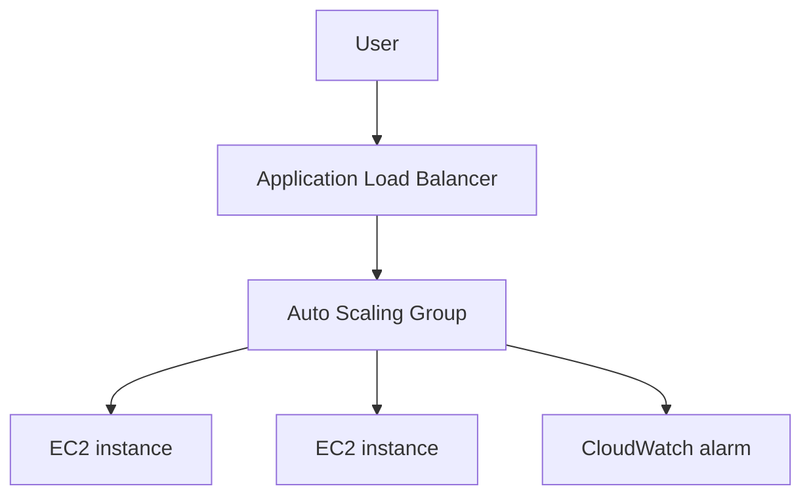

# Lab 06: ALB and Auto Scaling for High Availability

## Business Scenario
A stateless web tier must stay online during instance loss and automatically scale with traffic spikes.

## Core Services
ALB, Auto Scaling Group, Launch Template, CloudWatch

## Target Architecture


## Step-by-Step
1. Create a launch template and target group.
2. Attach the target group to an Auto Scaling group behind an ALB.
3. Terminate one instance and watch the group replace it.

## CLI Commands
```bash
aws ec2 create-launch-template --launch-template-name lab06-template --launch-template-data file://template.json
aws elbv2 create-load-balancer --name lab06-alb --subnets subnet-123 subnet-456 --security-groups sg-123
aws autoscaling create-auto-scaling-group --auto-scaling-group-name lab06-asg --launch-template LaunchTemplateName=lab06-template,Version=$Latest --min-size 2 --max-size 4 --desired-capacity 2 --vpc-zone-identifier subnet-123,subnet-456
aws autoscaling terminate-instance-in-auto-scaling-group --instance-id i-12345678 --should-decrement-desired-capacity false
```

## Expected Output
- Target health stays green for healthy instances.
- The ASG launches a replacement instance after termination.
- The ALB continues serving traffic without a single-instance dependency.

## Failure Injection
Kill one EC2 instance and confirm the ALB still has healthy targets while the ASG restores capacity.

## Decision Trade-offs
| Option | Best for | Strength | Weakness |
| --- | --- | --- | --- |
| ALB + ASG | HTTP/HTTPS apps | Flexible routing | Needs app health checks. |
| NLB + ASG | TCP/low latency | Very fast | Less Layer 7 awareness. |
| ECS service | Containers | Easier deployment | Different operational model. |

## Common Mistakes
- Using a single instance and calling it highly available.
- Putting the app in public subnets.
- Configuring a bad health check path so the ASG churns.

## Exam Question
**Q:** Why is ALB usually preferred over NLB for a normal web application?

**A:** ALB understands HTTP and HTTPS, supports path-based routing, and integrates well with application health checks.

## Cleanup
- Delete the ASG and launch template.
- Remove the load balancer and target group.
- Confirm all test instances are terminated.

