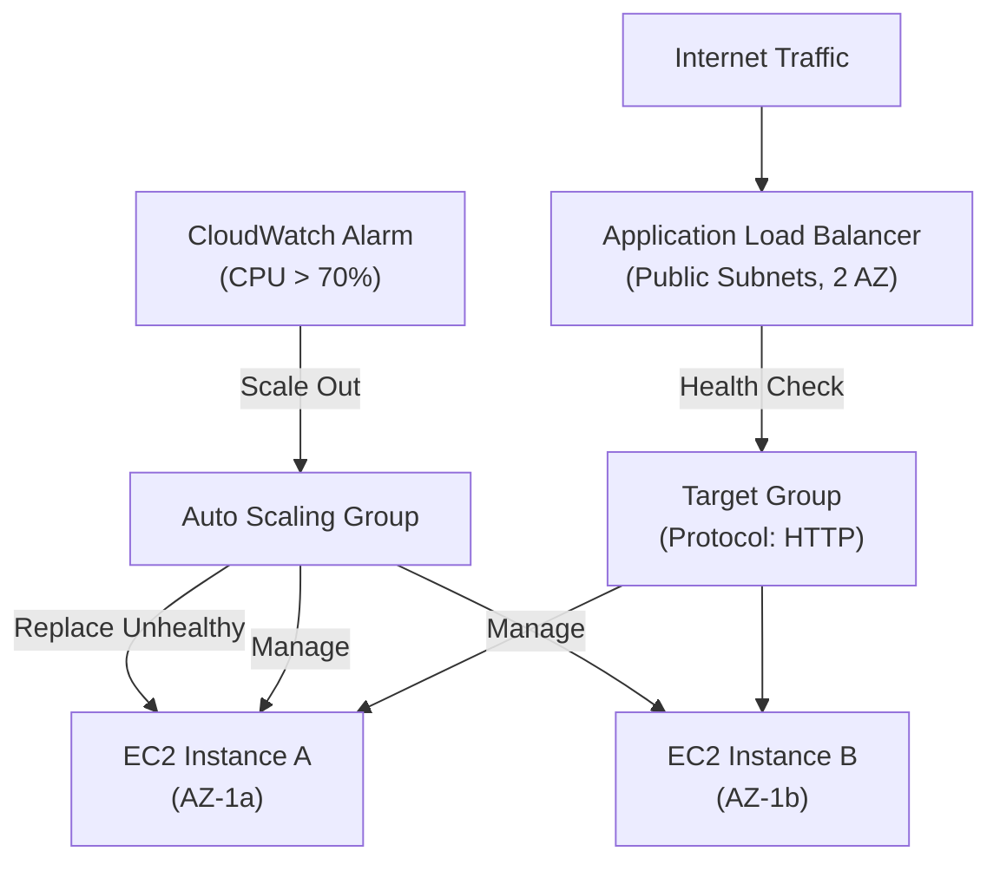

# Lab 06: ALB and Auto Scaling for High Availability

## Metadata
- Difficulty: Intermediate
- Time estimate: 30–40 minutes
- Estimated cost: ~$1.00 (ค่า ALB รายชั่วโมง)
- Prerequisites: Lab 01 (VPC with public and private subnets)
- Depends on: Lab 01

## Learning Objectives
หลังจากทำ Lab นี้เสร็จ ผู้เรียนจะสามารถ:
- สร้าง Application Load Balancer พร้อม Target Group และ Listener ได้
- กำหนด Launch Template และสร้าง Auto Scaling Group ที่เชื่อมกับ ALB
- ทดสอบ Auto Healing โดยการยิง Instance ทิ้งและสังเกตพฤติกรรมของ ASG
- อธิบายเหตุผลที่ต้องใช้ ALB + ASG แทน Single Instance สำหรับ Production workload

## Business Scenario
แอปพลิเคชัน Web แบบ Stateless ต้องการรองรับการใช้งานอย่างต่อเนื่องแม้ว่า Instance บางตัวจะหยุดทำงาน และต้องสามารถรองรับ Traffic ที่เพิ่มขึ้นในช่วง Peak ได้โดยอัตโนมัติ

หากใช้ Instance เดียวโดยไม่มี Load Balancer หรือ Auto Scaling เมื่อ Instance นั้นล่ม แอปพลิเคชันจะหยุดทำงานทันทีจนกว่าจะ Restart ด้วยตนเอง ส่งผลต่อประสบการณ์ผู้ใช้และรายได้

## Core Services
ALB, Auto Scaling Group, Launch Template, CloudWatch

## Target Architecture


## Environment Setup
```bash
# กำหนดค่าเหล่านี้ก่อนรันคำสั่งใดๆ ใน Lab นี้
export AWS_REGION=ap-southeast-1
export ACCOUNT_ID=$(aws sts get-caller-identity --query Account --output text)
export PROJECT_TAG=SAA-Lab-06
export VPC_ID=$(aws ec2 describe-vpcs \
  --filters "Name=tag:Project,Values=SAA-Lab-01" \
  --query 'Vpcs[0].VpcId' --output text)
export SUBNET_PUB_1=$(aws ec2 describe-subnets \
  --filters "Name=tag:Project,Values=SAA-Lab-01" "Name=tag:Name,Values=Public-Subnet" \
  --query 'Subnets[0].SubnetId' --output text)

# ALB ต้องการอย่างน้อย 2 AZ — ต้องมี Subnet ที่ 2 ใน AZ อื่น
export SUBNET_PUB_2=$(aws ec2 describe-subnets \
  --filters "Name=tag:Project,Values=SAA-Lab-01" "Name=tag:Name,Values=Public-Subnet-2" \
  --query 'Subnets[0].SubnetId' --output text)
```

---

## Step-by-Step

### Phase 1 — สร้าง ALB และ Target Group

สร้าง Application Load Balancer ใน Public Subnets ข้าม 2 AZ พร้อม Target Group สำหรับกระจาย Traffic ไปยัง Instance

#### 🖥️ วิธีทำผ่าน AWS Console (GUI)

1. ไปที่ **EC2 → Load Balancers** → คลิก **Create load balancer**
2. เลือก **Application Load Balancer** → **Create**
3. กำหนดค่า:
   - Name: `lab06-alb`
   - Scheme: **Internet-facing**
   - VPC: Lab01 VPC
   - Mappings: เลือก 2 AZ พร้อม Public Subnet แต่ละตัว
4. Security Group → สร้าง SG ใหม่ที่อนุญาต Port 80 Inbound
5. Listener: HTTP:80 → Default action: Forward to Target Group (สร้างใหม่ชื่อ `lab06-tg`)
6. Target Group settings: Protocol HTTP, Port 80, Target type: **Instance**
7. คลิก **Create load balancer**

#### ⌨️ วิธีทำผ่าน CLI

```bash
# สร้าง Security Group สำหรับ ALB
SG_ALB_ID=$(aws ec2 create-security-group \
  --group-name lab06-alb-sg \
  --description "ALB SG" \
  --vpc-id $VPC_ID \
  --query 'GroupId' --output text)
aws ec2 authorize-security-group-ingress \
  --group-id $SG_ALB_ID --protocol tcp --port 80 --cidr 0.0.0.0/0

# สร้าง ALB
ALB_ARN=$(aws elbv2 create-load-balancer \
  --name lab06-alb \
  --subnets $SUBNET_PUB_1 $SUBNET_PUB_2 \
  --security-groups $SG_ALB_ID \
  --query 'LoadBalancers[0].LoadBalancerArn' --output text)

# สร้าง Target Group
TG_ARN=$(aws elbv2 create-target-group \
  --name lab06-tg \
  --protocol HTTP \
  --port 80 \
  --vpc-id $VPC_ID \
  --query 'TargetGroups[0].TargetGroupArn' --output text)

# สร้าง Listener เชื่อม ALB กับ Target Group
aws elbv2 create-listener \
  --load-balancer-arn $ALB_ARN \
  --protocol HTTP \
  --port 80 \
  --default-actions Type=forward,TargetGroupArn=$TG_ARN
```

**Expected output:** ALB ARN และ Target Group ARN ถูกบันทึกในตัวแปร ALB จะอยู่ในสถานะ `provisioning` และเปลี่ยนเป็น `active` ภายใน 2-3 นาที

---

### Phase 2 — สร้าง Launch Template

กำหนด Launch Template ที่ระบุ AMI, Instance Type และ User Data Script สำหรับการสร้าง Instance ใหม่โดย ASG

#### 🖥️ วิธีทำผ่าน AWS Console (GUI)

1. ไปที่ **EC2 → Launch Templates** → คลิก **Create launch template**
2. กำหนดค่า:
   - Name: `lab06-template`
   - AMI: Amazon Linux 2 (ค้นหา `amzn2-ami-hvm`)
   - Instance type: `t3.micro`
3. ส่วน **Advanced details → User data** วาง script:
   ```bash
   #!/bin/bash
   yum install -y httpd
   echo "Hello from $(hostname -f)" > /var/www/html/index.html
   systemctl start httpd
   systemctl enable httpd
   ```
4. คลิก **Create launch template**

#### ⌨️ วิธีทำผ่าน CLI

```bash
cat <<'EOF' > user_data.sh
#!/bin/bash
yum install -y httpd
echo "Hello from $(hostname -f)" > /var/www/html/index.html
systemctl start httpd
systemctl enable httpd
EOF

USER_DATA_B64=$(base64 -w 0 user_data.sh)

aws ec2 create-launch-template \
  --launch-template-name lab06-template \
  --launch-template-data "{
    \"ImageId\": \"resolve:ssm:/aws/service/ami-amazon-linux-latest/amzn2-ami-hvm-x86_64-gp2\",
    \"InstanceType\": \"t3.micro\",
    \"UserData\": \"$USER_DATA_B64\"
  }"
```

**Expected output:** Launch Template Version 1 ถูกสร้างเรียบร้อย

---

### Phase 3 — สร้างและตรวจสอบ Auto Scaling Group

สร้าง ASG โดยเชื่อมกับ ALB Target Group และกำหนดค่า Min/Max/Desired เพื่อให้ระบบกระจาย Instance ข้าม 2 AZ

#### 🖥️ วิธีทำผ่าน AWS Console (GUI)

1. ไปที่ **EC2 → Auto Scaling Groups** → คลิก **Create Auto Scaling group**
2. ตั้งชื่อ `lab06-asg` → Launch template: `lab06-template`
3. Network: VPC จาก Lab01 → Subnets: เลือก Public Subnet ทั้ง 2 AZ
4. Load balancing: **Attach to an existing load balancer** → เลือก Target Group `lab06-tg`
5. Health checks: เปิด **ELB health checks**
6. Group size: Min `2`, Max `4`, Desired `2`
7. คลิก **Create Auto Scaling group**

#### ⌨️ วิธีทำผ่าน CLI

```bash
aws autoscaling create-auto-scaling-group \
  --auto-scaling-group-name lab06-asg \
  --launch-template LaunchTemplateName=lab06-template,Version='$Latest' \
  --min-size 2 \
  --max-size 4 \
  --desired-capacity 2 \
  --vpc-zone-identifier "$SUBNET_PUB_1,$SUBNET_PUB_2" \
  --target-group-arns $TG_ARN \
  --health-check-type ELB \
  --health-check-grace-period 60
```

**Expected output:** ASG ถูกสร้างและเริ่มสร้าง Instance 2 ตัวใน 2 AZ ตรวจสอบได้ใน Target Group ว่า Instance registered เป็น `healthy` ภายใน 1-2 นาที

---

## Failure Injection

ยิง Instance หนึ่งตัวทิ้งและสังเกต Auto Healing

```bash
# ดู Instance ตัวแรกใน ASG
INSTANCE_ID=$(aws autoscaling describe-auto-scaling-groups \
  --auto-scaling-group-names lab06-asg \
  --query 'AutoScalingGroups[0].Instances[0].InstanceId' --output text)

# ยิงทิ้ง แต่ไม่ลด Desired Capacity
aws autoscaling terminate-instance-in-auto-scaling-group \
  --instance-id $INSTANCE_ID \
  --should-decrement-desired-capacity false
```

**What to observe:**
1. Target Group จะตรวจพบว่า Instance นั้น `unhealthy` และหยุดส่ง Traffic ไป
2. ASG จะตรวจจับว่าจำนวน Instance น้อยกว่า Desired Capacity
3. ASG จะสร้าง Instance ใหม่โดยอัตโนมัติเพื่อแทนที่ภายใน 2-3 นาที

**How to recover:** ไม่ต้องดำเนินการใดๆ — ASG จัดการ Self-healing ให้เองโดยอัตโนมัติ

---

## Decision Trade-offs

| ตัวเลือก | เหมาะกับ | ประสิทธิภาพ | ค่าใช้จ่าย | ภาระงาน (Ops) |
|---|---|---|---|---|
| ALB + ASG | Web Application แบบ HTTP/HTTPS | ดี (Self-healing + Scale) | ปานกลาง | ปานกลาง (ต้องดูแล Launch Template และ AMI) |
| NLB + ASG | TCP/UDP, Gaming, Real-time | สูงมาก (Layer 4, Low latency) | ปานกลาง | ปานกลาง |
| ECS Service | Container Workloads | สูง (Fast scale, bin packing) | แปรผัน | ปานกลาง (ต้องเขียน Dockerfile) |

---

## Common Mistakes

- **Mistake:** ใช้ Single Instance โดยไม่มี ALB และ ASG แล้วอ้างว่าเป็น Production
  **Why it fails:** เมื่อ Instance ล่ม แอปพลิเคชันจะหยุดทำงานทันทีจนกว่าจะ Restart เอง ไม่มีกลไก Self-healing ใดๆ

- **Mistake:** ไม่เปิด ELB Health Check ใน ASG
  **Why it fails:** หาก HTTP Server ใน Instance พัง แต่ EC2 Instance ยังรันอยู่ EC2 Health Check จะยังรายงานว่า Healthy ASG จึงไม่สร้าง Instance ใหม่ ทำให้ Traffic ถูกส่งไปยัง Instance ที่ใช้งานไม่ได้

- **Mistake:** เก็บ Session data หรือไฟล์ที่ Upload ไว้บน Local Disk ของ Instance
  **Why it fails:** เมื่อ ASG Scale In หรือ Replace Instance ที่ Unhealthy ข้อมูลบน Disk จะหายทั้งหมด ข้อมูลประเภทนี้ต้องเก็บใน S3, EFS หรือ ElastiCache

- **Mistake:** กำหนด Subnet สำหรับ ALB ใน AZ เดียว
  **Why it fails:** ALB บังคับให้ต้องมี Subnet ใน 2 AZ ขึ้นไป หากกำหนดแค่ AZ เดียวจะ Create ไม่สำเร็จ

- **Mistake:** Hardcode IP Address ของ Instance ในโค้ดแทนการใช้ DNS ของ ALB
  **Why it fails:** ASG สร้างและลบ Instance อยู่ตลอดเวลา IP Address ของ Instance เปลี่ยนได้ ควรใช้ DNS Name ของ ALB เสมอ

---

## Exam Questions

**Q1:** เพราะเหตุใด Application Load Balancer (ALB) จึงเหมาะสมกว่า Network Load Balancer (NLB) สำหรับแอปพลิเคชัน Web แบบทั่วไป?
**A:** ALB ทำงานที่ Layer 7 รองรับ Path-based routing, Host-based routing และสามารถผสานกับ AWS WAF เพื่อ Application-level Security ได้
**Rationale:** NLB ทำงานที่ Layer 4 (TCP/UDP) เหมาะกับ Workload ที่ต้องการ Ultra-low Latency ALB มีความสามารถระดับ Application ที่ NLB ไม่สามารถทำได้

**Q2:** ผู้ใช้รายงานว่ารูปโปรไฟล์หายหลังจากระบบ Scale In ทำไมถึงเกิดปัญหานี้และแก้ไขอย่างไร?
**A:** รูปถูกเก็บไว้บน Local Disk ของ Instance เมื่อ ASG ลบ Instance นั้นทิ้ง รูปจึงหายตาม แก้ไขโดยย้ายไปเก็บใน Amazon S3 แทน
**Rationale:** Instance ใน ASG เป็น Stateless โดยธรรมชาติ ข้อมูลที่ต้องการ Persistence ต้องเก็บใน External Storage เช่น S3 (Object), EFS (File Share) หรือ RDS (Database)

---

## Cleanup (เรียงลำดับตามนี้เท่านั้น — ห้ามข้ามขั้นตอน)

```bash
# Step 1 — ลด Desired Capacity เป็น 0 แล้วลบ ASG (Instance ในกลุ่มจะถูกลบด้วย)
aws autoscaling update-auto-scaling-group \
  --auto-scaling-group-name lab06-asg \
  --min-size 0 --desired-capacity 0
aws autoscaling delete-auto-scaling-group \
  --auto-scaling-group-name lab06-asg \
  --force-delete

# Step 2 — ลบ Launch Template
aws ec2 delete-launch-template --launch-template-name lab06-template

# Step 3 — ลบ Listener ก่อน แล้วจึงลบ ALB
LISTENER_ARN=$(aws elbv2 describe-listeners \
  --load-balancer-arn $ALB_ARN \
  --query 'Listeners[0].ListenerArn' --output text)
aws elbv2 delete-listener --listener-arn $LISTENER_ARN
aws elbv2 delete-load-balancer --load-balancer-arn $ALB_ARN

# รอ 30 วินาทีก่อนลบ Target Group และ Security Group
sleep 30
aws elbv2 delete-target-group --target-group-arn $TG_ARN
aws ec2 delete-security-group --group-id $SG_ALB_ID

# Step 4 — ตรวจสอบว่าลบเรียบร้อยแล้ว
aws autoscaling describe-auto-scaling-groups \
  --auto-scaling-group-names lab06-asg 2>&1 || echo "✅ ASG ถูกลบเรียบร้อย"
```

**Cost check:** ALB มีค่าใช้จ่ายต่อชั่วโมง ตรวจสอบว่าไม่มีเหลืออยู่:
```bash
aws elbv2 describe-load-balancers \
  --query "LoadBalancers[?contains(LoadBalancerName,'lab06')].{Name:LoadBalancerName,State:State.Code}" \
  --output table
```
