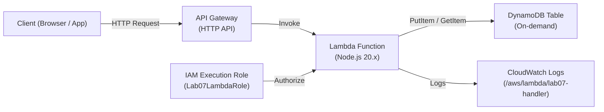

# Lab 07: Serverless CRUD API with API Gateway, Lambda, and DynamoDB

## Metadata
- Difficulty: Intermediate
- Time estimate: 20–30 minutes
- Estimated cost: Free Tier eligible
- Prerequisites: None
- Depends on: None

## Learning Objectives
หลังจากทำ Lab นี้เสร็จ ผู้เรียนจะสามารถ:
- สร้าง DynamoDB Table แบบ On-demand พร้อม IAM Execution Role ที่ถูกต้อง
- Deploy Lambda Function และเชื่อมต่อกับ HTTP API Gateway
- อธิบายเหตุใด Serverless Architecture เหมาะกับ Bursty/Variable Traffic
- Debug ปัญหา `AccessDeniedException` จาก Lambda ไปยัง DynamoDB ได้

## Business Scenario
ระบบจัดการคลังสินค้าต้องการ API สำหรับค้นหาและบันทึกข้อมูล Order โดยมี Traffic ที่พุ่งสูงเป็นช่วงๆ (Bursty) แต่ทีมไม่ต้องการบริหารจัดการ Server เอง

การใช้ EC2 หรือ RDS สำหรับ Workload ลักษณะนี้จะทำให้จ่ายค่า Compute ในช่วงที่ไม่มีการใช้งาน และหากมี Traffic พุ่งสูงกว่าที่ Provision ไว้ ระบบจะรับไม่ไหว

## Core Services
API Gateway, Lambda, DynamoDB

## Target Architecture


## Environment Setup
```bash
# กำหนดค่าเหล่านี้ก่อนรันคำสั่งใดๆ ใน Lab นี้
export AWS_REGION=ap-southeast-1
export ACCOUNT_ID=$(aws sts get-caller-identity --query Account --output text)
export PROJECT_TAG=SAA-Lab-07
export TABLE_NAME="lab07-orders"
export FUNCTION_NAME="lab07-handler"
```

---

## Step-by-Step

### Phase 1 — สร้าง DynamoDB Table และ IAM Role

สร้าง DynamoDB Table แบบ Pay-per-Request (On-demand) และ IAM Role สำหรับ Lambda พร้อมสิทธิ์อ่าน/เขียน Table

#### 🖥️ วิธีทำผ่าน AWS Console (GUI)

**สร้าง DynamoDB Table:**
1. ไปที่ **DynamoDB → Tables** → คลิก **Create table**
2. Table name: `lab07-orders`
3. Partition key: `orderId` (String)
4. Table settings: เลือก **Customize settings** → Capacity mode: **On-demand**
5. Tag: `Project = SAA-Lab-07` → คลิก **Create table**

**สร้าง IAM Role:**
1. ไปที่ **IAM → Roles** → คลิก **Create role**
2. Trusted entity: **AWS Service** → Service: **Lambda**
3. Add permission: `AWSLambdaBasicExecutionRole` → ตั้งชื่อ `Lab07LambdaRole` → **Create role**

#### ⌨️ วิธีทำผ่าน CLI

```bash
# สร้าง DynamoDB Table แบบ On-demand
aws dynamodb create-table \
  --table-name $TABLE_NAME \
  --attribute-definitions AttributeName=orderId,AttributeType=S \
  --key-schema AttributeName=orderId,KeyType=HASH \
  --billing-mode PAY_PER_REQUEST \
  --tags Key=Project,Value=$PROJECT_TAG

# สร้าง IAM Execution Role สำหรับ Lambda
cat <<EOF > trust.json
{
  "Version": "2012-10-17",
  "Statement": [{
    "Effect": "Allow",
    "Principal": {"Service": "lambda.amazonaws.com"},
    "Action": "sts:AssumeRole"
  }]
}
EOF

ROLE_ARN=$(aws iam create-role \
  --role-name Lab07LambdaRole \
  --assume-role-policy-document file://trust.json \
  --query 'Role.Arn' --output text)

aws iam attach-role-policy \
  --role-name Lab07LambdaRole \
  --policy-arn arn:aws:iam::aws:policy/service-role/AWSLambdaBasicExecutionRole
```

**Expected output:** DynamoDB Table สถานะ `ACTIVE` และ Role ARN ถูกบันทึกในตัวแปร `$ROLE_ARN`

---

### Phase 2 — Deploy Lambda Function

เขียน Function Code, Zip และ Deploy พร้อมกำหนด Environment Variable และ DynamoDB Permission

#### 🖥️ วิธีทำผ่าน AWS Console (GUI)

1. ไปที่ **Lambda → Functions** → คลิก **Create function**
2. เลือก **Author from scratch**:
   - Function name: `lab07-handler`
   - Runtime: `Node.js 20.x`
   - Execution role: **Use an existing role** → `Lab07LambdaRole`
3. คลิก **Create function**
4. ในหน้า Code editor วางโค้ด:
   ```javascript
   exports.handler = async (event) => {
     return {
       statusCode: 200,
       body: JSON.stringify({ message: "Success", table: process.env.TABLE_NAME })
     };
   };
   ```
5. แท็บ **Configuration → Environment variables** → Add:
   - Key: `TABLE_NAME` → Value: `lab07-orders`
6. แท็บ **Configuration → Permissions** → คลิก Role name → เพิ่ม Inline Policy สำหรับ DynamoDB

#### ⌨️ วิธีทำผ่าน CLI

```bash
# สร้าง Lambda Function Code
cat <<'EOF' > index.js
exports.handler = async (event) => {
  return {
    statusCode: 200,
    body: JSON.stringify({ message: "Success", table: process.env.TABLE_NAME })
  };
};
EOF
zip function.zip index.js

# รอให้ IAM Role ใช้งานได้ก่อน Deploy
sleep 10

aws lambda create-function \
  --function-name $FUNCTION_NAME \
  --runtime nodejs20.x \
  --handler index.handler \
  --role $ROLE_ARN \
  --zip-file fileb://function.zip \
  --environment "Variables={TABLE_NAME=$TABLE_NAME}" \
  --tags Project=$PROJECT_TAG

# เพิ่ม DynamoDB Access Policy เข้าไปใน Role
cat <<EOF > ddb-policy.json
{
  "Version": "2012-10-17",
  "Statement": [{
    "Effect": "Allow",
    "Action": ["dynamodb:PutItem", "dynamodb:GetItem"],
    "Resource": "arn:aws:dynamodb:$AWS_REGION:$ACCOUNT_ID:table/$TABLE_NAME"
  }]
}
EOF
aws iam put-role-policy \
  --role-name Lab07LambdaRole \
  --policy-name DDBAccess \
  --policy-document file://ddb-policy.json
```

**Expected output:** Lambda Function สถานะ `Active` และ Configuration แสดง `TABLE_NAME` ใน Environment Variables

---

### Phase 3 — เชื่อม API Gateway กับ Lambda และทดสอบ

สร้าง HTTP API Gateway พร้อม Integration กับ Lambda และทดสอบด้วย curl

#### 🖥️ วิธีทำผ่าน AWS Console (GUI)

1. ไปที่ **API Gateway** → คลิก **Create API** → เลือก **HTTP API** → **Build**
2. Add integration: **Lambda** → เลือก `lab07-handler`
3. API name: `lab07-api` → คลิก **Next** ผ่านจนถึง **Create**
4. คัดลอก **Invoke URL** ที่แสดงในหน้า API Overview
5. เปิด Browser หรือใช้ curl ทดสอบ:
   ```bash
   curl https://<invoke-url>/
   ```

#### ⌨️ วิธีทำผ่าน CLI

```bash
# สร้าง HTTP API และ Integration กับ Lambda ในคำสั่งเดียว
API_ID=$(aws apigatewayv2 create-api \
  --name lab07-api \
  --protocol-type HTTP \
  --target arn:aws:lambda:$AWS_REGION:$ACCOUNT_ID:function:$FUNCTION_NAME \
  --query 'ApiId' --output text)

# ให้ API Gateway มีสิทธิ์ Invoke Lambda
aws lambda add-permission \
  --function-name $FUNCTION_NAME \
  --statement-id apigw-invoke \
  --action lambda:InvokeFunction \
  --principal apigateway.amazonaws.com \
  --source-arn "arn:aws:execute-api:$AWS_REGION:$ACCOUNT_ID:$API_ID/*"

API_ENDPOINT=$(aws apigatewayv2 get-api \
  --api-id $API_ID \
  --query 'ApiEndpoint' --output text)

# ทดสอบ API
curl -s $API_ENDPOINT
```

**Expected output:** API คืนค่า `{"message":"Success","table":"lab07-orders"}` แสดงว่า Lambda รับ Request ได้และอ่าน Environment Variable ได้ถูกต้อง

---

## Failure Injection

ถอด DynamoDB Permission ออกจาก Lambda Role เพื่อจำลองสถานการณ์ `AccessDeniedException`

```bash
aws iam delete-role-policy --role-name Lab07LambdaRole --policy-name DDBAccess
# ทดสอบ API อีกครั้ง หาก Lambda Code ใช้ DynamoDB จริงจะได้รับ HTTP 500
curl -s $API_ENDPOINT
```

**What to observe:** API คืนค่า `500 Internal Server Error` เมื่อดู CloudWatch Logs จะพบ `AccessDeniedException: User is not authorized to perform: dynamodb:GetItem`

**How to recover:**
```bash
aws iam put-role-policy \
  --role-name Lab07LambdaRole \
  --policy-name DDBAccess \
  --policy-document file://ddb-policy.json
```

---

## Decision Trade-offs

| ตัวเลือก | เหมาะกับ | ประสิทธิภาพ | ค่าใช้จ่าย | ภาระงาน (Ops) |
|---|---|---|---|---|
| API GW + Lambda | Bursty / Variable Traffic | ดี (Scale อัตโนมัติ, Cold Start ~100ms) | จ่ายเฉพาะตอนมีการเรียกใช้ | ต่ำมาก (ไม่มี Server ให้บริหาร) |
| ECS Service | Traffic เรียบสม่ำเสมอแต่โหดต่อเนื่อง | ดีมาก (ไม่มี Cold Start) | จ่ายรายชั่วโมงแม้ไม่มี Traffic | ปานกลาง |
| EC2 + App Server | Legacy Workloads ที่ต้องการ Control เต็มที่ | ขึ้นอยู่กับ Instance Size | จ่ายรายชั่วโมง | สูง (ต้อง Patch, Monitor เอง) |

---

## Common Mistakes

- **Mistake:** ออกแบบ Partition Key ใน DynamoDB ให้มี Hotspot (ค่าซ้ำกันมาก)
  **Why it fails:** DynamoDB กระจาย Load ตาม Partition Key หากหลาย Request ใช้ Partition เดียวกัน จะเกิด Throttling แม้จะเพิ่ม Capacity ก็ไม่ช่วย ควรใช้ค่าที่กระจายสม่ำเสมอ เช่น UUID

- **Mistake:** ใช้ DynamoDB แบบ Provisioned Mode สำหรับ Workload ที่มี Traffic ไม่แน่นอน
  **Why it fails:** ต้องทำนาย Capacity ล่วงหน้า หาก Provision น้อยเกินเกิด Throttling หาก Provision มากเกินเสียค่าใช้จ่ายเปล่า ควรใช้ On-demand Mode แทน

- **Mistake:** ไม่กำหนด CloudWatch Log Group สำหรับ Lambda
  **Why it fails:** เมื่อ Lambda พัง จะไม่มี Log ให้ Debug ทำให้หา Root Cause ได้ยากมาก ควรตรวจสอบว่า Role มีสิทธิ์ `logs:CreateLogGroup` และ `logs:PutLogEvents`

- **Mistake:** Hardcode ชื่อ Table หรือ ARN ลงในโค้ด Lambda โดยตรง
  **Why it fails:** ทำให้ Deploy Function เดิมไปยัง Environment ต่างๆ (Dev/Staging/Prod) ได้ยาก ควรใช้ Environment Variables แทน

- **Mistake:** ไม่กำหนด Authorization ใน API Gateway
  **Why it fails:** API จะเปิดให้ทุกคนเรียกได้โดยไม่ต้องยืนยันตัวตน ทำให้เกิดค่าใช้จ่ายสูงหากถูกโจมตีแบบ API Abuse หรือ DDoS

---

## Exam Questions

**Q1:** Architecture แบบใดเหมาะสมที่สุดสำหรับ API ที่มี Traffic ไม่สม่ำเสมอ บางช่วงเงียบมาก บางช่วงพุ่งสูงมาก และทีมต้องการลดภาระการบริหาร Infrastructure?
**A:** API Gateway + Lambda + DynamoDB (Serverless Architecture)
**Rationale:** Serverless Scale จากศูนย์ถึงหลักพัน Concurrent Requests โดยอัตโนมัติ จ่ายเฉพาะเมื่อมีการเรียกใช้ ไม่ต้องบริหาร Server เอง

**Q2:** Lambda Function ส่ง Error `AccessDeniedException` เมื่อพยายามอ่านข้อมูลจาก DynamoDB แต่ IAM User ที่รัน Function มีสิทธิ์ครบ สาเหตุที่แท้จริงคืออะไร?
**A:** Lambda Execution Role ไม่มีสิทธิ์ `dynamodb:GetItem` หรือ `dynamodb:Query` สำหรับ Table นั้น
**Rationale:** Lambda ใช้สิทธิ์ของ Execution Role ในการเรียก AWS Services ไม่ใช่สิทธิ์ของผู้เรียกใช้ Lambda ต้องตรวจสอบและแก้ไข Policy ที่ Attach กับ Execution Role

---

## Cleanup (เรียงลำดับตามนี้เท่านั้น — ห้ามข้ามขั้นตอน)

```bash
# Step 1 — ลบ API Gateway
aws apigatewayv2 delete-api --api-id $API_ID

# Step 2 — ลบ Lambda Function
aws lambda remove-permission --function-name $FUNCTION_NAME --statement-id apigw-invoke || true
aws lambda delete-function --function-name $FUNCTION_NAME

# Step 3 — ลบ IAM Role และ Policies ที่เกี่ยวข้อง
aws iam delete-role-policy --role-name Lab07LambdaRole --policy-name DDBAccess || true
aws iam detach-role-policy \
  --role-name Lab07LambdaRole \
  --policy-arn arn:aws:iam::aws:policy/service-role/AWSLambdaBasicExecutionRole
aws iam delete-role --role-name Lab07LambdaRole

# Step 4 — ลบ DynamoDB Table และ CloudWatch Log Group
aws dynamodb delete-table --table-name $TABLE_NAME
aws logs delete-log-group --log-group-name /aws/lambda/$FUNCTION_NAME || true

# Step 5 — ตรวจสอบว่าลบเรียบร้อยแล้ว
aws dynamodb list-tables | grep $TABLE_NAME || echo "✅ DynamoDB Table ถูกลบเรียบร้อย"
```

**Cost check:** Lambda, API Gateway และ DynamoDB On-demand ไม่มีค่าใช้จ่ายหลัง Cleanup:
```bash
aws lambda list-functions \
  --query "Functions[?contains(FunctionName,'lab07')]" \
  --output table
```
