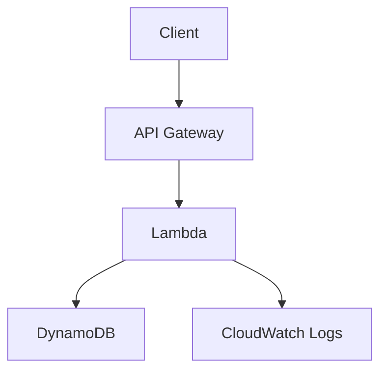

# Lab 07: Serverless CRUD API with API Gateway, Lambda, and DynamoDB

## Business Scenario
A bursty order lookup API needs near-zero server management and a simple path from request to data store.

## Core Services
API Gateway, Lambda, DynamoDB

## Target Architecture


## Step-by-Step
1. Create a DynamoDB table for the order records.
2. Deploy a Lambda function with IAM access to the table.
3. Expose the function through API Gateway and test the response.

## CLI Commands
```bash
aws dynamodb create-table --table-name lab07-orders --attribute-definitions AttributeName=orderId,AttributeType=S --key-schema AttributeName=orderId,KeyType=HASH --billing-mode PAY_PER_REQUEST
aws lambda create-function --function-name lab07-handler --runtime nodejs20.x --handler index.handler --role arn:aws:iam::123456789012:role/Lab07LambdaRole --zip-file fileb://function.zip
aws apigatewayv2 create-api --name lab07-api --protocol-type HTTP
aws apigatewayv2 create-route --api-id abc123 --route-key "GET /orders/{orderId}" --target integrations/xyz789
```

## Expected Output
- The API returns HTTP 200 for valid requests.
- DynamoDB reads and writes succeed with the Lambda execution role.
- CloudWatch Logs show the invocation and any errors.

## Failure Injection
Remove the table permission from the Lambda role and confirm the API returns a server error while the logs show AccessDenied.

## Decision Trade-offs
| Option | Best for | Pros | Cons |
| --- | --- | --- | --- |
| Lambda + API Gateway | Spiky APIs | Very low ops | Cold starts and timeouts. |
| ECS service | Long-running APIs | More control | More ops than serverless. |
| App Runner | Simple container APIs | Easy deployment | Less control than ECS. |

## Common Mistakes
- Ignoring idempotency for write paths.
- Putting hot keys into DynamoDB without a partition strategy.
- Skipping CloudWatch logs for Lambda.

## Exam Question
**Q:** Which stack is best when traffic is bursty and the team wants minimal server management?

**A:** API Gateway plus Lambda and DynamoDB, because it scales on demand and removes server management.

## Cleanup
- Delete the API and Lambda function.
- Drop the DynamoDB table.
- Remove any execution roles and log groups created for the lab.

