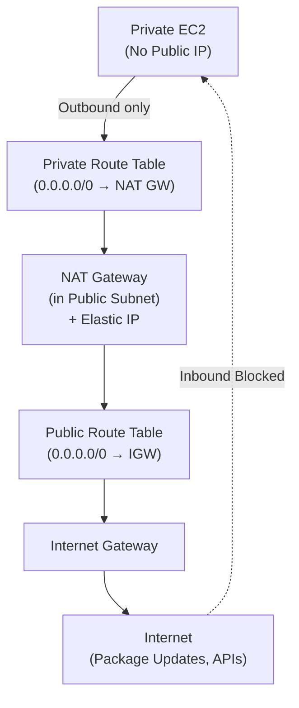

# Lab 08: NAT Gateway Patterns for Private Subnets

## Metadata
- Difficulty: Intermediate
- Time estimate: 20–30 minutes
- Estimated cost: ~$1.20/hr (NAT Gateway ค่าเปิด + ค่า Data Transfer) — **ไม่เข้าข่าย Free Tier**
- Prerequisites: Lab 01 (VPC with Public/Private subnets)
- Depends on: Lab 01

## Learning Objectives
หลังจากทำ Lab นี้เสร็จ ผู้เรียนจะสามารถ:
- สร้าง NAT Gateway พร้อม Elastic IP และกำหนด Route Table ให้ Private Subnet ได้
- อธิบายความแตกต่างระหว่าง NAT Gateway และ NAT Instance ได้
- ระบุว่าเหตุใด NAT Gateway ต้องอยู่ใน Public Subnet เสมอ
- ทราบข้อจำกัดของ NAT Gateway และสถานการณ์ที่ควรใช้ VPC Endpoint แทน

## Business Scenario
Application Servers ใน Private Subnet ต้องการออกอินเทอร์เน็ตเพื่ออัปเดต OS Packages และโหลด Dependencies แต่ตามนโยบาย Compliance ห้ามให้ทรัพยากรเหล่านั้นรับ Inbound Connection จากภายนอกโดยเด็ดขาด

การให้ Private Instance มี Public IP โดยตรงจะขัดกับ Compliance Policy ทำให้จำเป็นต้องใช้ NAT Gateway เป็นตัวกลางแปล IP สำหรับ Outbound Traffic เท่านั้น

## Core Services
VPC, NAT Gateway, Route Tables, EC2

## Target Architecture


## Environment Setup
```bash
# กำหนดค่าเหล่านี้ก่อนรันคำสั่งใดๆ ใน Lab นี้
export AWS_REGION=ap-southeast-1
export ACCOUNT_ID=$(aws sts get-caller-identity --query Account --output text)
export PROJECT_TAG=SAA-Lab-08
export VPC_ID=$(aws ec2 describe-vpcs \
  --filters "Name=tag:Project,Values=SAA-Lab-01" \
  --query 'Vpcs[0].VpcId' --output text)
export SUBNET_PUB=$(aws ec2 describe-subnets \
  --filters "Name=tag:Project,Values=SAA-Lab-01" "Name=tag:Name,Values=Public-Subnet" \
  --query 'Subnets[0].SubnetId' --output text)
export SUBNET_PRIV=$(aws ec2 describe-subnets \
  --filters "Name=tag:Project,Values=SAA-Lab-01" "Name=tag:Name,Values=Private-Subnet" \
  --query 'Subnets[0].SubnetId' --output text)
```

---

## Step-by-Step

### Phase 1 — สร้าง NAT Gateway

จัดสรร Elastic IP และสร้าง NAT Gateway ใน Public Subnet (บังคับ — NAT ต้องอยู่ใน Subnet ที่มี Route ถึง IGW)

#### 🖥️ วิธีทำผ่าน AWS Console (GUI)

1. ไปที่ **VPC → NAT Gateways** → คลิก **Create NAT gateway**
2. กำหนดค่า:
   - Name: `Lab08-NAT`
   - Subnet: เลือก **Public Subnet** จาก Lab01 (ห้ามเลือก Private)
   - Connectivity type: **Public**
   - Elastic IP: คลิก **Allocate Elastic IP**
3. Tag: `Project = SAA-Lab-08`
4. คลิก **Create NAT gateway**
5. รอสถานะเป็น **Available** (ประมาณ 2-3 นาที)

#### ⌨️ วิธีทำผ่าน CLI

```bash
# จัดสรร Elastic IP สำหรับ NAT Gateway
EIP_ALLOC=$(aws ec2 allocate-address \
  --domain vpc \
  --tag-specifications "ResourceType=elastic-ip,Tags=[{Key=Project,Value=$PROJECT_TAG}]" \
  --query 'AllocationId' --output text)

# สร้าง NAT Gateway ใน Public Subnet
NAT_GW_ID=$(aws ec2 create-nat-gateway \
  --subnet-id $SUBNET_PUB \
  --allocation-id $EIP_ALLOC \
  --tag-specifications "ResourceType=natgateway,Tags=[{Key=Project,Value=$PROJECT_TAG}]" \
  --query 'NatGateway.NatGatewayId' --output text)

# รอให้ NAT Gateway พร้อมใช้งาน (~2-3 นาที)
aws ec2 wait nat-gateway-available --nat-gateway-ids $NAT_GW_ID
echo "NAT Gateway ID: $NAT_GW_ID"
```

**Expected output:** NAT Gateway สถานะเปลี่ยนจาก `pending` เป็น `available`

---

### Phase 2 — กำหนด Route Table สำหรับ Private Subnet

สร้าง Route Table ใหม่สำหรับ Private Subnet โดยกำหนด Default Route ชี้ไปยัง NAT Gateway

#### 🖥️ วิธีทำผ่าน AWS Console (GUI)

1. ไปที่ **VPC → Route Tables** → คลิก **Create route table**
2. Name: `Private-RT` → VPC: Lab01 VPC → **Create**
3. เลือก `Private-RT` → แท็บ **Routes** → **Edit routes** → **Add route**:
   - Destination: `0.0.0.0/0` → Target: เลือก **NAT Gateway** → เลือก `Lab08-NAT`
4. แท็บ **Subnet associations** → **Edit subnet associations** → เลือก `Private-Subnet` → **Save**

#### ⌨️ วิธีทำผ่าน CLI

```bash
# สร้าง Route Table สำหรับ Private Subnet
RTB_PRIV_ID=$(aws ec2 create-route-table \
  --vpc-id $VPC_ID \
  --tag-specifications "ResourceType=route-table,Tags=[{Key=Project,Value=$PROJECT_TAG},{Key=Name,Value=Private-RT}]" \
  --query 'RouteTable.RouteTableId' --output text)

# กำหนด Default Route ชี้ไปที่ NAT Gateway
aws ec2 create-route \
  --route-table-id $RTB_PRIV_ID \
  --destination-cidr-block 0.0.0.0/0 \
  --nat-gateway-id $NAT_GW_ID

# ผูก Route Table เข้ากับ Private Subnet
aws ec2 associate-route-table \
  --route-table-id $RTB_PRIV_ID \
  --subnet-id $SUBNET_PRIV
```

**Expected output:** `associate-route-table` คืนค่า `"State": "associated"` แสดงว่า Private Subnet มี Default Route ผ่าน NAT Gateway แล้ว

---

### Phase 3 — ตรวจสอบพฤติกรรม Outbound-only

ทดสอบว่า Instance ใน Private Subnet สามารถออกอินเทอร์เน็ตได้ แต่อินเทอร์เน็ตไม่สามารถเชื่อมต่อเข้ามาโดยตรงได้

#### 🖥️ วิธีทำผ่าน AWS Console (GUI)

1. ไปที่ **EC2 → Instances** → Launch Instance ใน Private Subnet (ไม่ต้องมี Public IP)
2. ใช้ **Systems Manager → Session Manager** เชื่อมต่อเข้า Instance
3. ทดสอบ Outbound:
   ```bash
   curl -I https://aws.amazon.com
   ```
4. สังเกตว่า curl สำเร็จ (HTTP 200) แต่ถ้าพยายามเชื่อมต่อเข้า Instance จากภายนอก จะไม่มีทางทำได้

#### ⌨️ วิธีทำผ่าน CLI

```bash
# ตรวจสอบ Route Table ว่า Private Subnet มี Route ไปที่ NAT GW
aws ec2 describe-route-tables \
  --route-table-ids $RTB_PRIV_ID \
  --query 'RouteTables[0].Routes'

# ตรวจสอบว่า NAT Gateway ใช้งาน Public Subnet (บรรทัด SubnetId ต้องเป็น Public)
aws ec2 describe-nat-gateways \
  --nat-gateway-ids $NAT_GW_ID \
  --query 'NatGateways[0].{State:State, SubnetId:SubnetId, PublicIp:NatGatewayAddresses[0].PublicIp}'
```

**Expected output:** Route Table มี Route `0.0.0.0/0 → nat-xxx` และ NAT Gateway แสดง `SubnetId` เป็น Public Subnet พร้อม Public IP ที่ถูก Assign

---

## Failure Injection

ลบ Default Route ใน Private Route Table ออก เพื่อสังเกตว่า Outbound Traffic ถูกตัดทันที

```bash
aws ec2 delete-route \
  --route-table-id $RTB_PRIV_ID \
  --destination-cidr-block 0.0.0.0/0
```

**What to observe:** Instance ใน Private Subnet จะไม่สามารถออกอินเทอร์เน็ตได้ คำสั่ง `curl`, `yum update` หรือการ Download Package จะค้าง (Timeout) โดยไม่มี Error Message ที่ชัดเจน

**How to recover:**
```bash
aws ec2 create-route \
  --route-table-id $RTB_PRIV_ID \
  --destination-cidr-block 0.0.0.0/0 \
  --nat-gateway-id $NAT_GW_ID
```

---

## Decision Trade-offs

| ตัวเลือก | เหมาะกับ | ประสิทธิภาพ | ค่าใช้จ่าย | ภาระงาน (Ops) |
|---|---|---|---|---|
| NAT Gateway | Production Workloads ที่ต้องการ Outbound Internet | สูง (สูงสุด 45 Gbps) | สูง (ค่าเปิด/ชม. + ค่า Data/GB) | ต่ำ (AWS Managed) |
| NAT Instance (EC2) | Lab/Dev งบน้อย | จำกัดตาม Instance Type | ถูก (ค่า Instance เท่านั้น) | สูง (ต้อง Patch เอง, Single Point of Failure) |
| VPC Endpoint | เข้าถึง AWS Services (S3, DynamoDB) โดยตรง | สูงมาก (ผ่าน AWS Network) | ปานกลาง | ต่ำ |

---

## Common Mistakes

- **Mistake:** วาง NAT Gateway ใน Private Subnet แทน Public Subnet
  **Why it fails:** NAT Gateway ต้องการ Route ไปยัง Internet Gateway เพื่อแปล IP สำหรับ Outbound Traffic ถ้าอยู่ใน Private Subnet จะไม่มีทางออกอินเทอร์เน็ตได้

- **Mistake:** ใช้ NAT Gateway ตัวเดียวสำหรับทุก AZ
  **Why it fails:** NAT Gateway ผูกอยู่กับ AZ เดียว หากใช้ Instance จาก AZ อื่นผ่าน NAT ใน AZ อื่น จะมีค่า Cross-AZ Data Transfer และหาก AZ ที่มี NAT ล่ม ทุก AZ จะออกอินเทอร์เน็ตไม่ได้ — ควรสร้าง NAT Gateway ต่อ AZ

- **Mistake:** ใช้ NAT Gateway เชื่อมต่อกับ S3 หรือ DynamoDB ในทุก Request
  **Why it fails:** NAT Gateway คิดค่าบริการต่อ GB ของ Data Transfer การผ่าน NAT เพื่อเข้าถึง AWS Services เพิ่มค่าใช้จ่ายโดยไม่จำเป็น ควรใช้ VPC Endpoint แทน

- **Mistake:** ลืม Allocate Elastic IP ก่อนสร้าง NAT Gateway
  **Why it fails:** NAT Gateway ต้องการ Static Public IP เพื่อแทน IP ของ Private Instance ออกไปสู่อินเทอร์เน็ต

- **Mistake:** คิดว่า NAT Gateway รองรับ Traffic ได้ไม่จำกัด
  **Why it fails:** NAT Gateway มี Throughput สูงสุด 45 Gbps ต่อ Gateway หาก Workload ต้องการมากกว่านี้ ต้องแบ่ง Traffic ออกหลาย Subnet ที่แต่ละตัวมี NAT Gateway ของตัวเอง

---

## Exam Questions

**Q1:** ในกรณีที่ต้องการให้ Private Instance ออกอินเทอร์เน็ตได้ แต่ต้องการ Managed Service ที่ไม่ต้องบริหารจัดการเอง ควรเลือกใช้อะไร?
**A:** AWS NAT Gateway
**Rationale:** NAT Gateway เป็น Managed Service ที่ AWS ดูแลความพร้อมใช้งาน Scale อัตโนมัติสูงสุด 45 Gbps ไม่มี Single Point of Failure ต่างจาก NAT Instance ที่ต้อง Patch และดูแลเอง

**Q2:** Instance ที่อยู่หลัง NAT Gateway สามารถรับ Inbound Connection จากอินเทอร์เน็ตได้หรือไม่?
**A:** ไม่ได้
**Rationale:** NAT Gateway ทำหน้าที่แปล IP สำหรับ Outbound Traffic เท่านั้น (PAT — Port Address Translation) ไม่มีกลไกรับ Inbound Connection จากภายนอก Instance ใน Private Subnet จึงได้รับการปกป้องจาก Direct Inbound Access

---

## Cleanup (เรียงลำดับตามนี้เท่านั้น — ห้ามข้ามขั้นตอน)

```bash
# Step 1 — ถอด Route และยกเลิก Subnet Association
aws ec2 delete-route \
  --route-table-id $RTB_PRIV_ID \
  --destination-cidr-block 0.0.0.0/0 || true

ASSOC_ID=$(aws ec2 describe-route-tables \
  --route-table-ids $RTB_PRIV_ID \
  --query 'RouteTables[0].Associations[0].RouteTableAssociationId' \
  --output text)
aws ec2 disassociate-route-table --association-id $ASSOC_ID || true
aws ec2 delete-route-table --route-table-id $RTB_PRIV_ID

# Step 2 — ลบ NAT Gateway (ใช้เวลา 2-5 นาที)
aws ec2 delete-nat-gateway --nat-gateway-id $NAT_GW_ID
aws ec2 wait nat-gateway-deleted --nat-gateway-ids $NAT_GW_ID

# Step 3 — คืน Elastic IP (ถ้าไม่คืนจะถูกเก็บค่าใช้จ่ายต่อเดือน)
aws ec2 release-address --allocation-id $EIP_ALLOC

# Step 4 — ตรวจสอบว่าลบเรียบร้อยแล้ว
aws ec2 describe-nat-gateways \
  --filter "Name=state,Values=available,pending" \
  --query 'NatGateways[?contains(Tags[?Key==`Project`].Value,`SAA-Lab-08`)]' \
  --output table || echo "✅ NAT Gateway ถูกลบเรียบร้อย"
```

**Cost check:** NAT Gateway และ Elastic IP มีค่าใช้จ่ายต่อชั่วโมง ตรวจสอบให้แน่ใจ:
```bash
aws ec2 describe-nat-gateways \
  --filter "Name=tag:Project,Values=SAA-Lab-08" \
  --query 'NatGateways[?State!=`deleted`].{ID:NatGatewayId,State:State}' --output table
aws ec2 describe-addresses \
  --filters "Name=tag:Project,Values=SAA-Lab-08" \
  --query 'Addresses[?AssociationId==null].AllocationId' --output table
```
