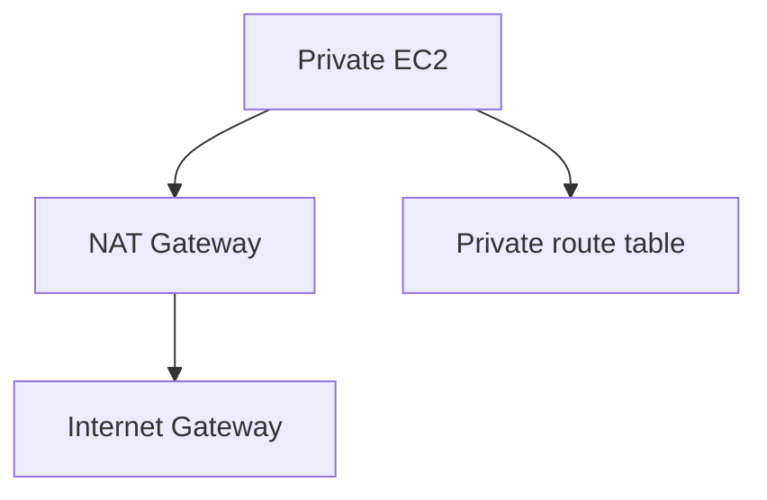

# Lab 08: NAT Gateway Patterns for Private Subnets

## Business Scenario
Private instances need outbound internet for patching and package downloads, but they must not accept inbound traffic from the internet.

## Core Services
VPC, NAT Gateway, Route Tables, EC2

## Target Architecture


## Step-by-Step
1. Create a NAT gateway in a public subnet with an Elastic IP.
2. Point private subnet routes to the NAT gateway.
3. Test outbound access from a private instance.

## CLI Commands
```bash
aws ec2 allocate-address --domain vpc
aws ec2 create-nat-gateway --subnet-id subnet-public --allocation-id eipalloc-12345678
aws ec2 create-route --route-table-id rtb-private --destination-cidr-block 0.0.0.0/0 --nat-gateway-id nat-12345678
curl https://aws.amazon.com
```

## Expected Output
- The private subnet can reach the internet for outbound requests.
- Inbound internet access still does not exist for the private instance.
- The route table shows `0.0.0.0/0` to the NAT gateway.

## Failure Injection
Delete the NAT gateway or remove the route, then confirm the private instance loses outbound internet access.

## Decision Trade-offs
| Option | Best for | Strength | Weakness |
| --- | --- | --- | --- |
| NAT Gateway | Managed egress | Simple and resilient | Cost per hour plus data charges. |
| NAT instance | Legacy egress | Cheaper at tiny scale | Needs patching and scaling. |
| VPC endpoint | AWS service access | No internet path needed | Not for general internet traffic. |

## Common Mistakes
- Placing the NAT gateway in a private subnet.
- Forgetting the Elastic IP.
- Using a single NAT gateway for every AZ without considering failure domains.

## Exam Question
**Q:** What should a private subnet use when it needs outbound internet access with low operational effort?

**A:** A NAT gateway, because it is managed and preserves the private subnet boundary.

## Cleanup
- Delete the NAT gateway and release the Elastic IP.
- Remove the private route table entry.
- Terminate any test instances used for outbound validation.

