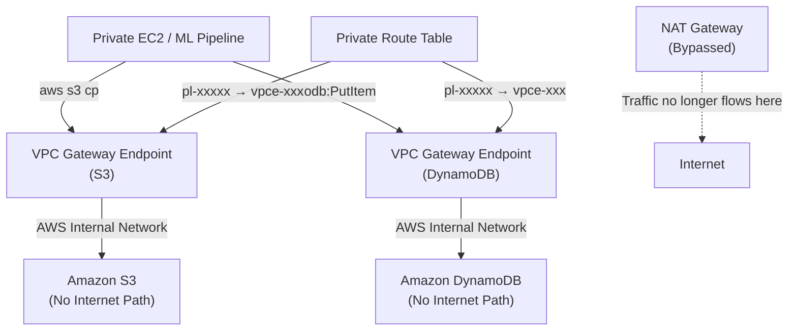

# Lab 09: VPC Endpoints for Private AWS Service Access

## Metadata
- Difficulty: Intermediate
- Time estimate: 20–25 minutes
- Estimated cost: Free Tier eligible (Gateway Endpoints ฟรี, Interface Endpoints มีค่าใช้จ่าย)
- Prerequisites: Lab 01 (VPC with Private Subnets)
- Depends on: Lab 01

## Learning Objectives
หลังจากทำ Lab นี้เสร็จ ผู้เรียนจะสามารถ:
- สร้าง VPC Gateway Endpoint สำหรับ S3 และ DynamoDB ได้
- อธิบายความแตกต่างระหว่าง Gateway Endpoint และ Interface Endpoint (PrivateLink)
- ตรวจสอบ Route ที่ถูก Inject เข้า Route Table หลังสร้าง Gateway Endpoint
- ระบุสถานการณ์ที่ VPC Endpoint ช่วยลดค่าใช้จ่าย NAT Gateway

## Business Scenario
Pipeline ประมวลผล Machine Learning ใน Private Subnet ต้องดาวน์โหลด Training Data ขนาด Terabytes จาก S3 และบันทึก Job Status ลง DynamoDB อยู่ตลอดเวลา

หากใช้ NAT Gateway เป็นทางผ่าน จะเสียค่า Data Transfer ต่อ GB เพิ่มไปอย่างไม่จำเป็น และข้อมูลจะวิ่งผ่านอินเทอร์เน็ตซึ่งอาจขัด Compliance Policy VPC Endpoint แก้ทั้งสองปัญหาพร้อมกันโดยไม่มีค่าใช้จ่ายเพิ่ม

## Core Services
VPC Endpoints (Gateway), S3, DynamoDB, Route Tables

## Target Architecture


## Environment Setup
```bash
# กำหนดค่าเหล่านี้ก่อนรันคำสั่งใดๆ ใน Lab นี้
export AWS_REGION=ap-southeast-1
export ACCOUNT_ID=$(aws sts get-caller-identity --query Account --output text)
export PROJECT_TAG=SAA-Lab-09
export VPC_ID=$(aws ec2 describe-vpcs \
  --filters "Name=tag:Project,Values=SAA-Lab-01" \
  --query 'Vpcs[0].VpcId' --output text)
export SUBNET_PRIV=$(aws ec2 describe-subnets \
  --filters "Name=tag:Project,Values=SAA-Lab-01" "Name=tag:Name,Values=Private-Subnet" \
  --query 'Subnets[0].SubnetId' --output text)

# สร้าง Route Table สำหรับ Lab นี้
export RTB_PRIV_ID=$(aws ec2 create-route-table \
  --vpc-id $VPC_ID \
  --tag-specifications "ResourceType=route-table,Tags=[{Key=Project,Value=$PROJECT_TAG},{Key=Name,Value=Private-RT-09}]" \
  --query 'RouteTable.RouteTableId' --output text)
aws ec2 associate-route-table --route-table-id $RTB_PRIV_ID --subnet-id $SUBNET_PRIV
```

---

## Step-by-Step

### Phase 1 — สร้าง Gateway Endpoint สำหรับ S3

Gateway Endpoint สำหรับ S3 ฟรีทั้งค่าเปิดและ Data Transfer โดย AWS จะ Inject Prefix List Route เข้า Route Table โดยอัตโนมัติ

#### 🖥️ วิธีทำผ่าน AWS Console (GUI)

1. ไปที่ **VPC → Endpoints** → คลิก **Create endpoint**
2. กำหนดค่า:
   - Service category: **AWS services**
   - Service: ค้นหา `com.amazonaws.ap-southeast-1.s3` → เลือก Type **Gateway**
3. VPC: เลือก Lab01 VPC
4. Route Tables: เลือก Route Table ของ Private Subnet (`Private-RT-09`)
5. Policy: Full access (Default)
6. คลิก **Create endpoint**

#### ⌨️ วิธีทำผ่าน CLI

```bash
S3_VPCE_ID=$(aws ec2 create-vpc-endpoint \
  --vpc-id $VPC_ID \
  --service-name com.amazonaws.$AWS_REGION.s3 \
  --vpc-endpoint-type Gateway \
  --route-table-ids $RTB_PRIV_ID \
  --query 'VpcEndpoint.VpcEndpointId' --output text)
echo "S3 Endpoint ID: $S3_VPCE_ID"
```

**Expected output:** VPC Endpoint ID ถูกบันทึกในตัวแปร และ Route Table จะมี Route ใหม่ที่มี `DestinationPrefixListId: pl-xxxxx` ชี้ไปยัง `GatewayId: vpce-xxxxx` โดยอัตโนมัติ

---

### Phase 2 — สร้าง Gateway Endpoint สำหรับ DynamoDB

DynamoDB Gateway Endpoint ทำงานเหมือน S3 — ฟรี ไม่ต้องผ่าน NAT และข้อมูลวิ่งผ่าน AWS Internal Network

#### 🖥️ วิธีทำผ่าน AWS Console (GUI)

1. ไปที่ **VPC → Endpoints** → คลิก **Create endpoint**
2. Service: ค้นหา `com.amazonaws.ap-southeast-1.dynamodb` → เลือก Type **Gateway**
3. VPC: Lab01 VPC → Route Tables: `Private-RT-09`
4. คลิก **Create endpoint**

#### ⌨️ วิธีทำผ่าน CLI

```bash
DDB_VPCE_ID=$(aws ec2 create-vpc-endpoint \
  --vpc-id $VPC_ID \
  --service-name com.amazonaws.$AWS_REGION.dynamodb \
  --vpc-endpoint-type Gateway \
  --route-table-ids $RTB_PRIV_ID \
  --query 'VpcEndpoint.VpcEndpointId' --output text)
echo "DynamoDB Endpoint ID: $DDB_VPCE_ID"
```

**Expected output:** Route Table มี Prefix List Routes เพิ่มขึ้นอีก 1 รายการสำหรับ DynamoDB

---

### Phase 3 — ตรวจสอบ Route ที่ถูก Inject อัตโนมัติ

ตรวจสอบว่า Route Table มี Prefix List Routes สำหรับทั้ง S3 และ DynamoDB

#### 🖥️ วิธีทำผ่าน AWS Console (GUI)

1. ไปที่ **VPC → Route Tables** → เลือก `Private-RT-09`
2. แท็บ **Routes** → ตรวจสอบว่ามี Routes ที่มี:
   - Destination: `pl-xxxxxx` (Prefix List สำหรับ S3)
   - Target: `vpce-xxxxxx`
3. ทำซ้ำสำหรับ DynamoDB — จะเห็น 2 rows ใหม่ที่ถูกเพิ่มโดยอัตโนมัติ

#### ⌨️ วิธีทำผ่าน CLI

```bash
aws ec2 describe-route-tables \
  --route-table-ids $RTB_PRIV_ID \
  --query 'RouteTables[0].Routes'
```

**Expected output:** Routes แสดง `DestinationPrefixListId` สองรายการ ชี้ไปที่ `vpce-xxx` แต่ละตัว Traffic จาก Private EC2 ไปยัง S3 และ DynamoDB จะไม่ผ่าน NAT Gateway อีกต่อไป

---

## Failure Injection

ลบ Route ของ S3 Endpoint ออกจาก Route Table เพื่อสังเกตว่า Traffic ไปไม่ถึง S3 จาก Private Subnet

```bash
# ลบ S3 Endpoint ออกจาก Route Table
aws ec2 modify-vpc-endpoint \
  --vpc-endpoint-id $S3_VPCE_ID \
  --remove-route-table-ids $RTB_PRIV_ID
```

**What to observe:** Prefix List Route สำหรับ S3 จะหายออกจาก Route Table ทันที Instance ใน Private Subnet จะไม่สามารถเข้าถึง S3 ได้ (Timeout หาก Instance ไม่มี NAT Gateway) หรือต้องผ่าน NAT ซึ่งเพิ่มค่าใช้จ่าย

**How to recover:**
```bash
aws ec2 modify-vpc-endpoint \
  --vpc-endpoint-id $S3_VPCE_ID \
  --add-route-table-ids $RTB_PRIV_ID
```

---

## Decision Trade-offs

| ประเภท Endpoint | เหมาะกับ | ประสิทธิภาพ | ค่าใช้จ่าย | ภาระงาน (Ops) |
|---|---|---|---|---|
| Gateway Endpoint | S3 และ DynamoDB เท่านั้น | สูง (AWS Internal Network) | ฟรี | ต่ำ (Route Inject อัตโนมัติ) |
| Interface Endpoint (PrivateLink) | AWS Services อื่นๆ เช่น KMS, SQS, SNS, API Gateway | สูง (ENI ใน Subnet) | มีค่าใช้จ่ายต่อชั่วโมง + Data/GB | ปานกลาง (ต้องกำหนด Security Group) |
| NAT Gateway | Third-party APIs, อินเทอร์เน็ตทั่วไป | สูง (สูงสุด 45 Gbps) | สูง (ค่าเปิด/ชม. + Data/GB) | ต่ำ |

---

## Common Mistakes

- **Mistake:** ใช้ NAT Gateway ดาวน์โหลดข้อมูลขนาดใหญ่จาก S3 แทน VPC Endpoint
  **Why it fails:** NAT Gateway คิดค่า Data Transfer ต่อ GB การย้าย S3 Traffic ไปผ่าน Gateway Endpoint ช่วยประหยัดค่าใช้จ่ายได้มาก และยังลด Latency ด้วย

- **Mistake:** สร้าง Gateway Endpoint แล้วลืม Associate กับ Route Table ของ Private Subnet
  **Why it fails:** หากไม่ได้ Associate Route Table จะไม่มี Route ถูก Inject และ Traffic จะยังคงวิ่งผ่านเส้นทางเดิม (NAT หรือ Internet)

- **Mistake:** เข้าใจว่า Gateway Endpoint รองรับทุก AWS Service
  **Why it fails:** Gateway Endpoint รองรับเฉพาะ S3 และ DynamoDB เท่านั้น Services อื่นต้องใช้ Interface Endpoint (PrivateLink) ซึ่งมีค่าใช้จ่าย

- **Mistake:** พยายามใช้ Gateway Endpoint จาก On-premises ผ่าน VPN หรือ Direct Connect
  **Why it fails:** Gateway Endpoint ไม่รองรับ Transitive Routing Traffic จาก On-premises ต้องใช้ Interface Endpoint ที่มี ENI อยู่ใน VPC แทน

---

## Exam Questions

**Q1:** วิธีใดที่ช่วยให้ Instance ใน Private Subnet เข้าถึง S3 และ DynamoDB ได้โดยไม่ต้องผ่าน Internet และไม่มีค่าใช้จ่ายเพิ่ม?
**A:** VPC Gateway Endpoints สำหรับ S3 และ DynamoDB
**Rationale:** Gateway Endpoints ฟรีทั้งค่าเปิดและค่า Data Transfer Traffic วิ่งผ่าน AWS Internal Network ซึ่งทั้งเร็วกว่า ปลอดภัยกว่า และถูกกว่าการใช้ NAT Gateway

**Q2:** Application บน On-premises เชื่อมต่อผ่าน AWS Direct Connect ต้องการเข้าถึง S3 โดยใช้ VPC Gateway Endpoint เป็นไปได้หรือไม่?
**A:** ไม่ได้
**Rationale:** Gateway Endpoint ไม่รองรับ Transitive Routing จาก On-premises ผ่าน VPN หรือ Direct Connect ต้องใช้ S3 Interface Endpoint (PrivateLink) ซึ่งสร้าง ENI ใน VPC แทน

---

## Cleanup (เรียงลำดับตามนี้เท่านั้น — ห้ามข้ามขั้นตอน)

```bash
# Step 1 — ลบ VPC Endpoints (Route จะถูกลบออกจาก Route Table อัตโนมัติ)
aws ec2 delete-vpc-endpoints --vpc-endpoint-ids $S3_VPCE_ID $DDB_VPCE_ID

# Step 2 — ลบ Route Table ของ Lab นี้
ASSOC_ID=$(aws ec2 describe-route-tables \
  --route-table-ids $RTB_PRIV_ID \
  --query 'RouteTables[0].Associations[0].RouteTableAssociationId' \
  --output text)
aws ec2 disassociate-route-table --association-id $ASSOC_ID || true
aws ec2 delete-route-table --route-table-id $RTB_PRIV_ID

# Step 3 — ตรวจสอบว่าลบเรียบร้อยแล้ว
aws ec2 describe-vpc-endpoints \
  --filters "Name=vpc-endpoint-id,Values=$S3_VPCE_ID,$DDB_VPCE_ID" \
  --query 'VpcEndpoints[*].{ID:VpcEndpointId,State:State}' --output table
```

**Cost check:** Gateway Endpoints ไม่มีค่าใช้จ่าย แต่ตรวจสอบว่าไม่มี Interface Endpoints ที่ค้างอยู่:
```bash
aws ec2 describe-vpc-endpoints \
  --filters "Name=vpc-id,Values=$VPC_ID" "Name=vpc-endpoint-type,Values=Interface" \
  --query 'VpcEndpoints[?State!=`deleted`]' --output table
```
