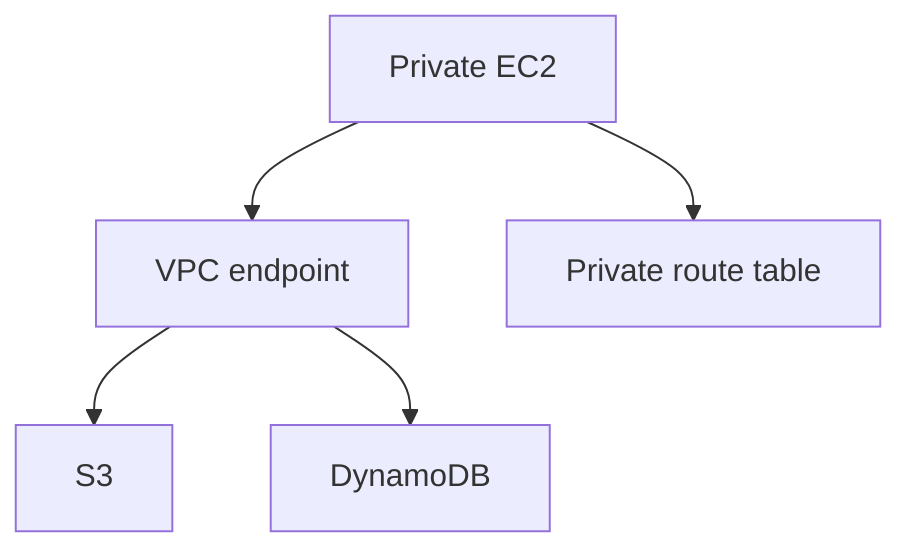

# Lab 09: VPC Endpoints for Private AWS Service Access

## Business Scenario
Private subnets should reach S3 and DynamoDB without traversing the public internet or a NAT gateway.

## Core Services
VPC Endpoints, S3, DynamoDB, Route Tables

## Target Architecture


## Step-by-Step
1. Create an S3 gateway endpoint and a DynamoDB gateway endpoint.
2. Associate both with the private route table.
3. Validate that private instances can reach AWS services without NAT.

## CLI Commands
```bash
aws ec2 create-vpc-endpoint --vpc-id vpc-12345678 --service-name com.amazonaws.ap-southeast-1.s3 --vpc-endpoint-type Gateway --route-table-ids rtb-private
aws ec2 create-vpc-endpoint --vpc-id vpc-12345678 --service-name com.amazonaws.ap-southeast-1.dynamodb --vpc-endpoint-type Gateway --route-table-ids rtb-private
aws s3 cp s3://lab09-bucket/test.txt -
aws dynamodb list-tables
```

## Expected Output
- S3 and DynamoDB requests succeed from the private subnet.
- No NAT gateway is required for those service calls.
- The endpoints are visible in the VPC endpoint list.

## Failure Injection
Disable the endpoint association and confirm the same private instance loses service access unless another path exists.

## Decision Trade-offs
| Option | Best for | Strength | Weakness |
| --- | --- | --- | --- |
| Gateway endpoint | S3/DynamoDB | Low cost and simple | Only supports specific services. |
| Interface endpoint | Private API access | More flexible | Costs more than gateway endpoints. |
| NAT gateway | General internet access | Broad coverage | Not needed for AWS-only access. |

## Common Mistakes
- Using NAT for AWS-only traffic.
- Forgetting private DNS on interface endpoints.
- Assuming every AWS service supports a gateway endpoint.

## Exam Question
**Q:** How do you let private subnets reach S3 without exposing them to the internet?

**A:** Use a VPC gateway endpoint for S3, because it keeps traffic on the AWS network and avoids NAT.

## Cleanup
- Delete the VPC endpoints.
- Remove route table associations added for the lab.
- Verify no interface endpoint ENIs remain.

