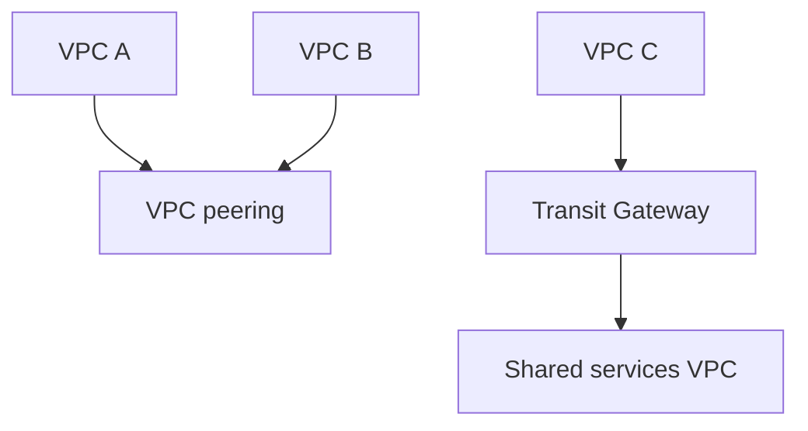

# Lab 10: VPC Peering vs Transit Gateway

## Business Scenario
The company has multiple VPCs today and expects more shared services later, so the network design must scale cleanly.

## Core Services
VPC Peering, Transit Gateway, Route Tables

## Target Architecture


## Step-by-Step
1. Create a peering connection between two VPCs and route traffic explicitly.
2. Create a Transit Gateway and attach multiple VPCs.
3. Compare what works for two VPCs and what works at scale.

## CLI Commands
```bash
aws ec2 create-vpc-peering-connection --vpc-id vpc-a --peer-vpc-id vpc-b
aws ec2 create-route --route-table-id rtb-a --destination-cidr-block 10.20.0.0/16 --vpc-peering-connection-id pcx-12345678
aws ec2 create-transit-gateway
aws ec2 attach-transit-gateway-vpc --transit-gateway-id tgw-12345678 --vpc-id vpc-c --subnet-ids subnet-123 subnet-456
```

## Expected Output
- Peering works only for the explicitly connected pair.
- Transit Gateway supports hub-and-spoke routing.
- Route tables must be updated on both sides.

## Failure Injection
Try to route VPC A to VPC C through VPC B using peering and confirm transitive routing does not happen.

## Decision Trade-offs
| Option | Best for | Strength | Weakness |
| --- | --- | --- | --- |
| VPC peering | Small number of VPCs | Simple and cheap | No transitive routing. |
| Transit Gateway | Many VPCs | Scales well | More cost and planning. |
| VPN | Hybrid connectivity | Works on the internet | Not ideal for east-west VPC traffic. |

## Common Mistakes
- Expecting transitive routing with peering.
- Ignoring overlapping CIDR ranges.
- Updating only one side of the route table.

## Exam Question
**Q:** Which option is the better long-term fit for many VPCs and shared services?

**A:** Transit Gateway, because it supports hub-and-spoke routing and scales better than many peering connections.

## Cleanup
- Delete the peering connection and TGW attachments.
- Remove routes created for the lab.
- Delete the Transit Gateway if it was created only for testing.

