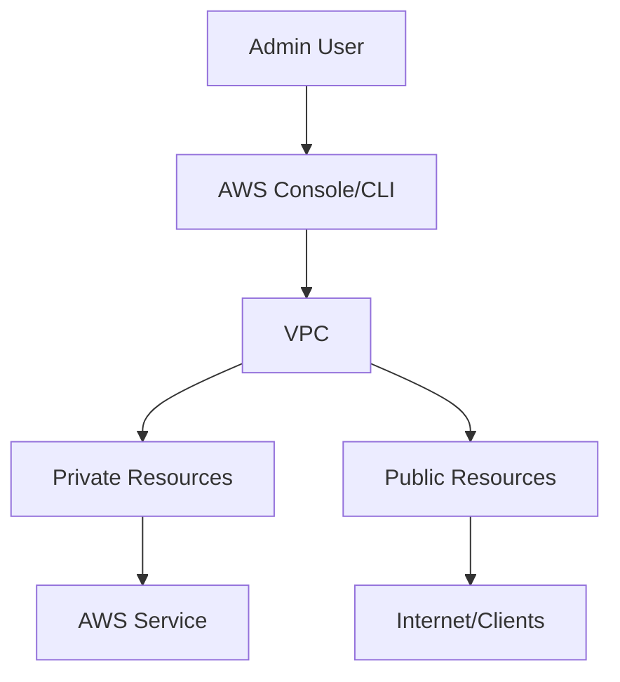

# Lab 10: VPC Peering vs Transit Gateway

## Objective
Connect multiple VPCs with the right pattern.

## SAA-C03 Domains
- Design Secure Architectures
- Design Resilient Architectures
- Design High-Performing Architectures
- Design Cost-Optimized Architectures

## Prerequisites
- AWS account with admin lab role
- AWS CLI configured
- Basic understanding of VPC/IAM

## Architecture Diagram

## Steps
1. Create baseline resources for this scenario.
2. Apply service-specific configuration aligned to the objective.
3. Validate behavior through functional and security checks.
4. Record findings and compare with exam design trade-offs.

## Validation Checklist
- [ ] Architecture deployed successfully
- [ ] Access control is least privilege
- [ ] High availability behavior verified
- [ ] Logging/monitoring enabled

## Cleanup
1. Delete workload resources.
2. Delete networking and security dependencies.
3. Confirm no running billable resources remain.

## Exam Traps
- Confusing similar services without considering constraints.
- Ignoring shared responsibility and encryption defaults.
- Choosing higher-cost options where managed alternatives fit.

## Quick Quiz
1. Why is this architecture resilient?
2. Which component is most cost-sensitive?
3. Which option would improve security posture first?
