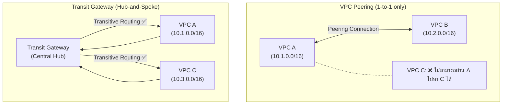

# Lab 10: VPC Peering vs Transit Gateway

## Metadata
- Difficulty: Advanced
- Time estimate: 30–45 minutes
- Estimated cost: ~$1.20 (ค่า Transit Gateway Attachment รายชั่วโมง)
- Prerequisites: None
- Depends on: None

## Learning Objectives
หลังจากทำ Lab นี้เสร็จ ผู้เรียนจะสามารถ:
- สร้าง VPC Peering Connection และกำหนด Route Tables ทั้ง 2 ฝั่ง
- สร้าง Transit Gateway และ Attach VPC เข้ากับ TGW
- อธิบายข้อจำกัด Transitive Routing ของ VPC Peering และวิธีแก้ด้วย TGW
- เลือกระหว่าง VPC Peering และ Transit Gateway ตามจำนวน VPC และ Use Case

## Business Scenario
บริษัทมีโครงสร้างเครือข่าย VPC กระจายอยู่กว่า 15 Account และมีแผนที่จะขยายเป็น 2 เท่าในปีถัดไป การใช้ VPC Peering แบบ Point-to-Point สำหรับจำนวน VPC ขนาดนี้จะสร้างความซับซ้อนในการบริหาร Route Tables อย่างมาก

จำนวน Peering Connections ที่ต้องจัดการสูงสุดถึง `n*(n-1)/2` — สำหรับ 30 VPCs จะต้องมีถึง 435 Connections ทำให้ Transit Gateway เป็นทางเลือกที่เหมาะสมกว่า

## Core Services
VPC Peering, Transit Gateway, Route Tables

## Target Architecture


## Environment Setup
```bash
# กำหนดค่าเหล่านี้ก่อนรันคำสั่งใดๆ ใน Lab นี้
export AWS_REGION=ap-southeast-1
export ACCOUNT_ID=$(aws sts get-caller-identity --query Account --output text)
export PROJECT_TAG=SAA-Lab-10

# สร้าง 3 VPC สำหรับ Lab นี้
export VPC_A=$(aws ec2 create-vpc \
  --cidr-block 10.1.0.0/16 \
  --tag-specifications "ResourceType=vpc,Tags=[{Key=Name,Value=VPC-A},{Key=Project,Value=$PROJECT_TAG}]" \
  --query 'Vpc.VpcId' --output text)
export VPC_B=$(aws ec2 create-vpc \
  --cidr-block 10.2.0.0/16 \
  --tag-specifications "ResourceType=vpc,Tags=[{Key=Name,Value=VPC-B},{Key=Project,Value=$PROJECT_TAG}]" \
  --query 'Vpc.VpcId' --output text)
export VPC_C=$(aws ec2 create-vpc \
  --cidr-block 10.3.0.0/16 \
  --tag-specifications "ResourceType=vpc,Tags=[{Key=Name,Value=VPC-C},{Key=Project,Value=$PROJECT_TAG}]" \
  --query 'Vpc.VpcId' --output text)

# สร้าง Subnet สำหรับ TGW Attachments
export SUB_A=$(aws ec2 create-subnet \
  --vpc-id $VPC_A --cidr-block 10.1.1.0/24 \
  --availability-zone ${AWS_REGION}a --query 'Subnet.SubnetId' --output text)
export SUB_C=$(aws ec2 create-subnet \
  --vpc-id $VPC_C --cidr-block 10.3.1.0/24 \
  --availability-zone ${AWS_REGION}a --query 'Subnet.SubnetId' --output text)
```

---

## Step-by-Step

### Phase 1 — สร้าง VPC Peering Connection (A ↔ B)

สร้าง VPC Peering แบบ Point-to-Point ระหว่าง VPC A และ VPC B พร้อมกำหนด Route Tables ทั้ง 2 ฝั่ง

#### 🖥️ วิธีทำผ่าน AWS Console (GUI)

1. ไปที่ **VPC → Peering connections** → คลิก **Create peering connection**
2. กำหนดค่า:
   - Name: `Lab10-A-to-B`
   - VPC ID (Requester): เลือก VPC-A
   - Account: **My account** → Region: **This Region**
   - VPC ID (Accepter): เลือก VPC-B
3. คลิก **Create peering connection**
4. เลือก Connection ที่สร้าง → **Actions → Accept request**
5. ไปที่ **Route Tables** → เพิ่ม Route ทั้ง 2 ฝั่ง:
   - Route Table ของ VPC-A: `10.2.0.0/16 → pcx-xxx`
   - Route Table ของ VPC-B: `10.1.0.0/16 → pcx-xxx`

#### ⌨️ วิธีทำผ่าน CLI

```bash
# สร้าง Peering Connection
PEER_ID=$(aws ec2 create-vpc-peering-connection \
  --vpc-id $VPC_A \
  --peer-vpc-id $VPC_B \
  --query 'VpcPeeringConnection.VpcPeeringConnectionId' --output text)

# ต้อง Accept ก่อนถึงจะใช้งานได้
aws ec2 accept-vpc-peering-connection --vpc-peering-connection-id $PEER_ID

# หา Default Route TABLE ของแต่ละ VPC
RT_A=$(aws ec2 describe-route-tables \
  --filters "Name=vpc-id,Values=$VPC_A" \
  --query 'RouteTables[0].RouteTableId' --output text)
RT_B=$(aws ec2 describe-route-tables \
  --filters "Name=vpc-id,Values=$VPC_B" \
  --query 'RouteTables[0].RouteTableId' --output text)

# กำหนด Route ทั้ง 2 ฝั่ง (ต้องทำทั้งคู่เสมอ)
aws ec2 create-route \
  --route-table-id $RT_A \
  --destination-cidr-block 10.2.0.0/16 \
  --vpc-peering-connection-id $PEER_ID
aws ec2 create-route \
  --route-table-id $RT_B \
  --destination-cidr-block 10.1.0.0/16 \
  --vpc-peering-connection-id $PEER_ID
```

**Expected output:** Peering Connection สถานะ `active` และ Route Tables ทั้ง 2 ฝั่งมี Route สำหรับ CIDR ของกันและกัน

---

### Phase 2 — สร้าง Transit Gateway (Hub สำหรับ A และ C)

สร้าง Transit Gateway เป็น Central Hub แล้ว Attach VPC A และ VPC C เพื่อให้สื่อสารกันได้แบบ Transitive Routing

#### 🖥️ วิธีทำผ่าน AWS Console (GUI)

1. ไปที่ **VPC → Transit Gateways** → คลิก **Create transit gateway**
2. Name: `Lab10-TGW` → รักษา Default Setting → **Create**
3. รอสถานะ `available` (ประมาณ 5 นาที)
4. ไปที่ **Transit Gateway Attachments** → **Create transit gateway attachment**:
   - TGW: `Lab10-TGW` → Resource type: **VPC** → VPC: `VPC-A` → Subnet: `SUB_A`
5. ทำซ้ำสำหรับ VPC-C โดยใช้ `SUB_C`
6. เพิ่ม Routes ใน Route Tables:
   - VPC-A Route Table: `10.3.0.0/16 → tgw-xxx`
   - VPC-C Route Table: `10.0.0.0/8 → tgw-xxx`

#### ⌨️ วิธีทำผ่าน CLI

```bash
# สร้าง Transit Gateway
TGW_ID=$(aws ec2 create-transit-gateway \
  --description "Lab 10 TGW" \
  --query 'TransitGateway.TransitGatewayId' --output text)

# รอให้ TGW พร้อมใช้งาน (ประมาณ 5 นาที)
aws ec2 wait transit-gateway-available --transit-gateway-ids $TGW_ID

# Attach VPC A และ VPC C เข้าสู่ TGW
TGW_ATT_A=$(aws ec2 create-transit-gateway-vpc-attachment \
  --transit-gateway-id $TGW_ID \
  --vpc-id $VPC_A \
  --subnet-ids $SUB_A \
  --query 'TransitGatewayVpcAttachment.TransitGatewayAttachmentId' --output text)
TGW_ATT_C=$(aws ec2 create-transit-gateway-vpc-attachment \
  --transit-gateway-id $TGW_ID \
  --vpc-id $VPC_C \
  --subnet-ids $SUB_C \
  --query 'TransitGatewayVpcAttachment.TransitGatewayAttachmentId' --output text)
```

**Expected output:** Attachment IDs ถูกบันทึกในตัวแปร Attachments จะอยู่ในสถานะ `pending` และเปลี่ยนเป็น `available` ภายใน 1-2 นาที

---

### Phase 3 — กำหนด Routes สำหรับ TGW และตรวจสอบ

กำหนด Route Tables ให้ VPC A และ VPC C ส่ง Traffic ผ่าน TGW เพื่อสื่อสารกัน

#### 🖥️ วิธีทำผ่าน AWS Console (GUI)

1. ไปที่ **VPC → Route Tables**
2. Route Table ของ VPC-A → **Edit routes** → Add:
   - `10.3.0.0/16 → tgw-xxx` (ไปหา VPC-C)
3. Route Table ของ VPC-C → **Edit routes** → Add:
   - `10.0.0.0/8 → tgw-xxx` (ไปหา VPC Address ทั้งหมด)

#### ⌨️ วิธีทำผ่าน CLI

```bash
RT_C=$(aws ec2 describe-route-tables \
  --filters "Name=vpc-id,Values=$VPC_C" \
  --query 'RouteTables[0].RouteTableId' --output text)

# VPC-C รู้ทางไปยัง VPC-A ผ่าน TGW
aws ec2 create-route \
  --route-table-id $RT_C \
  --destination-cidr-block 10.0.0.0/8 \
  --transit-gateway-id $TGW_ID

# VPC-A รู้ทางไปยัง VPC-C ผ่าน TGW
aws ec2 create-route \
  --route-table-id $RT_A \
  --destination-cidr-block 10.3.0.0/16 \
  --transit-gateway-id $TGW_ID
```

**Expected output:** ทั้ง VPC-A และ VPC-C มี Route ชี้ผ่าน TGW ระหว่างกัน Instance ใน VPC-A สามารถ Ping Instance ใน VPC-C ผ่าน TGW ได้

---

## Failure Injection

สาธิตข้อจำกัด Transitive Routing — พยายามส่ง Traffic จาก VPC-C ไปยัง VPC-B โดยผ่าน VPC-A ซึ่งใช้ Peering Connection

```bash
# VPC-C พยายามส่ง Traffic ผ่าน VPC-A ไปยัง VPC-B (C → TGW → A → Peering → B)
# ไม่ต้องรัน command — เป็นการพิสูจน์เชิงทฤษฎี
echo "Transitive routing test: C -> A -> B via Peering"
```

**What to observe:** Traffic จาก VPC-C ที่พยายามไปยัง VPC-B (10.2.0.0/16) จะถูก Drop ที่ VPC-A เนื่องจาก AWS ไม่รองรับ Transitive Routing ผ่าน VPC Peering แม้ว่า Route จะถูกกำหนดไว้ก็ตาม

**How to recover:** วิธีแก้ที่ถูกต้องคือ Attach VPC-B เข้า Transit Gateway โดยตรง แทนที่จะพยายามใช้ Peering Connection เป็นสะพาน

---

## Decision Trade-offs

| ตัวเลือก | เหมาะกับ | ความสามารถ | ค่าใช้จ่าย |
|---|---|---|---|
| VPC Peering | 2-5 VPCs ที่ต้องคุยกัน | ต่ำ Latency, ไม่รองรับ Transitive | ฟรี (ยกเว้น Cross-AZ Data Transfer) |
| Transit Gateway | 10+ VPCs หรือต้องการ Transitive Routing | รองรับ Transitive, Hub-and-Spoke | มีค่าใช้จ่ายต่อ Attachment + Data/GB |
| VPN (Site-to-Site) | On-premises เชื่อมต่อ AWS | รองรับ IPsec, จำกัด Bandwidth | ค่า VPN Connection รายชั่วโมง |

---

## Common Mistakes

- **Mistake:** คาดหวังว่า VPC Peering จะรองรับ Transitive Routing
  **Why it fails:** AWS ไม่รองรับ Transitive Routing ผ่าน VPC Peering — ถ้า A ↔ B และ B ↔ C A ไม่สามารถสื่อสารกับ C ผ่าน B ได้ ต้องสร้าง Peering โดยตรง A ↔ C หรือใช้ Transit Gateway

- **Mistake:** กำหนด Route เพียงฝั่งเดียวใน VPC Peering
  **Why it fails:** Packet ไปถึงปลายทางได้ แต่ Response กลับมาไม่ได้ เนื่องจากต้องกำหนด Route ทั้ง Requester และ Accepter VPC

- **Mistake:** ออกแบบ CIDR ที่ Overlap กันระหว่าง VPCs ที่ต้องการ Peer
  **Why it fails:** VPC Peering และ Transit Gateway ไม่รองรับ Overlapping CIDR Blocks ต้องวางแผน IP Addressing ให้ไม่ซ้ำกันตั้งแต่แรก

- **Mistake:** ใช้ Transit Gateway สำหรับเชื่อมต่อเพียง 2 VPCs
  **Why it fails:** TGW มีค่าใช้จ่ายต่อ Attachment และ Data Processing สำหรับ 2 VPCs VPC Peering ฟรีและเหมาะกว่า

---

## Exam Questions

**Q1:** บริษัทมี VPC กว่า 50 VPC กระจายอยู่ใน Multiple Accounts และต้องการให้ทุก VPC สื่อสารกันได้ วิธีใดที่ลด Operational Overhead ได้มากที่สุด?
**A:** Amazon Transit Gateway
**Rationale:** TGW ทำงานแบบ Hub-and-Spoke — เชื่อม VPC ทุกตัวเข้า TGW ตัวเดียว แทนที่จะต้องสร้าง Peering Connection N*(N-1)/2 = สำหรับ 50 VPCs ต้องมี 1,225 Connections

**Q2:** VPC-A มี Peering กับ VPC-B และ VPC-B มี Peering กับ VPC-C VPC-A สามารถสื่อสารกับ VPC-C ได้หรือไม่?
**A:** ไม่ได้
**Rationale:** VPC Peering ไม่รองรับ Transitive Routing VPC-A และ VPC-C ต้องมี Peering Connection โดยตรงระหว่างกัน หรือทั้งหมดต้อง Attach กับ Transit Gateway

---

## Cleanup (เรียงลำดับตามนี้เท่านั้น — ห้ามข้ามขั้นตอน)

```bash
# Step 1 — ลบ TGW Attachments ก่อน
aws ec2 delete-transit-gateway-vpc-attachment --transit-gateway-attachment-id $TGW_ATT_A
aws ec2 delete-transit-gateway-vpc-attachment --transit-gateway-attachment-id $TGW_ATT_C

# Step 2 — ลบ Routes ที่เกี่ยวข้องกับ TGW และ Peering
aws ec2 delete-route --route-table-id $RT_C --destination-cidr-block 10.0.0.0/8 || true
aws ec2 delete-route --route-table-id $RT_A --destination-cidr-block 10.3.0.0/16 || true
aws ec2 delete-route --route-table-id $RT_A --destination-cidr-block 10.2.0.0/16 || true
aws ec2 delete-route --route-table-id $RT_B --destination-cidr-block 10.1.0.0/16 || true

# Step 3 — ลบ Peering Connection
aws ec2 delete-vpc-peering-connection --vpc-peering-connection-id $PEER_ID

# Step 4 — รอ Attachments ลบเสร็จ แล้วจึงลบ Transit Gateway
aws ec2 wait transit-gateway-vpc-attachments-deleted \
  --transit-gateway-attachment-ids $TGW_ATT_A $TGW_ATT_C
aws ec2 delete-transit-gateway --transit-gateway-id $TGW_ID

# Step 5 — ลบ Subnets และ VPCs
aws ec2 delete-subnet --subnet-id $SUB_A
aws ec2 delete-subnet --subnet-id $SUB_C
aws ec2 delete-vpc --vpc-id $VPC_A
aws ec2 delete-vpc --vpc-id $VPC_B
aws ec2 delete-vpc --vpc-id $VPC_C

# Step 6 — ตรวจสอบ
aws ec2 describe-transit-gateways \
  --transit-gateway-ids $TGW_ID 2>&1 || echo "✅ Transit Gateway ถูกลบเรียบร้อย"
```

**Cost check:** Transit Gateway มีค่าใช้จ่ายต่อ Attachment ตรวจสอบว่าไม่มีเหลืออยู่:
```bash
aws ec2 describe-transit-gateways \
  --query "TransitGateways[?State!='deleted'].{ID:TransitGatewayId,State:State}" --output table
```
