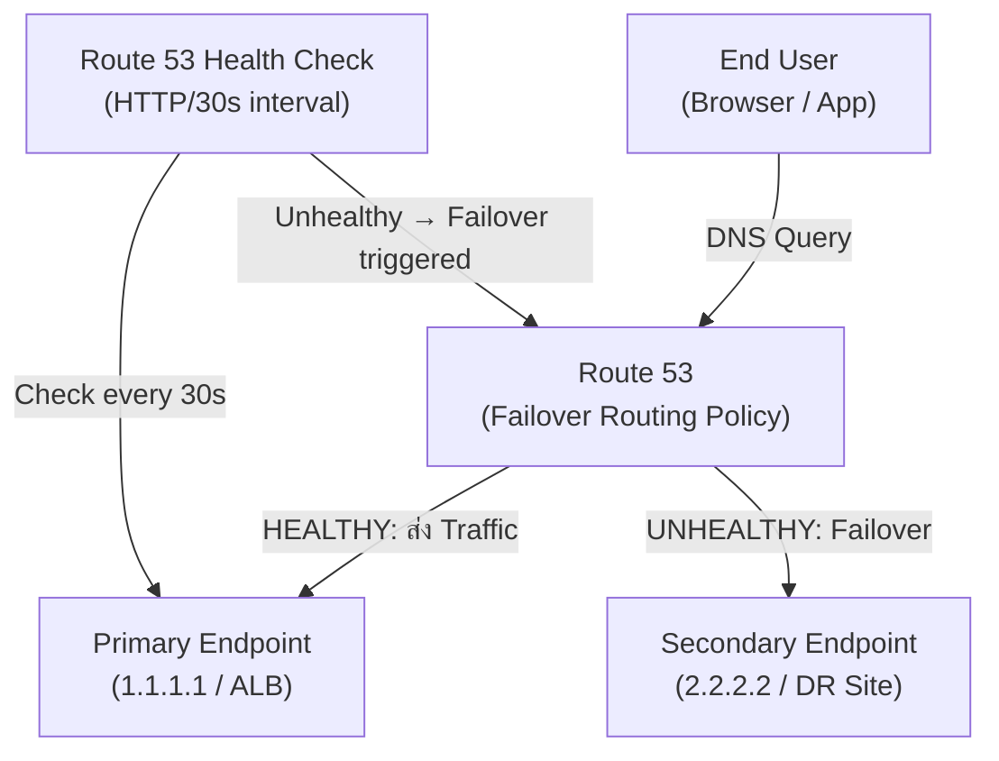

# Lab 11: Route 53 Failover Routing

## Metadata
- Difficulty: Intermediate
- Time estimate: 20–30 minutes
- Estimated cost: ~$1.00 (Route 53 Health Checks มีค่าใช้จ่ายต่อ Check)
- Prerequisites: ต้องมี Hosted Zone ใน Route 53 และ Domain Name ที่ควบคุมได้
- Depends on: None

## Learning Objectives
หลังจากทำ Lab นี้เสร็จ ผู้เรียนจะสามารถ:
- สร้าง Route 53 Health Check สำหรับตรวจสอบ Primary Endpoint
- กำหนด Failover Routing Records แบบ Primary และ Secondary
- สังเกตพฤติกรรมการสลับ DNS เมื่อ Health Check ล้มเหลว
- อธิบายผลกระทบของ TTL ต่อความเร็วในการ Failover

## Business Scenario
แอปพลิเคชัน E-commerce ต้องรองรับการเข้าถึงอย่างต่อเนื่องแม้ว่า Primary Server จะล่ม ระบบต้องสลับ Traffic ไปยัง Secondary Endpoint โดยอัตโนมัติภายในไม่กี่นาทีโดยไม่ต้องให้ Operator แทรกแซง

การไม่มีระบบ Failover อัตโนมัติ เมื่อ Primary พัง ผู้ใช้ทั้งหมดจะไม่สามารถเข้าถึงระบบได้จนกว่าจะมีการแก้ไขด้วยตนเอง

## Core Services
Route 53, Health Checks, EC2, ALB

## Target Architecture


## Environment Setup
```bash
# กำหนดค่าเหล่านี้ก่อนรันคำสั่งใดๆ ใน Lab นี้
export AWS_REGION=ap-southeast-1
export ACCOUNT_ID=$(aws sts get-caller-identity --query Account --output text)
export PROJECT_TAG=SAA-Lab-11

# สำคัญ: ต้องมี Hosted Zone ของตัวเองก่อน เปลี่ยน ID ด้านล่างนี้
export HOSTED_ZONE_ID="Z0123456789ABCDEF"
# ตัวอย่าง Domain: เปลี่ยนเป็น Domain ของคุณ
export APP_DOMAIN="app.example.com"
```

---

## Step-by-Step

### Phase 1 — สร้าง Route 53 Health Check

สร้าง Health Check ที่ตรวจสอบ HTTP Endpoint ของ Primary Server ทุก 30 วินาที และ Failover เมื่อล้มเหลว 3 ครั้งติดต่อกัน

#### 🖥️ วิธีทำผ่าน AWS Console (GUI)

1. ไปที่ **Route 53 → Health checks** → คลิก **Create health check**
2. กำหนดค่า:
   - Name: `Lab11-Primary-HC`
   - What to monitor: **Endpoint**
   - Protocol: **HTTP** → Port: `80`
   - Domain name: ใส่ Domain หรือ IP ของ Primary
   - Path: `/`
3. Advanced configuration:
   - Request interval: **Standard (30 seconds)**
   - Failure threshold: **3**
4. Tag: `Project = SAA-Lab-11`
5. คลิก **Create health check**

#### ⌨️ วิธีทำผ่าน CLI

```bash
cat <<EOF > healthcheck.json
{
  "Type": "HTTP",
  "ResourcePath": "/",
  "FullyQualifiedDomainName": "primary.example.com",
  "Port": 80,
  "RequestInterval": 30,
  "FailureThreshold": 3
}
EOF

HC_ID=$(aws route53 create-health-check \
  --caller-reference "lab11-$(date +%s)" \
  --health-check-config file://healthcheck.json \
  --query 'HealthCheck.Id' --output text)

aws route53 change-tags-for-resource \
  --resource-type healthcheck \
  --resource-id $HC_ID \
  --add-tags Key=Project,Value=$PROJECT_TAG

echo "Health Check ID: $HC_ID"
```

**Expected output:** Health Check ID ถูกบันทึกในตัวแปร สถานะเริ่มต้น `Insufficient data` แล้วจะเปลี่ยนเป็น `Healthy` หรือ `Unhealthy` ภายใน 1-2 นาที

---

### Phase 2 — กำหนด Failover DNS Records

สร้าง Record Set 2 รายการ (PRIMARY และ SECONDARY) สำหรับชื่อ Domain เดียวกัน Route 53 จะส่ง Traffic ไป Primary ตลอดเวลาที่ Health Check ผ่าน

#### 🖥️ วิธีทำผ่าน AWS Console (GUI)

1. ไปที่ **Route 53 → Hosted zones** → เลือก Hosted Zone ของคุณ
2. คลิก **Create record** → เปิด **Wizard** (หรือใช้ **Simple editor**)
3. สร้าง Record แรก (Primary):
   - Name: `app` → Type: `A`
   - Routing policy: **Failover** → Failover record type: **Primary**
   - Value: IP ของ Primary Server
   - Health check: เลือก `Lab11-Primary-HC`
   - Record ID: `Primary`
4. เพิ่ม Record ที่สอง (Secondary):
   - Name: `app` → Type: `A`
   - Failover record type: **Secondary**
   - Value: IP ของ Secondary Server
   - Record ID: `Secondary` (ไม่ต้องกำหนด Health Check)

#### ⌨️ วิธีทำผ่าน CLI

```bash
cat <<EOF > failover-records.json
{
  "Comment": "Failover routing setup for Lab 11",
  "Changes": [
    {
      "Action": "UPSERT",
      "ResourceRecordSet": {
        "Name": "$APP_DOMAIN",
        "Type": "A",
        "SetIdentifier": "Primary",
        "Failover": "PRIMARY",
        "TTL": 60,
        "ResourceRecords": [{"Value": "1.1.1.1"}],
        "HealthCheckId": "$HC_ID"
      }
    },
    {
      "Action": "UPSERT",
      "ResourceRecordSet": {
        "Name": "$APP_DOMAIN",
        "Type": "A",
        "SetIdentifier": "Secondary",
        "Failover": "SECONDARY",
        "TTL": 60,
        "ResourceRecords": [{"Value": "2.2.2.2"}]
      }
    }
  ]
}
EOF

aws route53 change-resource-record-sets \
  --hosted-zone-id $HOSTED_ZONE_ID \
  --change-batch file://failover-records.json
```

**Expected output:** `{"ChangeInfo": {"Status": "PENDING", ...}}` — การเปลี่ยนแปลง DNS จะ Propagate ภายใน 60 วินาที

---

### Phase 3 — ตรวจสอบการทำงานของ Failover

ตรวจสอบว่า DNS ตอบกลับเป็น Primary IP เมื่อ Health Check ผ่าน

#### 🖥️ วิธีทำผ่าน AWS Console (GUI)

1. ไปที่ **Route 53 → Health checks** → ตรวจสอบ Status ของ `Lab11-Primary-HC`
2. ไปที่ **Hosted zones** → เลือก Domain → ดูว่า Records ถูกสร้างถูกต้องทั้ง Primary และ Secondary

#### ⌨️ วิธีทำผ่าน CLI

```bash
# ตรวจสอบสถานะ Health Check
aws route53 get-health-check-status --health-check-id $HC_ID \
  --query 'HealthCheckObservations[*].{Region:Region,Status:StatusReport.Status}'

# ทดสอบ DNS Resolution (ต้องมี dig หรือ nslookup)
dig +short $APP_DOMAIN
```

**Expected output:** `dig` คืนค่า `1.1.1.1` (Primary IP) ตราบใดที่ Health Check สถานะ `Healthy`

---

## Failure Injection

จำลองสถานการณ์ที่ Primary ล่ม โดยการอัปเดต Health Check ให้ชี้ไปยัง Endpoint ที่ไม่ตอบสนอง

```bash
# แก้ Health Check ให้ชี้ไป Endpoint ที่ไม่ทำงาน
aws route53 update-health-check \
  --health-check-id $HC_ID \
  --fully-qualified-domain-name "nonexistent.invalid.example.com"
```

**What to observe:** ภายใน 2-3 นาที (3 Health Check Failures × 30s) สถานะ Health Check จะเปลี่ยนเป็น `Unhealthy` และ `dig` จะเริ่มคืนค่า `2.2.2.2` (Secondary IP) แทน

**How to recover:**
```bash
aws route53 update-health-check \
  --health-check-id $HC_ID \
  --fully-qualified-domain-name "primary.example.com"
```

---

## Decision Trade-offs

| Routing Policy | เหมาะกับ | RTO | ค่าใช้จ่าย | ภาระงาน (Ops) |
|---|---|---|---|---|
| Failover Routing | Active/Passive DR | TTL + HC Failure Detection (นาที) | ปานกลาง (ค่า Health Check/เดือน) | ต่ำ (อัตโนมัติ) |
| Weighted Routing | A/B Testing, Canary Deployment | ไม่มี Failover อัตโนมัติ | ฟรี | ปานกลาง (ต้องปรับ Weight เอง) |
| Latency Routing | Global Application, ลด Latency สำหรับ End User | เลือก Region ที่เร็วที่สุด | ฟรี | ต่ำ |

---

## Common Mistakes

- **Mistake:** ตั้ง TTL ไว้สูงเกินไป (เช่น 24 ชั่วโมง)
  **Why it fails:** DNS Resolver ของ ISP และ Browser จะ Cache IP เดิมไว้ตลอด TTL แม้ Route 53 จะ Failover ไปยัง Secondary แล้ว ผู้ใช้ยังคงถูกส่งไปยัง Primary ที่พังจนกว่า TTL จะหมดอายุ

- **Mistake:** ชี้ Health Check ไปยัง Server ที่แตกต่างจากตัวที่รับ Traffic จริง
  **Why it fails:** Health Check อาจรายงาน Healthy ในขณะที่ Server ที่รับ Traffic จริงพัง หรือ Failover เร็วเกินไปทั้งที่ระบบยังปกติ

- **Mistake:** Secondary Endpoint ไม่ได้รับการ Test ว่ารองรับ Full Production Load ได้
  **Why it fails:** เมื่อ Failover เกิดขึ้น Traffic ทั้งหมดจะไปที่ Secondary ซึ่งอาจล่มตามหาก Capacity ไม่พอ

- **Mistake:** ไม่เคย Test Failover ใน Pre-production ก่อน
  **Why it fails:** อาจพบปัญหา Database Replication Lag, Security Group Misconfiguration หรือ Missing Environment Variables ที่ Secondary Site ในช่วงวิกฤต

- **Mistake:** กำหนด Health Check ให้ Secondary Record ด้วย
  **Why it fails:** ถ้า Secondary Health Check ล้มเหลวด้วย Route 53 อาจไม่มี Endpoint ที่พร้อมรับ Traffic เลย ทำให้ DNS Return ค่าว่าง

---

## Exam Questions

**Q1:** Route 53 Routing Policy ใดที่ออกแบบมาสำหรับ Active/Passive Disaster Recovery?
**A:** Failover Routing
**Rationale:** Failover Routing ส่ง Traffic ไปยัง Primary เสมอ และสลับไป Secondary อัตโนมัติเมื่อ Health Check ของ Primary ล้มเหลว เหมาะกับ Architecture แบบ Active/Passive DR

**Q2:** หลัง Route 53 Failover เกิดขึ้นสำเร็จ แต่ผู้ใช้ยังคงถูกส่งไปยัง Primary ที่พัง สาเหตุที่พบบ่อยที่สุดคืออะไร?
**A:** ค่า TTL ใน DNS Record สูงเกินไป ทำให้ DNS Resolver Cache IP เดิมไว้นานกว่าที่คาดไว้
**Rationale:** TTL ควรตั้งไว้ต่ำ (เช่น 60 วินาที) สำหรับระบบที่ต้องการ Failover เร็ว แต่ TTL ต่ำจะเพิ่ม DNS Query Volume และค่าใช้จ่ายเล็กน้อย

---

## Cleanup (เรียงลำดับตามนี้เท่านั้น — ห้ามข้ามขั้นตอน)

```bash
# Step 1 — ลบ DNS Records โดยเปลี่ยน Action จาก UPSERT เป็น DELETE
sed 's/"UPSERT"/"DELETE"/g' failover-records.json > failover-delete.json
aws route53 change-resource-record-sets \
  --hosted-zone-id $HOSTED_ZONE_ID \
  --change-batch file://failover-delete.json

# Step 2 — ลบ Health Check
aws route53 delete-health-check --health-check-id $HC_ID

# Step 3 — ตรวจสอบว่าลบเรียบร้อยแล้ว
aws route53 list-health-checks \
  --query "HealthChecks[?Id=='$HC_ID']" --output table || echo "✅ Health Check ถูกลบเรียบร้อย"
```

**Cost check:** Route 53 Health Checks คิดค่าบริการรายเดือน ตรวจสอบว่าไม่มีเหลืออยู่:
```bash
aws route53 list-health-checks \
  --query 'HealthChecks[*].{ID:Id,Type:HealthCheckConfig.Type}' --output table
```
