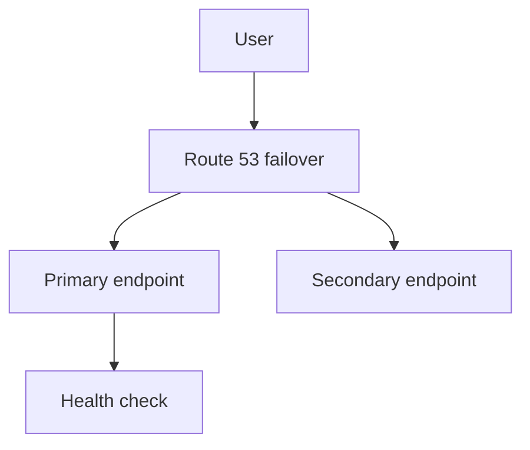

# Lab 11: Route 53 Failover Routing

## Business Scenario
An application needs an active primary endpoint with a secondary site ready to take over when health checks fail.

## Core Services
Route 53, Health Checks, EC2, ALB

## Target Architecture


## Step-by-Step
1. Create primary and secondary endpoints.
2. Configure failover records and a Route 53 health check.
3. Break the primary and verify DNS moves to the secondary.

## CLI Commands
```bash
aws route53 create-health-check --caller-reference lab11 --health-check-config file://healthcheck.json
aws route53 change-resource-record-sets --hosted-zone-id Z123456789 --change-batch file://failover-records.json
curl https://primary.example.com/health
curl https://secondary.example.com/health
```

## Expected Output
- The primary record resolves while health is good.
- The secondary record becomes active when the health check fails.
- TTL controls how fast clients notice the change.

## Failure Injection
Stop the primary service or fail its health endpoint and confirm Route 53 shifts traffic to the secondary record.

## Decision Trade-offs
| Option | Best for | Strength | Weakness |
| --- | --- | --- | --- |
| Failover | Active/passive DR | Simple recovery path | Needs health checks. |
| Weighted | Gradual traffic split | Useful for testing | Not automatic failover by itself. |
| Latency | Global performance | Better user proximity | Not a DR strategy alone. |

## Common Mistakes
- Setting TTL too high for a fast failover plan.
- Pointing the health check at the same failure domain as the app.
- Using failover records without testing the secondary.

## Exam Question
**Q:** Which Route 53 policy is most appropriate for active/passive disaster recovery?

**A:** Failover routing, because it sends traffic to the secondary only when the primary is unhealthy.

## Cleanup
- Delete the health check.
- Remove the failover records from the hosted zone.
- Terminate the standby resources if they were lab-only.

