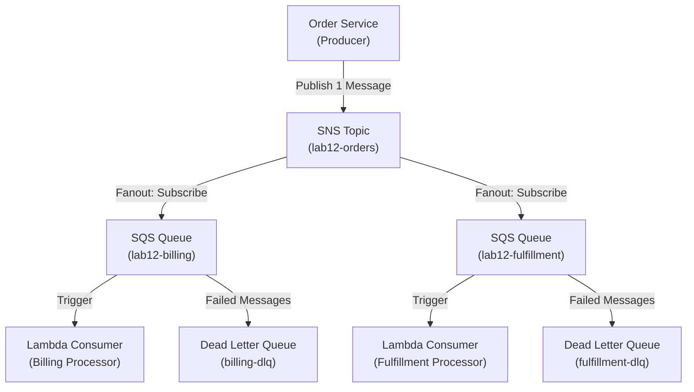

# Lab 12: SNS, SQS, and Lambda Fanout

## Metadata
- Difficulty: Intermediate
- Time estimate: 20–30 minutes
- Estimated cost: Free Tier eligible
- Prerequisites: None
- Depends on: None

## Learning Objectives
หลังจากทำ Lab นี้เสร็จ ผู้เรียนจะสามารถ:
- สร้าง SNS Topic และ SQS Queues พร้อม Subscribe Queues เข้ากับ Topic
- กำหนด SQS Queue Policy เพื่ออนุญาตให้ SNS ส่งข้อความได้
- ทดสอบรูปแบบ Fanout และสังเกตว่าข้อความ 1 ชิ้นถูกส่งไปยังหลาย Queues พร้อมกัน
- อธิบายว่าเหตุใด Fanout Pattern จึงแก้ปัญหา Tight Coupling ได้

## Business Scenario
ระบบ E-commerce เมื่อเกิด Order ใหม่ ข้อมูลจะต้องถูกส่งไปยังทั้ง Billing Service และ Fulfillment Service พร้อมกัน โดยไม่ให้ระบบรับ Order ต้องรอ Response จากทั้งสองระบบ

การให้ Order Service เรียก Billing และ Fulfillment โดยตรงแบบ Synchronous จะทำให้ Order พังเมื่อระบบใดระบบหนึ่งช้าหรือล่ม

## Core Services
SNS, SQS, Lambda, DLQ

## Target Architecture


## Environment Setup
```bash
# กำหนดค่าเหล่านี้ก่อนรันคำสั่งใดๆ ใน Lab นี้
export AWS_REGION=ap-southeast-1
export ACCOUNT_ID=$(aws sts get-caller-identity --query Account --output text)
export PROJECT_TAG=SAA-Lab-12
export TOPIC_NAME="lab12-orders"
export QUEUE_BILLING="lab12-billing"
export QUEUE_FULFILLMENT="lab12-fulfillment"
```

---

## Step-by-Step

### Phase 1 — สร้าง SNS Topic และ SQS Queues

สร้าง SNS Topic เป็นตัวกระจาย และ SQS Queues เป็นตัวรับข้อความสำหรับแต่ละ Service

#### 🖥️ วิธีทำผ่าน AWS Console (GUI)

**สร้าง SNS Topic:**
1. ไปที่ **SNS → Topics** → **Create topic**
2. Type: **Standard** → Name: `lab12-orders`
3. Tag: `Project = SAA-Lab-12` → **Create topic**

**สร้าง SQS Queues:**
1. ไปที่ **SQS → Queues** → **Create queue**
2. Type: **Standard** → Name: `lab12-billing` → **Create queue**
3. ทำซ้ำสำหรับ `lab12-fulfillment`

#### ⌨️ วิธีทำผ่าน CLI

```bash
# สร้าง SNS Topic
TOPIC_ARN=$(aws sns create-topic \
  --name $TOPIC_NAME \
  --tags Key=Project,Value=$PROJECT_TAG \
  --query 'TopicArn' --output text)

# สร้าง SQS Queues
QUEUE_URL_1=$(aws sqs create-queue \
  --queue-name $QUEUE_BILLING \
  --tags Key=Project,Value=$PROJECT_TAG \
  --query 'QueueUrl' --output text)
QUEUE_URL_2=$(aws sqs create-queue \
  --queue-name $QUEUE_FULFILLMENT \
  --tags Key=Project,Value=$PROJECT_TAG \
  --query 'QueueUrl' --output text)

# รับ ARN ของ Queues เพื่อใช้ในขั้นตอนถัดไป
QUEUE_ARN_1=$(aws sqs get-queue-attributes \
  --queue-url $QUEUE_URL_1 \
  --attribute-names QueueArn \
  --query 'Attributes.QueueArn' --output text)
QUEUE_ARN_2=$(aws sqs get-queue-attributes \
  --queue-url $QUEUE_URL_2 \
  --attribute-names QueueArn \
  --query 'Attributes.QueueArn' --output text)
```

**Expected output:** SNS Topic ARN และ SQS Queue URLs/ARNs ถูกบันทึกในตัวแปร

---

### Phase 2 — กำหนด SQS Policy และ Subscribe Queue เข้า Topic

กำหนด Queue Policy เพื่ออนุญาตให้ SNS ส่งข้อความได้ จากนั้น Subscribe ทั้ง 2 Queues เข้ากับ SNS Topic

#### 🖥️ วิธีทำผ่าน AWS Console (GUI)

**กำหนด SQS Policy:**
1. ไปที่ Queue `lab12-billing` → แท็บ **Access policy** → **Edit**
2. เพิ่ม Statement ที่อนุญาต SNS ส่งข้อความ:
   ```json
   {
     "Effect": "Allow",
     "Principal": {"Service": "sns.amazonaws.com"},
     "Action": "sqs:SendMessage",
     "Resource": "<Queue ARN>",
     "Condition": {"ArnEquals": {"aws:SourceArn": "<SNS Topic ARN>"}}
   }
   ```
3. ทำซ้ำสำหรับ Queue `lab12-fulfillment`

**Subscribe Queue เข้า Topic:**
1. ไปที่ **SNS → Topics → lab12-orders** → **Create subscription**
2. Protocol: **Amazon SQS** → Endpoint: ARN ของ `lab12-billing`
3. ทำซ้ำสำหรับ `lab12-fulfillment`

#### ⌨️ วิธีทำผ่าน CLI

```bash
# กำหนด Queue Policy ให้ Billing Queue รับข้อความจาก SNS ได้
cat <<EOF > sqs-policy-billing.json
{
  "Version": "2012-10-17",
  "Statement": [{
    "Effect": "Allow",
    "Principal": {"Service": "sns.amazonaws.com"},
    "Action": "sqs:SendMessage",
    "Resource": "$QUEUE_ARN_1",
    "Condition": {"ArnEquals": {"aws:SourceArn": "$TOPIC_ARN"}}
  }]
}
EOF
aws sqs set-queue-attributes \
  --queue-url $QUEUE_URL_1 \
  --attributes Policy="$(cat sqs-policy-billing.json)"

# กำหนด Policy สำหรับ Fulfillment Queue
cat <<EOF > sqs-policy-fulfillment.json
{
  "Version": "2012-10-17",
  "Statement": [{
    "Effect": "Allow",
    "Principal": {"Service": "sns.amazonaws.com"},
    "Action": "sqs:SendMessage",
    "Resource": "$QUEUE_ARN_2",
    "Condition": {"ArnEquals": {"aws:SourceArn": "$TOPIC_ARN"}}
  }]
}
EOF
aws sqs set-queue-attributes \
  --queue-url $QUEUE_URL_2 \
  --attributes Policy="$(cat sqs-policy-fulfillment.json)"

# Subscribe Queues เข้า SNS Topic
aws sns subscribe \
  --topic-arn $TOPIC_ARN \
  --protocol sqs \
  --notification-endpoint $QUEUE_ARN_1
aws sns subscribe \
  --topic-arn $TOPIC_ARN \
  --protocol sqs \
  --notification-endpoint $QUEUE_ARN_2
```

**Expected output:** `subscribe` คืนค่า `SubscriptionArn` สำหรับแต่ละ Queue

---

### Phase 3 — ทดสอบ Fanout Pattern

ส่ง 1 ข้อความไปยัง SNS Topic แล้วตรวจสอบว่าทั้ง 2 Queues ได้รับข้อความพร้อมกัน

#### 🖥️ วิธีทำผ่าน AWS Console (GUI)

1. ไปที่ **SNS → Topics → lab12-orders** → คลิก **Publish message**
2. Subject: `OrderEvent` → Message body: `Order-123-Confirmed`
3. คลิก **Publish message**
4. ไปที่ **SQS → Queues → lab12-billing** → คลิก **Send and receive messages**
5. คลิก **Poll for messages** → ตรวจสอบว่าข้อความ `Order-123-Confirmed` ปรากฏ
6. ทำซ้ำสำหรับ `lab12-fulfillment`

#### ⌨️ วิธีทำผ่าน CLI

```bash
# ส่งข้อความ 1 ชิ้นไปที่ SNS Topic
aws sns publish \
  --topic-arn $TOPIC_ARN \
  --message "Order-123-Confirmed" \
  --subject "OrderEvent"

# ตรวจสอบว่า Billing Queue ได้รับข้อความ
aws sqs receive-message \
  --queue-url $QUEUE_URL_1 \
  --max-number-of-messages 1 \
  --query 'Messages[0].Body' --output text

# ตรวจสอบว่า Fulfillment Queue ได้รับข้อความด้วย
aws sqs receive-message \
  --queue-url $QUEUE_URL_2 \
  --max-number-of-messages 1 \
  --query 'Messages[0].Body' --output text
```

**Expected output:** ทั้ง 2 Queues แสดงข้อความที่บรรจุ `Order-123-Confirmed` แสดงว่าข้อความ 1 ชิ้นถูกกระจายออกไปยัง 2 Queues พร้อมกัน

---

## Failure Injection

ลบ Queue Policy ออกจาก Billing Queue แล้วส่งข้อความใหม่เพื่อสังเกตว่าข้อความ "ตกหล่น" อย่างเงียบๆ

```bash
# ลบ Policy ออกจาก Billing Queue
aws sqs set-queue-attributes --queue-url $QUEUE_URL_1 --attributes Policy=""

# ส่งข้อความใหม่
aws sns publish --topic-arn $TOPIC_ARN --message "Order-456-Confirmed"

# ตรวจสอบว่า Billing Queue ไม่ได้รับข้อความ
aws sqs receive-message --queue-url $QUEUE_URL_1 --max-number-of-messages 1
```

**What to observe:** `lab12-billing` ไม่มีข้อความใหม่ แต่ `lab12-fulfillment` ได้รับปกติ SNS ส่งข้อความให้ Billing ไม่สำเร็จเพราะ SQS ปฏิเสธ (`AccessDenied`) หากไม่มี DLQ ข้อความนั้นจะ Lost ไปเงียบๆ

**How to recover:**
```bash
aws sqs set-queue-attributes \
  --queue-url $QUEUE_URL_1 \
  --attributes Policy="$(cat sqs-policy-billing.json)"
```

---

## Decision Trade-offs

| ตัวเลือก | เหมาะกับ | ประสิทธิภาพ | ค่าใช้จ่าย | ภาระงาน (Ops) |
|---|---|---|---|---|
| SNS Fanout + SQS | กระจายข้อความใปยัง Consumer หลายราย พร้อม Buffer | ดี (Async, Decoupled) | ต่ำ (จ่ายตามจำนวน Message) | ต่ำ |
| EventBridge | Event-driven Architecture ที่ต้องการ Filter ซับซ้อน | ดี (Schema registry, Rule-based routing) | สูงกว่า SNS เล็กน้อย | ปานกลาง |
| Direct Synchronous Calls | Simple workflow ที่ต้องการ Response ทันที | สูง (Low latency) | ต่ำ | ต่ำ แต่ Tight Coupling สูง |

---

## Common Mistakes

- **Mistake:** ลืมกำหนด SQS Queue Policy ให้รับข้อความจาก SNS ได้
  **Why it fails:** SNS จะได้รับ `AccessDenied` เมื่อพยายามส่งข้อความเข้า Queue ข้อความจะ Lost โดยไม่มีการแจ้งเตือนที่ชัดเจน

- **Mistake:** ไม่กำหนด Dead Letter Queue (DLQ) สำหรับ SQS
  **Why it fails:** หาก Consumer (Lambda) ล้มเหลวซ้ำๆ ข้อความจะถูก Retry ไปเรื่อยๆ ค้างอยู่ใน Queue จนหมด Visibility Timeout หรือถูกลบออกหลัง Max Receive Count เกิน ทำให้ข้อมูลสูญหาย

- **Mistake:** ออกแบบให้ Service เรียกกันโดยตรงแบบ Synchronous แทน Queue
  **Why it fails:** เมื่อ Service ใดล่มหรือช้า จะส่งผลกระทบต่อ Service ที่เรียกทั้งหมดทันที (Cascading Failure)

- **Mistake:** กำหนด Visibility Timeout ของ SQS สั้นกว่าเวลาที่ Lambda ใช้ประมวลผล
  **Why it fails:** Lambda ตัวที่สองจะหยิบข้อความนั้น (ที่ยังถูกประมวลผลอยู่) ขึ้นมา Retry ทำให้เกิดการประมวลผลซ้ำ (Duplicate Processing)

- **Mistake:** ใช้ Standard Queue สำหรับ Workflow ที่ต้องการลำดับที่แน่นอน
  **Why it fails:** Standard Queue รับประกันแค่ At-least-once Delivery ไม่รับประกันลำดับ ต้องใช้ FIFO Queue แทน

---

## Exam Questions

**Q1:** Architecture แบบใดช่วยให้สามารถส่ง Event 1 ชิ้นไปยัง Multiple Consumer แบบ Decoupled และทนทานต่อปัญหาของ Consumer แต่ละราย?
**A:** SNS Topic + SQS Queue Subscriptions (Fanout Pattern)
**Rationale:** SNS Publish ข้อความออกไปยังทุก Subscriber พร้อมกัน SQS Buffer ข้อความไว้ให้ Consumer ดึงไปประมวลผลในเวลาของตัวเอง ถ้า Consumer หนึ่งล่ม Consumer อื่นยังทำงานได้ตามปกติ

**Q2:** Consumer พบว่าข้อความเดิมถูก Receive ซ้ำหลายครั้ง ทั้งที่ยังอยู่ระหว่างการประมวลผล สาเหตุส่วนใหญ่คืออะไร?
**A:** Visibility Timeout ของ SQS สั้นกว่าเวลาที่ Consumer ใช้ประมวลผลจริง
**Rationale:** เมื่อ Visibility Timeout หมด SQS คิดว่า Consumer นั้นล้มเหลวและปลดล็อคข้อความให้ Consumer อื่นดึงไปได้ ต้องตั้ง Visibility Timeout ให้นานพอ (อย่างน้อย 6× runtime ของ Lambda)

---

## Cleanup (เรียงลำดับตามนี้เท่านั้น — ห้ามข้ามขั้นตอน)

```bash
# Step 1 — ลบ Subscriptions ทั้งหมดออกจาก Topic ก่อน
aws sns list-subscriptions-by-topic \
  --topic-arn $TOPIC_ARN \
  --query 'Subscriptions[*].SubscriptionArn' \
  --output text | tr '\t' '\n' | \
  while read sub; do aws sns unsubscribe --subscription-arn $sub; done

# Step 2 — ลบ SNS Topic
aws sns delete-topic --topic-arn $TOPIC_ARN

# Step 3 — ลบ SQS Queues
aws sqs delete-queue --queue-url $QUEUE_URL_1
aws sqs delete-queue --queue-url $QUEUE_URL_2

# Step 4 — ตรวจสอบว่าลบเรียบร้อยแล้ว
aws sns list-topics \
  --query "Topics[?contains(TopicArn,'$TOPIC_NAME')]" \
  --output table || echo "✅ SNS Topic ถูกลบเรียบร้อย"
```

**Cost check:** SNS และ SQS Free Tier ครอบคลุม Volume สำหรับ Lab ไม่มีค่าใช้จ่ายเพิ่ม:
```bash
aws sqs list-queues --queue-name-prefix "lab12" --output table
```
