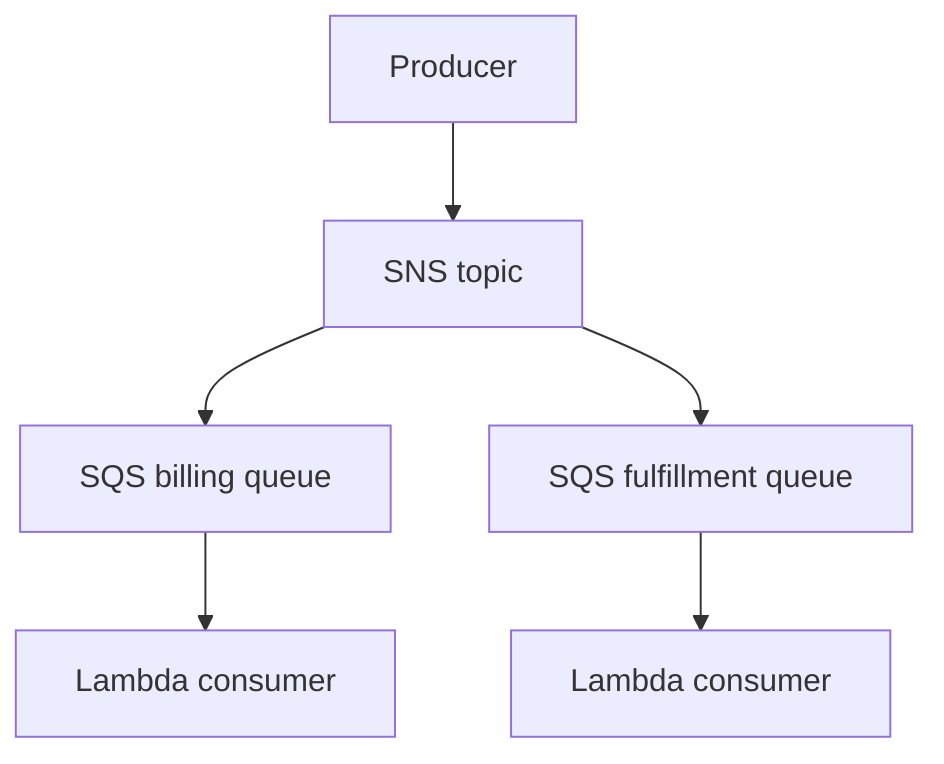

# Lab 12: SNS, SQS, and Lambda Fanout

## Business Scenario
Order events must fan out to billing and fulfillment services without blocking the producer during traffic spikes.

## Core Services
SNS, SQS, Lambda, DLQ

## Target Architecture


## Step-by-Step
1. Create the topic and subscribe two SQS queues.
2. Attach Lambda consumers to each queue.
3. Send a test message and watch the fanout behavior.

## CLI Commands
```bash
aws sns create-topic --name lab12-orders
aws sqs create-queue --queue-name lab12-billing
aws sns subscribe --topic-arn arn:aws:sns:ap-southeast-1:123456789012:lab12-orders --protocol sqs --notification-endpoint arn:aws:sqs:ap-southeast-1:123456789012:lab12-billing
aws lambda create-event-source-mapping --function-name lab12-billing --event-source-arn arn:aws:sqs:ap-southeast-1:123456789012:lab12-billing
```

## Expected Output
- The same event reaches both downstream consumers.
- Queue depth rises briefly and then drains.
- Lambda logs show one invocation per queue message.

## Failure Injection
Stop one consumer or send a poison message and confirm the DLQ catches the bad event without blocking the healthy queue.

## Decision Trade-offs
| Option | Best for | Strength | Weakness |
| --- | --- | --- | --- |
| SNS fanout | Broadcast | Simple publish/subscribe | No durable queue by itself. |
| SQS buffering | Backpressure | Durable and decoupled | Polling model. |
| EventBridge | Event routing | Rich filtering | Different delivery semantics. |

## Common Mistakes
- Forgetting the queue policy for SNS.
- Skipping the DLQ.
- Using a visibility timeout that is too short for the Lambda runtime.

## Exam Question
**Q:** Which service is the best fit when you must buffer bursts and avoid coupling producers to consumers?

**A:** SQS, because it stores messages durably and lets consumers process at their own pace.

## Cleanup
- Delete the queues and topic.
- Remove Lambda event source mappings.
- Clean up any DLQ messages used in the test.

