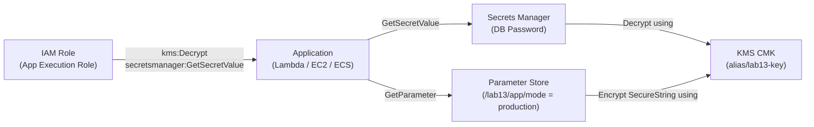

# Lab 13: KMS, Secrets Manager, and Parameter Store

## Metadata
- Difficulty: Intermediate
- Time estimate: 20–25 minutes
- Estimated cost: ~$1.40 (KMS Key ~$1/เดือน, Secrets Manager ~$0.40/เดือน)
- Prerequisites: None
- Depends on: None

## Learning Objectives
หลังจากทำ Lab นี้เสร็จ ผู้เรียนจะสามารถ:
- สร้าง KMS CMK (Customer Managed Key) พร้อม Alias
- เก็บ Secret (เช่น DB Password) ใน Secrets Manager โดยเข้ารหัสด้วย KMS
- เก็บ Configuration ที่ไม่ใช่ Secret ใน SSM Parameter Store
- สาธิตผลกระทบของการ Disable KMS Key ต่อการอ่าน Secret

## Business Scenario
แอปพลิเคชัน Production ต้องการระบบจัดการ Credentials ที่ปลอดภัย ไม่มีการ Hardcode Password ใน Code หรือ Environment File และต้องรองรับการหมุน (Rotate) รหัสผ่าน RDS โดยอัตโนมัติ

การฝัง Password ไว้ใน `.env` หรือ Docker Image ทำให้รหัสผ่านอาจรั่วไหลผ่าน Git History, Docker Registry หรือ Container Logs ได้

## Core Services
KMS, Secrets Manager, Systems Manager Parameter Store

## Target Architecture


## Environment Setup
```bash
# กำหนดค่าเหล่านี้ก่อนรันคำสั่งใดๆ ใน Lab นี้
export AWS_REGION=ap-southeast-1
export ACCOUNT_ID=$(aws sts get-caller-identity --query Account --output text)
export PROJECT_TAG=SAA-Lab-13
export SECRET_NAME="lab13-db-password"
export PARAM_NAME="/lab13/app/mode"
```

---

## Step-by-Step

### Phase 1 — สร้าง KMS Customer Managed Key

สร้าง KMS Key ที่เรากำหนดเองพร้อม Alias เพื่อให้ Secrets Manager และ Parameter Store ใช้เข้ารหัสข้อมูล

#### 🖥️ วิธีทำผ่าน AWS Console (GUI)

1. ไปที่ **KMS → Customer managed keys** → คลิก **Create key**
2. Key type: **Symmetric** → Key usage: **Encrypt and decrypt**
3. Alias: `lab13-key` → Description: `Lab 13 key`
4. Key administrators: เลือก IAM User/Role ของคุณ
5. Key users: เลือก IAM User/Role ที่แอปพลิเคชันใช้
6. Tag: `Project = SAA-Lab-13` → **Finish**

#### ⌨️ วิธีทำผ่าน CLI

```bash
KMS_KEY_ID=$(aws kms create-key \
  --description "Lab 13 key" \
  --tags TagKey=Project,TagValue=$PROJECT_TAG \
  --query 'KeyMetadata.KeyId' --output text)

aws kms create-alias \
  --alias-name alias/lab13-key \
  --target-key-id $KMS_KEY_ID

echo "KMS Key ID: $KMS_KEY_ID"
```

**Expected output:** KMS Key ID ถูกบันทึกในตัวแปร และ Alias `alias/lab13-key` ถูกสร้าง Key เริ่มต้นในสถานะ Enabled

---

### Phase 2 — เก็บ Secret และ Configuration

บันทึก DB Password ใน Secrets Manager (เข้ารหัสด้วย KMS) และค่า Config ทั่วไปใน Parameter Store

#### 🖥️ วิธีทำผ่าน AWS Console (GUI)

**Secrets Manager:**
1. ไปที่ **Secrets Manager → Secrets** → **Store a new secret**
2. Secret type: **Other type of secret**
3. Key/value: `password` = `supersecret_password_123!`
4. Encryption key: เลือก `alias/lab13-key`
5. Secret name: `lab13-db-password` → Tag: `Project = SAA-Lab-13` → **Store**

**Parameter Store:**
1. ไปที่ **Systems Manager → Parameter Store** → **Create parameter**
2. Name: `/lab13/app/mode` → Type: **String** → Value: `production`
3. Tag: `Project = SAA-Lab-13` → **Create parameter**

#### ⌨️ วิธีทำผ่าน CLI

```bash
# เก็บ Secret ด้วย Secrets Manager (เข้ารหัสด้วย KMS CMK)
aws secretsmanager create-secret \
  --name $SECRET_NAME \
  --secret-string "supersecret_password_123!" \
  --kms-key-id $KMS_KEY_ID \
  --tags Key=Project,Value=$PROJECT_TAG

# เก็บ Config ทั่วไปใน Parameter Store (ไม่ใช่ Secret)
aws ssm put-parameter \
  --name $PARAM_NAME \
  --type String \
  --value "production" \
  --overwrite \
  --tags "Key=Project,Value=$PROJECT_TAG"
```

**Expected output:** ทั้ง Secrets Manager และ Parameter Store คืนค่า JSON ยืนยันการสร้างสำเร็จ

---

### Phase 3 — ดึงข้อมูล Secret และ Parameter มาใช้งาน

จำลองการที่แอปพลิเคชันดึง Credentials และ Config มาใช้งาน

#### 🖥️ วิธีทำผ่าน AWS Console (GUI)

1. ไปที่ **Secrets Manager → lab13-db-password** → คลิก **Retrieve secret value**
2. ตรวจสอบว่าค่า `password` แสดงผลถูกต้อง
3. ไปที่ **Parameter Store → /lab13/app/mode** → ดู **Value** ที่แสดง

#### ⌨️ วิธีทำผ่าน CLI

```bash
# ดึง Secret จาก Secrets Manager
aws secretsmanager get-secret-value \
  --secret-id $SECRET_NAME \
  --query 'SecretString' --output text

# ดึง Parameter จาก Parameter Store
aws ssm get-parameter \
  --name $PARAM_NAME \
  --query 'Parameter.Value' --output text
```

**Expected output:** `supersecret_password_123!` และ `production` — แสดงให้เห็นว่าแอปพลิเคชันสามารถดึง Credentials ได้โดยไม่ต้อง Hardcode

---

## Failure Injection

Disable KMS Key แล้วพยายามอ่าน Secret เพื่อสังเกต `KMSDisabledException`

```bash
# Disable KMS Key
aws kms disable-key --key-id $KMS_KEY_ID

# พยายามอ่าน Secret (จะล้มเหลว)
aws secretsmanager get-secret-value --secret-id $SECRET_NAME
```

**What to observe:** คำสั่งล้มเหลวด้วย `DisabledException: ...is disabled` แสดงว่าข้อมูลในทุก Service ที่ใช้ KMS Key นี้จะไม่สามารถถอดรหัสได้ทันที — นี่คือการ Revoke Access ระดับ Key

**How to recover:**
```bash
aws kms enable-key --key-id $KMS_KEY_ID
```

---

## Decision Trade-offs

| ตัวเลือก | เหมาะกับ | ค่าใช้จ่าย | ภาระงาน (Ops) | Auto-rotate |
|---|---|---|---|---|
| Secrets Manager | DB Password, API Key ที่ต้องการ Rotation อัตโนมัติ | ~$0.40/secret/เดือน + API calls | ต่ำ | ✅ รองรับ (RDS, Redshift) |
| Parameter Store (SecureString) | Config ลับที่ไม่ต้องการ Rotation | ฟรีสำหรับ Standard | ต่ำ | ❌ ไม่มี Native Rotation |
| Parameter Store (String) | Config ทั่วไป เช่น URL, Mode | ฟรี | ต่ำมาก | N/A |
| KMS เท่านั้น | Encryption แบบ Custom ใน Application Code | ~$1/key/เดือน + API calls | สูง | ❌ จัดการเอง |

---

## Common Mistakes

- **Mistake:** เก็บ Password ใน Parameter Store แบบ `String` แทน `SecureString`
  **Why it fails:** Parameter Store แบบ String ไม่เข้ารหัส ทุกคนที่มีสิทธิ์อ่าน Parameter สามารถเห็นค่าได้โดยตรง ควรใช้ `SecureString` หรือ Secrets Manager แทน

- **Mistake:** ใช้ Parameter Store สำหรับ Auto-rotate RDS Password
  **Why it fails:** Parameter Store ไม่มี Native Integration กับ RDS หาก Rotate ต้องเขียน Lambda เอง ต่างจาก Secrets Manager ที่มี Built-in Rotation Lambda สำหรับ RDS

- **Mistake:** ลืมกำหนด `kms:Decrypt` ใน IAM Policy ของ Application Role
  **Why it fails:** แม้จะมีสิทธิ์อ่าน Secret ผ่าน Secrets Manager แต่ KMS จะปฏิเสธการ Decrypt ด้วย `AccessDeniedException`

- **Mistake:** Hardcode Password ลงใน Source Code หรือ Dockerfile
  **Why it fails:** Git history เก็บทุกสิ่ง Password ที่เคย Commit จะมองเห็นได้ตลอดไปแม้จะถูกลบแล้ว

- **Mistake:** ลบ KMS Key ใน Production โดยไม่ระวัง
  **Why it fails:** ข้อมูลทั้งหมดที่เข้ารหัสด้วย Key นั้นจะไม่สามารถถอดรหัสได้อีกเลย AWS มี Pending Deletion Period (7-30 วัน) เพื่อป้องกันกรณีนี้

---

## Exam Questions

**Q1:** AWS Service ใดที่รองรับการ Rotate รหัสผ่าน Amazon RDS โดยอัตโนมัติโดยไม่ต้องเขียน Code เพิ่มเติม?
**A:** AWS Secrets Manager
**Rationale:** Secrets Manager มี Built-in Lambda สำหรับ Rotation กับ RDS, Aurora, Redshift และ DocumentDB สามารถกำหนด Rotation Schedule ได้โดยตรงใน Console

**Q2:** หาก KMS Key ถูก Schedule Deletion แต่ต้องการยกเลิกการลบ ยังสามารถทำได้หรือไม่?
**A:** ได้ ตราบใดที่ Key ยังอยู่ในช่วง Pending Deletion (7-30 วัน) สามารถ Cancel Deletion ได้
**Rationale:** KMS Key ไม่ถูกลบทันที AWS ให้ Pending Window เพื่อป้องกันการลบโดยบังเอิญ ระหว่างนี้ Key ยังไม่สามารถถอดรหัสได้ แต่ยังไม่ถูกทำลาย

---

## Cleanup (เรียงลำดับตามนี้เท่านั้น — ห้ามข้ามขั้นตอน)

```bash
# Step 1 — ลบ Secret (AWS บังคับ Pending Window 7 วันขั้นต่ำ)
aws secretsmanager delete-secret \
  --secret-id $SECRET_NAME \
  --recovery-window-in-days 7

# Step 2 — ลบ SSM Parameter
aws ssm delete-parameter --name $PARAM_NAME

# Step 3 — Schedule ลบ KMS Key และ Alias (ต้องรออีก 7 วัน)
aws kms delete-alias --alias-name alias/lab13-key
aws kms schedule-key-deletion \
  --key-id $KMS_KEY_ID \
  --pending-window-in-days 7

# Step 4 — ตรวจสอบ
aws ssm get-parameter --name $PARAM_NAME 2>&1 || echo "✅ Parameter ถูกลบแล้ว"
aws kms describe-key --key-id $KMS_KEY_ID \
  --query 'KeyMetadata.{State:KeyState,DeletionDate:DeletionDate}'
```

**Cost check:** KMS Key มีค่าบริการ $1/เดือน ตรวจสอบว่า Key ถูก Schedule ลบแล้ว:
```bash
aws kms list-keys \
  --query "Keys[*].KeyId" --output table
```
