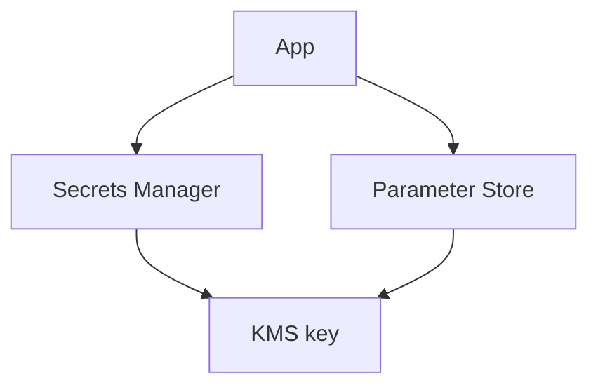

# Lab 13: KMS, Secrets Manager, and Parameter Store

## Business Scenario
An application needs a rotated database password and a secure place for non-secret configuration values.

## Core Services
KMS, Secrets Manager, Systems Manager Parameter Store

## Target Architecture


## Step-by-Step
1. Create a customer-managed KMS key.
2. Store a database secret and a plain configuration parameter.
3. Deny decrypt permission and prove access fails cleanly.

## CLI Commands
```bash
aws kms create-key --description "Lab 13 key"
aws secretsmanager create-secret --name lab13-db --secret-string "supersecret"
aws ssm put-parameter --name /lab13/app/mode --type String --value "prod" --overwrite
aws secretsmanager get-secret-value --secret-id lab13-db
```

## Expected Output
- Secrets Manager returns the secret only with permission.
- Parameter Store holds the non-secret value.
- KMS key usage is visible in CloudTrail or key metadata.

## Failure Injection
Remove `kms:Decrypt` or `secretsmanager:GetSecretValue` from the role and confirm access is denied immediately.

## Decision Trade-offs
| Option | Best for | Strength | Weakness |
| --- | --- | --- | --- |
| Secrets Manager | Rotating secrets | Managed rotation | More expensive. |
| Parameter Store | Config values | Cheap and simple | Not ideal for rotating secrets. |
| KMS only | Key control | Central encryption | Does not store the secret itself. |

## Common Mistakes
- Storing secrets in environment variables or plaintext files.
- Using Parameter Store for a rotating DB password when rotation is required.
- Forgetting that the KMS key policy also matters.

## Exam Question
**Q:** Which AWS service is designed for rotating application secrets such as database passwords?

**A:** Secrets Manager, because it is purpose-built for secret storage and rotation.

## Cleanup
- Delete the secret and parameter.
- Schedule the KMS key for deletion if it was lab-only.
- Remove any IAM permissions created for the test.

