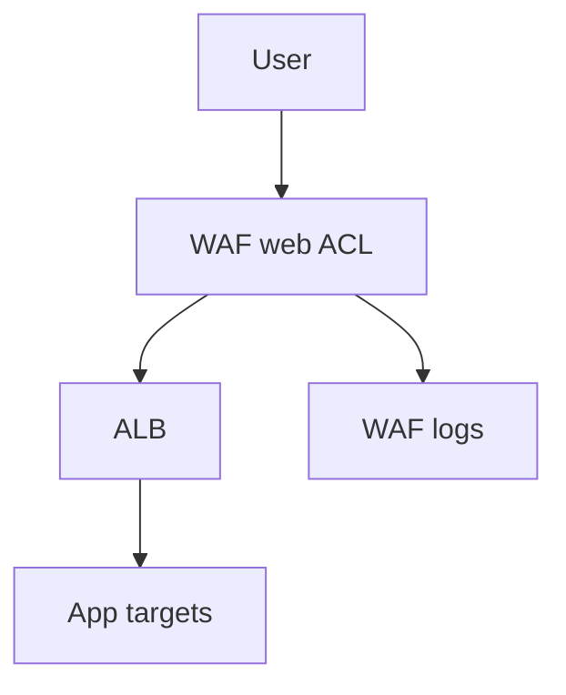

# Lab 14: WAF, ALB, and Shield

## Business Scenario
A public web app needs layer-7 request filtering and a clear place to test how blocked traffic looks to the user.

## Core Services
WAF, ALB, Shield

## Target Architecture


## Step-by-Step
1. Create a web ACL with a blocking rule.
2. Associate the ACL with the ALB.
3. Send a request that matches the rule and confirm the block.

## CLI Commands
```bash
aws wafv2 create-web-acl --scope REGIONAL --name lab14-acl --default-action Allow={}
aws wafv2 put-web-acl-association --web-acl-arn arn:aws:wafv2:ap-southeast-1:123456789012:regional/webacl/lab14-acl/... --resource-arn arn:aws:elasticloadbalancing:ap-southeast-1:123456789012:loadbalancer/app/lab14-alb/...
curl -H "User-Agent: sqlmap" https://lab14.example.com
```

## Expected Output
- Matched requests return HTTP 403 or the configured block response.
- Allowed traffic continues through the ALB normally.
- WAF logs show the rule that matched.

## Failure Injection
Send a request that matches the block rule and confirm the ACL, not the application, is the component rejecting it.

## Decision Trade-offs
| Option | Best for | Strength | Weakness |
| --- | --- | --- | --- |
| WAF | L7 filtering | Fine-grained rules | Not a full network firewall. |
| SG | Network allow lists | Simple | No HTTP-aware rules. |
| Shield Advanced | DDoS protection | Strong managed defense | Primarily for large public workloads. |

## Common Mistakes
- Expecting WAF to replace security groups.
- Writing overly broad or incorrectly ordered rules.
- Forgetting to enable logging on the ACL.

## Exam Question
**Q:** Which service blocks HTTP layer attacks such as SQL injection on an ALB?

**A:** AWS WAF, because it inspects web requests at layer 7 and can match patterns or managed rules.

## Cleanup
- Disassociate the web ACL from the ALB.
- Delete the ACL and test rules.
- Remove any log delivery resources created for the lab.

