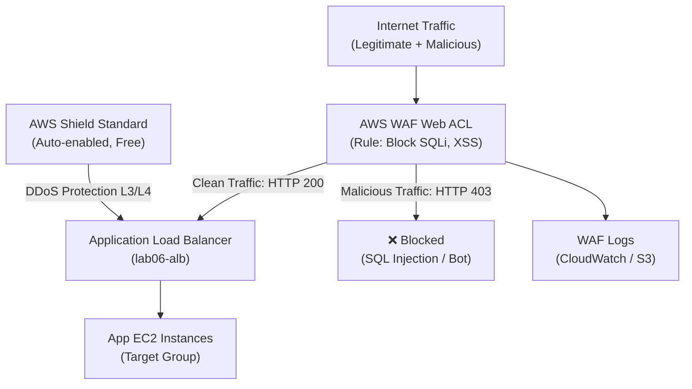

# Lab 14: WAF, ALB, and Shield

## Metadata
- Difficulty: Intermediate
- Time estimate: 20–30 minutes
- Estimated cost: ~$6.00 (WAF Web ACL $5/เดือน + Rule $1/เดือน)
- Prerequisites: Lab 06 (ALB and Auto Scaling)
- Depends on: Lab 06

## Learning Objectives
หลังจากทำ Lab นี้เสร็จ ผู้เรียนจะสามารถ:
- สร้าง AWS WAF Web ACL พร้อม Rule สำหรับ Block SQL Injection
- ผูก Web ACL เข้ากับ Application Load Balancer
- ทดสอบว่า Request ที่มี SQL Injection Pattern ถูก Block (HTTP 403)
- อธิบายความแตกต่างระหว่าง WAF, Security Group และ Shield

## Business Scenario
แอปพลิเคชัน Web แบบ Public ถูก Bot พยายามโจมตีด้วย SQL Injection และ XSS อย่างต่อเนื่อง Security Group ปกติทำงานที่ Layer 4 ไม่สามารถอ่านและตรวจสอบเนื้อหา HTTP Request ได้ ทำให้ต้องการ WAF เพื่อป้องกันที่ Layer 7

## Core Services
WAF, ALB, Shield

## Target Architecture


## Environment Setup
```bash
# กำหนดค่าเหล่านี้ก่อนรันคำสั่งใดๆ ใน Lab นี้
export AWS_REGION=ap-southeast-1
export ACCOUNT_ID=$(aws sts get-caller-identity --query Account --output text)
export PROJECT_TAG=SAA-Lab-14
export ACL_NAME="lab14-acl"

# ใช้ ALB จาก Lab 06 (ต้องมีอยู่แล้ว)
export ALB_ARN=$(aws elbv2 describe-load-balancers \
  --query 'LoadBalancers[?LoadBalancerName==`lab06-alb`].LoadBalancerArn' \
  --output text)
echo "ALB ARN: $ALB_ARN"
```

---

## Step-by-Step

### Phase 1 — สร้าง WAF Web ACL พร้อม SQL Injection Rule

สร้าง Web ACL ที่มี Default Action เป็น Allow แต่มี Rule Block SQL Injection สำหรับทุก Query Parameters

#### 🖥️ วิธีทำผ่าน AWS Console (GUI)

1. ไปที่ **WAF & Shield → Web ACLs** → คลิก **Create web ACL**
2. กำหนดค่า:
   - Name: `lab14-acl`
   - Region: `ap-southeast-1` (เพราะใช้กับ ALB)
   - Resource type: **Regional resources**
3. Associated AWS resources: เพิ่ม ALB `lab06-alb`
4. Add rules → **Add my own rules and rule groups** → **Rule builder**:
   - Name: `BlockSQLInjection`
   - Type: **Regular rule**
   - Statement: **SQL injection attack** → Field: **All query arguments**
   - Text transformation: **URL decode**
   - Action: **Block**
   - Priority: 1
5. Default action: **Allow**
6. คลิก **Create web ACL**

#### ⌨️ วิธีทำผ่าน CLI

```bash
cat <<'EOF' > rule.json
[
  {
    "Name": "BlockSQLInjection",
    "Priority": 1,
    "Statement": {
      "SqliMatchStatement": {
        "FieldToMatch": {"AllQueryArguments": {}},
        "TextTransformations": [
          {"Priority": 0, "Type": "URL_DECODE"}
        ]
      }
    },
    "Action": {"Block": {}},
    "VisibilityConfig": {
      "SampledRequestsEnabled": true,
      "CloudWatchMetricsEnabled": true,
      "MetricName": "BlockSQLInjectionRule"
    }
  }
]
EOF

WEB_ACL_ARN=$(aws wafv2 create-web-acl \
  --name $ACL_NAME \
  --scope REGIONAL \
  --default-action Allow={} \
  --visibility-config SampledRequestsEnabled=true,CloudWatchMetricsEnabled=true,MetricName=$ACL_NAME \
  --rules file://rule.json \
  --tags Key=Project,Value=$PROJECT_TAG \
  --query 'Summary.ARN' \
  --output text)
echo "Web ACL ARN: $WEB_ACL_ARN"
```

**Expected output:** Web ACL ARN ถูกบันทึกในตัวแปร

---

### Phase 2 — ผูก Web ACL เข้ากับ ALB

เชื่อม WAF Web ACL กับ ALB เพื่อให้ Traffic ทุก Request ผ่านการตรวจสอบก่อนถึง Instance

#### 🖥️ วิธีทำผ่าน AWS Console (GUI)

1. ไปที่ Web ACL `lab14-acl` → แท็บ **Associated AWS resources**
2. คลิก **Add AWS resources** → เลือก `lab06-alb` → **Add**

#### ⌨️ วิธีทำผ่าน CLI

```bash
aws wafv2 associate-web-acl \
  --web-acl-arn $WEB_ACL_ARN \
  --resource-arn $ALB_ARN
```

**Expected output:** คำสั่งสำเร็จโดยไม่มี Error จากนี้ไป Traffic ทุก Request ที่เข้า ALB จะผ่าน WAF ก่อน

---

### Phase 3 — ทดสอบ Block SQL Injection

ตรวจสอบว่า Request ปกติผ่าน แต่ Request ที่มี SQL Injection Pattern ถูก Block

#### 🖥️ วิธีทำผ่าน AWS Console (GUI)

1. ไปที่ **WAF → lab14-acl → Sampled requests** เพื่อดู Request ที่ถูก Sample
2. ชื่อ Rule `BlockSQLInjection` แสดง Count = 0 จนกว่าจะมีการส่ง SQLi Request

#### ⌨️ วิธีทำผ่าน CLI

```bash
# รับ DNS ของ ALB
ALB_DNS=$(aws elbv2 describe-load-balancers \
  --load-balancer-arns $ALB_ARN \
  --query 'LoadBalancers[0].DNSName' --output text)

# ทดสอบ Request ปกติ — ควรได้ HTTP 200
curl -Is http://$ALB_DNS/ | grep "HTTP/"

# ทดสอบ SQL Injection Pattern — ควรได้ HTTP 403
curl -Is "http://$ALB_DNS/login?user=1'%20OR%20'1'='1" | grep "HTTP/"
```

**Expected output:**
- Request ปกติ: `HTTP/1.1 200 OK`
- Request SQLi: `HTTP/1.1 403 Forbidden`

---

## Failure Injection

เปลี่ยน Default Action ของ Web ACL เป็น Block เพื่อสังเกตว่าทุก Request ถูกปฏิเสธทันที

```bash
# ดึง Lock Token (จำเป็นสำหรับการ Update WAF)
ACL_ID=$(aws wafv2 list-web-acls \
  --scope REGIONAL \
  --query "WebACLs[?Name=='$ACL_NAME'].Id" --output text)
LOCK_TOKEN=$(aws wafv2 get-web-acl \
  --name $ACL_NAME --scope REGIONAL --id $ACL_ID \
  --query 'LockToken' --output text)

echo "ACL ID: $ACL_ID, Lock Token: $LOCK_TOKEN"
echo "Concept: If Default Action = Block, ALL requests get HTTP 403"
```

**What to observe:** หากเปลี่ยน Default Action เป็น Block ผู้ใช้ทุกคนจะได้รับ `403 Forbidden` ทันที — เหตุการณ์นี้เรียกว่า False Positive ซึ่งมีผลกระทบรุนแรงต่อ Business

**How to recover:** เปลี่ยน Default Action กลับเป็น Allow หรือ Set Rule ให้เป็น Count Mode ก่อน Deploy จริง

---

## Decision Trade-offs

| ตัวเลือก | เหมาะกับ | ประสิทธิภาพ | ค่าใช้จ่าย | ภาระงาน (Ops) |
|---|---|---|---|---|
| AWS WAF | Block SQLi, XSS, Bot, IP Rate Limit (L7) | ดี (HTTP/HTTPS) | ~$5/ACL + $1/Rule/เดือน | ปานกลาง (ต้อง Tune Rules, Monitor False Positives) |
| Security Group | Block IP, Port (L3/L4) | สูงมาก | ฟรี | ต่ำมาก |
| Shield Standard | DDoS L3/L4 (Auto-enabled) | ดีสำหรับ Volumetric | ฟรี (Auto) | ไม่มี |
| Shield Advanced | DDoS ขนาดใหญ่ + WAF Support + 24/7 DRT | สูงสุด | $3,000/เดือน | ต่ำ (AWS Managed) |

---

## Common Mistakes

- **Mistake:** คิดว่า WAF ป้องกัน Traffic ที่ไม่ใช่ HTTP/HTTPS
  **Why it fails:** WAF ทำงานที่ Layer 7 (HTTP/HTTPS) บน ALB, CloudFront, API Gateway และ AppSync เท่านั้น การโจมตี SSH, RDP หรือ Protocol อื่นๆ ไม่ได้รับการป้องกันจาก WAF

- **Mistake:** Deploy Rule ใหม่ใน Block Mode โดยไม่ทดสอบ Count Mode ก่อน
  **Why it fails:** Rule อาจมี False Positive — Block Request ของผู้ใช้จริงซึ่งส่งผลเสียต่อ Business ควรตั้ง Rule เป็น Count Mode ก่อนแล้วดู Metrics สักช่วงก่อน Switch เป็น Block

- **Mistake:** สร้าง WAF แต่ลืม Associate กับ Resource
  **Why it fails:** WAF ที่ไม่ Associate กับ ALB, CloudFront หรือ API Gateway ใดๆ จะไม่ทำงานเลย แม้จะถูกสร้างแล้วก็ตาม แต่ยังเสียค่าใช้จ่ายอยู่

- **Mistake:** ใช้ WAF กับ CloudFront แต่เลือก Scope: REGIONAL แทน CLOUDFRONT
  **Why it fails:** CloudFront WAF ต้องใช้ Scope: `CLOUDFRONT` และต้องสร้างใน Region `us-east-1` เท่านั้น หากสร้างใน Region อื่นจะไม่สามารถ Associate กับ CloudFront ได้

- **Mistake:** คิดว่า WAF ป้องกัน DDoS ระดับ Volumetric ได้ครบ
  **Why it fails:** WAF ป้องกัน Application-level Attacks แต่สำหรับ Volumetric DDoS (เช่น SYN Flood ขนาด 100 Gbps) ต้องใช้ Shield Standard (ฟรี Auto) หรือ Shield Advanced

---

## Exam Questions

**Q1:** จะป้องกัน ALB จาก SQL Injection และ Cross-Site Scripting ควรใช้ AWS Service ใด?
**A:** AWS WAF (Web Application Firewall)
**Rationale:** WAF ทำงานที่ Layer 7 อ่านและตรวจสอบเนื้อหา HTTP Request รองรับ Managed Rules สำหรับ SQLi, XSS, Bot Control รวมถึง IP-based Rate Limit ซึ่ง Security Group ไม่สามารถทำได้

**Q2:** AWS Shield ระดับใดที่เปิดใช้งานอัตโนมัติสำหรับทุก AWS Account โดยไม่มีค่าใช้จ่ายเพิ่มเติม?
**A:** AWS Shield Standard
**Rationale:** Shield Standard เปิดใช้งานอัตโนมัติให้กับทุก AWS Account ป้องกัน DDoS L3/L4 เช่น SYN/UDP Floods โดยไม่มีค่าใช้จ่าย Shield Advanced ($3,000/เดือน) เพิ่มความสามารถอีกระดับ

---

## Cleanup (เรียงลำดับตามนี้เท่านั้น — ห้ามข้ามขั้นตอน)

```bash
# Step 1 — ถอด WAF Association ออกจาก ALB ก่อน
aws wafv2 disassociate-web-acl --resource-arn $ALB_ARN

# Step 2 — หา Lock Token แล้วลบ Web ACL
ACL_ID=$(aws wafv2 list-web-acls \
  --scope REGIONAL \
  --query "WebACLs[?Name=='$ACL_NAME'].Id" --output text)
LOCK_TOKEN=$(aws wafv2 get-web-acl \
  --name $ACL_NAME --scope REGIONAL --id $ACL_ID \
  --query 'LockToken' --output text)
aws wafv2 delete-web-acl \
  --name $ACL_NAME --scope REGIONAL --id $ACL_ID --lock-token $LOCK_TOKEN

# Step 3 — ตรวจสอบว่าลบเรียบร้อยแล้ว
aws wafv2 list-web-acls \
  --scope REGIONAL \
  --query "WebACLs[?Name=='$ACL_NAME']" --output table || echo "✅ Web ACL ถูกลบเรียบร้อย"
```

**Cost check:** WAF เก็บค่าบริการรายเดือน ตรวจสอบว่าไม่มี Web ACL ที่ค้างอยู่:
```bash
aws wafv2 list-web-acls \
  --scope REGIONAL \
  --query 'WebACLs[*].{Name:Name,ARN:ARN}' --output table
```
