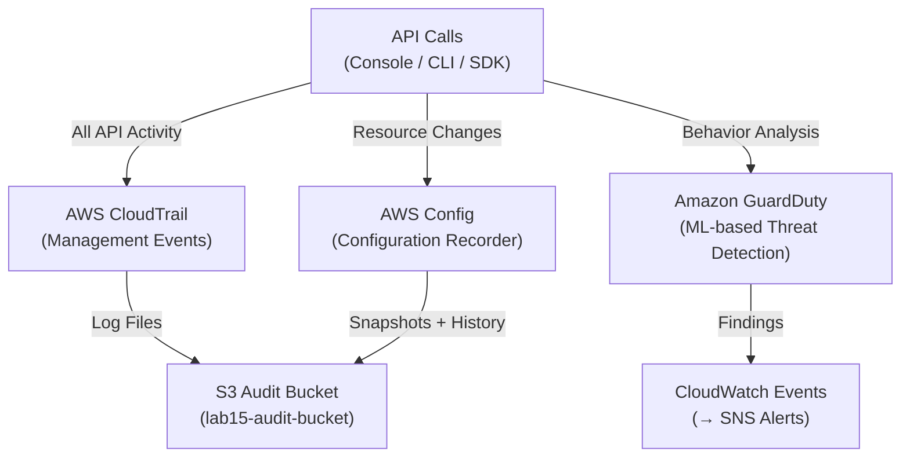

# Lab 15: CloudTrail, Config, and GuardDuty

## Metadata
- Difficulty: Intermediate
- Time estimate: 20–30 minutes
- Estimated cost: ~$1.00 (AWS Config Rules มีค่าบริการต่อ Configuration Item)
- Prerequisites: None
- Depends on: None

## Learning Objectives
หลังจากทำ Lab นี้เสร็จ ผู้เรียนจะสามารถ:
- สร้าง CloudTrail Trail และกำหนด S3 Bucket Policy ที่ถูกต้อง
- เปิดใช้งาน AWS Config Recorder เพื่อติดตาม Configuration Changes
- เปิดใช้งาน GuardDuty และเข้าใจว่ามันตรวจจับอะไร
- อธิบายความแตกต่างระหว่าง Detective Controls และ Preventive Controls

## Business Scenario
ทีม Security Governance ต้องการระบบที่บันทึกประวัติ API Call ทุกรายการ ตรวจจับ Configuration Drift และแจ้งเตือนเมื่อเกิดพฤติกรรมน่าสงสัยในบัญชี AWS

หากไม่มีสามบริการนี้ เมื่อเกิด Security Incident จะไม่มีข้อมูลสำหรับสืบสวน ทำให้ไม่รู้ว่าใครทำอะไร ที่ไหน เมื่อไหร่

## Core Services
CloudTrail, AWS Config, GuardDuty, S3

## Target Architecture


## Environment Setup
```bash
# กำหนดค่าเหล่านี้ก่อนรันคำสั่งใดๆ ใน Lab นี้
export AWS_REGION=ap-southeast-1
export ACCOUNT_ID=$(aws sts get-caller-identity --query Account --output text)
export PROJECT_TAG=SAA-Lab-15
export BUCKET_NAME="lab15-audit-bucket-${ACCOUNT_ID}-${RANDOM}"
export TRAIL_NAME="lab15-trail"
export RECORDER_NAME="lab15-recorder"
```

---

## Step-by-Step

### Phase 1 — สร้าง CloudTrail และ S3 Log Bucket

สร้าง S3 Bucket พร้อม Bucket Policy ที่อนุญาตให้ CloudTrail เขียน Log จากนั้นเปิด Trail และเริ่มบันทึก

#### 🖥️ วิธีทำผ่าน AWS Console (GUI)

1. ไปที่ **S3 → Create bucket** → ชื่อ `lab15-audit-<accountid>` → Region: `ap-southeast-1`
2. ปิด Public access ทุกตัว → **Create bucket**
3. ไปที่ **Permissions → Bucket policy** → เพิ่ม Policy ที่อนุญาต CloudTrail:
   ```json
   {"Effect":"Allow","Principal":{"Service":"cloudtrail.amazonaws.com"},
    "Action":["s3:GetBucketAcl","s3:PutObject"],
    "Resource":["arn:aws:s3:::lab15-audit-...","arn:aws:s3:::lab15-audit-.../AWSLogs/..."]}
   ```
4. ไปที่ **CloudTrail → Create trail**:
   - Name: `lab15-trail` → Storage location: `lab15-audit-<accountid>`
   - Multi-region trail: **เปิด** → **Create trail**

#### ⌨️ วิธีทำผ่าน CLI

```bash
# สร้าง S3 Bucket
aws s3api create-bucket \
  --bucket $BUCKET_NAME \
  --region $AWS_REGION \
  --create-bucket-configuration LocationConstraint=$AWS_REGION

# กำหนด Bucket Policy ให้ CloudTrail บันทึก Log ได้
cat <<EOF > bucket-policy.json
{
  "Version": "2012-10-17",
  "Statement": [
    {
      "Sid": "AWSCloudTrailAclCheck",
      "Effect": "Allow",
      "Principal": {"Service": "cloudtrail.amazonaws.com"},
      "Action": "s3:GetBucketAcl",
      "Resource": "arn:aws:s3:::$BUCKET_NAME"
    },
    {
      "Sid": "AWSCloudTrailWrite",
      "Effect": "Allow",
      "Principal": {"Service": "cloudtrail.amazonaws.com"},
      "Action": "s3:PutObject",
      "Resource": "arn:aws:s3:::$BUCKET_NAME/AWSLogs/$ACCOUNT_ID/*",
      "Condition": {"StringEquals": {"s3:x-amz-acl": "bucket-owner-full-control"}}
    }
  ]
}
EOF
aws s3api put-bucket-policy --bucket $BUCKET_NAME --policy file://bucket-policy.json

# สร้าง Trail และเริ่มบันทึก
aws cloudtrail create-trail \
  --name $TRAIL_NAME \
  --s3-bucket-name $BUCKET_NAME \
  --is-multi-region-trail \
  --tags-list Key=Project,Value=$PROJECT_TAG
aws cloudtrail start-logging --name $TRAIL_NAME
```

**Expected output:** Trail ถูกสร้างและสถานะ Logging = `true`

---

### Phase 2 — เปิดใช้งาน AWS Config

เปิด Config Recorder เพื่อบันทึกการเปลี่ยนแปลง Configuration ของทุก Resource ใน Account

#### 🖥️ วิธีทำผ่าน AWS Console (GUI)

1. ไปที่ **AWS Config → Get started**
2. เลือก **Record all resources** → S3 Bucket: เลือก `lab15-audit-<accountid>`
3. IAM Role: ให้ AWS สร้าง Service-Linked Role อัตโนมัติ
4. คลิก **Next → Confirm**

#### ⌨️ วิธีทำผ่าน CLI

```bash
# สร้าง Service-Linked Role หรือใช้ Role ที่มีอยู่
ROLE_ARN=$(aws iam create-service-linked-role \
  --aws-service-name config.amazonaws.com \
  --query 'Role.Arn' --output text 2>/dev/null || \
  aws iam get-role --role-name AWSServiceRoleForConfig \
  --query 'Role.Arn' --output text)

# ตั้งค่า Config Recorder
aws configservice put-configuration-recorder \
  --configuration-recorder name=$RECORDER_NAME,roleARN=$ROLE_ARN

# ตั้งค่า Delivery Channel ส่ง Snapshot ไปยัง S3
aws configservice put-delivery-channel \
  --delivery-channel name=default,s3BucketName=$BUCKET_NAME

# เริ่มบันทึก
aws configservice start-configuration-recorder \
  --configuration-recorder-name $RECORDER_NAME
```

**Expected output:** Config Recorder สถานะ `recording: true` จะเริ่ม Snapshot Resource ปัจจุบันและ Track การเปลี่ยนแปลงต่อไป

---

### Phase 3 — เปิดใช้งาน GuardDuty

เปิด GuardDuty Detector เพื่อเริ่มวิเคราะห์พฤติกรรมน่าสงสัยโดยใช้ Machine Learning

#### 🖥️ วิธีทำผ่าน AWS Console (GUI)

1. ไปที่ **GuardDuty → Get started**
2. คลิก **Enable GuardDuty**
3. สังเกต **Findings** (จะแสดง Demo Findings ใน 15-20 นาทีหากมีกิจกรรม)

#### ⌨️ วิธีทำผ่าน CLI

```bash
DETECTOR_ID=$(aws guardduty create-detector \
  --enable \
  --tags Key=Project,Value=$PROJECT_TAG \
  --query 'DetectorId' --output text)

# ตรวจสอบสถานะ
aws guardduty get-detector --detector-id $DETECTOR_ID \
  --query '{Status:Status,CreatedAt:CreatedAt}'
```

**Expected output:** Detector สถานะ `ENABLED` GuardDuty จะเริ่มวิเคราะห์ CloudTrail, VPC Flow Logs และ DNS Logs โดยอัตโนมัติ

---

## Failure Injection

ปิด CloudTrail แล้วตรวจสอบว่ามีร่องรอยการปิดบันทึกใน CloudTrail Event History

```bash
aws cloudtrail stop-logging --name $TRAIL_NAME
sleep 5

# ตรวจสอบ Event ที่เพิ่งเกิดขึ้น
aws cloudtrail lookup-events \
  --lookup-attributes AttributeKey=EventName,AttributeValue=StopLogging \
  --query 'Events[*].{Time:EventTime,User:Username,Action:EventName}'
```

**What to observe:** แม้ Trail จะถูกปิด แต่ Event `StopLogging` ยังถูกบันทึกไว้ได้เพราะ CloudTrail มีกลไกพิเศษรักษา Management Events — GuardDuty จะสร้าง Finding `AWS Account became root` หรือ `CloudTrail logging disabled` ขึ้นมาด้วย

**How to recover:**
```bash
aws cloudtrail start-logging --name $TRAIL_NAME
```

---

## Decision Trade-offs

| บริการ | เหมาะกับ | บันทึกอะไร | ค่าใช้จ่าย |
|---|---|---|---|
| CloudTrail | "ใครทำอะไร ที่ไหน เมื่อไหร่" | API Calls + Management Events | ฟรี 90 วัน, เสียค่า S3 Storage |
| AWS Config | "Resource เปลี่ยนแปลงอย่างไรเมื่อเวลา" | Configuration Snapshots + History | $0.003 ต่อ Configuration Item |
| GuardDuty | "มีพฤติกรรมน่าสงสัยไหม" | Threat Intelligence Analysis | คิดตาม Volume ของ Log ที่วิเคราะห์ |

---

## Common Mistakes

- **Mistake:** สับสนระหว่าง Detective Controls (CloudTrail, Config) กับ Preventive Controls (IAM Policy, SCP)
  **Why it fails:** CloudTrail บันทึกว่าใครลบ DB แต่ไม่ "ป้องกัน" การลบ ต้องใช้ IAM/SCPs เพื่อป้องกัน ใช้ CloudTrail เพื่อตรวจสอบหลังเหตุการณ์

- **Mistake:** ลืมกำหนด Bucket Policy ให้ CloudTrail เขียน Log ได้
  **Why it fails:** CloudTrail จะแสดง Warning แต่ Log ไฟล์จะไม่ถูกบันทึกลง S3 ทำให้ไม่มีประวัติให้ตรวจสอบ

- **Mistake:** เปิด Trail เฉพาะ Region ที่ใช้งานหลัก
  **Why it fails:** ถ้าผู้ไม่หวังดีสร้าง Resource ใน Region อื่น (เช่น `af-south-1`) ที่ไม่ได้ Monitor Trail จะไม่มีบันทึกการกระทำนั้น ควรเปิด Multi-Region Trail เสมอ

- **Mistake:** ปล่อย Log S3 ไว้โดยไม่มีการป้องกัน
  **Why it fails:** ผู้โจมตีที่ได้รับ Admin Access จะลบ Log ออกก่อนเพื่อทำลายหลักฐาน ควรเปิด S3 Object Lock และ MFA Delete

---

## Exam Questions

**Q1:** ต้องการทราบว่า 3 วันที่แล้ว ใครเป็นคนเปิด Port 22 ใน Security Group ควรใช้ Service ใด?
**A:** AWS CloudTrail (เพื่อหาว่าใครทำ API Call) คู่กับ AWS Config (เพื่อดู Configuration Timeline)
**Rationale:** CloudTrail บันทึก API Call `AuthorizeSecurityGroupIngress` พร้อมข้อมูล User และ Time ส่วน Config แสดง Timeline ของ Security Group Configuration ที่เปลี่ยนแปลง

**Q2:** EC2 Instance ของคุณมีการสื่อสารกับ IP ที่มีประวัติเป็น Command & Control Server บริการใดจะตรวจพบและแจ้งเตือนโดยอัตโนมัติ?
**A:** Amazon GuardDuty
**Rationale:** GuardDuty วิเคราะห์ VPC Flow Logs, CloudTrail และ DNS Queries เปรียบเทียบกับ Threat Intelligence Feeds หากพบ Communication กับ Malicious IP จะสร้าง Finding โดยอัตโนมัติ

---

## Cleanup (เรียงลำดับตามนี้เท่านั้น — ห้ามข้ามขั้นตอน)

```bash
# Step 1 — ลบ GuardDuty Detector
aws guardduty delete-detector --detector-id $DETECTOR_ID

# Step 2 — หยุดและลบ Config Recorder
aws configservice stop-configuration-recorder \
  --configuration-recorder-name $RECORDER_NAME
aws configservice delete-delivery-channel \
  --delivery-channel-name default
aws configservice delete-configuration-recorder \
  --configuration-recorder-name $RECORDER_NAME

# Step 3 — ลบ CloudTrail
aws cloudtrail delete-trail --name $TRAIL_NAME

# Step 4 — ลบ S3 Bucket (ต้องลบ Objects ก่อน)
aws s3 rm s3://$BUCKET_NAME --recursive
aws s3api delete-bucket --bucket $BUCKET_NAME

# Step 5 — ตรวจสอบว่าลบเรียบร้อยแล้ว
aws cloudtrail describe-trails \
  --query "trailList[?Name=='$TRAIL_NAME']" --output table || echo "✅ Trail ถูกลบแล้ว"
```

**Cost check:** AWS Config เก็บค่าบริการต่อ Configuration Item ตรวจสอบว่า Recorder หยุดทำงาน:
```bash
aws configservice describe-configuration-recorder-status \
  --configuration-recorder-names $RECORDER_NAME \
  --query 'ConfigurationRecordersStatus[*].{Name:name,Recording:recording}'
```
