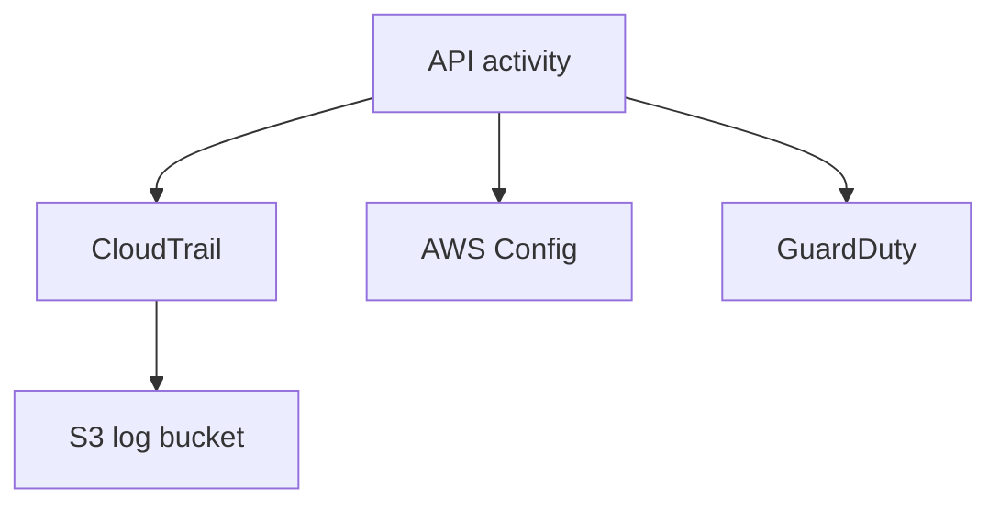

# Lab 15: CloudTrail, Config, and GuardDuty

## Business Scenario
A governance team wants to record API activity, detect configuration drift, and surface suspicious behavior in one lab.

## Core Services
CloudTrail, AWS Config, GuardDuty, S3

## Target Architecture


## Step-by-Step
1. Create a trail that sends events to S3.
2. Enable AWS Config recording for the selected resources.
3. Turn on GuardDuty and inspect a finding after a test action.

## CLI Commands
```bash
aws cloudtrail create-trail --name lab15-trail --s3-bucket-name lab15-audit-bucket
aws configservice put-configuration-recorder --configuration-recorder name=lab15-recorder,roleARN=arn:aws:iam::123456789012:role/Lab15ConfigRole
aws guardduty create-detector --enable
aws cloudtrail lookup-events --lookup-attributes AttributeKey=EventName,AttributeValue=DeleteTrail
```

## Expected Output
- CloudTrail records the API call history.
- Config shows configuration history or noncompliance.
- GuardDuty detector is enabled and ready to emit findings.

## Failure Injection
Attempt an unusual action and confirm it is captured in CloudTrail and surfaced by the detective controls.

## Decision Trade-offs
| Option | Best for | Strength | Weakness |
| --- | --- | --- | --- |
| CloudTrail | API audit trail | Strong event history | Not a preventive control. |
| Config | Drift tracking | Configuration timelines | Not threat detection. |
| GuardDuty | Threat findings | Managed detection | Needs other logs and signals. |

## Common Mistakes
- Not enabling the trail in every account that matters.
- Confusing detective controls with preventive controls.
- Forgetting the S3 bucket policy for CloudTrail delivery.

## Exam Question
**Q:** Which service records AWS API activity for audit and investigation?

**A:** CloudTrail, because it records account and API events that can later be queried or archived.

## Cleanup
- Stop the AWS Config recorder.
- Delete the GuardDuty detector if this was a standalone lab.
- Remove the trail and audit bucket after preserving any required evidence.

