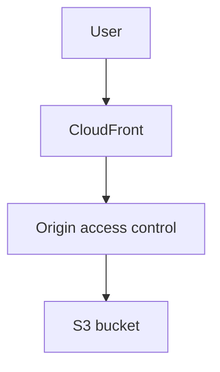

# Lab 16: CloudFront with S3 Origin Access Control

## Business Scenario
A static website needs global distribution while the S3 bucket stays private and inaccessible from the public internet.

## Core Services
CloudFront, S3, Origin Access Control

## Target Architecture


## Step-by-Step
1. Create a private S3 bucket for the site assets.
2. Attach an origin access control to the CloudFront distribution.
3. Verify that the bucket URL is blocked while the CloudFront URL works.

## CLI Commands
```bash
aws s3api create-bucket --bucket lab16-site --region ap-southeast-1
aws cloudfront create-origin-access-control --origin-access-control-config file://oac.json
aws cloudfront create-distribution --distribution-config file://distribution.json
aws s3api get-object --bucket lab16-site --key index.html index.html
```

## Expected Output
- Direct S3 access is denied.
- CloudFront serves the object successfully.
- The bucket policy allows only the CloudFront OAC principal.

## Failure Injection
Try to read the object directly from S3 and confirm AccessDenied, proving the bucket is not public.

## Decision Trade-offs
| Option | Best for | Strength | Weakness |
| --- | --- | --- | --- |
| OAC | Private S3 origins | Stronger modern pattern | Requires policy setup. |
| OAI | Older CloudFront pattern | Familiar to many teams | Legacy approach. |
| Public bucket | Simple static hosting | Easy to start | Not acceptable for sensitive content. |

## Common Mistakes
- Leaving the bucket policy public.
- Forgetting to invalidate the cache after updates.
- Mixing up the CloudFront domain with the raw S3 endpoint.

## Exam Question
**Q:** What is the modern way to keep an S3 origin private behind CloudFront?

**A:** Use Origin Access Control so only CloudFront can read from the bucket.

## Cleanup
- Delete the CloudFront distribution.
- Remove the origin access control.
- Empty and delete the S3 bucket.

