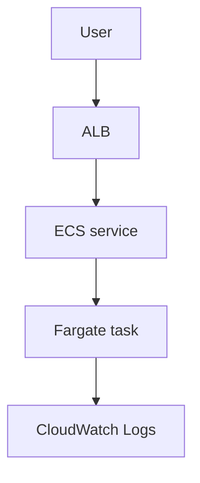

# Lab 17: ECS Fargate Basics

## Business Scenario
A container team wants to run a stateless service without managing EC2 hosts or patching the underlying fleet.

## Core Services
ECS, Fargate, ALB, CloudWatch Logs

## Target Architecture


## Step-by-Step
1. Register a task definition.
2. Create an ECS service using the Fargate launch type.
3. Send traffic through an ALB and verify the task stays healthy.

## CLI Commands
```bash
aws ecs create-cluster --cluster-name lab17-cluster
aws ecs register-task-definition --cli-input-json file://taskdef.json
aws ecs create-service --cluster lab17-cluster --service-name lab17-service --task-definition lab17-task --desired-count 2 --launch-type FARGATE
aws ecs update-service --cluster lab17-cluster --service lab17-service --desired-count 3
```

## Expected Output
- Tasks show as RUNNING without EC2 host management.
- ALB health checks stay green for healthy tasks.
- Logs stream to CloudWatch with the task execution role.

## Failure Injection
Crash one task or scale the service and confirm ECS replaces the task without manual intervention.

## Decision Trade-offs
| Option | Best for | Strength | Weakness |
| --- | --- | --- | --- |
| Fargate | No-host containers | Low ops | Less host control. |
| ECS on EC2 | Custom hosts | More tuning options | More fleet management. |
| App Runner | Simple web services | Very easy | Less control. |

## Common Mistakes
- Missing task execution role permissions.
- Using the wrong CPU and memory combination.
- Forgetting container health checks and log configuration.

## Exam Question
**Q:** Which container option is best when the team wants to avoid managing servers?

**A:** ECS on Fargate, because AWS manages the underlying compute capacity.

## Cleanup
- Delete the ECS service and cluster.
- Remove the task definition revisions if they are not reused.
- Delete the ALB and target group.

