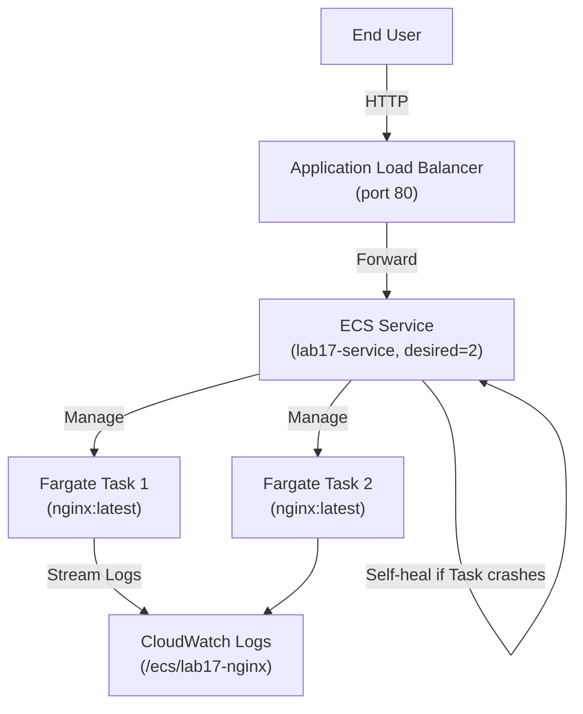

# Lab 17: ECS Fargate Basics

## Metadata
- Difficulty: Intermediate
- Time estimate: 20–30 minutes
- Estimated cost: ~$1.20 (Fargate vCPU + Memory รายชั่วโมง)
- Prerequisites: Lab 01 (VPC with private subnets)
- Depends on: Lab 01

## Learning Objectives
หลังจากทำ Lab นี้เสร็จ ผู้เรียนจะสามารถ:
- สร้าง ECS Cluster และ Task Execution IAM Role
- กำหนด Fargate Task Definition สำหรับ Container (nginx)
- สร้าง ECS Service ที่ run บน Fargate และสังเกตการ Self-heal อัตโนมัติ
- อธิบายความแตกต่างระหว่าง ECS on Fargate, EC2 และ Lambda

## Business Scenario
ทีม Developer ไม่ต้องการดูแล EC2 Server ราย Patch OS หรือ AMI Update พวกเขาต้องการ Deploy Docker Container และให้ AWS จัดการ Infrastructure ให้ทั้งหมด

การใช้งาน Fargate ตัดภาระ OS Management ออกสมบูรณ์ ทีมโฟกัสได้เฉพาะ Application Code และ Container Config เท่านั้น

## Core Services
ECS, Fargate, ALB, CloudWatch Logs

## Target Architecture


## Environment Setup
```bash
# กำหนดค่าเหล่านี้ก่อนรันคำสั่งใดๆ ใน Lab นี้
export AWS_REGION=ap-southeast-1
export ACCOUNT_ID=$(aws sts get-caller-identity --query Account --output text)
export PROJECT_TAG=SAA-Lab-17

# อ้างอิง VPC และ Subnet จาก Lab 01
export VPC_ID=$(aws ec2 describe-vpcs \
  --filters "Name=tag:Project,Values=SAA-Lab-01" \
  --query 'Vpcs[0].VpcId' --output text)
export SUBNET_PRIV_1=$(aws ec2 describe-subnets \
  --filters "Name=tag:Project,Values=SAA-Lab-01" "Name=tag:Name,Values=Private-Subnet" \
  --query 'Subnets[0].SubnetId' --output text)
export CLUSTER_NAME="lab17-cluster"
export SERVICE_NAME="lab17-service"

# สร้าง Security Group สำหรับ ECS Tasks
export SG_ECS_ID=$(aws ec2 create-security-group \
  --group-name lab17-ecs-sg \
  --description "ECS Fargate SG" \
  --vpc-id $VPC_ID \
  --query 'GroupId' --output text)
aws ec2 authorize-security-group-ingress \
  --group-id $SG_ECS_ID --protocol tcp --port 80 --cidr 0.0.0.0/0
```

---

## Step-by-Step

### Phase 1 — สร้าง ECS Cluster และ Task Execution Role

สร้าง ECS Cluster ชนิด Serverless (ไม่มี EC2 Instances ให้เห็น) และ IAM Role ที่ ECS ใช้ Pull Image และส่ง Log

#### 🖥️ วิธีทำผ่าน AWS Console (GUI)

1. ไปที่ **ECS → Clusters → Create cluster**
2. Cluster name: `lab17-cluster`
3. Infrastructure: **AWS Fargate (serverless)** — ไม่ต้องเลือก EC2
4. Tag: `Project = SAA-Lab-17` → **Create**

**สร้าง Task Execution Role:**
1. ไปที่ **IAM → Roles → Create role**
2. Use case: **Elastic Container Service Task**
3. Permission: เพิ่ม `AmazonECSTaskExecutionRolePolicy`
4. Role name: `Lab17EcsTaskExecRole` → **Create**

#### ⌨️ วิธีทำผ่าน CLI

```bash
# สร้าง ECS Cluster
aws ecs create-cluster \
  --cluster-name $CLUSTER_NAME \
  --tags key=Project,value=$PROJECT_TAG

# สร้าง Task Execution IAM Role
cat <<'EOF' > trust-ecs.json
{
  "Version": "2012-10-17",
  "Statement": [{
    "Effect": "Allow",
    "Principal": {"Service": "ecs-tasks.amazonaws.com"},
    "Action": "sts:AssumeRole"
  }]
}
EOF
ROLE_ARN=$(aws iam create-role \
  --role-name Lab17EcsTaskExecRole \
  --assume-role-policy-document file://trust-ecs.json \
  --query 'Role.Arn' --output text)
aws iam attach-role-policy \
  --role-name Lab17EcsTaskExecRole \
  --policy-arn arn:aws:iam::aws:policy/service-role/AmazonECSTaskExecutionRolePolicy
```

**Expected output:** Cluster ID และ Role ARN ถูกสร้าง

---

### Phase 2 — Register Fargate Task Definition

กำหนด Container Spec — Docker Image, CPU/Memory, Port Mapping และ Log Group

#### 🖥️ วิธีทำผ่าน AWS Console (GUI)

1. ไปที่ **ECS → Task definitions → Create new task definition**
2. Task definition family: `lab17-nginx`
3. Launch type: **AWS Fargate**
4. CPU: `0.25 vCPU` → Memory: `0.5 GB`
5. Task role: เว้นว่าง → Task execution role: `Lab17EcsTaskExecRole`
6. Add container:
   - Container name: `nginx-web`
   - Image: `nginx:latest`
   - Container port: `80` → Protocol: `tcp`
7. Log collection: **Use log collection** → Log driver: `awslogs`
8. **Create**

#### ⌨️ วิธีทำผ่าน CLI

```bash
cat <<EOF > taskdef.json
{
  "family": "lab17-nginx",
  "networkMode": "awsvpc",
  "requiresCompatibilities": ["FARGATE"],
  "cpu": "256",
  "memory": "512",
  "executionRoleArn": "${ROLE_ARN}",
  "containerDefinitions": [{
    "name": "nginx-web",
    "image": "nginx:latest",
    "essential": true,
    "portMappings": [{"containerPort": 80, "protocol": "tcp"}],
    "logConfiguration": {
      "logDriver": "awslogs",
      "options": {
        "awslogs-group": "/ecs/lab17-nginx",
        "awslogs-region": "${AWS_REGION}",
        "awslogs-stream-prefix": "ecs",
        "awslogs-create-group": "true"
      }
    }
  }]
}
EOF
aws ecs register-task-definition --cli-input-json file://taskdef.json
```

**Expected output:** Task Definition ARN พร้อม Revision Number (เช่น `lab17-nginx:1`)

---

### Phase 3 — สร้าง Fargate Service

สั่งให้ ECS รัน Task 2 ตัวตลอดเวลา (Desired Count = 2) บน Fargate

#### 🖥️ วิธีทำผ่าน AWS Console (GUI)

1. ไปที่ **ECS → lab17-cluster → Services → Create**
2. Compute options: **Launch type → Fargate**
3. Task definition: `lab17-nginx:1`
4. Service name: `lab17-service` → Desired tasks: `2`
5. Networking:
   - VPC: Lab01 VPC → Subnets: Private Subnet
   - Security group: `lab17-ecs-sg`
   - Public IP: **Turned off**
6. **Create service**

#### ⌨️ วิธีทำผ่าน CLI

```bash
aws ecs create-service \
  --cluster $CLUSTER_NAME \
  --service-name $SERVICE_NAME \
  --task-definition lab17-nginx \
  --desired-count 2 \
  --launch-type FARGATE \
  --network-configuration "awsvpcConfiguration={subnets=[$SUBNET_PRIV_1],securityGroups=[$SG_ECS_ID],assignPublicIp=DISABLED}"

# รอ Task เข้าสู่สถานะ RUNNING
aws ecs wait services-stable --cluster $CLUSTER_NAME --services $SERVICE_NAME
aws ecs list-tasks --cluster $CLUSTER_NAME
```

**Expected output:** Tasks 2 ตัวสถานะ `RUNNING` ใน Private Subnet

---

## Failure Injection

หยุด Task 1 ตัวด้วยตนเองเพื่อสังเกตว่า ECS Service จะสร้าง Task ใหม่มา Replace อัตโนมัติ

```bash
TASK_ARN=$(aws ecs list-tasks --cluster $CLUSTER_NAME --query 'taskArns[0]' --output text)
aws ecs stop-task \
  --cluster $CLUSTER_NAME \
  --task $TASK_ARN \
  --reason "Lab: Simulating container crash"
```

**What to observe:** ECS Service รู้ว่า Running Task Count ต่ำกว่า Desired Count (1 < 2) และจะสร้าง Task ใหม่มา Replace ภายใน 30-60 วินาที โดยที่ไม่มีการ Intervention จาก Operator เลย — นี่คือ Self-healing ของ ECS

**How to recover:** ไม่จำเป็น เพราะ ECS แก้ไขตัวเองอัตโนมัติ

---

## Decision Trade-offs

| ตัวเลือก | เหมาะกับ | ค่าใช้จ่าย | ภาระงาน (Ops) |
|---|---|---|---|
| ECS on Fargate | Container ที่ไม่ต้องการดูแล OS | สูงกว่า EC2 เล็กน้อย ต่อ Unit | ต่ำมาก (ไม่มี OS ให้จัดการ) |
| ECS on EC2 | High-performance / ใช้ Reserved Instances | ประหยัดสำหรับ Workload ขนาดใหญ่ | สูง (ต้อง Update AMI, Patch) |
| AWS Lambda | Event-driven, Short-lived Functions | ต่ำมาก (จ่ายตามเวลาทำงาน) | ต่ำ (Serverless) |

---

## Common Mistakes

- **Mistake:** วาง Fargate Task ใน Private Subnet โดยไม่มี NAT Gateway
  **Why it fails:** Fargate ต้องการ Internet Access เพื่อ Pull Docker Image จาก Docker Hub และส่ง Log ไป CloudWatch หากไม่มี NAT Gateway Task จะ Stuck ที่ `PENDING`

- **Mistake:** ไม่กำหนด Task Execution Role
  **Why it fails:** ECS ไม่มีสิทธิ์ Pull Container Image จาก ECR หรือส่ง Log ไป CloudWatch Container จะล้มเหลวโดยไม่มี Log ให้ Debug

- **Mistake:** ตั้ง `AssignPublicIp=ENABLED` ใน Private Subnet
  **Why it fails:** Private Subnet ไม่มี Internet Gateway Route ดังนั้น Public IP ที่ Assign จะไม่สามารถ Route ออกอินเทอร์เน็ตได้ ต้องใช้ NAT Gateway แทน

- **Mistake:** ต้องการ SSH เข้า Fargate Container เพื่อ Debug
  **Why it fails:** Fargate ไม่รองรับ SSH แบบ Traditional ต้องใช้ **ECS Exec** (`aws ecs execute-command`) ซึ่งต้องกำหนดสิทธิ์เพิ่มเติมใน IAM

---

## Exam Questions

**Q1:** ทีม Developer ไม่ต้องการจัดการ EC2 Instance และต้องการ Run Docker Container โดย AWS จัดการ Infrastructure ให้ ควรใช้อะไร?
**A:** Amazon ECS บน AWS Fargate
**Rationale:** Fargate เป็น Serverless Compute for Containers ไม่จำเป็นต้อง Provision หรือจัดการ EC2 Instance ทีมงานกำหนดแค่ CPU/Memory และ Container Image

**Q2:** หลังจาก Deploy ECS Service บน Fargate แล้ว สามารถ SSH เข้า Underlying Host เพื่อ Debug ได้หรือไม่?
**A:** ไม่ได้ Fargate ไม่เปิดให้เข้าถึง Underlying Host Infrastructure
**Rationale:** AWS จัดการ OS Layer ของ Fargate ทั้งหมด ผู้ใช้เห็นเฉพาะ Container Level สามารถใช้ ECS Exec เพื่อเข้า Shell ของ Container ได้แต่ไม่ใช่ Host OS

---

## Cleanup (เรียงลำดับตามนี้เท่านั้น — ห้ามข้ามขั้นตอน)

```bash
# Step 1 — ลด Desired Count เป็น 0 ก่อน แล้วลบ Service
aws ecs update-service \
  --cluster $CLUSTER_NAME --service $SERVICE_NAME --desired-count 0
aws ecs delete-service \
  --cluster $CLUSTER_NAME --service $SERVICE_NAME

# Step 2 — รอ Service ลบเสร็จ แล้วลบ Cluster
aws ecs wait services-inactive --cluster $CLUSTER_NAME --services $SERVICE_NAME
aws ecs delete-cluster --cluster $CLUSTER_NAME

# Step 3 — ลบ IAM Role
aws iam detach-role-policy \
  --role-name Lab17EcsTaskExecRole \
  --policy-arn arn:aws:iam::aws:policy/service-role/AmazonECSTaskExecutionRolePolicy
aws iam delete-role --role-name Lab17EcsTaskExecRole

# Step 4 — ลบ Security Group
aws ec2 delete-security-group --group-id $SG_ECS_ID || true

# Step 5 — ตรวจสอบ
aws ecs describe-clusters --clusters $CLUSTER_NAME \
  --query 'clusters[*].{Name:clusterName,Status:status}' --output table || echo "✅ Cluster ลบแล้ว"
```

**Cost check:** Fargate มีค่าใช้จ่ายต่อ vCPU/Memory-Hour ตรวจสอบว่าไม่มี Task Running:
```bash
aws ecs list-tasks --cluster $CLUSTER_NAME 2>&1 || echo "✅ ไม่มี Active Tasks"
```
