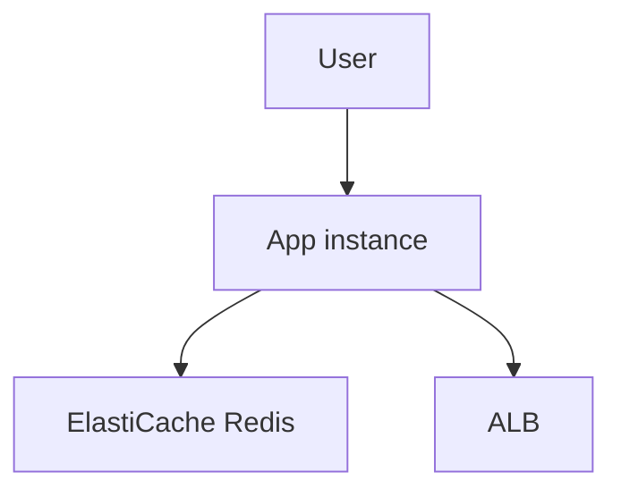

# Lab 18: ElastiCache Session Store

## Business Scenario
A web app needs a fast shared session store so users keep their login state even when app instances are replaced.

## Core Services
ElastiCache Redis, EC2, Application Session State

## Target Architecture


## Step-by-Step
1. Create a Redis replication group in private subnets.
2. Configure the app to store sessions in Redis.
3. Restart or replace the app instance and check that the session remains valid.

## CLI Commands
```bash
aws elasticache create-replication-group --replication-group-id lab18-redis --engine redis --cache-node-type cache.t3.micro --num-node-groups 1 --replicas-per-node-group 1
aws elasticache describe-replication-groups --replication-group-id lab18-redis
redis-cli -h <primary-endpoint> ping
```

## Expected Output
- The Redis replication group becomes available.
- Session data survives app restarts.
- Latency stays lower than writing every session to disk.

## Failure Injection
Restart or replace the app instance and confirm the session still exists in Redis.

## Decision Trade-offs
| Option | Best for | Strength | Weakness |
| --- | --- | --- | --- |
| Redis | Fast shared sessions | Feature rich | More cost than local memory. |
| Memcached | Simple cache/session | Very fast | No persistence. |
| DynamoDB | Durable session data | Highly scalable | Higher read/write latency. |

## Common Mistakes
- Keeping sessions in local instance memory only.
- Skipping subnet group and security group setup.
- Using Memcached when persistence or replication is needed.

## Exam Question
**Q:** Which service is a strong fit for a shared low-latency session store?

**A:** ElastiCache Redis, because it is fast, shared, and supports replication options.

## Cleanup
- Delete the replication group.
- Remove application config changes used for the test.
- Terminate any temporary app instances.

