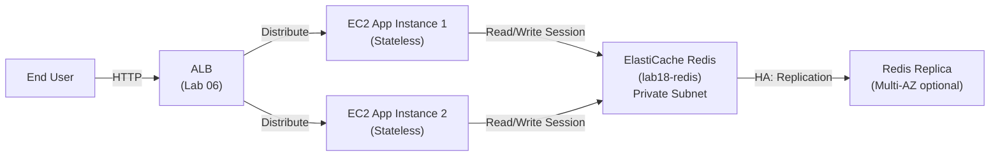

# Lab 18: ElastiCache Session Store

## Metadata
- Difficulty: Intermediate
- Time estimate: 20–30 minutes
- Estimated cost: ~$1.00 (ElastiCache cache.t3.micro รายชั่วโมง)
- Prerequisites: Lab 01 (VPC with private subnets)
- Depends on: Lab 01

## Learning Objectives
หลังจากทำ Lab นี้เสร็จ ผู้เรียนจะสามารถ:
- สร้าง ElastiCache Subnet Group และ Security Group
- Provision ElastiCache Redis Replication Group
- เชื่อมต่อและทดสอบ Redis ด้วย `redis-cli`
- อธิบายความแตกต่างระหว่าง Redis และ Memcached สำหรับ Session Store

## Business Scenario
แอปพลิเคชัน E-commerce ใช้ Auto Scaling Group สำหรับ Web Tier แต่ Session ของผู้ใช้ (Shopping Cart / Login State) ถูกเก็บบน In-memory ของ Instance แต่ละตัว เมื่อ ASG ยุบ Instance ที่รัน Session อยู่ ผู้ใช้จะถูก Logout ทันที

การย้าย Session ไปเก็บที่ ElastiCache Redis แก้ปัญหานี้ — ทุก Instance ใน ASG อ่าน-เขียน Session จากที่เดียวกัน

## Core Services
ElastiCache Redis, EC2, Application Session State

## Target Architecture


## Environment Setup
```bash
# กำหนดค่าเหล่านี้ก่อนรันคำสั่งใดๆ ใน Lab นี้
export AWS_REGION=ap-southeast-1
export ACCOUNT_ID=$(aws sts get-caller-identity --query Account --output text)
export PROJECT_TAG=SAA-Lab-18
export VPC_ID=$(aws ec2 describe-vpcs \
  --filters "Name=tag:Project,Values=SAA-Lab-01" \
  --query 'Vpcs[0].VpcId' --output text)
export SUBNET_PRIV_1=$(aws ec2 describe-subnets \
  --filters "Name=tag:Project,Values=SAA-Lab-01" "Name=tag:Name,Values=Private-Subnet" \
  --query 'Subnets[0].SubnetId' --output text)
```

---

## Step-by-Step

### Phase 1 — สร้าง Subnet Group และ Security Group

สร้าง Subnet Group เพื่อกำหนดว่า ElastiCache จะอยู่ใน Subnet ใด และ Security Group ที่เปิด Port Redis (6379) เฉพาะ VPC

#### 🖥️ วิธีทำผ่าน AWS Console (GUI)

**สร้าง Subnet Group:**
1. ไปที่ **ElastiCache → Subnet groups → Create subnet group**
2. Name: `lab18-group` → VPC: Lab01 VPC
3. เพิ่ม Private Subnet → **Create**

**สร้าง Security Group:**
1. ไปที่ **VPC → Security groups → Create security group**
2. Name: `lab18-redis-sg` → VPC: Lab01 VPC
3. Inbound rule: TCP → Port `6379` → Source: `10.10.0.0/16` (CIDR ของ VPC)
4. **Create**

#### ⌨️ วิธีทำผ่าน CLI

```bash
# สร้าง Subnet Group
aws elasticache create-cache-subnet-group \
  --cache-subnet-group-name lab18-group \
  --cache-subnet-group-description "Lab 18 subnets" \
  --subnet-ids $SUBNET_PRIV_1 \
  --tags Key=Project,Value=$PROJECT_TAG

# สร้าง Security Group สำหรับ Redis
SG_REDIS_ID=$(aws ec2 create-security-group \
  --group-name lab18-redis-sg \
  --description "Redis SG" \
  --vpc-id $VPC_ID \
  --query 'GroupId' --output text)

# เปิด Port 6379 เฉพาะ VPC CIDR เท่านั้น
aws ec2 authorize-security-group-ingress \
  --group-id $SG_REDIS_ID \
  --protocol tcp --port 6379 \
  --cidr 10.10.0.0/16
```

**Expected output:** Subnet Group และ Security Group ถูกสร้าง

---

### Phase 2 — Provision Redis Replication Group

สร้าง ElastiCache Redis Cluster แบบ Replication Group (ขนาดเล็กสำหรับ Lab)

#### 🖥️ วิธีทำผ่าน AWS Console (GUI)

1. ไปที่ **ElastiCache → Redis OSS caches → Create Redis OSS cache**
2. Cluster mode: **Disabled** (Simple)
3. Name: `lab18-redis` → Node type: `cache.t3.micro`
4. Number of replicas: `0` (ไม่มี Replica สำหรับ Lab เพื่อลดค่าใช้จ่าย)
5. Subnet group: `lab18-group` → Security group: `lab18-redis-sg`
6. **Create**

#### ⌨️ วิธีทำผ่าน CLI

```bash
aws elasticache create-replication-group \
  --replication-group-id lab18-redis \
  --replication-group-description "Session store" \
  --engine redis \
  --cache-node-type cache.t3.micro \
  --num-node-groups 1 \
  --replicas-per-node-group 0 \
  --cache-subnet-group-name lab18-group \
  --security-group-ids $SG_REDIS_ID \
  --tags Key=Project,Value=$PROJECT_TAG
```

**Expected output:** Replication Group เข้าสู่สถานะ `creating` ใช้เวลาประมาณ 5-10 นาทีก่อนสถานะ `available`

---

### Phase 3 — ตรวจสอบและทดสอบ Redis Connection

รอให้ Cluster พร้อม แล้วทดสอบ Connection จาก EC2 Instance ใน Private Subnet

#### 🖥️ วิธีทำผ่าน AWS Console (GUI)

1. ไปที่ **ElastiCache → Redis → lab18-redis** → รอสถานะ `Available`
2. คัดลอก **Primary endpoint** (เช่น `lab18-redis.xxxxx.cache.amazonaws.com:6379`)
3. ไปที่ EC2 ใน Private Subnet → Session Manager → รัน:
   ```bash
   redis-cli -h <primary-endpoint> ping
   ```

#### ⌨️ วิธีทำผ่าน CLI

```bash
# รอ Cluster พร้อม
aws elasticache wait replication-group-available \
  --replication-group-id lab18-redis

# ดึง Primary Endpoint
REDIS_EP=$(aws elasticache describe-replication-groups \
  --replication-group-id lab18-redis \
  --query 'ReplicationGroups[0].NodeGroups[0].PrimaryEndpoint.Address' \
  --output text)
echo "Redis Endpoint: $REDIS_EP"

# ทดสอบจาก EC2 ใน Private Subnet (ถ้ามี):
# ssh ec2-instance "redis-cli -h $REDIS_EP ping"
# หรือใช้ ECS/Lambda ที่อยู่ใน VPC เดียวกัน
```

**Expected output:** `PONG` — แสดงว่า Redis ตอบสนองได้จาก Instance ใน VPC เดียวกัน ทดสอบ Session Operations:
```bash
# redis-cli -h $REDIS_EP SET session:user123 "cart=[item1,item2]" EX 3600
# redis-cli -h $REDIS_EP GET session:user123
```

---

## Failure Injection

จำลอง Redis Node Failure (ใช้ได้เมื่อมี Replica > 0)

```bash
# ทดสอบ Failover (ใช้ได้เมื่อสร้าง Cluster ที่มี Replica > 0)
aws elasticache test-failover \
  --replication-group-id lab18-redis \
  --node-group-id 0001
```

**What to observe:** หากมี Replica Redis จะ Promote Replica ขึ้นเป็น Primary โดยอัตโนมัติ Application จะเห็น Endpoint เปลี่ยนแปลงและ Connection ขาดสั้นๆ ก่อน Reconnect — Session ข้อมูลยังคงอยู่ครบ (ต่างจากการที่ App Server แต่ละตัวเก็บ Session เอง)

**How to recover:** Redis จัดการ Failover อัตโนมัติ ไม่ต้องดำเนินการใดๆ

---

## Decision Trade-offs

| ตัวเลือก | เหมาะกับ | Latency | ค่าใช้จ่าย | คุณสมบัติพิเศษ |
|---|---|---|---|---|
| ElastiCache Redis | Session Store, Leaderboard, Pub/Sub | Microsecond | ปานกลาง | Persistence, HA, Data Structures |
| ElastiCache Memcached | Simple Key-Value Cache (Transient) | Microsecond | ต่ำกว่า Redis | Multi-threaded, ไม่มี Persistence |
| DynamoDB | Persistent Session ที่ต้องการ Cross-region | Millisecond | ต่ำ (Pay-per-use) | Serverless, TTL, Global Tables |

---

## Common Mistakes

- **Mistake:** วาง ElastiCache ใน Public Subnet
  **Why it fails:** Redis Port 6379 ที่เปิด Public เสี่ยงถูก Scan และ Attack ต้องวางใน Private Subnet เสมอ และเปิด Port เฉพาะให้ App ที่ต้องการเข้าถึงเท่านั้น

- **Mistake:** ใช้ Memcached เมื่อ Requirement ต้องการ HA Failover หรือ Backup
  **Why it fails:** Memcached ไม่มี Persistence ไม่มี Multi-AZ HA และไม่มี Snapshot สำหรับ Session Store ที่ต้องทนต่อ Node Failure ต้องใช้ Redis

- **Mistake:** ลืมกำหนด Security Group ให้ App Server เข้าถึง Redis Port ได้
  **Why it fails:** App จะได้รับ Connection Refused หรือ Timeout เมื่อพยายาม Connect Redis ต้องตรวจสอบ Security Group Rules ทั้ง App SG และ Redis SG

- **Mistake:** เลือก Instance Type เล็กเกินไปสำหรับ Production Session Load
  **Why it fails:** เมื่อ Session ใน Redis เต็ม RAM Redis จะใช้ Eviction Policy ลบ Key เก่าออก Sessions ของผู้ใช้จะหายทำให้ Logout โดยไม่คาดคิด

---

## Exam Questions

**Q1:** แอปพลิเคชัน Web ที่ใช้ ASG ต้องการ Share Session State ระหว่าง Instance ทุกตัว โดยต้องการ Sub-millisecond Latency ควรใช้อะไร?
**A:** Amazon ElastiCache for Redis
**Rationale:** Redis เก็บข้อมูลใน RAM จึงให้ Latency ต่ำมาก (Microsecond) รองรับการแชร์ Session ข้าม Instance และรองรับ HA Replication สำหรับ High Availability

**Q2:** ทำไม ElastiCache Redis ถึงเหมาะกับ Disaster Recovery มากกว่า Memcached?
**A:** Redis รองรับ Persistence โดยสามารถ Snapshot ข้อมูลลง S3 และ Replay AOF Log — Memcached เป็น In-memory เท่านั้น ข้อมูลหายทันทีเมื่อ Node ล่ม
**Rationale:** สำหรับ Exam เมื่อ Requirement ต้องการ Backup/Recovery หรือ Persistence ให้เลือก Redis เมื่อต้องการ Simple Cache ที่ไม่ต้องการ Persistence เลือก Memcached

---

## Cleanup (เรียงลำดับตามนี้เท่านั้น — ห้ามข้ามขั้นตอน)

```bash
# Step 1 — ลบ Redis Replication Group (ใช้เวลา 5-10 นาที)
aws elasticache delete-replication-group \
  --replication-group-id lab18-redis

# Step 2 — รอ Cluster ลบเสร็จ แล้วลบ Subnet Group และ Security Group
aws elasticache wait replication-group-deleted \
  --replication-group-id lab18-redis 2>/dev/null || sleep 300

aws elasticache delete-cache-subnet-group \
  --cache-subnet-group-name lab18-group || true
aws ec2 delete-security-group --group-id $SG_REDIS_ID || true

# Step 3 — ตรวจสอบว่าลบเรียบร้อยแล้ว
aws elasticache describe-replication-groups \
  --replication-group-id lab18-redis 2>&1 || echo "✅ Redis Cluster ถูกลบแล้ว"
```

**Cost check:** ElastiCache มีค่าใช้จ่ายรายชั่วโมง ตรวจสอบว่าไม่มี Cluster ค้างอยู่:
```bash
aws elasticache describe-replication-groups \
  --query "ReplicationGroups[*].{ID:ReplicationGroupId,Status:Status}" --output table
```
