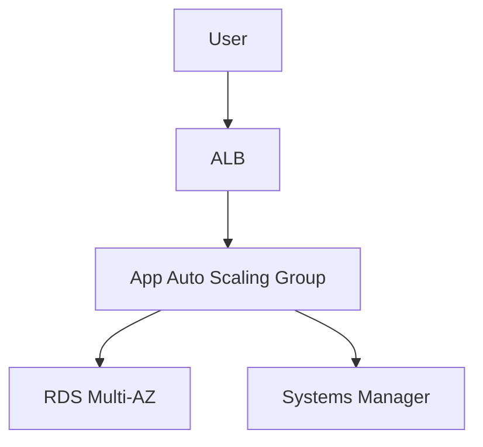

# Lab 19: Full 3-Tier Architecture Reference Implementation

## Business Scenario
An ecommerce app needs a public entry point, private application tier, and a resilient database layer with clear separation of concerns.

## Core Services
ALB, EC2 Auto Scaling, RDS, SSM

## Target Architecture


## Step-by-Step
1. Create the VPC, public and private subnets, and the ALB.
2. Launch the app tier in an Auto Scaling group and point it to the ALB.
3. Add a Multi-AZ RDS database and verify the app can reach it.

## CLI Commands
```bash
aws ec2 create-vpc --cidr-block 10.19.0.0/16
aws elbv2 create-load-balancer --name lab19-alb --subnets subnet-public-a subnet-public-b --security-groups sg-alb
aws autoscaling create-auto-scaling-group --auto-scaling-group-name lab19-asg --launch-template LaunchTemplateName=lab19-template,Version=$Latest --min-size 2 --max-size 4 --desired-capacity 2 --vpc-zone-identifier subnet-private-a,subnet-private-b
aws rds create-db-instance --db-instance-identifier lab19-db --db-instance-class db.t3.micro --engine postgres --multi-az --allocated-storage 20
```

## Expected Output
- ALB responds publicly while app instances remain private.
- The app tier can talk to the DB but the DB is not public.
- One failed app instance is replaced automatically.

## Failure Injection
Terminate one app instance and force a database failover to prove both layers recover independently.

## Decision Trade-offs
| Option | Best for | Strength | Weakness |
| --- | --- | --- | --- |
| Single-AZ DB | Cheapest start | Lower cost | Poor resilience. |
| Multi-AZ DB | Standard HA | Stable endpoint | Higher cost than single-AZ. |
| Aurora | Advanced managed HA | Fast failover | Usually more expensive. |

## Common Mistakes
- Putting the database in a public subnet.
- Mixing application and database security groups too broadly.
- Skipping SSM access and relying only on bastion SSH.

## Exam Question
**Q:** What is the best default pattern for a production web app that needs availability and separation of tiers?

**A:** ALB in public subnets, app instances in private subnets, and a Multi-AZ database.

## Cleanup
- Delete the ASG, ALB, and target group.
- Remove the database and subnet group.
- Delete the VPC artifacts created for the 3-tier stack.

