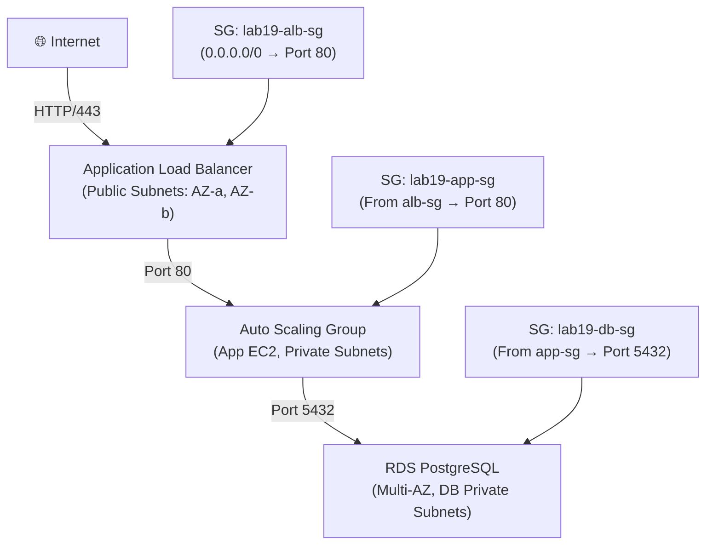

# Lab 19: Full 3-Tier Architecture Reference Implementation

## Metadata
- Difficulty: Advanced
- Time estimate: 40–50 minutes
- Estimated cost: ~$2.50 (ALB + Multi-AZ RDS รายชั่วโมง)
- Prerequisites: ไม่จำเป็นต้องมี Lab ก่อนหน้า (Lab นี้สร้าง VPC ใหม่ทั้งหมด)
- Depends on: None

## Learning Objectives
หลังจากทำ Lab นี้เสร็จ ผู้เรียนจะสามารถ:
- สร้าง VPC แบบ 3-Tier พร้อม Public, Private และ DB Subnets
- กำหนด Security Group เพื่อควบคุม Traffic Flow ระหว่าง Tier
- สร้าง ALB ใน Public Tier และ ASG ใน App Tier
- สร้าง RDS Multi-AZ ใน DB Tier และเชื่อม ALB → ASG → RDS

## Business Scenario
แอปพลิเคชัน E-commerce ต้องมี Security Separation ชัดเจน:
- **Public Tier**: ALB รับ Traffic จาก Internet
- **App Tier**: EC2 ASG ประมวลผล Business Logic ใน Private Subnet
- **DB Tier**: RDS Multi-AZ เก็บข้อมูลสำคัญ ไม่มี Public Access

หากไม่แยก Tier การเจาะระบบชั้น Web จะเปิดทางตรงสู่ฐานข้อมูลทันที

## Core Services
ALB, EC2 Auto Scaling, RDS, SSM

## Target Architecture


## Environment Setup
```bash
# กำหนดค่าเหล่านี้ก่อนรันคำสั่งใดๆ ใน Lab นี้
export AWS_REGION=ap-southeast-1
export ACCOUNT_ID=$(aws sts get-caller-identity --query Account --output text)
export PROJECT_TAG=SAA-Lab-19
export VPC_CIDR="10.19.0.0/16"
```

---

## Step-by-Step

### Phase 1 — สร้าง Network Foundation (VPC + Subnets + IGW)

สร้าง VPC แบบแยก 3 Zone: Public (ALB), App Private (EC2), DB Private (RDS)

#### 🖥️ วิธีทำผ่าน AWS Console (GUI)

1. ไปที่ **VPC → Create VPC** → Name: `Lab19-VPC` CIDR: `10.19.0.0/16`
2. สร้าง Subnets ทั้ง 4:
   - `Public-1` = `10.19.1.0/24` — AZ-a
   - `Public-2` = `10.19.2.0/24` — AZ-b
   - `App-Private-1` = `10.19.3.0/24` — AZ-a
   - `App-Private-2` = `10.19.4.0/24` — AZ-b
3. สร้าง Internet Gateway → Attach ไปที่ VPC
4. สร้าง Route Table สำหรับ Public → Add Route `0.0.0.0/0 → IGW` → Associate Public Subnets

#### ⌨️ วิธีทำผ่าน CLI

```bash
# สร้าง VPC
VPC_ID=$(aws ec2 create-vpc \
  --cidr-block $VPC_CIDR \
  --tag-specifications "ResourceType=vpc,Tags=[{Key=Name,Value=Lab19-VPC},{Key=Project,Value=$PROJECT_TAG}]" \
  --query 'Vpc.VpcId' --output text)

# สร้าง Subnets (Public × 2, App Private × 2)
SUB_PUB1=$(aws ec2 create-subnet --vpc-id $VPC_ID --cidr-block 10.19.1.0/24 \
  --availability-zone ${AWS_REGION}a --query 'Subnet.SubnetId' --output text)
SUB_PUB2=$(aws ec2 create-subnet --vpc-id $VPC_ID --cidr-block 10.19.2.0/24 \
  --availability-zone ${AWS_REGION}b --query 'Subnet.SubnetId' --output text)
SUB_PRIV1=$(aws ec2 create-subnet --vpc-id $VPC_ID --cidr-block 10.19.3.0/24 \
  --availability-zone ${AWS_REGION}a --query 'Subnet.SubnetId' --output text)
SUB_PRIV2=$(aws ec2 create-subnet --vpc-id $VPC_ID --cidr-block 10.19.4.0/24 \
  --availability-zone ${AWS_REGION}b --query 'Subnet.SubnetId' --output text)

# Internet Gateway และ Public Route Table
IGW_ID=$(aws ec2 create-internet-gateway --query 'InternetGateway.InternetGatewayId' --output text)
aws ec2 attach-internet-gateway --vpc-id $VPC_ID --internet-gateway-id $IGW_ID
RTB_PUB=$(aws ec2 create-route-table --vpc-id $VPC_ID --query 'RouteTable.RouteTableId' --output text)
aws ec2 create-route --route-table-id $RTB_PUB --destination-cidr-block 0.0.0.0/0 --gateway-id $IGW_ID
aws ec2 associate-route-table --route-table-id $RTB_PUB --subnet-id $SUB_PUB1
aws ec2 associate-route-table --route-table-id $RTB_PUB --subnet-id $SUB_PUB2
```

**Expected output:** VPC, Subnets, IGW และ Route Table ถูกสร้าง

---

### Phase 2 — สร้าง Security Groups + ALB + RDS Subnet Group + DB

สร้าง Security Group แบบ Chained (ALB → App → DB) และสร้าง ALB กับ RDS

#### 🖥️ วิธีทำผ่าน AWS Console (GUI)

**Security Groups:**
1. `lab19-alb-sg`: Inbound TCP 80 from `0.0.0.0/0`
2. `lab19-app-sg`: Inbound TCP 80 from `lab19-alb-sg`
3. `lab19-db-sg`: Inbound TCP 5432 from `lab19-app-sg`

**ALB:**
1. ไปที่ **EC2 → Load Balancers → Create** → Type: **ALB**
2. Name: `lab19-alb` → Scheme: **Internet-facing**
3. VPC: Lab19-VPC → Subnets: Public-1, Public-2
4. SG: `lab19-alb-sg`

**RDS:**
1. ไปที่ **RDS → Create database** → Engine: PostgreSQL
2. Template: **Dev/Test** → Multi-AZ: **เปิด**
3. Subnet group: สร้างใหม่ใช้ App-Private Subnets
4. SG: `lab19-db-sg`

#### ⌨️ วิธีทำผ่าน CLI

```bash
# Security Groups (Chained)
SG_ALB=$(aws ec2 create-security-group --group-name lab19-alb-sg \
  --description "Public ALB SG" --vpc-id $VPC_ID --query 'GroupId' --output text)
aws ec2 authorize-security-group-ingress \
  --group-id $SG_ALB --protocol tcp --port 80 --cidr 0.0.0.0/0

SG_APP=$(aws ec2 create-security-group --group-name lab19-app-sg \
  --description "App Tier SG" --vpc-id $VPC_ID --query 'GroupId' --output text)
aws ec2 authorize-security-group-ingress \
  --group-id $SG_APP --protocol tcp --port 80 --source-group $SG_ALB

SG_DB=$(aws ec2 create-security-group --group-name lab19-db-sg \
  --description "DB Tier SG" --vpc-id $VPC_ID --query 'GroupId' --output text)
aws ec2 authorize-security-group-ingress \
  --group-id $SG_DB --protocol tcp --port 5432 --source-group $SG_APP

# ALB (Internet-facing in Public Subnets)
ALB_ARN=$(aws elbv2 create-load-balancer \
  --name lab19-alb \
  --subnets $SUB_PUB1 $SUB_PUB2 \
  --security-groups $SG_ALB \
  --query 'LoadBalancers[0].LoadBalancerArn' --output text)

# RDS Subnet Group + DB Instance
aws rds create-db-subnet-group \
  --db-subnet-group-name lab19-rds-group \
  --db-subnet-group-description "Lab 19 RDS" \
  --subnet-ids $SUB_PRIV1 $SUB_PRIV2
aws rds create-db-instance \
  --db-instance-identifier lab19-db \
  --db-instance-class db.t3.micro \
  --engine postgres \
  --multi-az \
  --allocated-storage 20 \
  --master-username postgres \
  --master-user-password "StrongPass123!" \
  --db-subnet-group-name lab19-rds-group \
  --vpc-security-group-ids $SG_DB \
  --no-publicly-accessible
```

**Expected output:** ALB ถูกสร้างใน Public Subnets และ RDS เริ่ม Provisioning ใน Private Subnets

---

### Phase 3 — สร้าง Launch Template + Target Group + ASG

สร้าง Auto Scaling Group สำหรับ App Tier เชื่อมกับ ALB ผ่าน Target Group

#### 🖥️ วิธีทำผ่าน AWS Console (GUI)

1. **Target Group**: ไปที่ **EC2 → Target Groups → Create** → Type: Instances → Port 80 → VPC: Lab19-VPC
2. **Launch Template**: EC2 → Launch Templates → Create → Instance Type: `t3.micro` → SG: `lab19-app-sg`
3. **Auto Scaling**: EC2 → Auto Scaling Groups → Create:
   - Template: Lab19 → VPC: Lab19-VPC → Subnets: App-Private-1, App-Private-2
   - Min: 2, Desired: 2, Max: 4
   - Target Group: Lab19-TG

#### ⌨️ วิธีทำผ่าน CLI

```bash
# Launch Template
cat <<EOF > template.json
{
  "ImageId": "ami-0b08bfc6ff7069aff",
  "InstanceType": "t3.micro",
  "SecurityGroupIds": ["$SG_APP"]
}
EOF
aws ec2 create-launch-template \
  --launch-template-name lab19-app-template \
  --launch-template-data file://template.json

# Target Group
TG_ARN=$(aws elbv2 create-target-group \
  --name lab19-tg \
  --protocol HTTP --port 80 \
  --vpc-id $VPC_ID \
  --query 'TargetGroups[0].TargetGroupArn' --output text)

# ALB Listener → Target Group
aws elbv2 create-listener \
  --load-balancer-arn $ALB_ARN \
  --protocol HTTP --port 80 \
  --default-actions Type=forward,TargetGroupArn=$TG_ARN

# Auto Scaling Group
aws autoscaling create-auto-scaling-group \
  --auto-scaling-group-name lab19-asg \
  --launch-template LaunchTemplateName=lab19-app-template,Version='$Latest' \
  --min-size 2 --max-size 4 --desired-capacity 2 \
  --vpc-zone-identifier "$SUB_PRIV1,$SUB_PRIV2" \
  --target-group-arns $TG_ARN
```

**Expected output:** ASG สร้าง Instance 2 ตัวใน Private Subnets Traffic ไหล Internet → ALB → ASG → (RDS เมื่อ App พร้อม)

---

## Failure Injection

Terminate Instance 1 ตัวจาก ASG เพื่อสังเกตการ Self-heal

```bash
INSTANCE_ID=$(aws autoscaling describe-auto-scaling-groups \
  --auto-scaling-group-names lab19-asg \
  --query 'AutoScalingGroups[0].Instances[0].InstanceId' --output text)
aws ec2 terminate-instances --instance-ids $INSTANCE_ID
```

**What to observe:** ALB จะตรวจพบ Instance ที่ Unhealthy และหยุดส่ง Traffic ไปให้ ASG จะสร้าง Instance ใหม่มาทดแทนอัตโนมัติภายใน 2-3 นาที RDS ไม่ได้รับผลกระทบแต่อย่างใด

**How to recover:** ASG จัดการ Self-heal เองทั้งหมด — ไม่ต้องมี Operator แทรกแซง

---

## Decision Trade-offs

| ตัวเลือก | เหมาะกับ | Security Isolation | ค่าใช้จ่าย | ภาระงาน (Ops) |
|---|---|---|---|---|
| 3-Tier (ALB + EC2 ASG + RDS) | Enterprise Production Workloads | สูง (Port-chain SG) | ปานกลาง (NAT Gateway เพิ่มค่าใช้จ่าย) | ปานกลาง |
| Monolithic Single EC2 | Dev / Test | ต่ำ | ต่ำมาก | ต่ำ |
| Serverless 3-Tier (API GW + Lambda + DynamoDB) | Microservices, Event-driven | สูง (IAM-based) | ต่ำ (Scale to zero) | ต่ำมาก |

---

## Common Mistakes

- **Mistake:** วาง RDS ใน Public Subnet เพื่อเชื่อมต่อจาก Laptop โดยตรง
  **Why it fails:** DB Port 5432 ที่เปิด Public เสี่ยงถูก Brute Force ต้องใช้ Bastion Host หรือ AWS System Manager Session Manager เพื่อ Tunnel เข้าไปแทน

- **Mistake:** เปิด Security Group Rule เป็น `0.0.0.0/0` สำหรับ App และ DB Tier
  **Why it fails:** ทำลายหลักการ Security-in-Depth ของ 3-Tier ต้องใช้ SG Reference (ชี้ไปยัง SG อื่น) แทน CIDR ทำให้ Dynamic IP ของ ASG ไม่ต้องอัปเดต Rule เอง

- **Mistake:** ลืมสร้าง NAT Gateway สำหรับ App Private Subnet
  **Why it fails:** EC2 ใน App Tier ไม่สามารถดาวน์โหลด Package, Pull Docker Image หรือเรียก AWS API ได้ — ต้องมี NAT Gateway ใน Public Subnet ชี้ออก

- **Mistake:** ใส่ RDS ใน Auto Scaling Group
  **Why it fails:** RDS เป็น Stateful Service ไม่สามารถ Scale-in ได้เหมือน Stateless EC2 ต้องใช้ RDS Read Replica หรือ Aurora Auto Scaling แทน

---

## Exam Questions

**Q1:** สถาปัตยกรรม 3-Tier ที่ถูกต้องควรวาง Resource ไว้ที่ไหน?
**A:** ALB → Public Subnets, EC2 ASG → Private App Subnets, RDS → Private DB Subnets ที่แยกออกมาต่างหาก
**Rationale:** การแยก Tier ออกเป็น Public/Private และกำหนด Security Group Chaining ทำให้แม้ Web Tier ถูกเจาะ ผู้โจมตียังไม่สามารถข้ามไปยัง DB Tier ได้โดยตรง

**Q2:** DB Security Group ควรกำหนด Source อย่างไรเพื่อรองรับ ASG ที่ Instance IP เปลี่ยนตลอดเวลา?
**A:** ใช้ Security Group Reference — ชี้ Source ไปที่ `lab19-app-sg` แทนการใช้ IP CIDR
**Rationale:** เมื่อ ASG สร้าง Instance ใหม่ที่มี IP ต่างกัน SG Reference ยังคงครอบคลุม Instance ใหม่นั้นอัตโนมัติ ไม่ต้องอัปเดต DB Security Group Rule

---

## Cleanup (เรียงลำดับตามนี้เท่านั้น — ห้ามข้ามขั้นตอน)

```bash
# Step 1 — ลบ ASG ก่อน (ลด Instance เป็น 0 แล้วลบ)
aws autoscaling update-auto-scaling-group \
  --auto-scaling-group-name lab19-asg --min-size 0 --desired-capacity 0
aws autoscaling delete-auto-scaling-group \
  --auto-scaling-group-name lab19-asg --force-delete

# Step 2 — ลบ ALB และ Target Group
aws elbv2 delete-load-balancer --load-balancer-arn $ALB_ARN
aws elbv2 delete-target-group --target-group-arn $TG_ARN
aws ec2 delete-launch-template --launch-template-name lab19-app-template

# Step 3 — ลบ RDS (ใช้เวลานาน 5-10 นาที)
aws rds delete-db-instance \
  --db-instance-identifier lab19-db --skip-final-snapshot
aws rds wait db-instance-deleted --db-instance-identifier lab19-db
aws rds delete-db-subnet-group --db-subnet-group-name lab19-rds-group

# Step 4 — ลบ Security Groups (ต้องรอ Dependencies ลบก่อน)
aws ec2 delete-security-group --group-id $SG_DB || true
aws ec2 delete-security-group --group-id $SG_APP || true
aws ec2 delete-security-group --group-id $SG_ALB || true

# Step 5 — ลบ Network Resources
aws ec2 detach-internet-gateway --internet-gateway-id $IGW_ID --vpc-id $VPC_ID
aws ec2 delete-internet-gateway --internet-gateway-id $IGW_ID
aws ec2 delete-subnet --subnet-id $SUB_PUB1
aws ec2 delete-subnet --subnet-id $SUB_PUB2
aws ec2 delete-subnet --subnet-id $SUB_PRIV1
aws ec2 delete-subnet --subnet-id $SUB_PRIV2
aws ec2 delete-vpc --vpc-id $VPC_ID
```

**Cost check:** RDS Multi-AZ มีค่าใช้จ่ายสูงสุดใน Lab นี้ ตรวจสอบว่าลบสมบูรณ์:
```bash
aws rds describe-db-instances \
  --db-instance-identifier lab19-db 2>&1 || echo "✅ RDS ถูกลบแล้ว"
```
