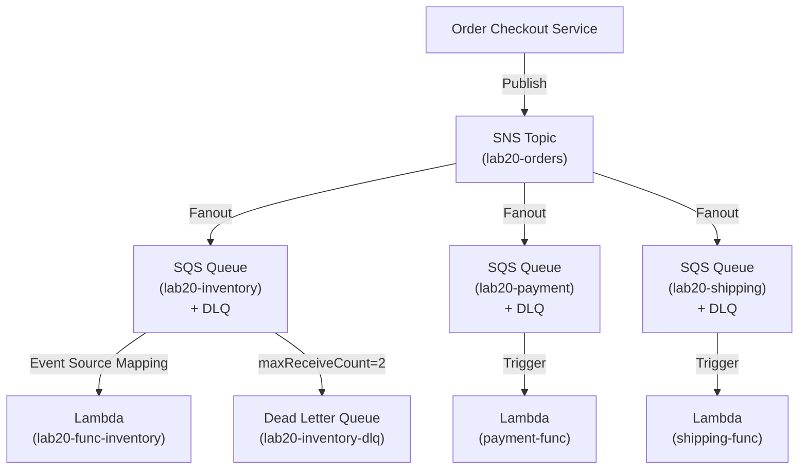

# Lab 20: Event-Driven Ordering Workflow

## Metadata
- Difficulty: Intermediate / Advanced
- Time estimate: 30–40 minutes
- Estimated cost: Free Tier eligible
- Prerequisites: None
- Depends on: None

## Learning Objectives
หลังจากทำ Lab นี้เสร็จ ผู้เรียนจะสามารถ:
- สร้าง SNS Topic กระจายคำสั่งซื้อแบบ Fanout ไปหลาย SQS Queue
- สร้าง SQS Queue พร้อม Dead Letter Queue (DLQ) และ Redrive Policy
- สร้าง Lambda Function ที่ triggered จาก SQS Event Source Mapping
- ทดสอบว่า Poison Message ถูก Route ไปยัง DLQ อัตโนมัติ

## Business Scenario
ระบบ E-commerce เมื่อ Checkout สำเร็จ ต้องส่ง Event ไปยัง:
- **Inventory Service**: ตัด Stock สินค้า
- **Payment Service**: ตัดบัตรเครดิต
- **Shipping Service**: สร้าง Shipment

การให้ Checkout รอ Response จากทั้ง 3 ระบบ (Synchronous) จะทำให้ช้า และถ้าระบบใดล่ม Checkout จะล่มตาม Fanout Pattern แก้ปัญหานี้ได้สมบูรณ์

## Core Services
SNS, SQS, Lambda, DLQ

## Target Architecture


## Environment Setup
```bash
# กำหนดค่าเหล่านี้ก่อนรันคำสั่งใดๆ ใน Lab นี้
export AWS_REGION=ap-southeast-1
export ACCOUNT_ID=$(aws sts get-caller-identity --query Account --output text)
export PROJECT_TAG=SAA-Lab-20
export TOPIC_NAME="lab20-orders"
export QUEUE_INV="lab20-inventory"
export QUEUE_DLQ="lab20-inventory-dlq"
export L_INV="lab20-func-inventory"
```

---

## Step-by-Step

### Phase 1 — สร้าง SNS Topic + SQS Queue + Dead Letter Queue

สร้าง SNS Topic เป็นตัวกระจาย และ Inventory SQS Queue พร้อม DLQ สำหรับดัก Poison Messages

#### 🖥️ วิธีทำผ่าน AWS Console (GUI)

**สร้าง Dead Letter Queue ก่อน:**
1. ไปที่ **SQS → Create queue** → Type: **Standard** → Name: `lab20-inventory-dlq`
2. **Create queue**

**สร้าง Main Queue พร้อม Redrive Policy:**
1. **SQS → Create queue** → Name: `lab20-inventory`
2. เปิด **Dead-letter queue** → DLQ ARN: ใส่ ARN ของ `lab20-inventory-dlq`
3. Maximum receives: `2` → **Create queue**

**สร้าง SNS Topic:**
1. **SNS → Create topic** → Type: **Standard** → Name: `lab20-orders` → **Create**

#### ⌨️ วิธีทำผ่าน CLI

```bash
# สร้าง SNS Topic
TOPIC_ARN=$(aws sns create-topic \
  --name $TOPIC_NAME \
  --tags Key=Project,Value=$PROJECT_TAG \
  --query 'TopicArn' --output text)

# สร้าง DLQ ก่อน
DLQ_URL=$(aws sqs create-queue \
  --queue-name $QUEUE_DLQ \
  --tags Key=Project,Value=$PROJECT_TAG \
  --query 'QueueUrl' --output text)
DLQ_ARN=$(aws sqs get-queue-attributes \
  --queue-url $DLQ_URL \
  --attribute-names QueueArn \
  --query 'Attributes.QueueArn' --output text)

# สร้าง Inventory Queue พร้อม Redrive Policy ชี้ไป DLQ
INV_URL=$(aws sqs create-queue \
  --queue-name $QUEUE_INV \
  --attributes "{\"RedrivePolicy\":\"{\\\"deadLetterTargetArn\\\":\\\"$DLQ_ARN\\\",\\\"maxReceiveCount\\\":\\\"2\\\"}\"}" \
  --tags Key=Project,Value=$PROJECT_TAG \
  --query 'QueueUrl' --output text)
INV_ARN=$(aws sqs get-queue-attributes \
  --queue-url $INV_URL --attribute-names QueueArn \
  --query 'Attributes.QueueArn' --output text)

# กำหนด Queue Policy ให้ SNS ส่งข้อความได้
cat <<EOF > policy-sns-sqs.json
{
  "Version": "2012-10-17",
  "Statement": [{
    "Effect": "Allow",
    "Principal": {"Service": "sns.amazonaws.com"},
    "Action": "sqs:SendMessage",
    "Resource": "$INV_ARN",
    "Condition": {"ArnEquals": {"aws:SourceArn": "$TOPIC_ARN"}}
  }]
}
EOF
aws sqs set-queue-attributes \
  --queue-url $INV_URL \
  --attributes Policy="$(cat policy-sns-sqs.json)"

# Subscribe Queue เข้า Topic
aws sns subscribe \
  --topic-arn $TOPIC_ARN \
  --protocol sqs \
  --notification-endpoint $INV_ARN
```

**Expected output:** SNS Topic, SQS Queue และ DLQ ถูกสร้างและเชื่อมกัน

---

### Phase 2 — สร้าง Lambda Consumer

สร้าง Lambda Function ที่อ่านข้อความจาก Inventory Queue และโยน Error เมื่อพบ Poison Message

#### 🖥️ วิธีทำผ่าน AWS Console (GUI)

1. ไปที่ **Lambda → Create function** → Name: `lab20-func-inventory`
2. Runtime: **Node.js 20.x** → **Create**
3. แทนที่ Code ด้วย:
   ```javascript
   exports.handler = async (event) => {
     for (const record of event.Records) {
       const order = JSON.parse(record.body);
       if (order.Message === "POISON") throw new Error("Poison message!");
       console.log("Processing:", order.Message);
     }
   };
   ```
4. **Deploy**
5. ไปที่แท็บ **Configuration → Triggers → Add trigger** → เลือก SQS → Queue: `lab20-inventory`

#### ⌨️ วิธีทำผ่าน CLI

```bash
# สร้าง Lambda Function Code
cat <<'EOF' > index.js
exports.handler = async (event) => {
  for (const record of event.Records) {
    console.log("Processing order:", record.body);
    const body = JSON.parse(record.body);
    if (body.Message === "POISON") throw new Error("Poison message detected!");
    console.log("Order processed:", body.Message);
  }
  return "Finished";
};
EOF
zip inv-func.zip index.js

# สร้าง IAM Role สำหรับ Lambda
ROLE_ARN=$(aws iam create-role \
  --role-name Lab20LambdaInvRole \
  --assume-role-policy-document \
    '{"Version":"2012-10-17","Statement":[{"Effect":"Allow","Principal":{"Service":"lambda.amazonaws.com"},"Action":"sts:AssumeRole"}]}' \
  --query 'Role.Arn' --output text)
aws iam attach-role-policy \
  --role-name Lab20LambdaInvRole \
  --policy-arn arn:aws:iam::aws:policy/service-role/AWSLambdaSQSQueueExecutionRole
sleep 10  # รอ Role propagate

# สร้าง Lambda Function
aws lambda create-function \
  --function-name $L_INV \
  --runtime nodejs20.x \
  --handler index.handler \
  --role $ROLE_ARN \
  --zip-file fileb://inv-func.zip

# เชื่อม SQS เป็น Event Source ของ Lambda
aws lambda create-event-source-mapping \
  --function-name $L_INV \
  --event-source-arn $INV_ARN \
  --batch-size 5
```

**Expected output:** Lambda Function ถูกสร้างและ EventSourceMapping ชี้จาก SQS → Lambda

---

### Phase 3 — ทดสอบ Checkout Event Fanout

ส่ง 1 Order Event ผ่าน SNS เพื่อตรวจสอบว่า Lambda รับและประมวลผลสำเร็จ

#### 🖥️ วิธีทำผ่าน AWS Console (GUI)

1. ไปที่ **SNS → lab20-orders → Publish message**
2. Message body: `{"orderId":"1001","item":"Widget"}`
3. **Publish message**
4. ไปที่ **Lambda → lab20-func-inventory → Monitor → View CloudWatch Logs**
5. ตรวจสอบว่ามี Log Entry: `Processing order: ...`

#### ⌨️ วิธีทำผ่าน CLI

```bash
# ส่ง Order Event ปกติ
aws sns publish \
  --topic-arn $TOPIC_ARN \
  --message '{"orderId":"1001","item":"Widget"}'

# รอ Lambda ประมวลผล แล้วดู CloudWatch Logs
sleep 5
aws logs describe-log-groups \
  --log-group-name-prefix "/aws/lambda/$L_INV" \
  --query 'logGroups[*].logGroupName'
```

**Expected output:** Lambda Log แสดง `Processing order: ...` — ข้อความถูกประมวลผลสำเร็จ

---

## Failure Injection

ส่ง Poison Message เพื่อให้ Lambda โยน Error และสังเกตว่า Message ถูก Route ไป DLQ หลัง 2 ครั้ง

```bash
# ส่ง Poison Message
aws sns publish --topic-arn $TOPIC_ARN --message "POISON"

# รอ SQS Retry 2 ครั้ง (ประมาณ 1-2 นาที)
sleep 90

# ตรวจสอบว่าข้อความตกไปอยู่ใน DLQ
aws sqs receive-message \
  --queue-url $DLQ_URL \
  --max-number-of-messages 1 \
  --query 'Messages[0].Body' --output text
```

**What to observe:** Lambda โยน Error 2 ครั้งตาม `maxReceiveCount` ข้อความจะถูก Move ไปยัง DLQ อัตโนมัติ Order ปกติที่ส่งหลังจากนั้นยังคงประมวลผลปกติ DLQ ทำหน้าที่เป็น "Safety Net" ป้องกัน Lambda ถูก Retry ไม่รู้จบ

**How to recover:** ทีม Developer ไป Debug ข้อความใน DLQ หาสาเหตุ แก้ Code แล้ว Redrive ข้อความกลับเข้า Queue หลัก

---

## Decision Trade-offs

| ตัวเลือก | เหมาะกับ | ความยืดหยุ่น | ค่าใช้จ่าย | ภาระงาน (Ops) |
|---|---|---|---|---|
| SNS + SQS Fanout | Event-driven Fanout พื้นฐาน | ดี | ต่ำ | ปานกลาง |
| EventBridge | Rule-based Routing ที่ซับซ้อน | สูงมาก | สูงกว่า SNS เล็กน้อย | ปานกลาง |
| Step Functions | Long-running Workflow, ต้องการ State, Retry Logic | สูงมาก | ค่อนข้างสูง | ต่ำ (Visual Workflow) |

---

## Common Mistakes

- **Mistake:** ใช้ Standard Queue และคาดหวังว่าข้อความจะเรียงลำดับถูกต้อง
  **Why it fails:** Standard Queue รับประกันแค่ At-least-once Delivery ไม่รับประกันลำดับ สำหรับ Order Processing ที่ต้องการลำดับ ต้องใช้ FIFO Queue

- **Mistake:** ไม่กำหนด Dead Letter Queue
  **Why it fails:** ข้อความที่ทำให้ Lambda Error จะถูก Retry ไม่รู้จบ สร้างค่าใช้จ่าย Lambda Invocations และขวางทาง (Block) ข้อความดีที่ตามมา

- **Mistake:** Lambda Consumer ไม่รองรับ Idempotency
  **Why it fails:** SQS อาจส่งข้อความซ้ำ (At-least-once) ถ้า Lambda ไม่เช็คว่าได้ประมวลผล Order นี้ไปแล้ว จะเกิด Double-charge หรือ Double-shipment

- **Mistake:** ลืมกำหนด SQS Queue Policy ให้รับข้อความจาก SNS
  **Why it fails:** SNS จะได้รับ `AccessDenied` ข้อความจะ Lost เงียบๆ โดยไม่มี Error ที่ชัดเจน

---

## Exam Questions

**Q1:** ระบบ Checkout ต้องการส่ง Event ไปยัง Inventory, Payment และ Shipping Service พร้อมกัน โดยไม่ให้ Checkout ต้องรอ Response สถาปัตยกรรมแบบใดเหมาะที่สุด?
**A:** SNS Fanout ไปยัง SQS Queue แยกกันสำหรับแต่ละ Service
**Rationale:** SNS Publish ข้อความออกไปยังทุก Subscriber พร้อมกันแบบ Async SQS Buffer ข้อความและ Lambda ดึงไปประมวลผล Checkout ไม่ต้องรอ ระบบ Decoupled สมบูรณ์

**Q2:** Lambda พบ Message ที่ทำให้ Error ซ้ำๆ และขัดขวาง Queue ของ Service ส่วนที่เหลือ ควรแก้ปัญหาอย่างไรใน AWS?
**A:** กำหนด Dead Letter Queue (DLQ) ใน SQS พร้อมตั้ง `maxReceiveCount` เพื่อ Auto-route ข้อความที่ล้มเหลวซ้ำออกจาก Main Queue
**Rationale:** DLQ แยก "Poison Messages" ออกมาโดยอัตโนมัติ ป้องกัน Lambda Retry ไม่รู้จบ ทีมสามารถวิเคราะห์ข้อความใน DLQ แยกต่างหากโดยไม่กระทบ Normal Order Flow

---

## Cleanup (เรียงลำดับตามนี้เท่านั้น — ห้ามข้ามขั้นตอน)

```bash
# Step 1 — ลบ Event Source Mapping ก่อน
ESM_UUID=$(aws lambda list-event-source-mappings \
  --function-name $L_INV \
  --query 'EventSourceMappings[0].UUID' --output text)
aws lambda delete-event-source-mapping --uuid $ESM_UUID || true

# Step 2 — ลบ Lambda Function และ IAM Role
aws lambda delete-function --function-name $L_INV
aws iam detach-role-policy \
  --role-name Lab20LambdaInvRole \
  --policy-arn arn:aws:iam::aws:policy/service-role/AWSLambdaSQSQueueExecutionRole
aws iam delete-role --role-name Lab20LambdaInvRole

# Step 3 — ลบ SNS Subscriptions และ Topic
aws sns list-subscriptions-by-topic \
  --topic-arn $TOPIC_ARN \
  --query 'Subscriptions[*].SubscriptionArn' \
  --output text | tr '\t' '\n' | \
  while read sub; do aws sns unsubscribe --subscription-arn $sub; done
aws sns delete-topic --topic-arn $TOPIC_ARN

# Step 4 — ลบ SQS Queues
aws sqs delete-queue --queue-url $INV_URL
aws sqs delete-queue --queue-url $DLQ_URL

# Step 5 — ตรวจสอบ
aws sqs list-queues --queue-name-prefix "lab20" --output table || echo "✅ Queues ลบแล้ว"
```
