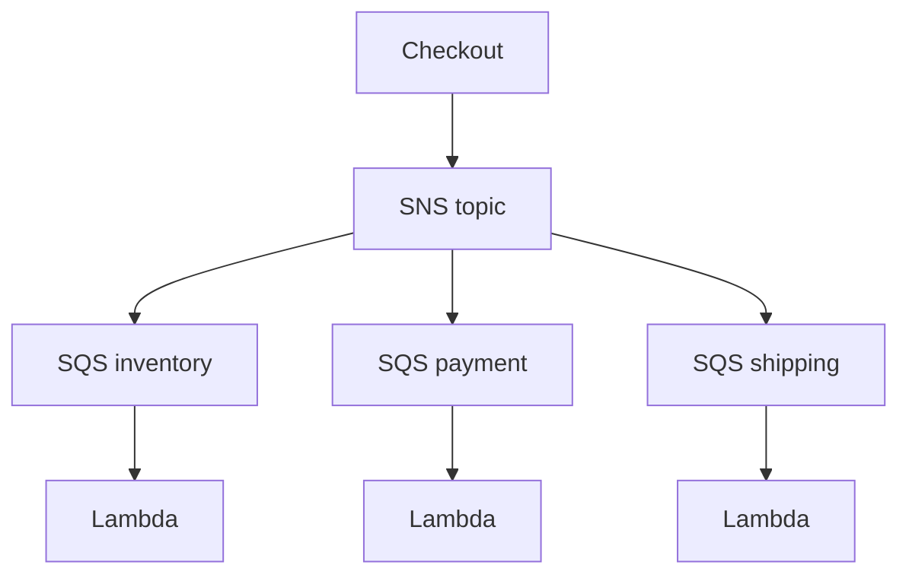

# Lab 20: Event-Driven Ordering Workflow

## Business Scenario
Order placement should trigger inventory, payment, and shipping workflows without making the checkout path wait on every downstream system.

## Core Services
SNS, SQS, Lambda, DynamoDB

## Target Architecture


## Step-by-Step
1. Publish an order-created event.
2. Fan the event out to service-specific queues.
3. Process each queue independently and store order state.

## CLI Commands
```bash
aws sns create-topic --name lab20-orders
aws sqs create-queue --queue-name lab20-inventory
aws lambda create-event-source-mapping --function-name lab20-inventory --event-source-arn arn:aws:sqs:ap-southeast-1:123456789012:lab20-inventory
aws sqs send-message --queue-url https://sqs.ap-southeast-1.amazonaws.com/123456789012/lab20-inventory --message-body "{\"orderId\":\"1001\"}"
```

## Expected Output
- The checkout path publishes once and returns quickly.
- Each downstream service processes its own queue.
- The DLQ catches poison messages without blocking the whole workflow.

## Failure Injection
Inject a poison message into one queue and confirm that only that queue backs up while the other queues continue.

## Decision Trade-offs
| Option | Best for | Strength | Weakness |
| --- | --- | --- | --- |
| SNS + SQS | Decoupled fanout | Durable and scalable | More moving parts. |
| EventBridge | Event routing | Rich filtering | Different consumer semantics. |
| Step Functions | Orchestration | Explicit workflow control | Less ideal for pure fanout. |

## Common Mistakes
- Assuming SQS standard queues preserve ordering.
- Skipping idempotency on consumers.
- Leaving out a DLQ for poison messages.

## Exam Question
**Q:** Which pattern best decouples checkout from downstream processing in an order system?

**A:** SNS plus SQS queues, because the event is fanned out and each consumer can process independently.

## Cleanup
- Delete the topic, queues, and DLQs.
- Remove Lambda event source mappings.
- Delete any DynamoDB tables used for order state.

