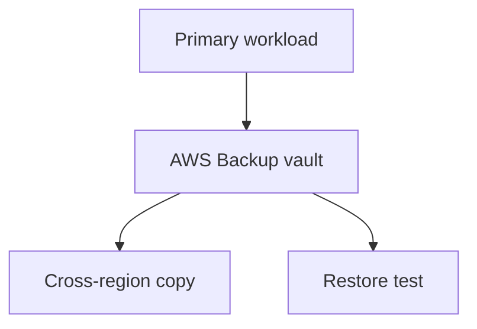

# Lab 21: Backup and DR Strategy

## Business Scenario
A team needs a low-cost disaster recovery plan that can restore data after deletion, corruption, or a region-wide issue.

## Core Services
AWS Backup, Snapshots, Cross-Region Restore, Route 53

## Target Architecture


## Step-by-Step
1. Create a backup plan and vault.
2. Run a backup job and copy it to a second region.
3. Perform a restore test and measure recovery time.

## CLI Commands
```bash
aws backup create-backup-vault --backup-vault-name lab21-vault
aws backup create-backup-plan --backup-plan file://backup-plan.json
aws backup start-backup-job --backup-vault-name lab21-vault --resource-arn arn:aws:rds:ap-southeast-1:123456789012:db:lab21-db --iam-role-arn arn:aws:iam::123456789012:role/Lab21BackupRole
aws backup start-restore-job --recovery-point-arn arn:aws:backup:ap-southeast-1:123456789012:recovery-point:123 --metadata file://restore.json
```

## Expected Output
- A recovery point appears in the vault.
- The restore job succeeds in the target account or region.
- Retention and copy rules are visible in the backup plan.

## Failure Injection
Delete or corrupt the primary resource and confirm the restore test proves the backup is usable.

## Decision Trade-offs
| Option | Best for | Strength | Weakness |
| --- | --- | --- | --- |
| Backup and restore | Lowest cost DR | Simple and cheap | Longer recovery time. |
| Pilot light | Medium resilience | Faster recovery | More infrastructure than backup only. |
| Warm standby | Faster failover | Better availability | Higher cost. |

## Common Mistakes
- Never testing restore, only backup creation.
- Keeping backups in only one account or region.
- Ignoring retention and lifecycle policy design.

## Exam Question
**Q:** Which DR pattern is usually the cheapest starting point for non-critical workloads?

**A:** Backup and restore, because you only pay for backups until you need to restore.

## Cleanup
- Delete backup plans and vaults if they were created only for the lab.
- Remove restore test resources.
- Verify no protected resources were left behind accidentally.

