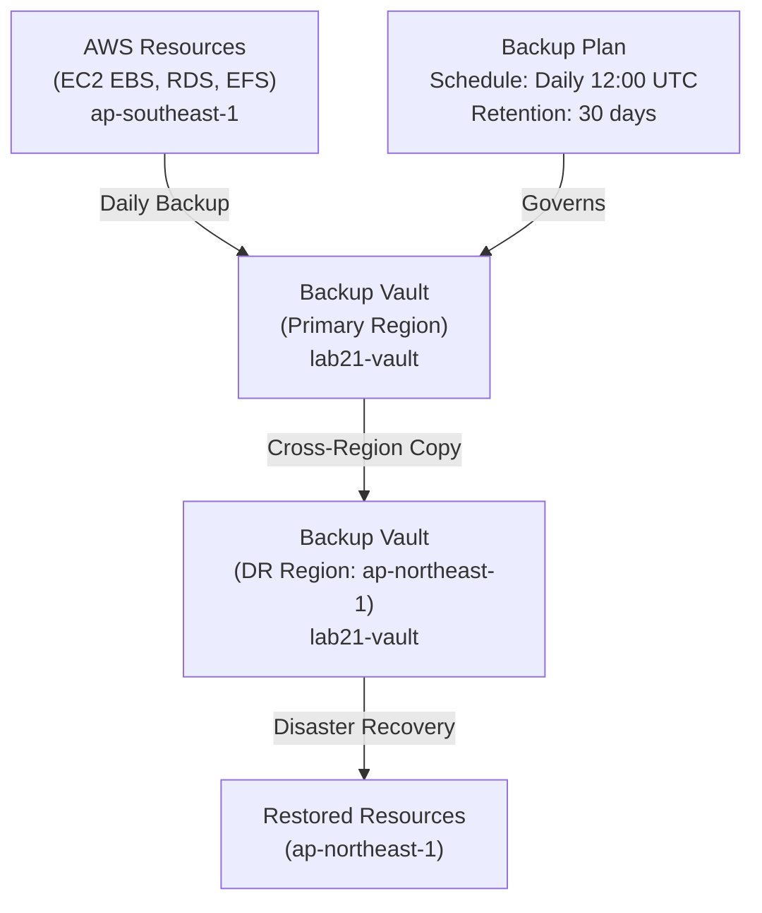

# Lab 21: Backup and DR Strategy

## Metadata
- Difficulty: Intermediate
- Time estimate: 20–30 minutes
- Estimated cost: Free Tier eligible (ค่า Storage ขึ้นกับขนาด Backup)
- Prerequisites: None
- Depends on: None

## Learning Objectives
หลังจากทำ Lab นี้เสร็จ ผู้เรียนจะสามารถ:
- สร้าง AWS Backup Vault ในทั้ง Primary และ DR Region
- สร้าง Backup Plan ที่รัน Daily และ Copy ข้ามไปยัง DR Region อัตโนมัติ
- อธิบายความแตกต่างระหว่าง DR Strategies (Backup/Restore, Pilot Light, Warm Standby, Multi-Site)
- เข้าใจกับดักของ KMS Key ข้ามภูมิภาค

## Business Scenario
ธุรกิจต้องการ Disaster Recovery Plan ในงบประมาณจำกัด เป้าหมายคือ:
- **RPO (Recovery Point Objective)**: ข้อมูลสูญหายได้ไม่เกิน 24 ชั่วโมง
- **RTO (Recovery Time Objective)**: กู้คืนภายใน 4 ชั่วโมง

หากไม่มีแผนนี้ เมื่อเกิด Region-wide Outage หรือ Human Error ลบข้อมูลทิ้ง ธุรกิจอาจไม่สามารถกลับมา Online ได้

## Core Services
AWS Backup, Snapshots, Cross-Region Restore

## Target Architecture


## Environment Setup
```bash
# กำหนดค่าเหล่านี้ก่อนรันคำสั่งใดๆ ใน Lab นี้
export AWS_REGION=ap-southeast-1
export TARGET_REGION=ap-northeast-1
export ACCOUNT_ID=$(aws sts get-caller-identity --query Account --output text)
export PROJECT_TAG=SAA-Lab-21
export VAULT_NAME="lab21-vault"
```

---

## Step-by-Step

### Phase 1 — สร้าง Backup Vault ทั้ง 2 Regions

สร้าง Vault เป็น "ตู้นิรภัย" สำหรับเก็บ Backup — ต้องมีทั้งใน Primary Region และ DR Region

#### 🖥️ วิธีทำผ่าน AWS Console (GUI)

1. ไปที่ **AWS Backup → Backup vaults → Create backup vault**
2. Region: `ap-southeast-1` → Name: `lab21-vault` → **Create backup vault**
3. เปลี่ยน Region เป็น `ap-northeast-1` แล้วทำซ้ำขั้นตอนเดิม

#### ⌨️ วิธีทำผ่าน CLI

```bash
# สร้าง Vault ใน DR Region ก่อน (จำเป็นสำหรับ Cross-Region Copy)
aws backup create-backup-vault \
  --backup-vault-name $VAULT_NAME \
  --region $TARGET_REGION
TARGET_VAULT_ARN=$(aws backup describe-backup-vault \
  --backup-vault-name $VAULT_NAME --region $TARGET_REGION \
  --query 'BackupVaultArn' --output text)

# สร้าง Vault ใน Primary Region
aws backup create-backup-vault \
  --backup-vault-name $VAULT_NAME \
  --region $AWS_REGION
```

**Expected output:** Backup Vault ถูกสร้างในทั้ง 2 Region

---

### Phase 2 — สร้าง Backup Plan (Daily + Cross-Region Copy)

กำหนด Schedule และนโยบาย Copy ข้ามไปยัง DR Region อัตโนมัติ

#### 🖥️ วิธีทำผ่าน AWS Console (GUI)

1. ไปที่ **AWS Backup → Backup plans → Create backup plan**
2. Start with template → **Daily-35day-Retention**
3. Backup plan name: `Lab21-Daily-With-DR`
4. Backup rule:
   - Schedule: Daily at 12:00 UTC
   - Lifecycle: Delete after 30 days
   - **Copy to another region** → Region: `ap-northeast-1` → Vault: `lab21-vault`
5. **Create plan**

#### ⌨️ วิธีทำผ่าน CLI

```bash
cat <<EOF > backup-plan.json
{
  "BackupPlanName": "Lab21-Daily-With-DR",
  "Rules": [{
    "RuleName": "DailyBackup",
    "TargetBackupVaultName": "$VAULT_NAME",
    "ScheduleExpression": "cron(0 12 * * ? *)",
    "StartWindowMinutes": 60,
    "CompletionWindowMinutes": 120,
    "Lifecycle": {"DeleteAfterDays": 30},
    "CopyActions": [{
      "DestinationBackupVaultArn": "$TARGET_VAULT_ARN",
      "Lifecycle": {"DeleteAfterDays": 30}
    }]
  }]
}
EOF
PLAN_ID=$(aws backup create-backup-plan \
  --backup-plan file://backup-plan.json \
  --query 'BackupPlanId' --output text)
echo "Backup Plan ID: $PLAN_ID"
```

**Expected output:** Backup Plan ID ถูกสร้าง Plan จะ Run ตาม Schedule ทุกวัน 12:00 UTC และ Copy ไปยัง `ap-northeast-1` อัตโนมัติ

---

### Phase 3 — สั่ง On-Demand Backup และทดสอบ Restore

ในสภาพแวดล้อมจริงให้ Attach Resource กับ Backup Plan แล้วทดสอบ Restore เพื่อยืนยันว่ากู้คืนได้จริง

#### 🖥️ วิธีทำผ่าน AWS Console (GUI)

**Assign Resources:**
1. ไปที่ Backup Plan `Lab21-Daily-With-DR` → **Assign resources**
2. Resource type: **EBS** หรือ **RDS** → เลือก Resource ที่ต้องการ

**On-Demand Backup:**
1. ไปที่ **Protected resources** → เลือก Resource → **Create on-demand backup**
2. Vault: `lab21-vault` → **Create backup**

**Restore Test:**
1. **Backup vaults → lab21-vault** → เลือก Recovery Point
2. คลิก **Restore** → กำหนดค่า Restore Settings → **Restore backup**

#### ⌨️ วิธีทำผ่าน CLI

```bash
# ตัวอย่าง: สั่ง On-Demand Backup สำหรับ EBS Volume
# aws backup start-backup-job \
#   --backup-vault-name $VAULT_NAME \
#   --resource-arn arn:aws:ec2:${AWS_REGION}:${ACCOUNT_ID}:volume/vol-0xxxxx \
#   --iam-role-arn arn:aws:iam::${ACCOUNT_ID}:role/service-role/AWSBackupDefaultServiceRole

# ดู Recovery Points ที่มีอยู่
aws backup list-recovery-points-by-backup-vault \
  --backup-vault-name $VAULT_NAME \
  --query 'RecoveryPoints[*].{ARN:RecoveryPointArn,Status:Status,Date:CreationDate}' \
  --output table
```

**Expected output:** Recovery Point ปรากฏใน Vault Primary Region และภายในเวลาไม่กี่ชั่วโมงจะปรากฏใน DR Region

---

## Failure Injection

จำลองสถานการณ์ Accidental Deletion โดยการ Disable KMS Key แล้วพยายาม Restore

**What to observe:** หาก Backup เข้ารหัสด้วย KMS Key ใน Region A และ Key ถูก Disable หรือไม่ได้ Copy ไปยัง Region B การ Restore จะล้มเหลวด้วย `KMS Key not accessible` — นี่คือ Failure Point ที่มักเจอเมื่อซ้อม DR ครั้งแรก

**How to recover:**
1. Enable KMS Key กลับมา หรือ
2. สร้าง Multi-Region KMS Key ที่ทำงานข้ามภูมิภาคได้ หรือ
3. Re-encrypt Backup ด้วย Key ใน DR Region

---

## Decision Trade-offs

| DR Strategy | RPO | RTO | ค่าใช้จ่าย (เปรียบเทียบ) | เหมาะกับ |
|---|---|---|---|---|
| **Backup & Restore** | หลายชั่วโมง | หลายชั่วโมง | ต่ำที่สุด (Storage เท่านั้น) | งบประมาณจำกัด |
| **Pilot Light** | นาที | 10-30 นาที | ต่ำ (Core Services เท่านั้น) | ธุรกิจขนาดกลาง |
| **Warm Standby** | วินาที-นาที | นาที | สูง (Infrastructure ขนาดย่อ) | ธุรกิจสำคัญ |
| **Multi-Site Active/Active** | 0 | < 1 วินาที | สูงมาก (2× Infrastructure) | Mission-critical |

---

## Common Mistakes

- **Mistake:** ไม่เคยทดสอบ Restore จริง (เน้นแค่สร้าง Backup Plan เสร็จ)
  **Why it fails:** Backup อาจ Restore ไม่ได้เพราะ KMS Key ข้ามภูมิภาค หรือ IAM Role ไม่มีสิทธิ์ Create Resource ต้องซ้อม Restore อย่างน้อยทุกไตรมาส

- **Mistake:** เก็บ Backup ไว้ใน Account หรือ Region เดียวกับ Production
  **Why it fails:** ผู้โจมตีที่ได้ Admin Access จะลบทั้ง Production Data และ Backup พร้อมกัน ควรเก็บใน Separate Account หรือ Cross-Region

- **Mistake:** ไม่กำหนด Lifecycle/Retention Policy
  **Why it fails:** AWS เก็บค่า Backup Storage รายเดือน Backup เก่าที่ไม่จำเป็นสะสมค่าใช้จ่ายไปเรื่อยๆ

---

## Exam Questions

**Q1:** บริษัทต้องการ DR ที่ถูกที่สุด ยอม RTO หลายชั่วโมง แต่ต้องการ Cross-Region ควรใช้กลยุทธ์ใด?
**A:** Backup and Restore แบบ Cross-Region
**Rationale:** จ่ายเฉพาะค่า Storage ใน DR Region ไม่มีค่า Compute Server ที่รันทิ้งไว้ เหมาะกับงบประมาณจำกัดที่ยอม RTO สูงได้

**Q2:** เมื่อทำ Cross-Region Restore จาก Backup ที่เข้ารหัสด้วย KMS Key ใน Region A ไปยัง Region B พบ Error เรื่อง KMS สาเหตุคืออะไร?
**A:** KMS Key มีขอบเขตการทำงานจำเพาะแต่ละ Region (Regionally scoped) ต้องใช้ Multi-Region KMS Key หรือ Re-encrypt ด้วย Key ใน DR Region
**Rationale:** KMS Key ปกติไม่สามารถใช้ข้ามภูมิภาคได้ การ Copy Backup ข้าม Region ต้องผ่านกระบวนการ Decrypt ด้วย Key เดิม แล้ว Encrypt ใหม่ด้วย Key ของ DR Region

---

## Cleanup (เรียงลำดับตามนี้เท่านั้น — ห้ามข้ามขั้นตอน)

```bash
# Step 1 — ลบ Backup Plan
PLAN_ID=$(aws backup list-backup-plans \
  --query "BackupPlansList[?BackupPlanName=='Lab21-Daily-With-DR'].BackupPlanId" \
  --output text)
aws backup delete-backup-plan --backup-plan-id $PLAN_ID

# Step 2 — ลบ Recovery Points ก่อน (Vault ต้องว่างก่อนจึงลบได้)
aws backup list-recovery-points-by-backup-vault \
  --backup-vault-name $VAULT_NAME \
  --query 'RecoveryPoints[*].RecoveryPointArn' \
  --output text | tr '\t' '\n' | \
  while read arn; do
    aws backup delete-recovery-point \
      --backup-vault-name $VAULT_NAME \
      --recovery-point-arn $arn || true
  done

# Step 3 — ลบ Vault (Primary และ DR Region)
aws backup delete-backup-vault --backup-vault-name $VAULT_NAME || echo "Vault may contain recovery points"
aws backup delete-backup-vault \
  --backup-vault-name $VAULT_NAME \
  --region $TARGET_REGION || echo "Target vault may contain recovery points"

# Step 4 — ตรวจสอบ
aws backup list-backup-plans \
  --query "BackupPlansList[?BackupPlanName=='Lab21-Daily-With-DR']" --output table || echo "✅ Backup Plan ลบแล้ว"
```
