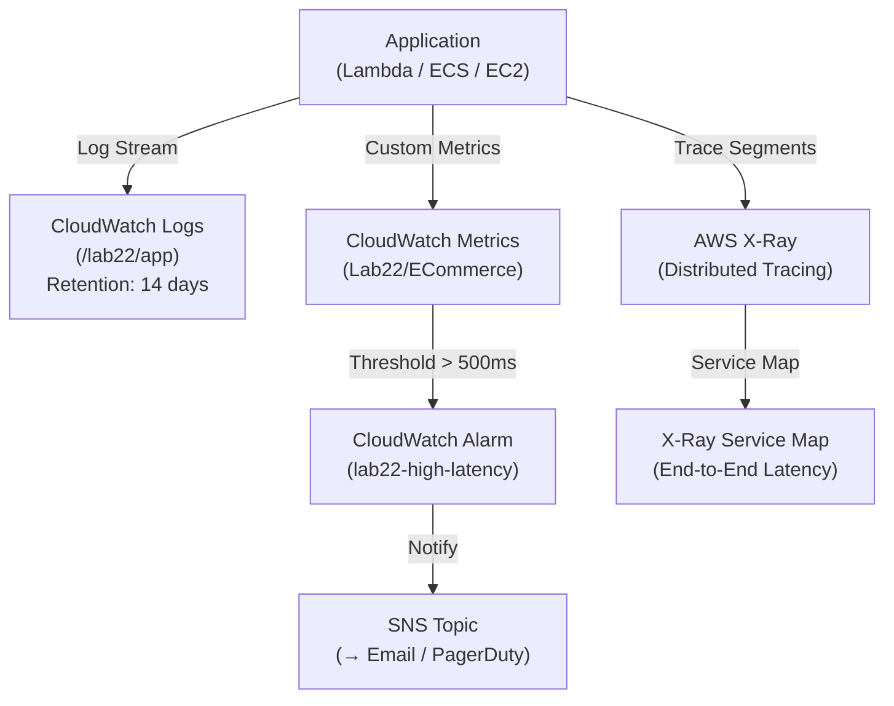

# Lab 22: Observability with CloudWatch and X-Ray

## Metadata
- Difficulty: Intermediate
- Time estimate: 20–30 minutes
- Estimated cost: Free Tier eligible
- Prerequisites: None
- Depends on: None

## Learning Objectives
หลังจากทำ Lab นี้เสร็จ ผู้เรียนจะสามารถ:
- สร้าง CloudWatch Log Group พร้อม Retention Policy
- Publish Custom Metrics ผ่าน AWS CLI
- สร้าง CloudWatch Alarm ที่ตอบสนองต่อ Metric Threshold
- อธิบายความแตกต่างระหว่าง Metrics, Logs, Traces และ X-Ray

## Business Scenario
แอปพลิเคชัน Microservices ประกอบด้วยหลาย Service (API Gateway → Lambda → Database) ทีม Support ได้รับ Report ว่า Payment API ช้ากว่าปกติ แต่ไม่ทราบว่าปัญหาอยู่ที่ Component ไหน

ระบบ Observability ที่ดีต้องมีทั้ง Metrics (ดู Trend), Logs (Debug Detail) และ Traces (ตามรอย Request ข้าม Service)

## Core Services
CloudWatch Logs, CloudWatch Metrics, Alarms, X-Ray

## Target Architecture


## Environment Setup
```bash
# กำหนดค่าเหล่านี้ก่อนรันคำสั่งใดๆ ใน Lab นี้
export AWS_REGION=ap-southeast-1
export ACCOUNT_ID=$(aws sts get-caller-identity --query Account --output text)
export PROJECT_TAG=SAA-Lab-22
export LOG_GROUP="/lab22/app"
export NS_METRICS="Lab22/ECommerce"
```

---

## Step-by-Step

### Phase 1 — สร้าง Log Group และ Publish Custom Metrics

สร้าง Log Group พร้อม Retention Policy และส่ง Custom Metric เพื่อจำลอง API Latency ที่สูง

#### 🖥️ วิธีทำผ่าน AWS Console (GUI)

**Log Group:**
1. ไปที่ **CloudWatch → Log groups → Create log group**
2. Name: `/lab22/app` → Retention: **14 days** → **Create**

**Custom Metrics:**
1. ไปที่ **CloudWatch → Metrics → All metrics → Custom Namespaces**
2. (Metrics จะปรากฏเองหลังจาก Publish ผ่าน CLI)

#### ⌨️ วิธีทำผ่าน CLI

```bash
# สร้าง Log Group พร้อม Retention 14 วัน
aws logs create-log-group --log-group-name $LOG_GROUP
aws logs put-retention-policy \
  --log-group-name $LOG_GROUP \
  --retention-in-days 14

# Publish Custom Metric จำลอง API Latency 600ms (สูงกว่า Threshold 500ms)
aws cloudwatch put-metric-data \
  --namespace $NS_METRICS \
  --metric-name API_Latency \
  --value 600 \
  --unit Milliseconds \
  --dimensions Service=Payment
```

**Expected output:** Log Group ถูกสร้างและ Custom Metric ปรากฏใน CloudWatch Console Namespace: `Lab22/ECommerce`

---

### Phase 2 — สร้าง CloudWatch Alarm

กำหนด Alarm ที่แจ้งเตือนเมื่อ Average Latency สูงกว่า 500ms ติดต่อกัน 1 Period

#### 🖥️ วิธีทำผ่าน AWS Console (GUI)

1. ไปที่ **CloudWatch → Alarms → Create alarm**
2. Select metric → Namespaces → `Lab22/ECommerce` → `API_Latency` → **Select metric**
3. Statistic: **Average** → Period: **1 minute**
4. Threshold: **Greater than 500**
5. Alarm name: `lab22-high-latency` → **Create alarm**

#### ⌨️ วิธีทำผ่าน CLI

```bash
aws cloudwatch put-metric-alarm \
  --alarm-name lab22-high-latency \
  --metric-name API_Latency \
  --namespace $NS_METRICS \
  --dimensions Name=Service,Value=Payment \
  --statistic Average \
  --period 60 \
  --threshold 500 \
  --comparison-operator GreaterThanThreshold \
  --evaluation-periods 1 \
  --treat-missing-data notBreaching \
  --alarm-description "Alert when Payment API Latency > 500ms"

# ตรวจสอบสถานะ Alarm
aws cloudwatch describe-alarms \
  --alarm-names lab22-high-latency \
  --query 'MetricAlarms[0].{State:StateValue,Threshold:Threshold}'
```

**Expected output:** Alarm สถานะ `ALARM` เพราะ Metric 600ms > Threshold 500ms

---

### Phase 3 — ตรวจสอบ X-Ray Traces (Conceptual)

X-Ray ต้องมีการฝัง SDK ในโค้ดเพื่อ Capture Traces ส่วนนี้สาธิตการดึง Trace Summary

#### 🖥️ วิธีทำผ่าน AWS Console (GUI)

1. ไปที่ **X-Ray → Service map** — แสดง Graph ของ Services ที่เชื่อมต่อกัน
2. **X-Ray → Traces** — แสดง Request Timeline แบบ Waterfall

#### ⌨️ วิธีทำผ่าน CLI

```bash
# ดึง Trace Summaries จากชั่วโมงที่ผ่านมา
START_TIME=$(date -u -d "1 hour ago" +%Y-%m-%dT%H:%M:%SZ 2>/dev/null || \
  date -u -v-1H +%Y-%m-%dT%H:%M:%SZ)
END_TIME=$(date -u +%Y-%m-%dT%H:%M:%SZ)
aws xray get-trace-summaries \
  --start-time $START_TIME \
  --end-time $END_TIME || echo "ไม่มี Active Traces (X-Ray SDK ยังไม่ได้ฝังในแอป)"
```

**Expected output:** หากมีแอปที่ติดตั้ง X-Ray SDK จะพบ Trace Summaries พร้อม Duration และ Service Path หากยังไม่ได้ฝัง SDK จะ Return Array ว่าง

---

## Failure Injection

Publish Metric ที่ Latency สูงซ้ำๆ เพื่อ Trigger Alarm เปลี่ยนสถานะ

```bash
for i in {1..3}; do
  aws cloudwatch put-metric-data \
    --namespace $NS_METRICS \
    --metric-name API_Latency \
    --value 750 \
    --unit Milliseconds \
    --dimensions Service=Payment
  sleep 15
done

# ตรวจสอบสถานะ Alarm
aws cloudwatch describe-alarms \
  --alarm-names lab22-high-latency \
  --query 'MetricAlarms[0].StateValue' --output text
```

**What to observe:** Alarm เปลี่ยนจาก `OK` เป็น `ALARM` — หาก Alarm มี Action เชื่อม SNS จะมี Email แจ้งอัตโนมัติ

**How to recover:**
```bash
# ยิง Metric ที่ Latency ต่ำเพื่อ Recover Alarm กลับมา OK
aws cloudwatch put-metric-data \
  --namespace $NS_METRICS \
  --metric-name API_Latency \
  --value 100 \
  --unit Milliseconds \
  --dimensions Service=Payment
```

---

## Decision Trade-offs

| เครื่องมือ | เหมาะกับ | ความแม่นยำ | ค่าใช้จ่าย |
|---|---|---|---|
| CloudWatch Metrics | Trend Monitoring, Alarm, Auto Scaling Trigger | สถิติโดยรวม | ฟรี 10 Metrics, $0.30/metric หลังจากนั้น |
| CloudWatch Logs | Root Cause Analysis, Debug Detail | บรรทัดต่อบรรทัด | $0.50/GB Ingestion |
| AWS X-Ray | Request Tracing ข้าม Microservices | Segment-level Timing | $5/1 ล้าน Traces ที่บันทึก |

---

## Common Mistakes

- **Mistake:** ไม่กำหนด Retention Policy ให้ Log Group
  **Why it fails:** CloudWatch Logs Default คือ Never Expire ค่า Storage จะบวมไปเรื่อยๆ ทุกปี ควรกำหนด Retention ที่เหมาะสม (7-30 วันสำหรับ Debug Logs, 90+ วันสำหรับ Compliance)

- **Mistake:** สร้าง Alarm โดยไม่กำหนด Dimension ให้ตรงกับ Metric
  **Why it fails:** ถ้า Metric Publish มา Dimension `Service=Payment` แต่ Alarm Monitor โดยไม่มี Dimension จะไม่ Match กัน Alarm จะไม่ทำงาน

- **Mistake:** พยายามหา Root Cause ด้วยแค่ Logs ในระบบ Microservices ที่ซับซ้อน
  **Why it fails:** ต้องใช้ Correlation ด้วย Trace ID ข้ามหลาย Log Groups — X-Ray แก้ปัญหานี้ด้วยการ Visualize Request Path แบบ End-to-End

- **Mistake:** เข้าใจว่า X-Ray ทำงานได้ทันทีโดยไม่ต้องแก้โค้ด
  **Why it fails:** X-Ray ต้องฝัง SDK ในแอปพลิเคชัน (หรือใช้ Lambda Layer/ECS Fargate Auto-instrumentation) และต้องกำหนด IAM Policy `xray:PutTraceSegments`

---

## Exam Questions

**Q1:** ทีม Developer ต้องการตามรอย HTTP Request ข้ามหลาย Service (API Gateway → Lambda → DynamoDB) เพื่อหา Bottleneck ควรใช้เครื่องมือใด?
**A:** AWS X-Ray
**Rationale:** X-Ray ให้ Service Map แบบ Visual และ Trace Timeline แสดง Duration ของแต่ละ Segment/Sub-segment ทำให้เห็นได้ชัดว่า Latency เกิดที่ Component ไหน

**Q2:** ต้องการนับจำนวนคำว่า "ERROR" ใน Log แล้วใช้ Trigger CloudWatch Alarm อัตโนมัติ ควรใช้ Feature ใด?
**A:** CloudWatch Metric Filter
**Rationale:** Metric Filter แปลง Log Events ที่ Match Pattern (เช่น "ERROR") ให้เป็น Custom Metric ซึ่งสามารถ Alarm ได้ — ทำให้ไม่ต้องเขียน Lambda มา Parse Log เอง

---

## Cleanup (เรียงลำดับตามนี้เท่านั้น — ห้ามข้ามขั้นตอน)

```bash
# Step 1 — ลบ Alarm
aws cloudwatch delete-alarms --alarm-names lab22-high-latency

# Step 2 — ลบ Log Group
aws logs delete-log-group --log-group-name $LOG_GROUP

# Step 3 — ตรวจสอบ
aws cloudwatch describe-alarms \
  --alarm-names lab22-high-latency 2>&1 || echo "✅ Alarm ลบแล้ว"

# หมายเหตุ: Custom Metrics จะหมดอายุเองใน 15 เดือนหากไม่มีข้อมูลใหม่
echo "Custom Metrics (Lab22/ECommerce) จะหมดอายุอัตโนมัติใน 15 เดือน"
```
