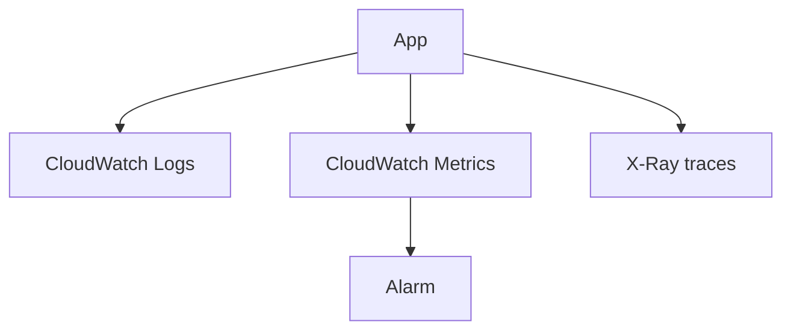

# Lab 22: Observability with CloudWatch and X-Ray

## Business Scenario
A service team wants to see latency, errors, logs, and traces in one place so they can identify the bottleneck quickly.

## Core Services
CloudWatch Logs, CloudWatch Metrics, Alarms, X-Ray

## Target Architecture


## Step-by-Step
1. Create a log group and publish application metrics.
2. Add an alarm for errors or latency.
3. Enable X-Ray tracing and inspect the request path.

## CLI Commands
```bash
aws logs create-log-group --log-group-name /lab22/app
aws cloudwatch put-metric-alarm --alarm-name lab22-high-latency --metric-name Latency --namespace Lab22 --statistic Average --period 60 --threshold 500 --comparison-operator GreaterThanThreshold --evaluation-periods 1
aws xray get-trace-summaries --start-time 2026-03-18T00:00:00Z --end-time 2026-03-18T01:00:00Z
aws cloudwatch describe-alarms --alarm-names lab22-high-latency
```

## Expected Output
- The CloudWatch alarm changes state when the metric crosses the threshold.
- Logs capture the failing request or exception.
- X-Ray shows the downstream hop that consumed the time.

## Failure Injection
Inject latency or an error, then confirm the alarm, logs, and trace all line up on the same request.

## Decision Trade-offs
| Option | Best for | Strength | Weakness |
| --- | --- | --- | --- |
| Metrics | Fast detection | Low cost and alerting | No payload detail. |
| Logs | Forensics | Rich context | Harder to aggregate. |
| Traces | Request path | End-to-end timing | Requires instrumentation. |

## Common Mistakes
- Setting no retention on log groups.
- Creating alarms without the right dimensions.
- Trying to debug only with logs when tracing is available.

## Exam Question
**Q:** Which tool best shows the path of one slow request across services?

**A:** X-Ray traces, because they show the end-to-end request flow and timing.

## Cleanup
- Delete the alarms and log groups.
- Disable tracing if it was enabled only for the lab.
- Remove any custom metrics created for the exercise.

