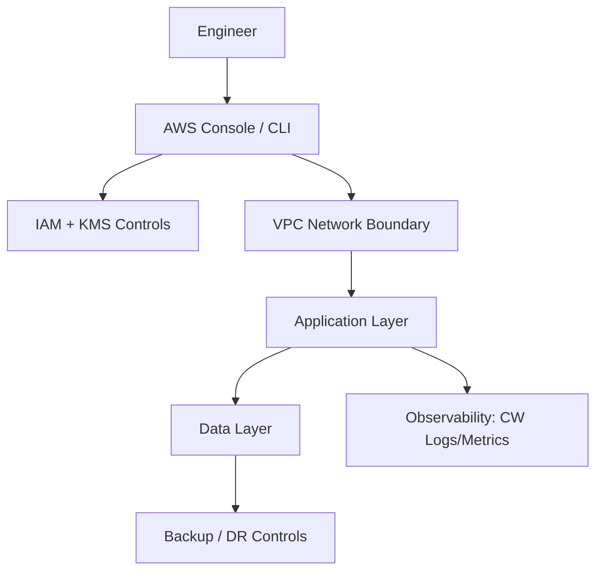

# Lab 22: Observability with CloudWatch Logs, Metrics, Alarms, and X-Ray

## Business Scenario
You are the cloud architect for a team preparing production-grade AWS workloads and SAA-C03 interview/exam scenarios. This lab simulates real design decisions under constraints (security, availability, latency, and cost).

## Core Services
CloudWatch, X-Ray

## Learning Outcomes
- Correlate metrics, logs, and traces for faster incident response.
- Explain *why* one option is better than alternatives for the given constraints.
- Produce evidence (screenshots/logs/metrics) to defend your architecture decision.

## Difficulty / Time / Cost
- **Difficulty**: Intermediate → Advanced
- **Estimated time**: 90–180 minutes
- **Estimated cost**: Low-to-medium (depends on runtime; terminate resources immediately after validation)

## Exam Domain Mapping (SAA-C03)
- **Secure architectures**: IAM boundaries, encryption, least-privilege validation.
- **Resilient architectures**: fault isolation across AZs, failure testing, recovery checks.
- **High-performing architectures**: right service choices, scaling patterns, latency checks.
- **Cost-optimized architectures**: right-sizing, lifecycle policies, managed-service trade-offs.

## Lab Format (How to run)
1. Build exactly as described.
2. Record observations after each phase (latency, cost, availability).
3. Break one component intentionally (failure injection).
4. Verify monitoring + recovery behavior.
5. Clean up everything at the end.


## Prerequisites
- AWS account (preferably sandbox) + admin role for lab setup.
- AWS CLI configured (`aws configure`) and default region selected.
- Basic familiarity with IAM, VPC, EC2, and CloudWatch.
- Tagging standard prepared: `Project=SAA-Lab-22`, `Owner=<your-name>`, `TTL=<date>`.

## Target Architecture


## Implementation Phases (Detailed)
### Phase 0 — Planning & Guardrails
1. Define workload requirement in one paragraph (SLA, security class, RTO/RPO, budget ceiling).
2. Create mandatory tags and naming convention for every resource.
3. Decide “must-have controls” before deployment (encryption, logging, alerting).

### Phase 1 — Foundation Build
1. Provision required network and identity prerequisites.
2. Create baseline roles/policies with least privilege (avoid wildcard actions/resources).
3. Enable baseline logs/metrics before workload launch.

### Phase 2 — Workload Deployment
1. Deploy workload components for this lab objective.
2. Apply security controls (encryption at rest/in transit, inbound restrictions, secret isolation).
3. Configure scaling/failover behavior where applicable.

### Phase 3 — Validation (Functional + Security)
1. Run happy-path functional test (expected business behavior).
2. Run negative test (blocked access / invalid input / forced failure).
3. Confirm logs capture both success and failure events.

### Phase 4 — Resilience / Performance Test
1. Simulate single-component disruption.
2. Measure time to recover, error rate impact, and user-visible behavior.
3. Document whether requirements were met.

### Phase 5 — Cost & Operational Review
1. List top cost drivers from this design.
2. Propose at least 2 cheaper alternatives and explain trade-offs.
3. Add alarms/budgets for runaway cost risk.

### Phase 6 — Evidence Pack
Collect:
- Console screenshots for architecture and security settings.
- CLI outputs for core resources.
- CloudWatch metrics/alarms proving system behavior.
- A short postmortem paragraph (what failed, why, and mitigation).

## Validation Checklist (Must Pass)
- [ ] Required resources created with correct tags.
- [ ] Least-privilege access confirmed (no unnecessary wildcard permissions).
- [ ] Encryption configured where data is stored.
- [ ] Monitoring and alerting enabled for critical signals.
- [ ] Failure test executed and documented.
- [ ] Cleanup tested and verified.

## CLI Verification Examples
```bash
aws sts get-caller-identity
aws resourcegroupstaggingapi get-resources --tag-filters Key=Project,Values=SAA-Lab-22
aws cloudwatch describe-alarms --max-records 20
```

## Troubleshooting Playbook
- If deployment fails, check IAM permission boundaries and service-linked roles.
- If connectivity fails, inspect route tables, SG/NACL, endpoint policies, and DNS settings.
- If failover doesn’t trigger, verify health checks/thresholds and cooldown timers.
- If logs are empty, confirm agent/integration and IAM write permissions to log groups.

## Common SAA-C03 Traps for This Topic
1. Choosing a service that solves performance but violates security requirement.
2. Assuming HA == DR (it is not; DR includes region-level recovery design).
3. Ignoring operational burden when a managed option exists.
4. Over-engineering for rare edge cases while missing baseline controls.

## Exam-Style Questions
1. Which design change improves resilience with the smallest operational overhead?
2. Which option best reduces cost without violating RTO/RPO?
3. Which control enforces least privilege most effectively in this scenario?

## Cleanup (Strict)
1. Delete app/data resources created by this lab.
2. Remove temporary IAM roles/policies not reused.
3. Delete network artifacts created solely for the lab.
4. Confirm zero unexpected running resources via Cost Explorer next day.

## Extension Challenges (Optional, Advanced)
- Re-implement this lab with Terraform.
- Add canary/chaos test step and capture MTTR metrics.
- Add CI validation (lint + policy checks) before deployment.
