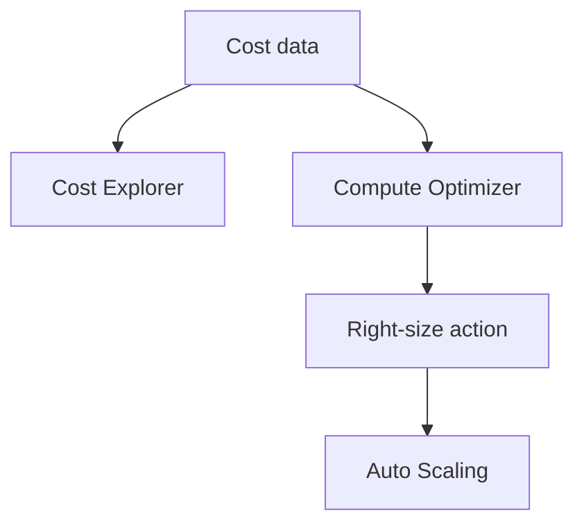

# Lab 23: Cost Optimization Deep Dive

## Business Scenario
A product team needs to reduce monthly spend without hurting the production SLOs of a mostly steady application.

## Core Services
Cost Explorer, Compute Optimizer, EC2, Auto Scaling

## Target Architecture


## Step-by-Step
1. Review current spend and usage patterns.
2. Check recommendation tools for underused resources.
3. Apply one safe right-sizing or scheduling change and re-measure.

## CLI Commands
```bash
aws ce get-cost-and-usage --time-period Start=2026-03-01,End=2026-03-18 --granularity MONTHLY --metrics UnblendedCost
aws compute-optimizer get-ec2-instance-recommendations --account-ids 123456789012
aws autoscaling update-auto-scaling-group --auto-scaling-group-name lab23-asg --min-size 1 --max-size 2 --desired-capacity 1
aws ec2 stop-instances --instance-ids i-12345678
```

## Expected Output
- Cost Explorer shows the major cost drivers.
- Compute Optimizer identifies underutilized compute.
- A safe change lowers spend without breaking the workload.

## Failure Injection
Leave one oversized or idle resource running, then compare the spend before and after the fix.

## Decision Trade-offs
| Option | Best for | Strength | Weakness |
| --- | --- | --- | --- |
| Rightsizing | Steady workloads | Immediate savings | Needs measurement. |
| Savings Plans | Predictable baseline | Good discount | Commitment required. |
| Scheduling | Dev/test environments | Simple and effective | Not for 24/7 workloads. |

## Common Mistakes
- Optimizing cost before knowing the usage profile.
- Ignoring data transfer and storage costs.
- Turning off critical capacity just to save money.

## Exam Question
**Q:** What is usually the safest first move when reducing cost on a steady workload?

**A:** Right-size the obvious overprovisioned resources, then consider commitment discounts for the remaining baseline.

## Cleanup
- Stop or terminate any test instances.
- Revert temporary size or schedule changes if needed.
- Record the cost delta and remove temporary permissions.

