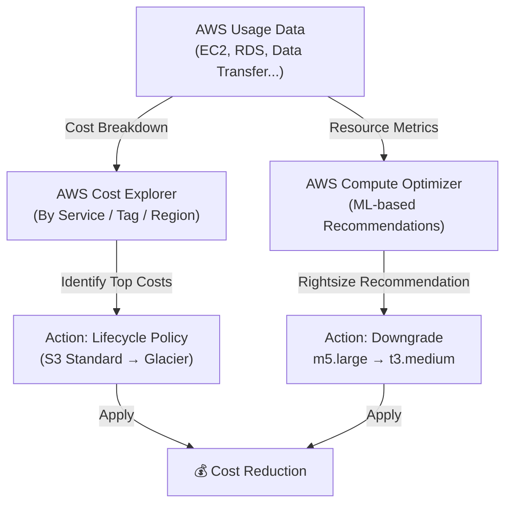

# Lab 23: Cost Optimization Deep Dive

## Metadata
- Difficulty: Intermediate
- Time estimate: 15–20 minutes
- Estimated cost: Free Tier eligible
- Prerequisites: None
- Depends on: None

## Learning Objectives
หลังจากทำ Lab นี้เสร็จ ผู้เรียนจะสามารถ:
- ใช้ AWS Cost Explorer วิเคราะห์ค่าใช้จ่ายแยกตาม Service
- ใช้ AWS Compute Optimizer ตรวจสอบ Right-sizing Recommendations
- อธิบายความแตกต่างระหว่าง On-Demand, Reserved, Spot และ Savings Plans
- ระบุแหล่ง Hidden Costs ที่มักถูกมองข้าม

## Business Scenario
ทีม Product ถูกสั่งให้ลดค่าใช้จ่าย Cloud รายเดือน 30% โดย SLO ห้ามแย่ลง ทีมต้องวิเคราะห์ว่าทรัพยากรชนิดใดใช้งานต่ำกว่าที่ Provision ไว้ และ Workload ประเภทใดสมควรย้ายไปใช้ Spot หรือ Reserved Instances

การ Optimize Cost ที่ผิดพลาดโดยไม่อ่านข้อมูลก่อน อาจทำให้ระบบล่มสร้างความเสียหายรายได้มากกว่าค่าเซิร์ฟเวอร์หลายเท่า

## Core Services
Cost Explorer, Compute Optimizer, EC2, Auto Scaling

## Target Architecture


## Environment Setup
```bash
# กำหนดค่าเหล่านี้ก่อนรันคำสั่งใดๆ ใน Lab นี้
export AWS_REGION=ap-southeast-1
export ACCOUNT_ID=$(aws sts get-caller-identity --query Account --output text)
export PROJECT_TAG=SAA-Lab-23
```

---

## Step-by-Step

### Phase 1 — วิเคราะห์ค่าใช้จ่ายด้วย Cost Explorer

ดูค่าใช้จ่ายย้อนหลัง 1 เดือน แยกตาม AWS Service เพื่อระบุ Top Cost Drivers

#### 🖥️ วิธีทำผ่าน AWS Console (GUI)

1. ไปที่ **Cost Explorer → Cost & Usage** (ต้องเปิดใช้งานครั้งแรก อาจรอ 24 ชั่วโมง)
2. Group by: **Service** → Time range: **Last 1 month**
3. สังเกตว่า EC2, RDS, Data Transfer คิดเป็น % เท่าไหร่ของบิลทั้งหมด
4. ดู **Rightsizing recommendations** ใต้ Cost Optimization

#### ⌨️ วิธีทำผ่าน CLI

```bash
# ดูค่าใช้จ่ายเดือนที่แล้ว แยกตาม Service
START=$(date -d "$(date +%Y-%m-01) -1 month" +%Y-%m-%d 2>/dev/null || date -v-1m -v1d +%Y-%m-%d)
END=$(date +%Y-%m-%d)

aws ce get-cost-and-usage \
  --time-period Start=$START,End=$END \
  --granularity MONTHLY \
  --metrics UnblendedCost \
  --group-by Type=DIMENSION,Key=SERVICE \
  --query 'ResultsByTime[0].Groups[*].{Service:Keys[0],Cost:Metrics.UnblendedCost.Amount}' \
  --output table 2>/dev/null || echo "Cost Explorer ต้องเปิดใช้งานใน Console ก่อน (อาจรอ 24 ชั่วโมงหลังเปิดบัญชีใหม่)"
```

**Expected output:** ตาราง Cost แยกตาม Service เช่น EC2, RDS, S3, Data Transfer — ระบุ Top 3 Cost Drivers

---

### Phase 2 — ตรวจสอบ Right-sizing Recommendations ด้วย Compute Optimizer

Compute Optimizer วิเคราะห์ CloudWatch Metrics ย้อนหลัง 14 วัน และแนะนำการปรับขนาด Instance ที่เหมาะสม

#### 🖥️ วิธีทำผ่าน AWS Console (GUI)

1. ไปที่ **Compute Optimizer → Dashboard**
   - หากยังไม่ได้ Opt-in คลิก **Opt in to Compute Optimizer**
2. ดู **EC2 instances** → ตรวจสอบ Instance ที่มี `Under-provisioned` หรือ `Over-provisioned`
3. คลิก Instance เพื่อดู Recommendation Detail (เช่น ลด `m5.large` → `t3.medium`)

#### ⌨️ วิธีทำผ่าน CLI

```bash
# Opt-in เพื่อเปิดใช้งาน Compute Optimizer (ทำครั้งเดียว)
aws compute-optimizer update-enrollment-status --status Active 2>/dev/null || true

# ดู EC2 Recommendations (ต้องรอ 24-48 ชั่วโมงหลัง Opt-in)
aws compute-optimizer get-ec2-instance-recommendations \
  --account-ids $ACCOUNT_ID \
  --query 'instanceRecommendations[*].{Instance:instanceArn,Finding:finding,RecommendedType:recommendationOptions[0].instanceType}' \
  --output table 2>/dev/null || echo "ยังไม่มีข้อมูล Recommendation — รอ 24-48 ชั่วโมงหลัง Opt-in"
```

**Expected output:** รายการ Instance ที่ Compute Optimizer แนะนำให้ Rightsize พร้อม Projected Cost Savings

---

### Phase 3 — สาธิตกลยุทธ์ลดค่าใช้จ่ายที่ปลอดภัย

วิธีลด Cost ที่ปลอดภัยโดยไม่กระทบ SLO

#### 🖥️ วิธีทำผ่าน AWS Console (GUI)

**ลด Min Size ของ ASG ใน Off-peak:**
1. ไปที่ **EC2 → Auto Scaling Groups** → เลือก Group
2. คลิก **Edit** → ลด Min Capacity ลงตาม Recommendation
3. สังเกต Desired Capacity เปลี่ยนแปลงและ Cost ลดลงเดือนถัดไป

**S3 Lifecycle Policy:**
1. ไปที่ **S3 → Bucket → Management → Lifecycle rules**
2. สร้าง Rule: Move to Glacier after 90 days, Delete after 365 days

#### ⌨️ วิธีทำผ่าน CLI

```bash
# ตัวอย่าง: ปรับ ASG ให้ Min Capacity ลดลงตาม Recommendation
# (ใช้ชื่อ ASG ของ Lab อื่นที่มีอยู่)
# aws autoscaling update-auto-scaling-group \
#   --auto-scaling-group-name <your-asg-name> \
#   --min-size 1 --max-size 4 --desired-capacity 1

# ดู Instance ที่ใช้งาน Low CPU (< 10% อาจเป็น Target Downgrade)
aws cloudwatch get-metric-statistics \
  --namespace AWS/EC2 \
  --metric-name CPUUtilization \
  --statistics Average \
  --period 86400 \
  --start-time $(date -d "7 days ago" +%Y-%m-%dT%H:%M:%SZ 2>/dev/null || date -u -v-7d +%Y-%m-%dT%H:%M:%SZ) \
  --end-time $(date -u +%Y-%m-%dT%H:%M:%SZ) \
  --dimensions Name=InstanceId,Value=<INSTANCE_ID> 2>/dev/null || echo "ระบุ Instance ID ที่ต้องการตรวจสอบ"
```

**Expected output:** ข้อมูล CPU ย้อนหลัง 7 วัน — ถ้าค่าเฉลี่ยต่ำกว่า 10% เป็น Candidate สำหรับ Downgrade หรือ Convert เป็น Spot

---

## Failure Injection

ลด Desired Capacity ของ Production ASG เร็วเกินไปโดยไม่ดูข้อมูล

**What to observe:** การลด Desired Count เร็วเกิน อาจทำให้ ALB Target Group มี Healthy Instances ไม่พอ Latency พุ่งสูง จนถึง 502/503 Errors

**How to recover:**
```bash
# เพิ่ม Capacity กลับทันที
# aws autoscaling update-auto-scaling-group \
#   --auto-scaling-group-name <asg-name> \
#   --desired-capacity <original-count>
```

กฎสำคัญ: ทดสอบ Rightsize ใน Non-Production ก่อนเสมอ และดู Metrics อย่างน้อย 1-2 สัปดาห์ก่อน Apply

---

## Decision Trade-offs

| Pricing Model | เหมาะกับ | ส่วนลดสูงสุด | ข้อจำกัด |
|---|---|---|---|
| On-Demand | Dev/Test, Unpredictable Workloads | 0% (ราคาเต็ม) | ไม่มี Commitment |
| Savings Plans | Consistent Compute (Flexible) | สูงสุด 66% | Commit 1 หรือ 3 ปี |
| Reserved Instances | Steady-state Production | สูงสุด 72% | Commit Instance Type/Region |
| Spot Instances | Fault-tolerant, Batch, Flexible | สูงสุด 90% | อาจถูก Terminate ใน 2 นาที |

---

## Common Mistakes

- **Mistake:** ซื้อ Reserved Instances ทันทีในเดือนแรก โดยยังไม่รู้ Traffic Pattern
  **Why it fails:** Overcommit Instance Type หรือ Region ที่ไม่ตรงกับ Workload จริง RI ที่ไม่ได้ใช้ยังเสียเงินตาม Commitment

- **Mistake:** มองข้าม Data Transfer Costs
  **Why it fails:** Traffic ข้าม AZ ภายใน Region มีค่า $0.01/GB ที่ดูเล็กน้อยแต่เมื่อรวมกับ Volume ขนาดใหญ่จะเป็นส่วนใหญ่ของบิล ควรวาง Resources ใน AZ เดียวกันเมื่อเป็นไปได้

- **Mistake:** เก็บ Log ไว้ใน S3 Standard ตลอดไม่มีการ Archive
  **Why it fails:** S3 Standard มีราคาสูงกว่า Glacier ถึง 20× ควรตั้ง Lifecycle Policy ย้ายไป Glacier Instant Retrieval หลัง 90 วัน และ Deep Archive หลัง 180 วัน

---

## Exam Questions

**Q1:** แอปพลิเคชันรัน 24/7 ตลอด 3 ปีด้วย Consistent Load วิธีชำระเงินแบบใดประหยัดที่สุด?
**A:** EC2 Reserved Instances หรือ Compute Savings Plans แบบ 3 ปี All Upfront
**Rationale:** All Upfront 3 ปีให้ส่วนลดสูงสุดถึง 72% เหมาะกับ Steady-state Workload ที่คาดเดา Usage ได้ล่วงหน้า

**Q2:** Batch Processing ขนาดใหญ่ที่ทนต่อการ Interrupt ได้ และใช้ SQS รับงาน ควรใช้ EC2 ประเภทใดเพื่อลดต้นทุน?
**A:** Amazon EC2 Spot Instances
**Rationale:** Spot Instances ราคาถูกสูงสุด 90% จาก On-Demand เหมาะกับ Fault-tolerant Batch Jobs ที่ใช้ SQS — ถ้า Instance ถูก Terminate งานจะไม่หาย เพราะ SQS เก็บ Message ไว้รอ

---

## Cleanup

```bash
# Lab นี้ไม่ได้สร้าง Resource ถาวร
# Compute Optimizer Opt-in ไม่มีค่าใช้จ่าย
# Cost Explorer Query ไม่มีค่าใช้จ่าย (เกิน 1 ล้าน Rows อาจมีค่า)
echo "✅ ไม่มี Resource ที่ต้องลบใน Lab นี้"
```
