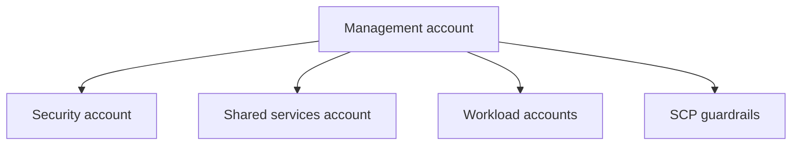

# Lab 24: Multi-Account Landing Zone

## Business Scenario
A company wants separate security, shared services, and workload accounts with guardrails that apply organization-wide.

## Core Services
AWS Organizations, SCPs, IAM, CloudTrail

## Target Architecture


## Step-by-Step
1. Create organizational units for security, shared services, and workloads.
2. Attach service control policies that deny unsafe actions.
3. Move a test account and verify the guardrail takes effect.

## CLI Commands
```bash
aws organizations create-organization
aws organizations create-organizational-unit --parent-id r-root --name Security
aws organizations attach-policy --policy-id p-12345678 --target-id ou-1234
aws organizations move-account --account-id 123456789012 --source-parent-id ou-old --destination-parent-id ou-new
```

## Expected Output
- Accounts are grouped by function, not by ad hoc ownership.
- SCPs block disallowed actions even if IAM would otherwise allow them.
- Central logging and security controls live in dedicated accounts.

## Failure Injection
Attempt a blocked action such as public S3 creation or root-based changes in a restricted account and confirm the SCP stops it.

## Decision Trade-offs
| Option | Best for | Strength | Weakness |
| --- | --- | --- | --- |
| SCPs | Org-wide guardrails | Strong preventative control | Do not grant permissions by themselves. |
| IAM policies | Per-principal access | Flexible | Account-local only. |
| Control Tower | Opinionated landing zone | Fast setup | Less custom than pure Organizations. |

## Common Mistakes
- Thinking SCPs grant permissions.
- Leaving root accounts unmanaged.
- Skipping centralized logging and security accounts.

## Exam Question
**Q:** Which control is best for denying unsafe actions across an entire AWS Organization?

**A:** Service control policies, because they set the maximum permissions available in the organization or OU.

## Cleanup
- Detach temporary SCPs or move test accounts back.
- Delete experimental OUs if they were created only for the lab.
- Confirm the organization still has the desired logging and security structure.

