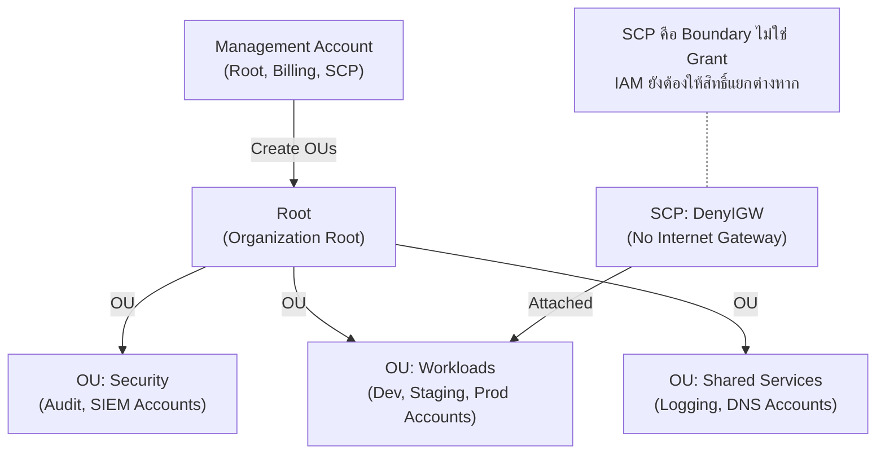

# Lab 24: Multi-Account Landing Zone

## Metadata
- Difficulty: Advanced
- Time estimate: 30–45 minutes
- Estimated cost: Free Tier eligible
- Prerequisites: สิทธิ์ Management Account ใน AWS Organizations
- Depends on: None

## Learning Objectives
หลังจากทำ Lab นี้เสร็จ ผู้เรียนจะสามารถ:
- สร้าง Organizational Units (OUs) ภายใน AWS Organizations
- เขียนและ Attach Service Control Policy (SCP) เพื่อ Block การสร้าง Internet Gateway
- เข้าใจว่า SCP ไม่ใช่ Permission Grant แต่เป็น Maximum Permission Boundary
- อธิบายความแตกต่างระหว่าง Organizations + SCP กับ IAM Policy

## Business Scenario
บริษัทขนาดใหญ่มีหลาย Team แต่ละ Team ใช้ AWS Account ของตนเอง (Multi-Account Strategy) แต่ CISO ต้องการ Guardrails ที่ป้องกันไม่ให้ Team ใดสร้าง Internet-facing Resources โดยไม่ได้รับอนุญาต

SCP เป็นเครื่องมือเดียวที่ทำงานข้าม Account ทั้งหมด ไม่ว่าผู้ใช้ใน Account ลูกจะมี Admin Permission ระดับใดก็ตาม

## Core Services
AWS Organizations, SCPs, IAM, CloudTrail

## Target Architecture


## Environment Setup
```bash
# กำหนดค่าเหล่านี้ก่อนรันคำสั่งใดๆ ใน Lab นี้
export AWS_REGION=ap-southeast-1
export ACCOUNT_ID=$(aws sts get-caller-identity --query Account --output text)
export PROJECT_TAG=SAA-Lab-24
```

---

## Step-by-Step

### Phase 1 — เปิดใช้งาน Organizations และสร้าง Organizational Units

สร้าง OU สำหรับจัดกลุ่ม Account ตาม Purpose (Security, Workloads, Shared Services)

#### 🖥️ วิธีทำผ่าน AWS Console (GUI)

1. ไปที่ **AWS Organizations → AWS accounts**
2. หากยังไม่มี Organization: คลิก **Create an organization**
3. คลิก **Root** → **Actions → Create new**:
   - OU Name: `Security` → **Create organizational unit**
   - ทำซ้ำสำหรับ `Workloads` และ `SharedServices`

#### ⌨️ วิธีทำผ่าน CLI

```bash
# เปิดสร้าง Organization (ทำครั้งแรกเท่านั้น หากยังไม่มี)
# aws organizations create-organization --feature-set ALL

# ดึง Root ID
ORG_ROOT_ID=$(aws organizations list-roots \
  --query 'Roots[0].Id' --output text)
echo "Root ID: $ORG_ROOT_ID"

# สร้าง Organizational Units
OU_SEC_ID=$(aws organizations create-organizational-unit \
  --parent-id $ORG_ROOT_ID \
  --name Security \
  --query 'OrganizationalUnit.Id' --output text)
OU_WORK_ID=$(aws organizations create-organizational-unit \
  --parent-id $ORG_ROOT_ID \
  --name Workloads \
  --query 'OrganizationalUnit.Id' --output text)
echo "Security OU: $OU_SEC_ID"
echo "Workloads OU: $OU_WORK_ID"
```

**Expected output:** OU Security และ Workloads ถูกสร้างใต้ Root

---

### Phase 2 — สร้างและ Attach Service Control Policy

เขียน SCP ที่ Deny การสร้าง Internet Gateway และ Attach เข้า OU Workloads

#### 🖥️ วิธีทำผ่าน AWS Console (GUI)

1. ไปที่ **Organizations → Policies → Service control policies**
2. หาก SCP ยังไม่ Enabled: คลิก **Enable service control policies**
3. **Create policy** → Name: `DenyIGW`
4. ใส่ Policy JSON:
   ```json
   {
     "Version": "2012-10-17",
     "Statement": [{
       "Sid": "DenyInternetGatewayCreation",
       "Effect": "Deny",
       "Action": "ec2:CreateInternetGateway",
       "Resource": "*"
     }]
   }
   ```
5. **Create policy**
6. ไปที่ OU **Workloads** → **Policies** → **Attach** → เลือก `DenyIGW`

#### ⌨️ วิธีทำผ่าน CLI

```bash
# เปิดใช้งาน SCP บน Root (ทำครั้งแรกเท่านั้น)
aws organizations enable-policy-type \
  --root-id $ORG_ROOT_ID \
  --policy-type SERVICE_CONTROL_POLICY 2>/dev/null || true

# สร้าง SCP
cat <<'EOF' > scp-no-igw.json
{
  "Version": "2012-10-17",
  "Statement": [{
    "Sid": "DenyInternetGatewayCreation",
    "Effect": "Deny",
    "Action": "ec2:CreateInternetGateway",
    "Resource": "*"
  }]
}
EOF

POLICY_ID=$(aws organizations create-policy \
  --name "DenyIGW" \
  --description "Prevent Internet Gateway creation in Workload accounts" \
  --type SERVICE_CONTROL_POLICY \
  --content file://scp-no-igw.json \
  --query 'Policy.PolicySummary.Id' --output text)
echo "SCP Policy ID: $POLICY_ID"

# Attach SCP เข้า Workloads OU
aws organizations attach-policy \
  --policy-id $POLICY_ID \
  --target-id $OU_WORK_ID
```

**Expected output:** SCP ถูกสร้างและ Attach เข้า Workloads OU ทุก Account ในนั้นจะถูก Restrict ทันที

---

### Phase 3 — ทดสอบว่า SCP ทำงาน

Account ใดที่อยู่ใน OU Workloads จะไม่สามารถสร้าง Internet Gateway ได้ แม้จะมี Admin Permission

#### 🖥️ วิธีทำผ่าน AWS Console (GUI)

1. Login เข้า Account ที่อยู่ใน OU Workloads (ถ้ามี)
2. ไปที่ **VPC → Internet Gateways → Create internet gateway**
3. คาดว่าจะได้ Error: `User is not authorized to perform: ec2:CreateInternetGateway`

#### ⌨️ วิธีทำผ่าน CLI

```bash
# ทดสอบจาก Account ที่อยู่ใน OU Workloads (จะล้มเหลวด้วย Deny)
# aws ec2 create-internet-gateway

# ดูรายการ OUs และ Policies ที่ Attach
aws organizations list-policies-for-target \
  --target-id $OU_WORK_ID \
  --filter SERVICE_CONTROL_POLICY \
  --query 'Policies[*].{Name:Name,Id:Id}' --output table
```

**Expected output:** SCP `DenyIGW` ปรากฏใน Policy List ของ Workloads OU — Account ใน OU นี้ไม่สามารถสร้าง IGW ได้แม้จะเป็น Admin

---

## Failure Injection

พยายามใช้ AdministratorAccess ใน Account ลูกเพื่อ Detach SCP

**What to observe:** Account ลูกแม้จะมี AdministratorAccess ก็ไม่สามารถจัดการ Organizations Policy ได้ — Organizations Policy สามารถจัดการได้เฉพาะจาก Management Account เท่านั้น

**How to recover:**
```bash
# ถอด SCP ออกจาก OU (ทำได้เฉพาะจาก Management Account)
aws organizations detach-policy \
  --policy-id $POLICY_ID \
  --target-id $OU_WORK_ID
```

---

## Decision Trade-offs

| เครื่องมือ | เหมาะกับ | Scope | ข้อจำกัด |
|---|---|---|---|
| SCP | Guardrails ข้าม Account ทั้ง OU | Organization-level | ไม่ Grant Permission, ต้องมี IAM ด้วย |
| IAM Policy | สิทธิ์ระดับ User/Role ต่อ Action | Account-level | ไม่ข้าม Account |
| AWS Control Tower | Landing Zone ครบ Suite (Automated) | Multi-Account | Setup ซับซ้อน, ควบคุม Customize ได้น้อย |
| Permission Boundary | จำกัด Max Permission ต่อ Role | Role-level | ต้องกำหนดต่อ Role ไม่ใช่ Account |

---

## Common Mistakes

- **Mistake:** เข้าใจว่า SCP ให้ Permission (Grant)
  **Why it fails:** SCP เป็นเพียง Maximum Boundary ถ้า SCP Allow ทุกอย่าง แต่ IAM Policy ไม่ได้ Allow — ผู้ใช้ก็ทำไม่ได้ ต้องมีทั้ง SCP และ IAM Allow พร้อมกัน

- **Mistake:** ปล่อย Management Account Root User ไม่มี MFA
  **Why it fails:** Management Account มีอำนาจสูงสุด สามารถ Disable SCP, ลบ Account ลูก และ Override Billing ได้ ต้องใช้ Hardware MFA และเก็บ Credentials ในตู้นิรภัย

- **Mistake:** วาง Workload ทุกอย่างไว้ใน Management Account
  **Why it fails:** หาก Management Account ถูก Compromise ผู้โจมตีควบคุมทั้ง Organization ได้ทันที — AWS Best Practice คือใช้ Management Account สำหรับ Billing และ Organizations เท่านั้น

---

## Exam Questions

**Q1:** เครื่องมือใดมีอำนาจสูงสุดในการ Block การกระทำข้ามทุก Account ใน AWS Organization?
**A:** Service Control Policies (SCPs)
**Rationale:** SCP ทำงานที่ Organization Level และมีอำนาจ Override IAM Permission ในทุก Account ลูก ถ้า SCP Deny แล้ว แม้ Account จะมี `AdministratorAccess` ก็ทำไม่ได้

**Q2:** นโยบายองค์กรต้องการ Restrict ทุก Account ไม่ให้ Deploy Resource นอกภูมิภาค `ap-southeast-1` ควรใช้กลไกใด?
**A:** SCP ที่มี `Condition: StringNotEquals: aws:RequestedRegion: ap-southeast-1`
**Rationale:** SCP Condition `aws:RequestedRegion` ใช้จำกัด Region ได้ทุก API Call ทำให้ไม่มี Account ใดภายใน OU สามารถสร้าง Resource ใน Region อื่นได้

---

## Cleanup (เรียงลำดับตามนี้เท่านั้น — ห้ามข้ามขั้นตอน)

```bash
# Step 1 — Detach SCP ออกจาก OU ก่อน
aws organizations detach-policy \
  --policy-id $POLICY_ID \
  --target-id $OU_WORK_ID || true

# Step 2 — ลบ SCP Policy
aws organizations delete-policy --policy-id $POLICY_ID || true

# Step 3 — ลบ OUs (ต้องว่างเปล่า ไม่มี Account อยู่ข้างใน)
aws organizations delete-organizational-unit \
  --organizational-unit-id $OU_WORK_ID || true
aws organizations delete-organizational-unit \
  --organizational-unit-id $OU_SEC_ID || true

# Step 4 — ตรวจสอบ
aws organizations list-organizational-units-for-parent \
  --parent-id $ORG_ROOT_ID \
  --query 'OrganizationalUnits[*].{Name:Name,Id:Id}' --output table
echo "⚠️ หมายเหตุ: AWS Organizations มีผลระดับ Global — ตรวจสอบให้แน่ใจก่อน Cleanup"
```
